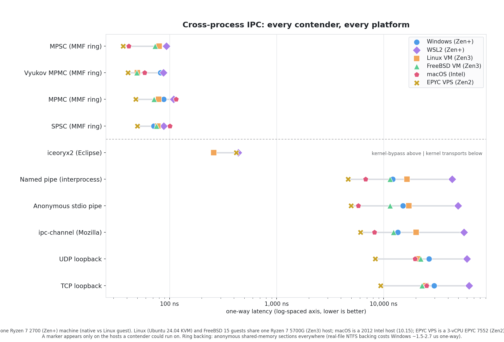
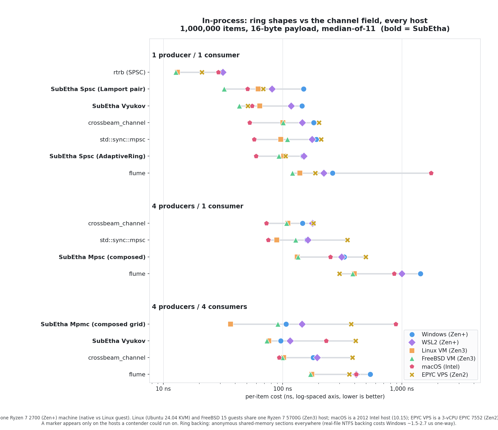
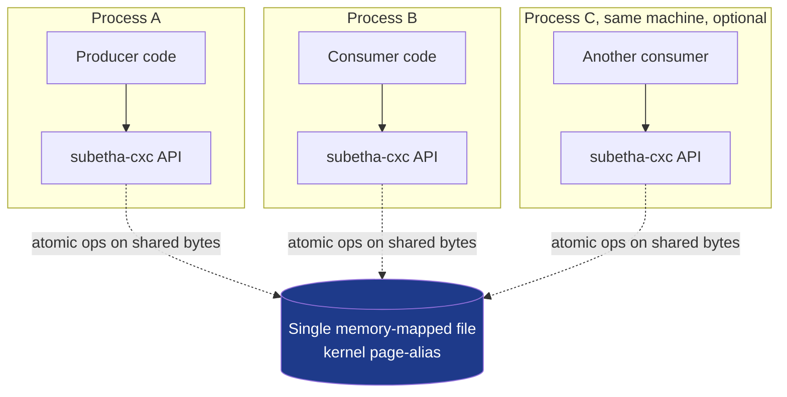
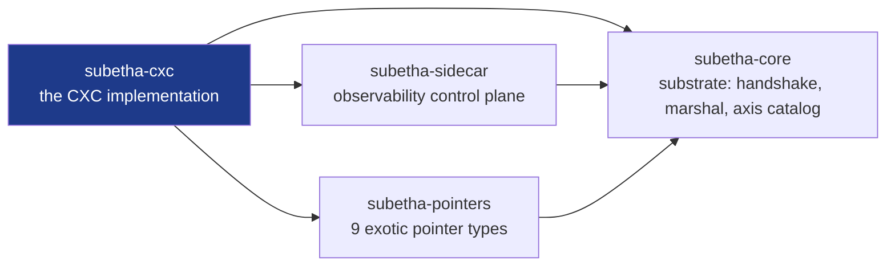
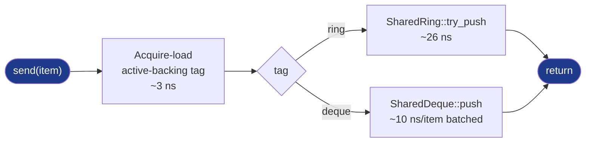
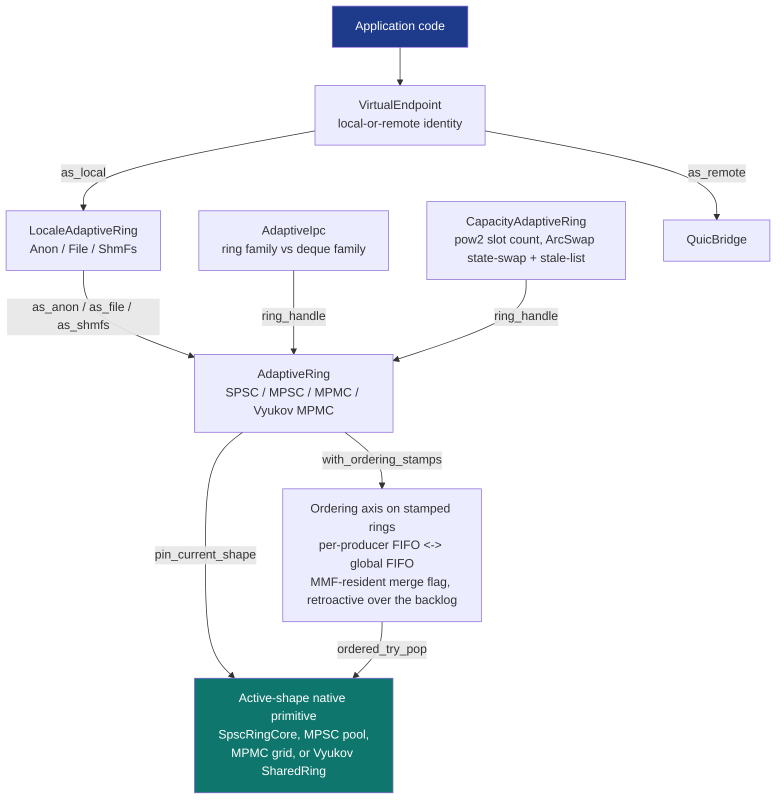
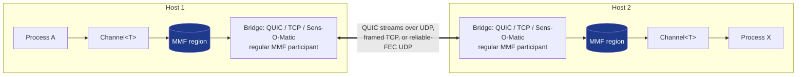
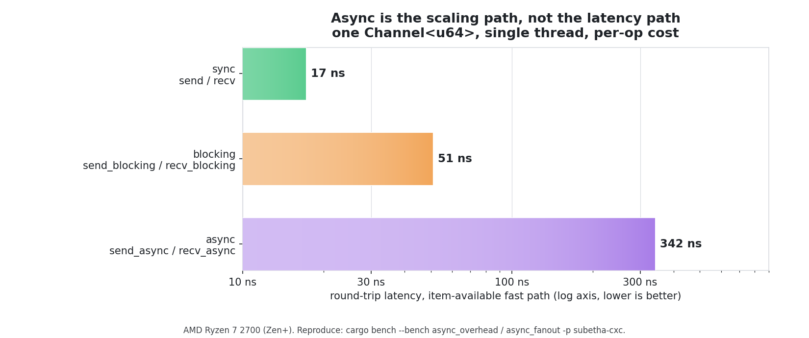
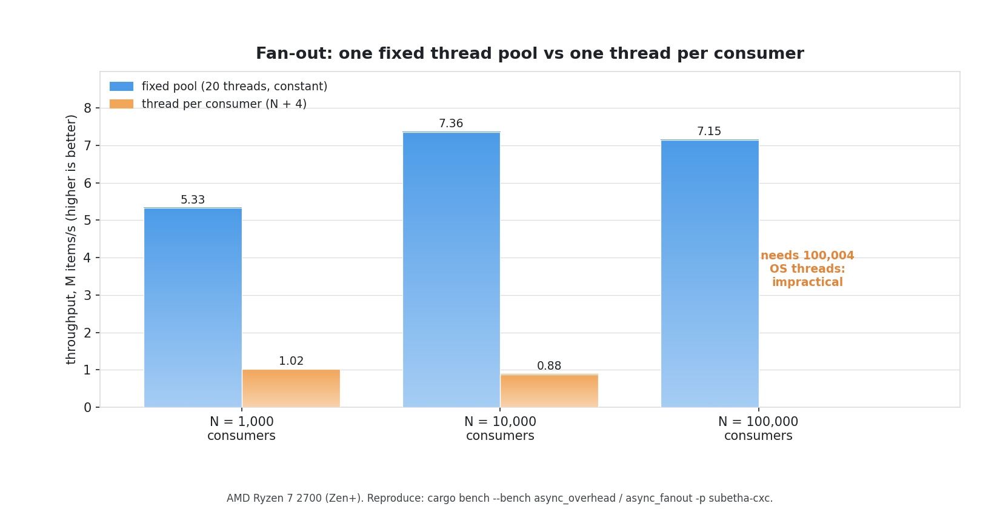

<p align="center">
  
</p>

<h2 align="center">SubEtha</h2>

<p align="center">
<strong>In the beginning pipes were created. They made a lot of processes very slow and have been widely regarded as a bad move.</strong>
</p>

---

<p align="center">
  <em>Cross-Context Channel for Rust. Kernel-bypass IPC - lock-free, thread- and process-safe - that spans threads, processes, disk, and network through memory-mapped files, with no syscalls on the data path and no locks in your code.</em>
</p>

<p align="center">
  <a href="LICENSE-MIT"></a>
  <a href="rust-toolchain.toml"></a>
  
  
  
</p>

---

## Table of contents

<details>
<summary>Click to expand</summary>

- [Why SubEtha?](#why-subetha)
- [Quick start](#quick-start)
- [Architecture](#architecture)
- [What it costs](#what-it-costs)
- [Is it safe?](#is-it-safe)
- [Use cases](#use-cases)
- [Crate layout](#crate-layout)
- [The architectural premise](#the-architectural-premise)
- [Examples](#examples)
- [Requirements](#requirements)
- [Documentation](#documentation)
- [Douglas Adams and the Hitchhiker's Guide](#douglas-adams-and-the-hitchhikers-guide)
- [Citations](#citations)
- [License](#license)

</details>

---

## Why SubEtha?

> *The Guide has this to say on the subject of local inter-process communication: it is slow. You may think your last syscall was quick. It wasn't. Kernel transit is big. Really big. And by a quirk of operating-system history, the boundary between two processes on the same machine is treated with roughly the same ceremony as the boundary between two continents, complete with customs inspection, even when the two processes in question are looking at the same physical RAM.*

Local IPC normally means picking the least-bad option from a menu that all goes through the kernel. SubEtha skips the menu. After construction, every send and recv is a user-space atomic op on a memory-mapped file the kernel page-aliases between participants. **No syscalls on the data path.** The numbers, measured on six platforms (native Windows, WSL2, a Linux VM, a FreeBSD VM, an Intel Mac, and a 3-vCPU EPYC 7552 datacenter VPS) with 10,000 round-trips and 8-byte payloads per contender:

<picture>
  <source media="(prefers-color-scheme: dark)" srcset="docs/platform_ipc_dotplot_dark.png">
  
</picture>

<p align="center">
  <strong>Measured 126-498x faster than the fastest canonical kernel IPC mechanism on every platform tested</strong> (named pipes, stdio pipes, ipc-channel, TCP/UDP loopback) and 5.0-11.4x faster than iceoryx2's zero-copy shared memory on the platforms where it builds. All four pinned channel shapes (SPSC / MPSC / composed MPMC / Vyukov MPMC) land between 37 and 115 ns one-way across the six platforms.<br><br>
  
</p>

Same typed Channel&lt;T&gt; API works cross-thread, cross-process, persisted to disk.

And you write none of the synchronization. Every ring is lock-free, with its atomic counters living *inside* the shared file, so the same structure is thread-safe and process-safe at once, with no `Mutex` or `Arc<Mutex>` (a process-private lock would not survive the process boundary anyway). The default ring picks and changes its own shape (SPSC to MPMC and back) under live producers and consumers without losing an item, grows its backings as peers register from any process, and refuses a registration only when you explicitly pin a ceiling; the full contract is in [Concurrency and safety](wiki/content/docs/explanation/concurrency-and-safety.md).

Same N, same payload, same shared-memory backing on every platform. The raw per-platform JSON is in `docs/cross_process_ipc_results-{windows,wsl,linux,freebsd,macos}.json`; the methodology audit is in [`docs/CROSS_PROCESS_IPC_PERFORMANCE.md`](docs/CROSS_PROCESS_IPC_PERFORMANCE.md).

### In-process: the same shapes against the channel field

The rings are not only a cross-process tool. The same lock-free shapes run thread-to-thread with no memory-mapped file, so they stand directly against `crossbeam_channel`, `flume`, `rtrb`, and `std::sync::mpsc` - benched on every host (1,000,000 items, 16-byte payload, median-of-11 per contender), with a marker shown only where each contender's API can run:

<picture>
  <source media="(prefers-color-scheme: dark)" srcset="docs/platform_inprocess_dotplot_dark.png">
  
</picture>

<p align="center">
A SubEtha shape <strong>wins 4 producers / 4 consumers on every multi-core host</strong> (the composed MPMC grid at 36.6 ns/item on Linux, ~2.8x faster than crossbeam_channel; the Vyukov shape leads at 73.8 ns on FreeBSD, 96.4 on Windows, and 115.2 on WSL2), though the 13-year-old Intel Mac and the 3-vCPU EPYC VPS - both starved for cores at 4x4 - flip that one cell to crossbeam and flume respectively. rtrb's purpose-built SPSC leads raw 1P/1C on every host; 4P/1C goes to crossbeam or `std::sync::mpsc` depending on the host. Each contender appears only in the scenarios its API supports - rtrb (SPSC) in 1P/1C alone, <code>std::sync::mpsc</code> (single-consumer) through 4P/1C, crossbeam and flume (MPMC) in all three - and <strong>none of them crosses a process boundary</strong>: this whole field is in-process only, so none can do what the cross-process chart above measures. SubEtha gives up a little single-shape peak in exchange for one structure that morphs across all four shapes <em>and</em> runs the same code cross-thread, cross-process, and cross-host.
</p>

---

## Quick start

> *The Vogons regard no inter-clan transaction as legitimate without the appropriate forms filed in triplicate, in red ink, with notarised copies despatched in advance to a separate office for filing in advance of any action being taken. The kernel has long shared this view of local IPC, though without the saving grace of an actual filing cabinet. SubEtha's setup ritual is what you see below.*

```toml
[dependencies]
subetha-cxc = "0.1"
```

```rust
use subetha_cxc::AutoIpc;

let chan = AutoIpc::new("/tmp/events.bin")
    .capacity(64)
    .build_channel::<u64>()?;

// Non-blocking: returns Full / Empty right away.
chan.send(&42)?;
let v = chan.recv()?;
assert_eq!(v, 42);
```

One handle, three ways to call it. Sync is above. The same `chan` also parks
a thread or suspends a task, picked per call:

```rust
// Blocking: parks the calling thread until there is room / an item.
chan.send_blocking(&42, None)?;
let v = chan.recv_blocking(None)?;

// Async: suspends the task. Runs on any executor, including the crate's
// own runtime-free `block_on` (no tokio required).
chan.send_async(&42).await?;
let v = chan.recv_async().await?;
```

That's it. The file path is the channel. It can be opened from another thread, another process, or after a reboot, an arrangement the kernel regards with suspicion and the hardware regards as perfectly normal. The `AutoIpc` builder auto-routes to the empirically-best primitive based on declarative hints: 
- `.batch_size(64)` flips to KHL work-stealing
- `.consumers(4)` flips to URD per-thief mailboxes
- No shape arg flips to SharedRing streaming.

Sync and async are not separate types. `build_channel` and `build_adaptive` both hand back a single channel that answers all three call styles, so the choice is yours at each call site, not baked into the type you constructed.

---

## Architecture

> *The Bistromathic drive depended on the insight that numbers written on restaurant bills, within the confines of a restaurant, do not obey the same laws as numbers written anywhere else. SubEtha rests on a smaller but related observation: bytes written inside a memory-mapped file, within the confines of the same machine, do not require kernel transit to be read by another participant. The kernel concurs once at `mmap()`, again at `fsync()` if asked, and otherwise politely absents itself from the conversation.*



**One byte layout, three topologies.** The MMF is the channel. Producers and consumers in different threads, different processes, or different launches of the program all participate through the same file, and the rings cross the process boundary in much the same way that named pipes don't. The kernel is only on the path at `mmap()` (once per participant) and `fsync()` (optional persistence).

Inside the workspace, the crate dependency graph stays small:



The hot path on `Channel::send`:



`AdaptiveIpc<T>::send` adds one branch on `TypeId::of::<T>() == TypeId::of::<u64>()`, which monomorphises to a known constant and lets LLVM eliminate the dead arm. For `T = u64`, the call collapses to a direct invocation of `send_u64`: 8-byte stack buffer, `to_le_bytes`, ring push. **Because `send::<u64>` routes through this very branch, the explicit `send_u64` runs the identical code, so the two measure at parity (~147 ns/item on a Ryzen 7 2700).** LLVM already inlines the `u64` path to equivalent machine code, so the branch's payoff is the guaranteed 8-byte buffer across toolchains rather than a separate measured win.

---

## Polymorphic substrate (Locale x Protocol x Shape x Capacity x Ordering)

> *The only machine on record to change its fundamental nature mid-journey without losing its passengers was the starship Heart of Gold, an achievement universally admired by everyone except a sperm whale and a bowl of petunias, who were briefly and terminally involved. SubEtha's substrate performs the same trick with less collateral botany: the channel you are sending through can change its storage, its protocol, its shape, its capacity, and its ordering guarantee while you hold a live handle to it, and the handle finds out in exactly one Acquire-load.*

Beyond the per-call dispatch above, SubEtha composes five orthogonal axes
of runtime morphability under one pin-protocol contract. Each axis morphs
independently; the pin handle at every layer carries a single Acquire-load
generation check so steady-state ops stay native-primitive fast and
shape-shifts during morph stay observable to callers.



Two rings, one trade. The zero-CAS composed rings give per-producer FIFO
and nothing stronger; a single Vyukov ring gives global FIFO but pays a
CAS on every push. Most workloads never need the global order, so the
default declines to pay for it. The ordering axis is what lets a ring
change its mind at runtime.

Build a ring with `with_ordering_stamps()` and every push carries an
8-byte stamp (invariant-TSC `rdtsc` when the CPUID probe passes, a shared
counter or the monotonic clock when it does not). The stamps do nothing
visible at first. What they buy is a signal: the consumer counts
cross-producer inversions as it pops, and that rate is the ring telling
you whether per-producer order still resembles global order. When it
stops, one store on a shared flag flips the ring to global FIFO, and the
consumer starts k-way-merging the ring heads by stamp.

And the items already in flight? They order themselves. The stamps were
written at push time, so the backlog sorts retroactively the moment the
merge turns on. No drain, no barrier, no re-send.

You reach the switch two ways. Declare the need up front on the
`QosPolicy` `Ordering` knob, and a ring with no stamps morphs to Vyukov
instead, paying the CAS it now needs. Or pre-authorize the automatic
response with `auto_order(threshold)`: the sidecar watches the inversion
rate, and once it crosses the line you set, throws that same single
store. Producers never coordinate. Detection rides the pop the consumer
was already doing. The backlog orders itself because the stamps were
already paid for. The substrate never changes ordering semantics on its
own. The threshold you set is the authorization.

One caveat, stated plainly. The by-stamp merge is best-effort: global
FIFO within the stamp skew, no tighter. With an invariant TSC that skew
is tight enough that you will not notice it. Without one, the stamps fall
back to a shared counter, and under producer lag that counter can hand
back a low stamp late, after the merge has already moved past it. So when
the contract is exact delivery, `AdaptiveOrderedReceiver` chooses per
host: a consumer-side reorder buffer (sized to the producer count,
provably exact, about 9% over the raw merge) or the watermark-gated
strict merge. It measures first, then picks.

The full loop (one-way-arm semantics, the exact-delivery consumer, and a
custom-policy hook) is on
[the adaptive-ordering page](wiki/content/docs/reference/subetha-cxc/rings/adaptive-ordering.md).
The measured ladder is in
[`docs/ORDERING_MODES_PERFORMANCE.md`](docs/ORDERING_MODES_PERFORMANCE.md).

Each axis member ships as a `pub struct` you can use independently OR
compose into the stack above. The composition is **automatic by default**
(`AdaptiveIpc::create()` wires AdaptiveRing as the ring backing;
`LocaleAdaptiveRing` pre-allocates all three locales) and **overridable
via the explicit handle accessors** (`ring_handle()`, `as_<axis>()`).
`SpscRingCore` is the underlying primitive that `AdaptiveRing` dispatches
to when the active shape is SPSC; reach it directly only when explicitly
overriding the substrate's defaults.

### Primitives under this axis layout

<details>
<summary>Cross-platform primitives (default features)</summary>

| Primitive | Axis | Module |
|---|---|---|
| [`AdaptiveRing`](crates/subetha-cxc/src/adaptive_ring.rs) | Shape | `subetha_cxc::adaptive_ring` |
| [`OrderingRegion`](crates/subetha-cxc/src/ordering.rs) + stamped `AdaptiveRing` paths | Ordering (stamps + inversion metric + merge flag + strict watermark gate + drainer lease) | `subetha_cxc::ordering` |
| [`CapacityAdaptiveRing`](crates/subetha-cxc/src/capacity_adaptive_ring.rs) + [`CapacityAdaptiveRingSidecar`](crates/subetha-cxc/src/capacity_adaptive_ring.rs) | Capacity (fan-in family + hysteresis-gated auto-morph) | `subetha_cxc::capacity_adaptive_ring` |
| [`CapacityBroadcastRing`](crates/subetha-cxc/src/capacity_broadcast_ring.rs) | Capacity (broadcast fan-out) | `subetha_cxc::capacity_broadcast_ring` |
| [`CapacityPubSubRing`](crates/subetha-cxc/src/capacity_pubsub_ring.rs) + [`CapacityPubSubSubscriber`](crates/subetha-cxc/src/capacity_pubsub_ring.rs) | Capacity (pub/sub fan-out, chain-of-backings) | `subetha_cxc::capacity_pubsub_ring` |
| [`LocaleAdaptiveRing`](crates/subetha-cxc/src/locale_adaptive_ring.rs) + [`LocaleAdaptiveRingSidecar`](crates/subetha-cxc/src/locale_adaptive_ring.rs) | Locale (Anon / File / ShmFs + hysteresis-gated migration) | `subetha_cxc::locale_adaptive_ring` |
| [`AdaptiveIpc<T>`](crates/subetha-cxc/src/adaptive_ipc.rs) | Protocol | `subetha_cxc::adaptive_ipc` |
| [`VirtualEndpoint`](crates/subetha-cxc/src/virtual_endpoint.rs) | Identity | `subetha_cxc::virtual_endpoint` |
| [`PubSubRing`](crates/subetha-cxc/src/protocol_pubsub.rs) | Protocol (pub/sub) | `subetha_cxc::protocol_pubsub` |
| [`QosPolicy`](crates/subetha-cxc/src/qos_policy.rs) | Policy | `subetha_cxc::qos_policy` |
| [`RingContract`](crates/subetha-cxc/src/ring_contract.rs) | Legality (count bounds + ordering contract + capacity ceiling; attach-check authority + policy feasible-region filter) | `subetha_cxc::ring_contract` |
| [`SubscriberPosition`](crates/subetha-cxc/src/replay_positions.rs) | Position tracking | `subetha_cxc::replay_positions` |
| [`ShmFile`](crates/subetha-cxc/src/shm_file.rs) | Storage helper | `subetha_cxc::shm_file` |
| [`UnifiedSensSender`](crates/subetha-cxc/src/sens_unified.rs) / `UnifiedSensReceiver` | **Sens-O-Matic unified transport**: carries BOTH erasure codes on one port and auto-switches RLC <-> RS mid-stream on the loss the receiver feeds back; TLS 1.3 seals every item across the switch (`connect_tls`) | `subetha_cxc::sens_unified` |
| [`SensOMaticRlcSender`](crates/subetha-cxc/src/sens_rlc.rs) / `SensOMaticRlcReceiver` | Sens-O-Matic sliding-window RLC code alone (low-to-moderate loss, low latency tail; FEC + ARQ, optional TLS 1.3) | `subetha_cxc::sens_rlc` |
| [`ReliableUdpSender`](crates/subetha-cxc/src/udp_bridge.rs) / `ReliableUdpReceiver` (`SensOMaticRs*`) | Sens-O-Matic block Reed-Solomon code alone (high sustained loss, parity-efficient; FEC + ARQ). Standalone it is `std`-only; the unified endpoint above adds TLS to the RS stream | `subetha_cxc::udp_bridge` |

</details>

<details>
<summary>Behind Cargo feature flags</summary>

| Primitive | Feature | Notes |
|---|---|---|
| [`QuicBridgeClient`](crates/subetha-cxc/src/quic_bridge.rs) / `QuicBridgeServer` | `quic-bridge` | Pulls quinn + rcgen + rustls + tokio. |
| [`TcpBridgeClient`](crates/subetha-cxc/src/tcp_bridge.rs) / `TcpBridgeServer` | `tcp-bridge` | Pulls tokio (net + io-util + rt). |
| [`WireSocket`](crates/subetha-cxc/src/locale_wire.rs) | `wire-locale` | Raw-L2 NIC-bypass socket: AF_XDP (Linux), XDP (Windows), netmap (FreeBSD), BPF (macOS). |

</details>

<details>
<summary>OS-specific primitives (no extra deps)</summary>

| Primitive | Module | Use case |
|---|---|---|
| [`DirectFileRing`](crates/subetha-cxc/src/protocol_direct_file.rs) | `protocol_direct_file` | Non-mmap pread/pwrite ring, page-cache bypass: `O_DIRECT` (Linux/FreeBSD), `F_NOCACHE` (macOS), `FILE_FLAG_NO_BUFFERING` (Windows). |
| [`send_fd` / `recv_fd`](crates/subetha-cxc/src/fd_handoff.rs) | `fd_handoff` | Fd handoff: `SCM_RIGHTS` over a Unix socket (unix, incl. macOS); `DuplicateHandle` (Windows). |
| [`KernelAsyncRing`](crates/subetha-cxc/src/kernel_async_ring.rs) | `kernel_async_ring` | Kernel async-I/O ring: io_uring (Linux), IoRing (Windows), POSIX `aio` (FreeBSD / macOS). |
| [`HugepageRegion`](crates/subetha-cxc/src/hugepages.rs) | `hugepages` | Linux `MAP_HUGETLB` anon mmap (2 MB or 1 GB pages). |
| [`SuperPageRegion`](crates/subetha-cxc/src/super_pages.rs) | `super_pages` | Superpage anon mmap: FreeBSD `MAP_ALIGNED_SUPER`, macOS x86_64 `VM_FLAGS_SUPERPAGE_SIZE_2MB`. |
| [`VsockSocket`](crates/subetha-cxc/src/locale_vsock.rs) | `locale_vsock` | Host-VM byte streaming: `AF_VSOCK` (Linux), Hyper-V `AF_HYPERV` (Windows). |

</details>

Design notes for the axis composition pattern live in
[`docs/POLYMORPHIC_SUBSTRATE_AXES.md`](docs/POLYMORPHIC_SUBSTRATE_AXES.md).
Live builds + E2E coverage of every primitive live in
[`crates/subetha-cxc/examples/`](crates/subetha-cxc/examples/).

---

## What it costs

The cross-process comparison sits in [Why SubEtha?](#why-subetha) above. The two tables here measure SubEtha by itself: how expensive one send is, and how much throughput it sustains under steady load.

<details>
<summary>Per-call cost (single send / push)</summary>

| Path | Cost on Zen+ R7 2700 | Notes |
|---|---:|---|
| `SharedRing::try_push` direct | 24.1 ns/op | bare MMF ring push |
| `Arc<dyn MessageTransport>::try_push` | 26.2 ns/op | ~2 ns of dyn-dispatch overhead on top of the direct push |
| `AdaptiveIpc<u64>::send` (`T = u64`, auto-routes to `send_u64`) | 146.9 ns/op | what most consumers reach for; the `TypeId` branch sends it down the specialised path |
| `AdaptiveIpc<u64>::send_u64` (specialised, called directly) | 148.5 ns/op | same code path as `send::<u64>`, so parity by construction (LLVM inlines both equivalently) |

</details>

<details>
<summary>Sustained workload throughput</summary>

| Workload | Throughput | Notes |
|---|---:|---|
| SPSC sustained 1M items | **20.5 M items/s** | ~49 ns/item, [stress_test.rs Tier 1](crates/subetha-cxc/examples/stress_test.rs); best of 3 (sustained throughput is noisy, 11-20 M/s run-to-run) |
| MPMC 8P/8C 800k items | **9.6 M items/s** | 0 lost, 0 duplicated (verified by per-item ID set) |
| Service simulation (4 worker × 4 client) | **6.5 M req/s** | balanced across workers |
| Burst traffic (10× 10k bursts) | p50 346 µs, p95 916 µs | within-burst throughput 24.5 M items/s |
| AutoIpc construction | **~2.0 ms / build_channel** | file create + mmap + handshake init + dispatcher pick; `create_anon` is ~70 µs |

</details>

Reproduce with `cargo bench` in [`crates/subetha-cxc/benches/`](crates/subetha-cxc/benches/) or run [`cargo run --release --example cross_process_compare`](crates/subetha-cxc/examples/cross_process_compare.rs) to regenerate the leaderboard JSON used to make the PNG.

For the **full ring-primitive throughput matrix** (every shape x locale x capacity x P x C combo, plus pinned vs unpinned vs external-library comparison) see the dedicated [throughput harness](wiki/content/docs/reference/subetha-cxc/rings/throughput.md) and [results page](wiki/content/docs/reference/subetha-cxc/rings/throughput-results.md). The harness is a single binary (`bench_throughput`, run per cell as `cargo run --release -p subetha-cxc --example bench_throughput -- <primitive> <locale> <capacity> <producers> <consumers> <n_items>`); the results page documents every cell it was swept over.

---

## Is it safe?

Yes - fully, atomically, and across the process boundary, with no lock for you to write and no shape for you to choose. Every ring is lock-free, its synchronization atomics live *inside* the shared file, and the default ring changes its own shape under live traffic without dropping an item. The short version is below; the complete model - including what you must *not* do - is in [Concurrency and safety](wiki/content/docs/explanation/concurrency-and-safety.md).

> *The Guide observes that "safe" is among the galaxy's most overloaded words, applied with equal confidence to spacecraft, financial instruments, and the act of wrapping a shared queue in a `Mutex`. At least one of those is a category error. SubEtha keeps its atomics inside the mapped file, where a lock bolted on from the outside guards nothing the ring does not already guard - and could not reach across the process boundary even if it tried.*

<details>
<summary>Do I need a Mutex / RwLock / Arc&lt;Mutex&lt;T&gt;&gt;?</summary>

**No - and adding one is three kinds of wrong.** Each `Shared*` ring is already lock-free: the synchronization *is* the atomic counters - a producer-owned `head` and consumer-owned `tail` for SPSC, per-slot sequence numbers advanced by CAS for MPMC.

| A lock would be | Because |
|---|---|
| Redundant | the atomics are the synchronization; the lock guards nothing the ring does not |
| Slower | a contended acquire (and a possible syscall) lands back on the fast path you reached for a ring to avoid |
| Broken across processes | a `std::sync::Mutex` lives in process-private memory and cannot synchronize two processes at all |

Share the handle directly (`&AdaptiveRing` / `&SharedRing` are `Sync`) or open the same file from each process. No wrapper type.

</details>

<details>
<summary>Why it is process-safe, not only thread-safe</summary>

The synchronization atomics live **inside the memory-mapped file**, not in a process-private struct. The file is page-aliased to the same *physical* pages in every participant, and CPU cache coherence is keyed on physical addresses - so the exact lock-free protocol that synchronizes two threads synchronizes two processes, even when they map the file at different virtual addresses.

"Thread-safe" and "process-safe" are therefore one mechanism, not two: an ordinary `AtomicU64` in a `Box` is thread-safe but process-*private*; moving the atomic into the file is what buys the cross-process guarantee.

</details>

<details>
<summary>The morph: changing shape under live traffic, atomically</summary>

The `AdaptiveRing` keeps **all four backings (SPSC / MPSC / MPMC / Vyukov) pre-allocated**, so a morph never allocates, copies, or tears anything down. `morph_to` is a single atomic re-point:

| Step | Operation (ordering) | Guarantee |
|---|---|---|
| 1 | `pin_generation.fetch_add(1)` (`AcqRel`) | any holder of a pinned pointer sees `is_still_valid() == false` and re-pins |
| 2 | publish the old shape as **stale** (`Release`) | ordered *before* the new tag, so any consumer that sees the new shape also sees the stale marker |
| 3 | publish the new shape tag (`Release`) | fresh `try_send`s route to the new backing |

On the read side, `try_recv` drains the **stale backing first**: an item pushed microseconds before the flip is consumed before the new backing is read, so nothing is lost and FIFO holds across the seam. A second morph is refused (`RingError::StaleBacklog`) until the prior stale backing empties, so at most one backing is ever draining and no item is ever copied between backings.

</details>

<details>
<summary>Your one job: declare the producer / consumer count (or don't)</summary>

You choose no lock and no shape. On the fixed-shape rings you declare **how many producers and consumers can be live at once** at construction; registering past that envelope returns an error rather than corrupting silently. On `AdaptiveRing` the construction counts are **sizing hints**: peers register and unregister at runtime, registration past the hint **grows the ring on demand** (new per-producer backings, published cross-process through a shared peer directory), and the shape re-morphs to the live counts on every join / leave - no sidecar, no explicit morph call. Errors exist only when you pin: a declared `with_contract` ceiling makes `register_producer` / `register_consumer` return `AdaptiveError::TooManyProducers` / `TooManyConsumers`, and an explicit `morph_to` / `pin_shape` fixes the shape.

| Ring | Producers x Consumers | Who enforces it |
|---|---|---|
| Typed SPSC pair | exactly 1 x 1 | **the compiler** - both handles are `Send + !Sync + !Clone` |
| `SharedRing` (Vyukov) / composed MPMC | N x N | the CAS protocol, at runtime |
| `AdaptiveRing` | grows with the live peer set | the shared peer directory: slot claims + on-demand backing growth; a declared `with_contract` ceiling is the only source of `TooMany*` errors |

</details>

None of this is asserted on faith. `morph_preserves_in_flight_items_via_stale_walk`, `second_morph_blocked_until_stale_backlog_drains`, and `stamped_items_survive_shape_morphs` exercise shape changes under live traffic, and the MPMC path runs to 8 producers / 8 consumers and 800k items with zero lost and zero duplicated (verified by a per-item ID set). The full treatment, including what you must *not* do, is in [Concurrency and safety](wiki/content/docs/explanation/concurrency-and-safety.md).

---

## Use cases

> *The Guide's most useful entries are not the ones describing what a thing is, but the ones describing what to use it for, which is a different question and frequently a more interesting one. The lists below name the situations where reaching for SubEtha will save you a week of bench tuning, and the situations where reaching for it will leave you maintaining a substrate to solve a problem you didn't actually have.*

<details>
<summary>When SubEtha is the right tool</summary>

- **Cross-process pipelines on one box** that reach for named pipes or `ipc-channel`. Measured 126-498x lower one-way latency on the pinned channel shapes.
- **In-process pipelines** (the case people often reach for `crossbeam_channel` for). The same rings run thread-to-thread with no mmap: the composed MPMC grid hits **36.6 ns/item** at 4 producers / 4 consumers (2.8x faster than `crossbeam_channel`), all benched against the full channel field (`crossbeam_channel`, `flume`, `rtrb`, `std::sync::mpsc`) in [`competitor_matrix`](crates/subetha-cxc/examples/competitor_matrix.rs). The Lamport pair is `Send`-only and statically enforces 1P/1C at compile time.
- **Cross-host pipelines** that otherwise require a separate network-channel design. For an untrusted or lossy real-world WAN, the **Sens-O-Matic** reliable-FEC transport is the default: encrypted (TLS 1.3 on both erasure codes, no extra deps beyond the `tls` feature), it auto-switches RLC <-> RS on measured loss and holds throughput plus a bounded latency tail across the whole loss range where TCP - and, at heavy loss, QUIC - degrade. `QuicBridgeClient`/`QuicBridgeServer` (`quic-bridge`) are the alternative when you want QUIC's stream multiplexing / migration / 0-RTT (real QUIC streams with TLS-via-rustls, ~490K items/s on 127.0.0.1 in [`quic_bridge_e2e`](crates/subetha-cxc/examples/quic_bridge_e2e.rs)); `TcpBridgeClient`/`TcpBridgeServer` (`tcp-bridge`) do the same over plain TCP for trusted networks, without the TLS+async overhead, several times faster (~4.5 M items/s on loopback). All compose on the same shape-axis morphing that drives local IPC.
- **Mixed-size or variable-length message streams.** The `AdaptiveRing` carries any payload size automatically at every shape (SPSC / MPSC / MPMC / Vyukov): [`send_frame`](crates/subetha-cxc/src/adaptive_ring.rs) tags each record inline (small) or spills it to a shared concurrent region (large), chosen per record and read back from the tag by the consumer, and the producer can override the choice. One ring handles a stream of mixed sizes with no separate arena to manage. The standalone [`FrameRing`](crates/subetha-cxc/src/frame_ring.rs) is the dedicated single-producer form; small messages stay inline at near-raw-slot speed (8.9 ns/op round-trip at 16 bytes vs 14.7 ns for the always-region path), large ones spill with a single indirection - the downside paid only when a record needs it.
- **Short-lived / one-shot scripts** that send only a handful of messages. `LazySharedRing::new` defers the mmap + ftruncate + first-fault cost until the first `try_push`/`try_pop`: **32.6 µs upfront** (vs ~750 µs for eager file-backed `SharedRing::create`; the in-memory `create_anon` path is ~70 µs). Break-even is ~559 sends against eager file creation, so all but the most trivial scripts come out ahead.
- **Worker pools where the work queue lives in shared memory.** `SharedDeque<T>` is a Chase-Lev work-stealing deque mapped into a file. Multiple processes attach as thieves; the owner pushes once.
- **Service-style applications** where N worker threads handle requests from M client threads. The stress test in [`examples/stress_test.rs`](crates/subetha-cxc/examples/stress_test.rs) hits 6.5 M req/s across a balanced 4-worker / 4-client grid.
- **Persisted streams**: the same MMF the kernel uses for IPC is also a durable log. Crash the process; restart; re-open the file; pick up the in-flight slot. `HeartbeatTable` + `FailoverWatchdog` automate the takeover.
- **Cross-process workloads where the routing decision is data-dependent.** `AdaptiveIpc` observes send patterns, migrates SharedRing <-> SharedDeque at runtime, and publishes batched small-payload sends through a KHL fast path - all without losing items.

</details>

<details>
<summary>When SubEtha is the wrong tool</summary>

The Guide is occasionally honest, mostly in sections nobody is selling anything. In that spirit:

- **Single-threaded buffers with no concurrent reader.** A plain `Vec<T>` or `std::collections::VecDeque<T>` is the right shape: there's no IPC happening at all, just a buffer in one thread. The substrate's pre-allocated rings and atomic plumbing are pure overhead in this case.
- **`no_std` / embedded contexts.** SubEtha depends on `std` and `memmap2` (POSIX `mmap` / Windows `CreateFileMappingW`). Microcontrollers and kernel-mode targets do not link.
- **Records larger than the configured frame block.** The `AdaptiveRing` frame path ([`send_frame`](crates/subetha-cxc/src/adaptive_ring.rs)) carries any payload at every shape - inlining small records and spilling larger ones to a shared region - but a single record above the region's block size (8 KB by default; raise it with `with_frames`) is rejected, and the frame path is not offered on stamped (ordering) rings. The raw fixed-slot API (`try_send`, or the typed `Producer` pair) caps at 64 / 56 bytes by design; reach for `send_frame` when records vary in size.

</details>

---

## Crate layout

| Crate | Role |
|---|---|
| [`subetha-cxc`](crates/subetha-cxc) | The CXC implementation. `Channel<T>`, `AdaptiveIpc<T>`, `AutoIpc`, MMF dispatcher, ~40 MMF-backed primitives. `cargo add subetha-cxc` is what users reach for. |
| [`subetha-core`](crates/subetha-core) | Substrate: handshake header, observation ring, marshal trait, axis-signature catalog, CPUID helpers. |
| [`subetha-sidecar`](crates/subetha-sidecar) | Control plane: per-NUMA scan thread, policy, `SidecarBox`, `AdaptiveInstance` trait. |
| [`subetha-pointers`](crates/subetha-pointers) | Nine exotic pointer types: Umbra (content-prefix), Bloom (set summary), KStep (log2 stride), KTower (multi-segment), SelfDesc (type tag), Versioned + HLC (MVCC), Cardinality (size class), CHERI capability (ARM Morello bounds), RaspBatch + RaspBatchIndex (x86 AVX2/AVX-512F SIMD-batched bounds). |
| [`subetha`](crates/subetha) | Umbrella crate: pulls in the whole stack and re-exports each member as a module (`subetha::cxc` / `::core` / `::sidecar` / `::pointers`). `cargo add subetha` for the lot; most users reach for `subetha-cxc` directly. |

The cross-host test harness for the reliable-UDP FEC transport is the
[`udp_xhost` example](crates/subetha-cxc/examples/udp_xhost.rs)
(`cargo run --release -p subetha-cxc --example udp_xhost -- --role ...`).

---

## The architectural premise

> *It is an important and popular fact that a channel is not a thing but a decision: somebody, somewhere, froze an opinion about where your bytes live into an API, and everyone since has mistaken the freeze for physics. The Guide's editors note that most of the galaxy's infrastructure works this way, that almost none of it is anyone's fault, and that the wise traveller learns to distinguish between the laws of nature and the defaults of whoever got there first.*

A channel is a frozen handshake between two roles, and the freeze usually happens where you cannot see it. `std::sync::mpsc::channel` freezes "single process, in memory." `socket(AF_UNIX, SOCK_STREAM, 0)` freezes "kernel-mediated byte stream." `TcpStream` freezes the whole IP stack. Each is the right call for the median workload. Each is the wrong call the moment the topology crosses a process boundary and the application still wants in-process speed.

CXC breaks the freeze in two directions. They are orthogonal.

**By topology.** Lift the channel into a memory-mapped file, and one primitive serves cross-thread, cross-process, and disk-persistent with no rewrite. The kernel touches the path once, at `mmap()`, and never again. Only the cross-machine case leaves the box, so it extends through a bridge at the edge: the Sens-O-Matic adaptive-FEC transport for an untrusted or lossy WAN, QUIC when you want its stream multiplexing and migration, or plain / TLS TCP on a trusted link. Both sides keep their fast local path either way (see [Going cross-host](#going-cross-host)).

**By workload.** Make the dispatch end of the channel a runtime field. An `AtomicU32` tag indexes into pre-allocated backings: `SharedRing` for streaming MPMC, `SharedDeque` variants for work-stealing, `SharedHashMap` for key-value. At construction time `MmfDispatcher` reads a declarative workload signature and picks the empirically-best primitive, and the consumer is never in the loop. The tag can flip live without dropping an item, because both backings are already mapped and the migration is a single Release-store on a shared atomic.

One philosophy, two un-freezings. That is the whole point.

**Cross-process wake without per-message syscalls.** The waker is the userspace `futex` idea moved into a wake-list inside the MMF, so it runs on any OS that can map a file. A consumer parks on a registered sequence; the producer's send overtakes it and wakes exactly that one consumer. A send with nobody parked costs one cache line, because a single parked-mask word in the header answers the common case before any slot is touched.

But what about the waits that do park? Before it goes near the kernel, every wait arms a hardware monitor on the slot's own cache line (`MONITORX`/`MWAITX` or `UMONITOR`/`UMWAIT` on x86-64, `LDAXR`+`WFE` on aarch64, probed at runtime) and light-sleeps there. The producer's store is the wake. No syscall on either side, and it lands at 120 ns median against 9.3 us for the kernel park on Zen+ R7 2700. This tier is also what buys Windows a real cross-process wake: `WaitOnAddress` will not cross a process boundary, but a hardware monitor keys on the physical address and does not care who did the store. Each platform's kernel-park arm behind the monitor tier is in [`docs/LOW_LEVEL_OPTIMIZATIONS.md`](docs/LOW_LEVEL_OPTIMIZATIONS.md).

The waker itself lives at `crates/subetha-cxc/src/cross_process_waker.rs`. The blocking rings (`BlockingSpscRing`, `BlockingMpscRing`, `BlockingMpmcRing`), `SharedCondvar`, `BlockingSemaphore`, `BlockingRWLock`, and the async adapter `AsyncSpscRing` all layer on top.

## Going cross-host

> *SubEtha takes its name from the Sub-Etha, the galaxy-wide signalling network on which the Guide's field researchers depend for news, gossip, and passing rides. Ours spans one LAN rather than one galaxy, observes the speed of light as a matter of politeness, and round-trips in about a millisecond, which for any network that has ever met a sysadmin is practically instantaneous.*

Same-host CXC is the core scope. Cross-host extends the same shape through a bridge - a regular MMF participant on each host that ferries ring bytes across the wire, with the same byte layout on each end. Five cross-host transports are available; pick by network trust, link quality, and idle profile.



**Choosing a bridge.** For an untrusted or lossy real-world WAN, reach for **Sens-O-Matic**: it is encrypted end to end (TLS 1.3 on *both* erasure codes) and its adaptive forward error correction holds throughput and a bounded latency tail across the whole loss range, auto-switching RLC <-> RS on the loss the receiver measures - where QUIC and TCP recover loss with a single path that degrades as loss climbs. `QuicBridge` is the alternative when you specifically want QUIC's stream multiplexing, connection migration, 0-RTT, or interop with a QUIC peer. The TCP bridges are for trusted links (same rack, VPN, lab LAN) where encryption and FEC buy nothing.

| Bridge | Feature | Transport | Encryption | Best for |
|---|---|---|---|---|
| **Sens-O-Matic (unified)** | none (`std`) / `tls` | Reliable UDP, adaptive FEC (RLC <-> RS) + ARQ | none, or TLS 1.3 (both codes) | **Default: untrusted / lossy WAN** |
| `QuicBridge` | `quic-bridge` | QUIC over UDP | TLS 1.3 (rustls) | QUIC multiplexing / migration / 0-RTT |
| `TcpTlsBridge` | `tcp-tls-bridge` | TCP + rustls record | TLS 1.3 (rustls) | Encrypted TCP, clean untrusted link |
| `TcpBridge` | `tcp-bridge` | Plain TCP | none | Trusted LAN, lowest latency |
| `BlockingTcpBridge` | `tcp-bridge` | Plain TCP | none | Trusted LAN, zero idle CPU |

<details>
<summary>Per-bridge notes</summary>

**Sens-O-Matic (unified)** is the QUIC peer of this set. Forward error correction recovers loss with no retransmit round-trip, and ARQ is the floor. The `UnifiedSens*` endpoint (`sens_unified`) carries both erasure codes on one UDP port and auto-switches on the measured forward loss: the sliding-window RLC code below the ~15% crossover (incremental recovery, low latency tail) and the block Reed-Solomon code above it (MDS Cauchy, parity-efficient, holds throughput at high sustained loss), with a hysteresis band so a loss level at the boundary does not flap. TLS 1.3 AEAD-seals every item across the switch. Measured exactly-once across three OSes: 15% loss meets or beats clean throughput, and 30% loss holds ~86% of clean where a TCP path stalls behind the gap ([`SENS_O_MATIC_PERFORMANCE.md`](docs/SENS_O_MATIC_PERFORMANCE.md)).

**`QuicBridge`** is for when you want QUIC itself: multiplexed streams (one per `Channel<T>`, no cross-channel head-of-line blocking), connection migration (peers change IPs without losing the channel), 0-RTT resumption (cheap reconnect after a crash, matching MMF's re-`mmap()` recovery story), or interop with a QUIC peer. BBR-style control holds throughput under mild loss where TCP backs off; under heavy loss its single loss-recovery path degrades where Sens-O-Matic's adaptive FEC does not.

**`TcpTlsBridge`** is the encrypted-TCP option: identical framing and batching to `TcpBridge`, the only wire delta the AEAD record layer. Reach for it on a clean untrusted link where QUIC's dependency footprint is unwanted. It collapses under loss like any TCP.

**`TcpBridge`** is for trusted networks (same rack, VPN, lab LAN) where TLS cost and the QUIC dependency footprint buy nothing. One ring per connection, so QUIC's multiplexing is moot. Burst-batched egress plus `TCP_NODELAY`: a backlog ships 256 slots per socket write, a lone item ships immediately.

**`BlockingTcpBridge`** shares `TcpBridge`'s trust model and adds zero CPU at idle: the forwarder parks on the cross-process waker (`recv_blocking` / `send_blocking` via `spawn_blocking`) instead of `yield_now`-polling, so an idle bridge costs nothing and a fresh item ships one wake plus socket-write later.

</details>

The unified transport can share one UDP port with QUIC (demuxed by first
wire byte), so a single endpoint speaks both -
[`examples/one_port_tls_e2e.rs`](crates/subetha-cxc/examples/one_port_tls_e2e.rs)
proves QUIC and the encrypted Sens-O-Matic stream, adaptive switch and
all, on one port with exactly-once delivery.

All transports run through one harness
([`examples/bridge_lan.rs`](crates/subetha-cxc/examples/bridge_lan.rs)),
byte-matched with strict in-order, count, and sum assertions on every run
(the stream bridges ship 64-byte ring slots batched 256 per socket write;
Sens-O-Matic and `udp` ship the same bytes as 1408-byte MTU items, 22 slots
each, so totals match at ~70 MB). Measured on **real wire between separate
OS processes** - an Ubuntu 24.04 host and a FreeBSD 15.0 host (each a VM on
one Zen3 / Ryzen 7 5700G machine, cross-OS over virtio NICs) for the LAN,
and that Ubuntu host to a remote datacenter VPS over the public internet
(~22 ms RTT) for the WAN. Sampling is interleaved (every transport per round,
ten rounds), reported as the median with a bootstrap 95% confidence interval;
loss is `tc ... netem loss X%` on the sender's egress.

<details>
<summary>1. Clean LAN throughput (Mbit/s goodput)</summary>

On a clean link the stream
bridges lead on raw rate - they ferry bytes without parity, where
Sens-O-Matic spends part of the link on FEC. TLS is nearly free (`TcpTlsBridge`
ties `TcpBridge`; Sens-O-Matic / RLC with TLS ties it without).

| Transport | clean goodput |
|---|---:|
| `udp` (blast, **36% delivered**) | 1821 |
| `TcpTlsBridge` / `TcpBridge` | 1382 / 1375 |
| `BlockingTcpBridge` | 1228 |
| Sens-O-Matic / RLC | ~890 |
| `QuicBridge` (TLS) | 831 |
| Sens-O-Matic / RS | 801 |

</details>

<details>
<summary>2. Under loss: the dividing line (Mbit/s goodput, LAN)</summary>

The instant
loss appears the order inverts. The TCP bridges collapse (their congestion
control reads loss as congestion and backs the window toward zero);
QUIC's BBR and both Sens-O-Matic codes hold by recovering loss from parity
already on the wire, no retransmit round-trip.

| Transport | clean | 3% loss | 8% loss |
|---|---:|---:|---:|
| `TcpBridge` / `TcpTlsBridge` / `BlockingTcpBridge` | ~1300 | ~115 | **~10** |
| `QuicBridge` (TLS) | 831 | 648 | 651 |
| Sens-O-Matic / RLC | ~890 | ~870 | ~550 |
| **Sens-O-Matic / RS** | 801 | 838 | **758** |

**Latency under loss is the sharper result.** A lost TCP segment
head-of-line-blocks the whole stream until its retransmit lands, so the TCP
bridges' p99 round-trip blows out to **204-254 ms** at 3-8% loss.
Sens-O-Matic recovers in-band, so the stream never stalls: **block-RS holds a
1.6-2.0 ms p99 - a ~130x lower tail than TCP at the same 3% loss** (the RLC
code ~30 ms, QUIC ~30-38 ms).

</details>

<details>
<summary>3. Real internet (WAN, secure transports, Mbit/s goodput)</summary>

Same
inversion over a real ~22 ms path: clean, all three are within noise
(~300-335); under loss `TcpTlsBridge` collapses to single digits and finally
zero, while QUIC and Sens-O-Matic / RLC hold ~260-300.

| Transport | clean | 3% | 5% | 8% |
|---|---:|---:|---:|---:|
| `QuicBridge` (TLS) | 333 | 299 | 300 | 300 |
| Sens-O-Matic / RLC (+TLS) | 335 | 258 | 260 | 261 |
| `TcpTlsBridge` | 302 | 4 | 2 | **0** |

The stream bridges own the clean trusted link; Sens-O-Matic owns the lossy
link - holding both throughput and a low latency tail where the TCP bridges
collapse on both. The same inversion is proven on a **macOS** receiver too
(an Intel Mac over the real internet): under loss `TcpTlsBridge` collapses to
single digits while QUIC and Sens-O-Matic / RLC hold, the FEC decode running on
Apple hardware exactly as on Linux. Full matrix, confidence intervals, the
macOS cross-platform table, and the round-trip latency table:
[`docs/TRANSPORT_COMPARISON.md`](docs/TRANSPORT_COMPARISON.md).

</details>

**Why the untrusted path rides a userspace UDP transport.** Userspace transport matches CXC's no-kernel-on-data-path philosophy: the kernel is touched at `sendto`/`recvfrom` on UDP, and everything between (multiplexing, framing, encryption, retransmit) stays in userspace. Raw TCP gives one stream per connection with HOL-blocking; HTTP/2 multiplexes but is still TCP-HOL-blocked at the transport layer. None of that matters on a trusted single-channel link - which is exactly the niche the TCP bridges fill.

**Memory / process / concurrency control on both sides.** Each host owns its own MMF layout, capacity, and primitive choice. The sidecar runs per-host. The bridge sits in the middle as a transport detail; it does not dictate memory layout or concurrency model on either end. The same `Channel<T>` API works whether the other end is in the same thread, another process on the same host, or a process on a different host reachable through the bridge.

---

## Examples

> *The Restaurant at the End of the Universe famously serves any dish you can name, prepared with arbitrary precision, at any cosmic epoch you care to dine at, on the strength of a single time-paradox catering arrangement that no diner is asked to fully understand. The examples below operate on the same principle: one channel handle, several courses, expand whichever interests you.*

<details>
<summary>Streaming channel, sync or async (1P/1C)</summary>

```rust
use subetha_cxc::AutoIpc;

let chan = AutoIpc::new("/tmp/events.bin")
    .capacity(64)
    .build_channel::<u64>()?;

chan.send(&42)?;                  // non-blocking
let v = chan.recv()?;
assert_eq!(v, 42);

chan.send_blocking(&42, None)?;   // parks the thread until there is room
let v = chan.recv_blocking(None)?;

chan.send_async(&42).await?;      // suspends the task
let v = chan.recv_async().await?;
```

`build_adaptive::<u64>()` returns an `AdaptiveIpc<u64>` with the same six methods; it migrates the backing ring to a Chase-Lev work-stealing deque under data-dependent load, and a `send_batch` of small (≤ 16-byte) items publishes through a KHL deque - three items per cache-line write - all without losing the async surface.

</details>

<details>
<summary>Cross-process hash map</summary>

```rust
use subetha_cxc::SharedHashMap;

// Process A
let m = SharedHashMap::<u32, u64>::create("/tmp/sessions.bin", 4096)?;
m.insert(42, 4242)?;

// Process B (same machine, no coordination)
let m = SharedHashMap::<u32, u64>::open("/tmp/sessions.bin", 4096)?;
assert_eq!(m.get(&42), Some(4242));
```

The kernel page-aliases the MMF. Process B sees the insert through the OS page cache.

</details>

<details>
<summary>Adaptive migration under load</summary>

```rust
use subetha_cxc::{AdaptiveIpc, MmfWorkloadShape};

let initial = MmfWorkloadShape::StreamingMpmc {
    n_producers: 1,
    n_consumers: 1,
};
let ipc: AdaptiveIpc<u64> =
    AdaptiveIpc::create("/tmp/adapt", initial, 256, 1)?;

// send::<u64> monomorphises to send_u64 via TypeId constant-fold.
// ~147 ns/item; no Marshal trait dispatch on the hot path.
for i in 0..5 { ipc.send(&i)?; }

// Batched sends update the Bloom shape filter.
for _ in 0..10 {
    let batch: Vec<u64> = (0..16).collect();
    ipc.send_batch(&batch)?;
}

// send_batch already published the batches through the KHL deque (three
// items per cache-line write). maybe_promote migrates the single-send
// backing SharedRing <-> SharedDeque on the observed shape; no items are
// lost across the flip - in-flight slots drain from the old backing.
ipc.maybe_promote()?;
```

</details>

<details>
<summary>Async without a runtime, across threads, processes, and the wire</summary>

The async path is a plain `std::future::Future`. It runs on tokio, smol, or the crate's own `block_on`, and the wake never spends a thread per future. Three examples carry it end to end:

- [`channel_async`](crates/subetha-cxc/examples/channel_async.rs) - one channel, sync + blocking + async, 300k items through each of `build_channel` and `build_adaptive`.
- [`xproc_async_ring`](crates/subetha-cxc/examples/xproc_async_ring.rs) - a `recv_async().await` in one process, parked in the kernel, woken by a push from a separate process. A per-process reactor bridges the shared-memory wake to the local `Waker`.
- [`net_async_ring`](crates/subetha-cxc/examples/net_async_ring.rs) - the same await woken by a TCP packet, on blocking `std::net` sockets, with no async runtime in the build.

```rust
use subetha_cxc::reactor::block_on;

let total = block_on(async move {
    let mut sum = 0u64;
    for _ in 0..n {
        sum += chan.recv_async().await?;
    }
    Ok::<_, subetha_cxc::api::ApiError>(sum)
})?;
```

`tokio_interop` drives the same `recv_async()` future from inside a `#[tokio::main]` runtime, so the substrate sits under your existing async app when you want it to.

Async is the scaling path, not the latency path. A single async round-trip is about 20x a sync one on Zen+ (the suspendable future carries wake machinery the sync path skips), but a fixed thread pool drives 6-7 M items/s from one thousand to one hundred thousand awaiting consumers on a constant thread count, where a thread-per-consumer design would need one OS thread each. Both are reproducible with `cargo bench --bench async_overhead` and `cargo bench --bench async_fanout`.

<picture>
  <source media="(prefers-color-scheme: dark)" srcset="docs/async_overhead-dark.png">
  
</picture>

<picture>
  <source media="(prefers-color-scheme: dark)" srcset="docs/async_scaling-dark.png">
  
</picture>

</details>

<details>
<summary>Rings on huge / large pages</summary>

A ring lays its header and slots directly into a 2 MB-paged region, so a many-lane grid sits on a handful of TLB entries instead of thousands of 4 KB ones. `RegionOwner` is implemented for `LargePageRegion` / `LargePageSection` (Windows), `HugepageRegion` (Linux `MAP_HUGETLB`), and `SuperPageRegion` (FreeBSD `MAP_ALIGNED_SUPER`, macOS x86_64 `VM_FLAGS_SUPERPAGE_SIZE_2MB`).

```rust
use subetha_cxc::mpmc_ring::SharedRingMpmc;
use subetha_cxc::large_pages::LargePageRegion;
use subetha_cxc::spsc_ring::spsc_ring_file_size;

let need = spsc_ring_file_size(4096) * 8;        // 8 lanes
let region = LargePageRegion::allocate(need)?;   // one large-page allocation
let (producers, consumers) =
    SharedRingMpmc::create_grid_in_region(region, 8, 4, 4096)?;
```

[`large_page_ring`](crates/subetha-cxc/examples/large_page_ring.rs) runs the grid on real large pages, plus a cross-process SPSC ring on a named large-page section. Large pages need a privilege (Windows `SeLockMemoryPrivilege`), a reservation (Linux hugepages), or transparent / on-demand superpages (FreeBSD `vm.pmap.pg_ps_enabled`; macOS x86_64 needs no reservation); without them the example prints why and exits clean.

</details>

<details>
<summary>Work-stealing queue with multiple thieves</summary>

```rust
use subetha_cxc::{AutoIpc, WorkStealQueue};

// Owner side
let q: WorkStealQueue<u64> = AutoIpc::new("/tmp/tasks.bin")
    .consumers(4)
    .batch_size(64)
    .capacity(1024)
    .build_work_steal_queue()?;
for i in 0..1000 { q.push(&i)?; }

// In each of 4 thief processes/threads:
let q = WorkStealQueue::<u64>::open_as_thief("/tmp/tasks.bin")?;
while let Some(task) = q.steal() {
    // process task
}
```

</details>

<details>
<summary>Cross-process Pass dispatcher with auto-failover</summary>

```rust
use subetha_cxc::{BackgroundScheduler, Pass, MmfWorkloadShape};

let (sched, _submit_fam, _result_fam) =
    BackgroundScheduler::start_by_workload_shape(
        "/tmp/submit.bin",
        MmfWorkloadShape::StreamingMpmc { n_producers: 1, n_consumers: 1 },
        "/tmp/result.bin",
        MmfWorkloadShape::WorkStealing(/* ... */),
        "/tmp/heartbeat.bin",
        64,    // ring capacity
        8,     // heartbeat slots
    )?;

let submitter = sched.submitter();
let token = submitter.submit(&Pass {
    closure_id: my_closure_id,
    args: vec![1, 2, 3],
})?;
```

The scheduler dispatches passes to whichever worker picks them up. If a worker dies mid-pass, the `FailoverWatchdog` reclaims the in-flight slot for another worker.

</details>

---

## Requirements

> *The Guide's entry on interstellar travel lists exactly one hard requirement, and it is a towel. SubEtha subscribes to the same school of dependency management.*

SubEtha runs on **stable Rust 1.96+** (the workspace `rust-version`). The [`rust-toolchain.toml`](rust-toolchain.toml) at the workspace root pins the toolchain channel. No nightly features, no `#![feature(...)]` flags, no `llvm-tools-preview` components. That is the towel; you already know where it is.

Cross-compile-verified targets:

- `x86_64-pc-windows-msvc`
- `x86_64-unknown-linux-gnu`
- `aarch64-unknown-linux-gnu`
- `x86_64-apple-darwin`
- `aarch64-apple-darwin`

All five compile with zero warnings. macOS: mostly harmless - and
additionally built and E2E-verified natively on Intel hardware, where the
transport, DirectFile (`F_NOCACHE`), FdPassed (`SCM_RIGHTS`), the
cross-process waker, the kernel async ring (POSIX `aio` + `aio_suspend`),
superpages (`VM_FLAGS_SUPERPAGE_SIZE_2MB`), and the BPF `Locale::Wire`
backend all run.

The 1.62x `AdaptiveIpc::send::<u64>` speedup is delivered by an in-source `TypeId::of::<T>() == TypeId::of::<u64>()` branch in [`AdaptiveIpc::send`](crates/subetha-cxc/src/adaptive_ipc.rs). LLVM monomorphises the comparison to a constant at codegen time, so the right specialisation is picked with **zero opt-in on stable Rust**.

---

## Documentation

> *The original Guide outsold the Encyclopedia Galactica despite many omissions and much that was apocryphal, or at least wildly inaccurate, for two reasons: it was slightly cheaper, and it had the words DON'T PANIC printed in large friendly letters on the cover. The SubEtha Guide aspires to the same cover with fewer of the omissions: every number in it was measured, every example compiles, and the panics, where unavoidable, are documented.*

The canonical reference is the SubEtha Guide:

- [`docs/CROSS_PROCESS_IPC_PERFORMANCE.md`](docs/CROSS_PROCESS_IPC_PERFORMANCE.md): the perf table with methodology audit and reproducibility instructions.
- [`docs/cross_process_ipc_results.json`](docs/cross_process_ipc_results.json): machine-readable leaderboard, timestamped per run.
- [`crates/subetha-cxc/src/mmf_dispatcher.rs`](crates/subetha-cxc/src/mmf_dispatcher.rs): the `MmfDispatcher` that maps workload shapes to primitives.
- [`wiki/`](wiki/): Hugo-rendered SubEtha Guide (the *Don't Panic* edition).

Inside each crate, rustdoc covers every public type with reference-quality detail. `cargo doc --open` for the local build.

---

## Douglas Adams and the Hitchhiker's Guide

This project's name, its wiki's subtitle, and the voice at its section
boundaries are an homage to Douglas Adams (1952-2001) and *The
Hitchhiker's Guide to the Galaxy*. The Sub-Etha is the galaxy-wide
signalling network his hitchhikers use to flag down passing ships; a
library whose job is to carry messages between processes that cannot
otherwise hear each other could not reasonably be named anything else.

The borrowings, for the record: the name (the Sub-Etha network), the
wiki's *Don't Panic* edition subtitle, the Guide-entry epigraphs
throughout this README, one "mostly harmless" verdict in
[Requirements](#requirements), the towel, and the dolphins' farewell at
the top of the page. The increasingly inaccurately named trilogy, in
five parts:

- *The Hitchhiker's Guide to the Galaxy* (1979)
- *The Restaurant at the End of the Universe* (1980)
- *Life, the Universe and Everything* (1982)
- *So Long, and Thanks for All the Fish* (1984)
- *Mostly Harmless* (1992)

This project is not affiliated with, or endorsed by, the estate of
Douglas Adams. It is merely grateful. If you have somehow read this far
without having read the books, they are larger than this codebase and
considerably funnier.

---

## Citations

> *Slartibartfast, who designed the fjords of Norway and won an award for it, would point out that no respectable planet is built without crediting the sources of its constituent geographies. The list below names the lock-free queues, work-stealing schedulers, probabilistic sketches, and capability models from which SubEtha is composed. Nothing on this list was invented here; the contribution is the substrate that lets them share a single memory-mapped file.*

<details open>
<summary>Algorithm references</summary>

CXC composes algorithms from the published lock-free, probabilistic-data-structure, and distributed-systems literature.

- **Vyukov bounded MPMC queue** (Dmitry Vyukov, 1024cores.net, ~2010) for `SharedRing` and `SharedBroadcastRing`.
- **Treiber stack** (R. Kent Treiber, IBM RJ 5118, 1986) for `SharedTreiberStack` and the free-lists inside `SharedHandleTable` and `SharedRegion`.
- **Pugh skip list** (William Pugh, CACM 33(6), 1990) for `SharedSkipList`.
- **Chase-Lev work-stealing deque** (Chase and Lev, SPAA 2005) for `SharedDeque<T>`, lifted into a memory-mapped file so the same protocol serves cross-thread and cross-process work-stealing.
- **Blumofe-Leiserson work-stealing scheduler** (Blumofe and Leiserson, JACM 46(5), 1999) for the time- and space-bound results that make `SharedDeque` useful as a scheduler primitive.
- **RCU / epoch double-check** (McKenney + Slingwine, PDCS 1998) for the `HandshakeHeader` migration protocol.
- **Seqlock** (formal model: Boehm, MSPC 2012) for `HeartbeatTable`, `EventStateLog`, `OwnerLease`, and `SharedBroadcastRing`'s per-slot writes.
- **Path expressions** (Campbell + Habermann, 1974) for `RingContract`: a ring's legal operation envelope (producer/consumer count bounds, ordering contract, capacity ceiling) declared as one artifact the rings enforce at attach time and the policy consults as a feasible-region filter.
- **Bloom filter** (Burton H. Bloom, CACM 13(7), 1970) and the double-hashing trick (Kirsch + Mitzenmacher, RSA 2008) for `Bloom64` and `BloomPointer`.
- **Count-Min Sketch** (Cormode + Muthukrishnan, J. Algorithms 55(1), 2005) for `SharedCountMinSketch`.
- **HyperLogLog** (Flajolet, Fusy, Gandouet, Meunier, AofA 2007) for `SharedHyperLogLog`.
- **Vitter's Algorithm R** (Jeffrey Scott Vitter, ACM TOMS 11(1), 1985) for `SharedReservoirSampler`.
- **Umbra string** (Neumann + Freitag, CIDR 2020) for `UmbraPointer<T>`'s content-prefix layout.
- **CHERI capabilities** (Watson et al., IEEE S&P 2015) for the `ReadableCapability` / `WritableCapability` bounds model.
- **FNV-1a** (Fowler, Noll, Vo, 1991, public-domain spec) for the probe hashes in `SharedHashMap`.
- **POSIX `mmap` with `MAP_SHARED`** (IEEE Std 1003.1-2024) and Windows `CreateFileMapping`, wrapped portably by [`memmap2`](https://crates.io/crates/memmap2), for every `Shared*` type's storage layer.
- **Closure-id-not-closure-code registry pattern** (Ray, OSDI 2018, pp. 561-577) for `pass_registry`.

</details>

---

## Use of AI Tools

> *Field researchers for the Guide are notoriously prolific, occasionally insightful, and reliably unreliable in roughly equal measure, which is why the published edition differs from the field drafts by one important step: someone in the editorial office reads it first. The Guide's editors hold that compilation and conviction are different jobs, and that any traveller relying on an entry nobody has checked deserves whatever the universe sends next. SubEtha's documentation observes the same separation of duties.*

The author used Claude (Anthropic) via the Claude Code CLI for code development assistance, documentation drafting, and benchmark scripting during the preparation of this repository. All technical decisions, channel architecture, mmap-backed transport design, and final content were determined by the author. The Rust implementation, unit tests, and benchmark results were independently verified by the author through zero-warning `cargo build` / `cargo clippy` / `cargo doc` passes, the full unit-test suite, and end-to-end executions of the demo binaries and the cross-process IPC benchmark on native Windows, WSL2, Ubuntu Linux, and FreeBSD.

---

## License

SubEtha is licensed under the MIT License; see [LICENSE-MIT](LICENSE-MIT). Contributions, bug reports, and feature requests are welcome.

> So long, and thanks for all the pipes.