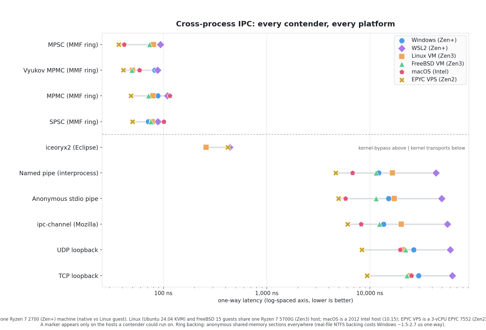

<p align="center">
  
</p>

<h2 align="center">SubEtha</h2>

<p align="center">
<strong>In the beginning pipes were created. They made a lot of processes very slow and have been widely regarded as a bad move.</strong>
</p>

<p align="center">
  <em>Kernel-bypass IPC for Rust. Send and receive over a memory-mapped file instead of the kernel, across threads, processes, disk and network, with no syscalls on the data path and no locks in your code.</em>
</p>

<p align="center">
  <a href="https://variably-constant.github.io/SubEtha/"></a>
  <a href="https://crates.io/crates/subetha"></a>
  <a href="https://pypi.org/project/subetha-ipc/"></a>
  <a href="https://www.powershellgallery.com/packages/SubEtha"></a>
  <a href="LICENSE-MIT"></a>
  
</p>

<p align="center">
  <strong><a href="https://variably-constant.github.io/SubEtha/">Read the SubEtha Guide</a></strong> -
  tutorials, how-to guides, the generated reference for every binding, and the explanations behind them.
</p>

---

<details>
<summary><b>Table of contents</b></summary>

- [Features](#features)
- [Quick start](#quick-start)
- [Why SubEtha?](#why-subetha)
- [How it works](#how-it-works)
- [What it costs](#what-it-costs)
- [Is it safe?](#is-it-safe)
- [Use cases](#use-cases)
- [Going cross-host](#going-cross-host)
- [Examples](#examples)
- [Requirements](#requirements)
- [Documentation](#documentation)
- [Douglas Adams and the Hitchhiker's Guide](#douglas-adams-and-the-hitchhikers-guide)
- [Citations](#citations)
- [Use of AI Tools](#use-of-ai-tools)
- [License](#license)

</details>

---

## Features

<details open>
<summary><b>What you get</b></summary>

- One typed `Channel<T>` that works cross-thread, cross-process, and persisted to disk, with [no syscalls on the data path](https://variably-constant.github.io/SubEtha/docs/explanation/mmf-substrate/).
- Lock-free rings whose atomic counters live *inside* the shared file, so one structure is thread-safe and process-safe at once - [no `Mutex`, no `Arc<Mutex>`](https://variably-constant.github.io/SubEtha/docs/explanation/concurrency-and-safety/).
- A ring that [changes its own shape](https://variably-constant.github.io/SubEtha/docs/reference/subetha-cxc/rings/) between SPSC and MPMC under live producers and consumers, without losing an item.
- Sync, blocking and async on the same handle, chosen per call site rather than baked into the type.
- [Maps, slabs, lists, locks, atomics, sketches and versioned structures](https://variably-constant.github.io/SubEtha/docs/reference/subetha-cxc/catalog/), all in the same mapped region.
- [TCP and QUIC bridges](https://variably-constant.github.io/SubEtha/docs/how-to/cross-host-bridge/) that carry the same channel between hosts.
- An erasure-coded link that measures loss and [changes code while running](SENS_O_MATIC_WIRE.md).
- Bindings for [Python](https://variably-constant.github.io/SubEtha/docs/how-to/python/) and [PowerShell](https://variably-constant.github.io/SubEtha/docs/how-to/powershell/), and a [C ABI](https://variably-constant.github.io/SubEtha/docs/reference/subetha-ffi/) for everything else.

</details>

---

## Quick start

> *The Vogons regard no inter-clan transaction as legitimate without the appropriate forms filed in triplicate, in red ink, with notarized copies dispatched in advance to a separate office for filing in advance of any action being taken. The kernel has long shared this view of local IPC, though without the saving grace of an actual filing cabinet. SubEtha's setup ritual is what you see below.*

```toml
[dependencies]
subetha-cxc = "0.5"
```

```rust
use subetha_cxc::AutoIpc;

let chan = AutoIpc::new("/tmp/events.bin")
    .capacity(64)
    .build_channel::<u64>()?;

// Non-blocking: returns Full / Empty right away.
chan.send(&42)?;
let v = chan.recv()?;
assert_eq!(v, 42);
```

The same `chan` also parks a thread or suspends a task, picked per call:

```rust
// Blocking: parks the calling thread until there is room / an item.
chan.send_blocking(&42, None)?;
let v = chan.recv_blocking(None)?;

// Async: suspends the task. Runs on any executor, including the crate's
// own runtime-free `block_on` (no tokio required).
chan.send_async(&42).await?;
let v = chan.recv_async().await?;
```

That's it. The file path is the channel. It can be opened from another thread, another process, or after a reboot, an arrangement the kernel regards with suspicion and the hardware regards as perfectly normal.

Sync and async are not separate types, so the choice is yours at each call site rather than baked into the type you constructed. The builder's hints, and what each one routes to, are in the [tutorial](https://variably-constant.github.io/SubEtha/docs/tutorial/).

Python and PowerShell have their own quick starts: [`pip install subetha-ipc`](https://variably-constant.github.io/SubEtha/docs/how-to/python/install/) and [`Install-PSResource SubEtha`](https://variably-constant.github.io/SubEtha/docs/how-to/powershell/install/).

---

## Why SubEtha?

> *The Guide has this to say on the subject of local inter-process communication: it is slow. You may think your last syscall was quick. It wasn't. Kernel transit is big. Really big. And by a quirk of operating-system history, the boundary between two processes on the same machine is treated with roughly the same ceremony as the boundary between two continents, complete with customs inspection, even when the two processes in question are looking at the same physical RAM.*

Local IPC normally means picking the least-bad option from a menu that all goes through the kernel. SubEtha skips the menu. After construction, every send and recv is a user-space atomic op on a memory-mapped file the kernel page-aliases between participants.

<picture>
  <source media="(prefers-color-scheme: dark)" srcset="docs/platform_ipc_dotplot_dark.png">
  
</picture>

Measured **126-499x faster than the fastest canonical kernel IPC mechanism on every platform tested** (named pipes, stdio pipes, ipc-channel, TCP/UDP loopback), and 5.0-11.4x faster than iceoryx2's zero-copy shared memory where it builds. Six platforms, 10,000 round-trips, 8-byte payloads, same backing everywhere. All four pinned channel shapes land between 36.8 and 114.9 ns one-way.

The rings are not only a cross-process tool. The same lock-free shapes run thread-to-thread with no mapped file, against `crossbeam_channel`, `flume`, `rtrb` and `std::sync::mpsc`. At 4 producers / 4 consumers a SubEtha shape wins on every multi-core host; the specialists still win where they are built to, and `rtrb` takes raw 1P/1C everywhere. None of that field crosses a process boundary at all.

That is the trade: a little single-shape peak, for one structure that morphs across four shapes and runs the same code cross-thread, cross-process and cross-host. The charts, the per-platform JSON and the methodology audit are in [the performance record](https://variably-constant.github.io/SubEtha/docs/reference/subetha-cxc/cross-platform-benchmarks/).

---

## How it works

> *The Bistromathic drive depended on the insight that numbers written on restaurant bills, within the confines of a restaurant, do not obey the same laws as numbers written anywhere else. SubEtha rests on a smaller but related observation: bytes written inside a memory-mapped file, within the confines of the same machine, do not require kernel transit to be read by another participant. The kernel concurs once at `mmap()`, again at `fsync()` if asked, and otherwise politely absents itself from the conversation.*

A channel is a file. Not a file the data passes through on its way somewhere, but a file that *is* the place the data lives, mapped into every participant's address space at once so that each of them is reading and writing the same physical pages. The kernel arranges that aliasing once, at `mmap()`, and then has nothing further to do with it. A send is a store and a counter bump. A receive is a load and a counter bump. There is no transition to kernel mode on that path because there is nothing for the kernel to carry: both parties are already looking at the bytes.

What makes that safe rather than merely fast is where the synchronization lives. At the front of every mapped file sits a handshake header holding a format version, a table of participants, and an epoch counter. Behind it are the structure's own atomics - producer and consumer cursors, sequence numbers, per-slot version stamps - and the important word is *behind*, in the file, not beside it in some process's private memory. A `Mutex` guarding a shared ring guards the half of it that one process can see. The counters in the mapping are visible to every process that opened the file, which is why the same ring is thread-safe and process-safe without a lock anywhere, and why a peer that dies mid-write leaves a torn slot a reader can detect rather than a poisoned lock nobody can release.

Attaching is opening the file and reading the header. There is no daemon to start, no broker to configure, no registry to register with, and no ordering requirement between the participants: the first one to arrive creates the structure, the rest find it. A process that comes back after a reboot opens the same path and finds the same data, because durability was never a separate feature - it is what a file already does.

> *It is an important and popular fact that a channel is not a thing but a decision: somebody, somewhere, froze an opinion about where your bytes live into an API, and everyone since has mistaken the freeze for physics. The Guide's editors note that most of the galaxy's infrastructure works this way, that almost none of it is anyone's fault, and that the wise traveler learns to distinguish between the laws of nature and the defaults of whoever got there first.*

Most channel libraries make five of those decisions on your behalf and then hide them in the type. Where the bytes live, how they travel, how many producers and consumers the structure admits, how many items it holds, and what ordering it promises: pick a type, and you have picked all five for the life of the program. The choices are usually sound. The problem is that they are permanent, and a workload is not - the shape that suits one producer filling a queue at startup is not the shape that suits eight of them at peak, and the difference between an in-process handoff and a cross-process one is a fact about deployment rather than about your code.

SubEtha treats those five as axes rather than as properties. Locale is whether the backing is anonymous memory or a file on disk. Protocol is which family of primitive carries the traffic. Shape is SPSC through MPMC. Capacity is how many items fit. Ordering is what the structure promises about the sequence items come out in. A channel moves along any of them while it is running.

> *The only machine on record to change its fundamental nature mid-journey without losing its passengers was the starship Heart of Gold, an achievement universally admired by everyone except a sperm whale and a bowl of petunias, who were briefly and terminally involved. SubEtha's substrate performs the same trick with less collateral botany: the channel you are sending through can change its storage, its protocol, its shape, its capacity, and its ordering guarantee while you hold a live handle to it, and the handle finds out in exactly one Acquire-load.*

The trick is the pin. Every handle that is about to touch the structure first takes a pin: one Acquire load of a generation counter, captured and then compared on each later check. A morph builds the new backing beside the old one, drains what is still owed to the old, publishes the swap, and bumps the generation. A handle whose pin no longer matches learns that on its next operation, in the cost of one atomic load, and follows the swap. No handle is invalidated, no item is lost, and nothing has to stop - which is the whole point, because a channel you have to quiesce to reconfigure is a channel you reconfigure by restarting the program.

Nothing here watches your traffic and decides for you. A morph is asked for, by a caller who knows something the library does not - that the fan-out is about to grow, that the backing should become durable. The paths that move a ring without a caller saying so are few and named: a resumed auto-shape, a deferred morph landing, and a sidecar policy proposing a shape from what it observes. Even then the ring maps the proposal onto the nearest shape its contract permits and counts what it refused, so a policy can influence the structure and never violate it.

The pin protocol in full, the axis matrix, and the primitives under each axis are in [the substrate reference](https://variably-constant.github.io/SubEtha/docs/reference/subetha-cxc/) and [the architecture explanation](https://variably-constant.github.io/SubEtha/docs/explanation/mmf-substrate/).

---

## What it costs

Two numbers most readers want, measured on a Zen+ R7 2700:

| Path | Cost |
|---|---:|
| `SharedRing::try_push` direct | 24.1 ns/op |
| SPSC sustained, 1M items | 20.5 M items/s |

Reproduce with `cargo bench` in `crates/subetha-cxc/benches/`. The per-call table, the sustained-workload table and the full ring-primitive throughput matrix - every shape by locale by capacity by producers by consumers - are in [the throughput results](https://variably-constant.github.io/SubEtha/docs/reference/subetha-cxc/rings/throughput-results/).

---

## Is it safe?

> *The Guide observes that "safe" is among the galaxy's most overloaded words, applied with equal confidence to spacecraft, financial instruments, and the act of wrapping a shared queue in a `Mutex`. At least one of those is a category error. SubEtha keeps its atomics inside the mapped file, where a lock bolted on from the outside guards nothing the ring does not already guard - and could not reach across the process boundary even if it tried.*

A process-private lock cannot guard a structure another process is writing to, which is why the synchronization lives in the file rather than around it. What that buys, what it does not, and what a torn read looks like when a peer dies mid-write are in [Concurrency and safety](https://variably-constant.github.io/SubEtha/docs/explanation/concurrency-and-safety/).

---

## Use cases

> *The Guide's most useful entries are not the ones describing what a thing is, but the ones describing what to use it for, which is a different question and frequently a more interesting one. The lists below name the situations where reaching for SubEtha will save you a week of bench tuning, and the situations where reaching for it will leave you maintaining a substrate to solve a problem you didn't actually have.*

Reach for it when processes on one machine exchange messages often enough that kernel transit shows up in a profile, when the same code has to run cross-thread and cross-process, or when a structure has to outlive the process that made it.

Reach for something else when one process does all the work, when the traffic is a handful of messages a second, or when the hosts are far enough apart that the network dominates. [Choosing a structure](https://variably-constant.github.io/SubEtha/docs/how-to/python/choose-a-structure/) walks the decision.

---

## Going cross-host

> *SubEtha takes its name from the Sub-Etha, the galaxy-wide signaling network on which the Guide's field researchers depend for news, gossip, and passing rides. Ours spans one LAN rather than one galaxy, observes the speed of light as a matter of politeness, and round-trips in about a millisecond, which for any network that has ever met a sysadmin is practically instantaneous.*

The same channel crosses a network through a TCP or QUIC bridge, and the Sens-O-Matic link adds erasure coding that measures loss and switches between a sliding and a block code while running, without either end reconnecting. [`SENS_O_MATIC_WIRE.md`](SENS_O_MATIC_WIRE.md) is the normative wire specification: both codes, every frame layout, the compatibility rules and the frozen interop vectors. It is versioned with the code and the code is held to it - `spec_doc.rs` parses the document's tables and each owning module asserts its constants against them, so the build fails if the two disagree.

Setting one up is in [Bridge two hosts](https://variably-constant.github.io/SubEtha/docs/how-to/cross-host-bridge/).

---

## Examples

> *The Restaurant at the End of the Universe famously serves any dish you can name, prepared with arbitrary precision, at any cosmic epoch you care to dine at, on the strength of a single time-paradox catering arrangement that no diner is asked to fully understand. The examples below operate on the same principle: one channel handle, several courses, expand whichever interests you.*

Every example in [`crates/subetha-cxc/examples/`](crates/subetha-cxc/examples/) compiles and runs; `cargo run --release --example <name>` from the repository root. The worked walkthroughs, with output, are in [the tutorial](https://variably-constant.github.io/SubEtha/docs/tutorial/).

---

## Requirements

> *The Guide's entry on interstellar travel lists exactly one hard requirement, and it is a towel. SubEtha subscribes to the same school of dependency management.*

Stable Rust and a filesystem. No broker, no daemon, no C toolchain, no system packages. Windows, Linux, macOS and FreeBSD on x86_64 and ARM64; the per-platform detail is in [Platforms](https://variably-constant.github.io/SubEtha/docs/reference/subetha-cxc/cross-platform-benchmarks/). Mostly harmless.

---

## Documentation

> *The original Guide outsold the Encyclopedia Galactica despite many omissions and much that was apocryphal, or at least wildly inaccurate, for two reasons: it was slightly cheaper, and it had the words DON'T PANIC printed in large friendly letters on the cover. The SubEtha Guide aspires to the same cover with fewer of the omissions: every number in it was measured, every example compiles, and the panics, where unavoidable, are documented.*

Everything is at **<https://variably-constant.github.io/SubEtha/>** (the *Don't Panic* edition):
[tutorials](https://variably-constant.github.io/SubEtha/docs/tutorial/),
[how-to guides](https://variably-constant.github.io/SubEtha/docs/how-to/),
[reference](https://variably-constant.github.io/SubEtha/docs/reference/) and
[explanation](https://variably-constant.github.io/SubEtha/docs/explanation/).
The pages are built from [`wiki/`](wiki/) by [`wiki-deploy.yml`](.github/workflows/wiki-deploy.yml) on every push that touches them, so the site and this repository cannot disagree.

[`SENS_O_MATIC_WIRE.md`](SENS_O_MATIC_WIRE.md) is normative for the wire; where this README and that document differ, it governs. `cargo doc --open` builds the rustdoc.

---

## Douglas Adams and the Hitchhiker's Guide

This project's name, its wiki's subtitle, and the voice at its section
boundaries are an homage to Douglas Adams (1952-2001) and *The
Hitchhiker's Guide to the Galaxy*. The Sub-Etha is the galaxy-wide
signaling network his hitchhikers use to flag down passing ships; a
library whose job is to carry messages between processes that cannot
otherwise hear each other could not reasonably be named anything else.

The borrowings, for the record: the name (the Sub-Etha network), the
wiki's *Don't Panic* edition subtitle, the Guide-entry epigraphs
throughout this README, one "mostly harmless" verdict in
[Requirements](#requirements), the towel, and the dolphins' farewell at
the foot of the page. The increasingly inaccurately named trilogy, in
five parts:

- *The Hitchhiker's Guide to the Galaxy* (1979)
- *The Restaurant at the End of the Universe* (1980)
- *Life, the Universe and Everything* (1982)
- *So Long, and Thanks for All the Fish* (1984)
- *Mostly Harmless* (1992)

This project is not affiliated with, or endorsed by, the estate of
Douglas Adams. It is merely grateful. If you have somehow read this far
without having read the books, they are larger than this codebase and
considerably funnier.

---

## Citations

> *Slartibartfast, who designed the fjords of Norway and won an award for it, would point out that no respectable planet is built without crediting the sources of its constituent geographies. The list below names the lock-free queues, work-stealing schedulers, probabilistic sketches, and capability models from which SubEtha is composed. Nothing on this list was invented here; the contribution is the substrate that lets them share a single memory-mapped file.*

<details>
<summary>Algorithm references</summary>

- **Vyukov bounded MPMC queue** (Dmitry Vyukov, 1024cores.net, ~2010) for `SharedRing` and `SharedBroadcastRing`.
- **Treiber stack** (R. Kent Treiber, IBM RJ 5118, 1986) for `SharedTreiberStack` and the free-lists inside `SharedHandleTable` and `SharedRegion`.
- **Pugh skip list** (William Pugh, CACM 33(6), 1990) for `SharedSkipList`.
- **Chase-Lev work-stealing deque** (Chase and Lev, SPAA 2005) for `SharedDeque<T>`, lifted into a memory-mapped file so the same protocol serves cross-thread and cross-process work-stealing.
- **Blumofe-Leiserson work-stealing scheduler** (Blumofe and Leiserson, JACM 46(5), 1999) for the time- and space-bound results that make `SharedDeque` useful as a scheduler primitive.
- **RCU / epoch double-check** (McKenney + Slingwine, PDCS 1998) for the `HandshakeHeader` migration protocol.
- **Seqlock** (formal model: Boehm, MSPC 2012) for `HeartbeatTable`, `EventStateLog`, `OwnerLease`, and `SharedBroadcastRing`'s per-slot writes.
- **Path expressions** (Campbell + Habermann, 1974) for `RingContract`: a ring's legal operation envelope declared as one artifact the rings enforce at attach time and the policy consults as a feasible-region filter.
- **Bloom filter** (Burton H. Bloom, CACM 13(7), 1970) and the double-hashing trick (Kirsch + Mitzenmacher, RSA 2008) for `Bloom64` and `BloomPointer`.
- **Count-Min Sketch** (Cormode + Muthukrishnan, J. Algorithms 55(1), 2005) for `SharedCountMinSketch`.
- **HyperLogLog** (Flajolet, Fusy, Gandouet, Meunier, AofA 2007) for `SharedHyperLogLog`.
- **Vitter's Algorithm R** (Jeffrey Scott Vitter, ACM TOMS 11(1), 1985) for `SharedReservoirSampler`.
- **Umbra string** (Neumann + Freitag, CIDR 2020) for `UmbraPointer<T>`'s content-prefix layout.
- **CHERI capabilities** (Watson et al., IEEE S&P 2015) for the `ReadableCapability` / `WritableCapability` bounds model.
- **FNV-1a** (Fowler, Noll, Vo, 1991, public-domain spec) for the probe hashes in `SharedHashMap`.
- **POSIX `mmap` with `MAP_SHARED`** (IEEE Std 1003.1-2024) and Windows `CreateFileMapping`, wrapped portably by [`memmap2`](https://crates.io/crates/memmap2), for every `Shared*` type's storage layer.
- **Closure-id-not-closure-code registry pattern** (Ray, OSDI 2018, pp. 561-577) for `pass_registry`.

</details>

---

## Use of AI Tools

> *Field researchers for the Guide are notoriously prolific, occasionally insightful, and reliably unreliable in roughly equal measure, which is why the published edition differs from the field drafts by one important step: someone in the editorial office reads it first. The Guide's editors hold that compilation and conviction are different jobs, and that any traveler relying on an entry nobody has checked deserves whatever the universe sends next. SubEtha's documentation observes the same separation of duties.*

The author used Claude (Anthropic) via the Claude Code CLI for code development assistance, documentation drafting, and benchmark scripting during the preparation of this repository. All technical decisions, channel architecture, mmap-backed transport design, and final content were determined by the author. The Rust implementation, unit tests, and benchmark results were independently verified by the author through zero-warning `cargo build` / `cargo clippy` / `cargo doc` passes, the full unit-test suite, and end-to-end executions of the demo binaries and the cross-process IPC benchmark on native Windows, WSL2, Ubuntu Linux, and FreeBSD.

---

## License

SubEtha is licensed under the MIT License; see [LICENSE-MIT](LICENSE-MIT). Contributions, bug reports, and feature requests are welcome.

<p align="center">
<em>So long, and thanks for all the pipes.</em>
</p>
