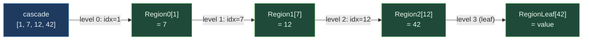

# KTowerCascade&lt;T, const DEPTH: usize&gt;


Recursive pow2-of-pow2 pointer encoding - the userspace MMU
primitive. A `KTowerCascade<T, N>` is `[u32; N]` of indices.
Each index at level `i` selects a slot in the level-`i`
[`SharedRegion`](./SHARED_REGION.md); at the leaf level the
slot holds T itself. Resolution walks N levels of region
lookups. The cascade is the same byte size as a raw pointer at
DEPTH=2 (8 bytes) and 2x a raw pointer at DEPTH=4 (16 bytes),
trading native-pointer size for cross-process position-
independence.

> **The "MMU lifted to userspace, cross-process" primitive.**
> Lookup at depth 2 in **3.36 ns** vs `Mutex<HashMap>` 51.11 ns
> (**15.2x faster**); depth 4 in 6.48 ns (**7.9x faster**).
> Insert at scale 22.4x faster than the hashmap (27.70 ns vs
> 620 ns - cascade's sequential allocator vs hashmap's rehash-
> on-growth cost). Small-batch insert 9.8x slower than hashmap
> (cascade pays per-batch region-create overhead). Cross-process
> position independence at native-pointer size is the
> architectural lever.

**Constraints (read first):**

- **Native sidecar integration**: `CascadeResolver2` and `CascadeResolverN<T, DEPTH>` carry a `HandshakeHeader` + `ObservationRing` and implement `subetha_sidecar::AdaptiveInstance`. Wrap in `SidecarBox::new` to register with the global sidecar; raw `create()` / `open()` return the unregistered type unchanged.

- **`[u32; DEPTH]` indices, position-independent**: same byte
  pattern resolves to the same value in any process that maps
  the same N regions.
- **Sentinel `NIL_INDEX = u32::MAX`**: per-level NIL means "no
  binding at this level"; `is_nil()` checks every level.
- **DEPTH chosen at compile time**: DEPTH=1 = flat region;
  DEPTH=2 = one outer + one inner; DEPTH=4 = MMU PML4-shape.
- **Sparse address spaces are free**: DEPTH=4 with u32 per
  level = 2^128 logical slots; storage paid only for branches
  populated.
- **Resolution walks N regions**: each level reads one slot in
  one region. N=DEPTH cache-line reads in the worst case.
- **`CascadeResolver2` is the simplest case**: outer +
  inner regions, explicit insert/get. `CascadeResolverN<T, N>`
  is the generic N-level resolver.
- **Cross-process backed by MMF.**

---

## Table of contents

- [What it is](#what-it-is)
- [Resolution protocol](#resolution-protocol)
- [Bench evidence](#bench-evidence)
- [Worked examples](#worked-examples)
- [Use case patterns](#use-case-patterns)
- [Known limitations](#known-limitations)
- [Common pitfalls](#common-pitfalls)
- [References](#references)

---

## What it is

```text
KTowerCascade<T, 4>  =  [u32; 4]  =  [top, mid1, mid2, leaf]
                          |       |       |       |
                          v       v       v       v
                       Region0  Region1  Region2  RegionLeaf<T>
                       [u32]    [u32]    [u32]    [T]
```

At level `i`, slot `cascade.indices[i]` of the level-`i` region
either:
- Holds the next level's u32 index (when `i < DEPTH - 1`), or
- Holds T itself (when `i == DEPTH - 1`, the leaf).

The cascade ITSELF is `DEPTH * 4` bytes. Resolution walks
DEPTH region lookups; with each region cache-aligned and flat-
indexed, the access pattern is N cache-line reads.



---

## Resolution protocol

`CascadeResolverN<T, DEPTH>::get(cascade)`:

```text
for level in 0..DEPTH:
   if cascade.indices[level] == NIL_INDEX:
       return Err(NilAtLevel(level))

for level in 0..DEPTH - 1:
   stored = intermediate[level].get(cascade.indices[level])
   if stored != cascade.indices[level + 1]:
       return Err(NilAtLevel(level + 1))

return leaf.get(cascade.indices[DEPTH - 1])
```

The intermediate-level verification (`stored != indices[level+1]`)
detects a cascade that points at a stale or wrong sub-tree.
Without it, a cascade with a valid leaf index but a stale top
index resolves to a value that doesn't belong to it.

---

## Bench evidence

Bench harness: `crates/subetha-cxc/benches/k_tower_cascade.rs`.
Captured 2026-06-02 on Windows 11 / Zen+ R7 2700, Criterion with
`--sample-size=15 --warm-up-time=1 --measurement-time=2`.

The bench file ships **two insert variants** that measure
different things:

### insert_presized (large-scale amortized cost)

Cascade pre-mapped at 1<<28 = 268M slots; hashmap with_capacity
1<<20 = 1M (grows naturally, rehashing ~7-8 times as inserts
accumulate). Both contenders pay the cost of their natural
growth strategy.

| Op | mmf | mutex_hashmap | Relative |
|---|---:|---:|---:|
| insert (criterion's full iter count) | **27.70 ns** | 620.20 ns | **22.4x cascade win** |

The cascade's sequential allocator amortizes page faults (~one
fault per 1024 slots written). The hashmap rehashes 7-8 times
over the iter count; each rehash copies every entry.

### insert_batched_256 (per-batch cost with setup)

Both contenders use `iter_batched(PerIteration)` to recreate
their structure per iter. 256 inserts per batch.

| Op | mmf | mutex_hashmap | Relative |
|---|---:|---:|---:|
| insert 256 (per-batch with setup) | 171.79 µs (≈671 ns/op) | 17.54 µs (≈68 ns/op) | **9.8x hashmap win per-op** |

The cascade pays per-batch file create + region init overhead;
the hashmap just allocates a Vec. At small batch sizes that
setup cost dominates.

### get (the architectural claim)

| Op | mmf | mutex_hashmap (1024 entries) | Relative |
|---|---:|---:|---:|
| get depth 2 | **3.36 ns** | 51.11 ns | **15.2x cascade win** |
| get depth 4 | 6.48 ns | 51.11 ns | **7.9x cascade win** |

Lookup is the headline. Two-region walk at 3.36 ns. Four-
region walk at 6.48 ns. Both far below the 51-ns hashmap
mutex+hash+bucket cost.

### Storage

| Type | Size | vs raw pointer |
|---|---:|---|
| `*const u64` | 8 bytes | baseline |
| `KTowerCascade<u64, 2>` | 8 bytes | **1.0x** (identical) |
| `KTowerCascade<u64, 4>` | 16 bytes | 2.0x |

Cross-process position-independence at native-pointer size
(depth 2) or 2x (depth 4) is the architectural lever.

### sparse_insert_100 (cascade vs hashmap at sparse key spread)

Both use `iter_batched(PerIteration)`, 100 widely-spaced inserts
per batch.

| Op | mmf | mutex_hashmap | Relative |
|---|---:|---:|---:|
| sparse insert 100 | 106.41 µs (≈1064 ns/op) | 5.25 µs (≈52 ns/op) | 20.3x hashmap win per-op |

Same per-batch-setup asymmetry as insert_batched_256. The
"sparse" workload doesn't favor the cascade at this scale -
the hashmap's hash distribution makes sparse keys cheap. The
cascade's advantage shows in the **resolution** path
(`get` numbers above), not the construction path.

### Rule 3b bench audit

- **Fair contenders**: `Mutex<HashMap<u64, u64>>` is the textbook
  in-process keyed-lookup primitive.
- **Sizing chosen for honest comparison**: cascade at 1<<28
  (avoids overflow during criterion's iter count); hashmap at
  1<<20 with natural growth (captures the realistic rehash cost
  of a hashmap at scale).
- **Both insert variants run**: presized (large-scale amortized)
  and batched (per-batch with setup); readers pick the variant
  matching their workload.
- **No `thread::spawn` inside `b.iter`**: all single-threaded.
- **MMF lifecycle managed**: per-bench create + ops + drop +
  remove_file (presized) or per-iter via `iter_batched`
  (batched / sparse).
- **Loud overflow**: `.expect("cascade overflow")` panics rather
  than silently returning Err.

### What the numbers do NOT show

- **Cross-process resolution**: the cascade resolves to the same
  T in any process that maps the same N regions. The hashmap is
  in-process only.
- **Sparse memory footprint**: at DEPTH=4 a cascade addresses
  2^128 logical slots; storage is paid only for populated
  branches. The hashmap has no notion of "empty subspace."
- **Cache behavior under churn**: a working set that fits in L3
  (~32 MB on Zen+) keeps both contenders in cache; out-of-cache
  workloads diverge per their growth strategies.

---

## Worked examples

### Two-level cascade (the simplest case)

```rust
use subetha_cxc::CascadeResolver2;

let r: CascadeResolver2<u64> = CascadeResolver2::create(
    "/tmp/outer.bin", 16,
    "/tmp/inner.bin", 64,
).unwrap();

let c1 = r.insert(0, 0xDEAD).unwrap();
let c2 = r.insert(1, 0xBEEF).unwrap();

assert_eq!(r.get(c1).unwrap(), 0xDEAD);
assert_eq!(r.get(c2).unwrap(), 0xBEEF);
```

### Four-level MMU-shape cascade

```rust
use subetha_cxc::CascadeResolverN;

let r: CascadeResolverN<u64, 4> = CascadeResolverN::create(
    "/tmp/leaf.bin", 64,
    vec![
        ("/tmp/i0.bin".into(), 16),
        ("/tmp/i1.bin".into(), 16),
        ("/tmp/i2.bin".into(), 16),
    ],
).unwrap();

let c = r.append(0xCAFEBABE).unwrap();
assert_eq!(r.get(c).unwrap(), 0xCAFEBABE);
```

### Cross-process resolution

```rust
use subetha_cxc::{CascadeResolverN, KTowerCascade};

// Process A - writer:
let r_a: CascadeResolverN<u64, 2> = CascadeResolverN::create(
    "/tmp/leaf.bin", 64,
    vec![("/tmp/i0.bin".into(), 64)],
).unwrap();
let c = r_a.append(0xCAFEBABE).unwrap();
let raw = c.raw();           // [u32; 2] - position-independent

// Process B - reader (raw bits shipped via any IPC):
let r_b: CascadeResolverN<u64, 2> = CascadeResolverN::open(
    "/tmp/leaf.bin", 64,
    vec![("/tmp/i0.bin".into(), 64)],
).unwrap();
let c_b = KTowerCascade::<u64, 2>::from_raw(raw);
assert_eq!(r_b.get(c_b).unwrap(), 0xCAFEBABE);
```

---

## Use case patterns

### Pattern: userspace MMU for cross-process object graphs

A graph of objects spread across processes. Edges store
cascades instead of pointers; each process resolves cascades
through the same N shared regions. The graph topology is
process-independent.

### Pattern: sparse virtual address space

DEPTH=4 with u32 per level addresses 2^128 logical slots.
Storage is paid only for the populated branches. An object
store with naturally sparse keys (e.g., 64-bit content hashes)
maps each key to a cascade path with zero waste.

### Pattern: pointer table for serialized data

Serialized data stores cascades instead of raw offsets. A
crash-and-recovery cycle re-maps the regions; the same cascade
bits resolve to the same data, no relocation pass needed.

---

## Known limitations

- **DEPTH chosen at compile time**: cannot tune depth per object
  at runtime without separate resolver instances.
- **Sequential allocator at the leaf**: `append` extends the
  leaf region linearly. Sparse insertion at a chosen top index
  still allocates the leaf sequentially.
- **Intermediate-slot reuse is manual**: `insert_at_top`
  overwrites the top slot's chain; orphaned intermediate slots
  remain in their regions but become unreachable.
- **No deletion**: a cascade can be NIL'd out at one level, but
  the underlying leaf and intermediate slots are not reclaimed.
- **DEPTH * 4 byte cascade**: at DEPTH=8 the cascade is 32
  bytes - larger than a raw pointer by 4x. Pick DEPTH for the
  sparsity / footprint trade your workload requires.
- **Cross-process backed by MMF.**

---

## Common pitfalls

- **Mixing cascades across regions.** A cascade's raw bits
  resolve only against the specific N regions it was created
  from. Two resolvers with the same DEPTH but different region
  files do NOT share cascade bits.

- **Overwriting `top_idx` in `insert_at_top`.** Calling twice
  with the same `top_idx` overwrites the previous chain; the
  orphaned intermediates remain in their regions. For
  independent insertions use `append` (picks the next free top
  slot) or distinct `top_idx` values.

- **Treating cascade indices as offsets.** They are slot
  positions in a region, not byte offsets. Multiplying by sizeof
  to convert is a bug.

- **NIL at the leaf vs NIL at the top.** `NilAtLevel(0)` means
  the top-level chain is unset; `NilAtLevel(DEPTH - 1)` means the
  chain is set but the leaf slot is empty. Different recovery
  paths.

- **Confusing DEPTH=1 with `OffsetPtr`.** They are byte-
  identical (both `u32`) but `KTowerCascade<T, 1>` carries the
  type-level resolver contract that `OffsetPtr` does not.

---

## References

- Source: `crates/subetha-cxc/src/k_tower_cascade.rs` (653 lines, 15
  unit tests covering NIL semantics, level access,
  with_level update, equality, hash, raw round-trip, DEPTH=1
  degeneration, size growth, CascadeResolver2 insert+get,
  cross-handle visibility, CascadeResolverN depth-4 walk, NIL
  rejection, struct value round-trip, position independence,
  and disk persistence).
- Bench: `crates/subetha-cxc/benches/k_tower_cascade.rs`
  (insert_presized [22.4x cascade win at scale],
  insert_batched_256 [9.8x hashmap win per-batch], get at
  depths 2/4 [15.2x/7.9x cascade win], storage witness,
  sparse_insert_100 [20.3x hashmap win per-batch],
  all vs `Mutex<HashMap<u64, u64>>`).
- Underlying primitive:
  [SHARED_REGION.md](./SHARED_REGION.md) - the flat-array
  region each cascade level reads from.
- Sibling primitive: [OFFSET_PTR.md](./OFFSET_PTR.md) -
  single-level position-independent pointer; KTowerCascade
  generalizes this to N nested levels.
- Sibling primitive:
  [TAGGED_OFFSET_PTR.md](./TAGGED_OFFSET_PTR.md) - OffsetPtr
  with a u32 tag; orthogonal to cascade nesting.
- Hardware analog: x86_64 MMU PML4 -> PDPT -> PD -> PT, four
  levels of 9-bit indices. KTowerCascade lifts the same
  mechanism to userspace with u32 indices per level.
