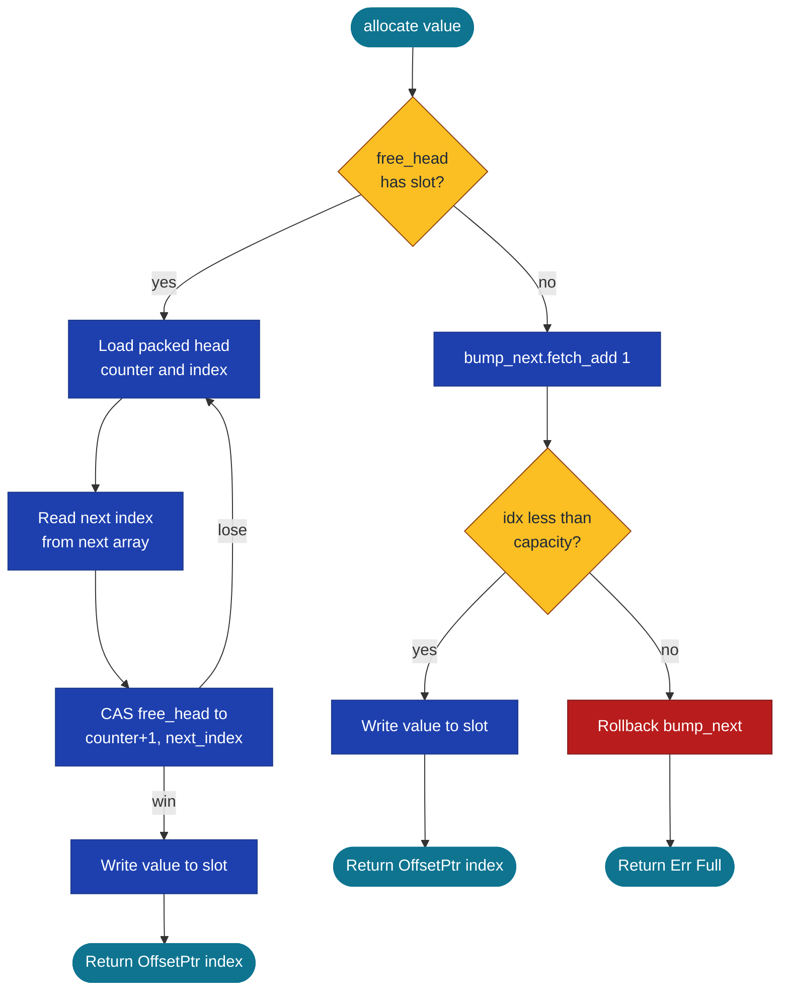

# OffsetPtr&lt;T&gt; and SharedRegion&lt;T&gt;


A 4-byte position-independent pointer to a typed slot inside a
memory-mapped file. Resolves to the same logical value in any
process that has the file mapped, regardless of where the OS places
each process's mapping in its address space.

> **The foundational primitive.** Every other cross-process pointer
> in this crate composes on top of `OffsetPtr<T>` plus its host
> `SharedRegion<T>`. Once this pair is understood, the rest of the
> family is the same shape with extra metadata bytes bolted on.

**Constraints (read first):**

- **Cross-process / MMF-backed.** Requires a writable backing file
  path. For in-process workloads that never cross a process
  boundary, prefer a typed-arena crate or one of the
  `subetha-pointers` exotic pointer types (for example `UmbraPointer`).
- **`T: Copy + 'static`.** No `Drop` glue runs on `free`. Types
  with destructors (`String`, `Vec`, `Box`) cannot live in a slot
  directly.
- **Capacity fixed at `create`.** No auto-grow. Size the region
  for the workload upfront; allocation past capacity returns
  `Err(Full)`.
- **Maximum `u32::MAX - 1` slots per region** (the 4-byte index
  plus the reserved `NIL` sentinel). For larger workloads,
  partition across regions.
- **`clear()` is not thread-safe.** Intended for single-threaded
  bench setup and test teardown only; calling it concurrent with
  `allocate` / `free` corrupts the free list. All other ops are
  lock-free.
- **Pointer is meaningful only with the region that issued it.**
  An `OffsetPtr<T>` from region A passed to region B silently
  resolves to wrong bytes (or returns `Err(InvalidPtr)` if the
  index exceeds B's capacity).

---

## Table of contents

- [What it is](#what-it-is)
- [When to reach for it](#when-to-reach-for-it)
- [Memory layout](#memory-layout)
- [Allocation protocol](#allocation-protocol)
- [API at a glance](#api-at-a-glance)
- [Worked example](#worked-example)
- [Benchmark results](#benchmark-results)
- [Concurrency and safety](#concurrency-and-safety)
- [Known limitations (verified)](#known-limitations-verified)
- [Common pitfalls](#common-pitfalls)
- [Composition with other primitives](#composition-with-other-primitives)

---

## What it is

`OffsetPtr<T>` is a `#[repr(C)]` struct with one field:

```rust
pub struct OffsetPtr<T> {
    pub index: u32,
    _phantom: PhantomData<T>,
}
```

Four bytes. Plain old data. `Copy`. `Hash`. Equality on the `index`
field. A sentinel `OffsetPtr::NIL` whose `index` is `u32::MAX`.

`SharedRegion<T>` is the host. It owns the memory-mapped file, the
allocator's bump cursor, and the lock-free free list. An `OffsetPtr`
is meaningful only when paired with the region that issued it. The
region resolves the pointer by reading `slot[index]` out of its
mmap.

The position-independent property is the whole point. A raw
`*const T` in one process's heap is a virtual address that the OS
chose at mmap time; another process mapping the same file gets a
different base address and the raw pointer dangles as a wild pointer.
The 4-byte index does not have that problem: every process resolves
`index` to `base_ptr + slots_offset + index * size_of::<T>()`, where
`base_ptr` is that process's own mapping.

## When to reach for it

Reach for `OffsetPtr<T>` + `SharedRegion<T>` when **all** of these
hold:

- The pointer or the value it points to needs to be visible to more
  than one process, OR persisted to disk and reloaded later.
- The payload `T` is `Copy + 'static` (no `Drop` glue, no
  lifetimes).
- The slot count can be picked at allocation time (capacity is
  fixed at `create`; it does not auto-grow).
- You want a typed arena with one slot type, not a heterogeneous
  bump allocator.

Reach for something else when:

- Your data lives in one process and never crosses the boundary. A
  plain `Vec<T>` or a typed-arena crate is smaller and faster.
- `T` has `Drop` glue. The region does not run drop on free.
- The slot count is unknown and may exceed `u32::MAX - 1`. The
  4-byte index caps total slots at `u32::MAX - 1` (one value is
  reserved for `NIL`).

## Memory layout

The MMF backing file is laid out in three contiguous regions:


The header is a `#[repr(C, align(64))]` struct that fits in one
cache line:

| Field | Type | Purpose |
|---|---|---|
| `magic` | `u32` | `0x4150_5247`, sanity check on `open` |
| `capacity` | `u32` | Slot count, set at `create`, validated on `open` |
| `slot_size` | `u32` | `size_of::<T>()`, validated on `open` |
| `bump_next` | `AtomicU64` | Bump cursor for fresh allocations |
| `free_head` | `AtomicU64` | Packed `(counter, index)` for the lock-free free list |

The `next[]` array sits between header and payloads. Each entry is
an `AtomicU32` that holds the free-list link when its matching slot
is on the free list (and is unused otherwise). Keeping the link
out of the payload bytes means `T` is free to choose any alignment
without colliding with allocator metadata.

The `slots[]` array is just `capacity` consecutive `T` values, byte-
identical to a `Vec<T>` of the same length. Resolving an `OffsetPtr`
is one pointer add and one read.

## Allocation protocol

Two paths exist: a lock-free Treiber-stack pop from the free list,
falling back to an atomic bump-pointer allocation.



The free-list path is a classic Treiber stack with one twist: a
32-bit counter is packed into the high half of `free_head` alongside
the 32-bit index. Every push increments the counter, which makes
the packed 64-bit word distinct even when the same index repeats.
The counter exists to close the ABA race: without it, a thread that
reads `head = A`, sleeps, then races on a CAS may see "A" again
even though A has been popped, repushed with a different next link,
and the link it remembered is stale. With the counter, the second
view of A is a different `(counter, A)` pair and the CAS fails
correctly. A 32-bit counter spans 4 billion pushes before it wraps,
which exceeds any realistic concrete race window.

The bump path is `fetch_add` plus a capacity check. On overflow the
bump cursor is rolled back with `fetch_sub` so a subsequent
allocation does not see a stale `bump_next > capacity`.

## API at a glance

<details>
<summary><b>OffsetPtr&lt;T&gt;</b> (click to expand)</summary>

| Method | Signature | Returns |
|---|---|---|
| `OffsetPtr::NIL` | const | sentinel pointer with `index = u32::MAX` |
| `OffsetPtr::new(index: u32)` | constructor | typed pointer |
| `is_nil()` | `&self -> bool` | true when index equals `NIL_INDEX` |
| `Copy + Clone` | derived | 4-byte copy |
| `PartialEq + Eq` | derived | index equality |
| `Hash` | derived | hashes the u32 index |

</details>

<details>
<summary><b>SharedRegion&lt;T&gt;</b> (click to expand)</summary>

| Method | Signature | Behavior |
|---|---|---|
| `create(path, capacity)` | `Result<Self, RegionError>` | creates the MMF, writes header, initializes free-list links |
| `open(path, expected_capacity)` | `Result<Self, RegionError>` | opens an existing MMF, validates magic / capacity / slot_size |
| `allocate(value)` | `Result<OffsetPtr<T>, RegionError>` | tries free-list pop, falls back to bump, returns `Err(Full)` on exhaustion |
| `free(ptr)` | `Result<T, RegionError>` | pushes the slot index back onto the Treiber stack, returns the previous value |
| `get(ptr)` | `Result<T, RegionError>` | reads the slot by value (T: Copy) |
| `set(ptr, value)` | `Result<(), RegionError>` | overwrites the slot in place |
| `len()` | `usize` | bump high-water minus free-list length (snapshot) |
| `free_count()` | `usize` | walks the free list (O of N_free) |
| `clear()` | `&self` | resets bump cursor to 0 and free list to NIL; not thread-safe |
| `flush()` | `Result<(), RegionError>` | msync (blocks until durable) |
| `flush_async()` | `Result<(), RegionError>` | schedules writeback; partially async on Windows |
| `mmap_ptr()` | `*const u8` | raw mmap base for primitives that build on top |

</details>

## Worked example

```rust
use subetha_cxc::{OffsetPtr, SharedRegion};

let region: SharedRegion<u64> = SharedRegion::create("/tmp/example.bin", 1024)?;

// Allocate two slots.
let a = region.allocate(42).expect("region full");
let b = region.allocate(99).expect("region full");

// Read them back.
assert_eq!(region.get(a)?, 42);
assert_eq!(region.get(b)?, 99);

// Free a, then allocate again. The free-list LIFO returns the same slot.
let v = region.free(a)?;
assert_eq!(v, 42);
let c = region.allocate(777).expect("region full");
assert_eq!(c.index, a.index);  // slot reused

// A second process can open the same file and resolve the same OffsetPtr.
// (run in a separate process)
// let reader: SharedRegion<u64> = SharedRegion::open("/tmp/example.bin", 1024)?;
// assert_eq!(reader.get(OffsetPtr::new(c.index))?, 777);
```

## Benchmark results

Comparison baseline: `MutexArena<T> = { Mutex<Vec<T>>, Mutex<Vec<usize>> }`,
the textbook in-process typed-arena + free-list pattern. The baseline
takes one `parking_lot::Mutex` lock per allocate and per free. The
`SharedRegion` path uses lock-free `fetch_add` on the bump cursor or
a Treiber CAS on the free list.

Numbers are median of 10 samples, 2-second measurement window, on
Windows x86-64. Each iteration is one operation. Lower is faster.

| Workload | SharedRegion (mmf) | MutexArena (in-process) | Ratio |
|---|---:|---:|---:|
| `allocate` (bump path) | **60 ns** | 91 ns | **1.5x faster** |
| `alloc + free cycle` (free-list path) | **18 ns** | 78 ns | **4.3x faster** |
| `get` (resolve known pointer) | **1.6 ns** | 17 ns | **10.6x faster** |
| `concurrent_alloc_4t` (4 threads, 100 allocs each) | 416 us | **372 us** | 0.89x (baseline wins) |

### Why each result lands where it does

<details>
<summary><b>allocate (bump): SharedRegion wins 1.5x</b></summary>

Both implementations bump-allocate to a slot. `SharedRegion` uses a
single `fetch_add` on `bump_next` plus one `std::ptr::write` to the
slot. `MutexArena` takes the `slots` Mutex, calls `Vec::push`, then
releases. The Mutex acquire / release adds ~30 ns of atomic-op
overhead the lock-free path skips. `Vec::push` also checks capacity
and may reallocate (it does not in this bench because the Vec was
pre-allocated to capacity, but the branch is still in the hot
path).

</details>

<details>
<summary><b>alloc + free cycle: SharedRegion wins 4.3x</b></summary>

`alloc + free` is the Treiber stack's home turf. `SharedRegion`
does two `CompareExchange` operations (one push on free, one pop
on alloc) and zero locks. `MutexArena` takes the `free_list` Mutex
twice (push on free, pop on alloc) and the `slots` Mutex twice
(write on alloc, read on free), so four mutex round-trips per
cycle. At ~10 to 15 ns per uncontended `parking_lot::Mutex` cycle
and one CAS at ~5 ns, the math works out to roughly the measured
ratio.

</details>

<details>
<summary><b>get (resolve known pointer): SharedRegion wins 10.6x</b></summary>

`SharedRegion::get` is one bounds check, one pointer add, and one
`std::ptr::read`. The whole call is a handful of instructions and
the bench measures ~1.6 ns per resolve.

`MutexArena::get` has to take the `slots` Mutex first because the
Vec might be growing concurrently. That single Mutex acquire is
the entire 17 ns. A non-thread-safe baseline (just `Vec<T>`)
resolves in the same ~1 to 2 ns the MMF version does.

The 10x gap here is not "MMF is fast"; it is "Mutex is unavoidable
for safe shared access through Vec." `SharedRegion::get` is safe
without a mutex because the slot is never moved after allocation:
slot indices are stable for the lifetime of the region.

</details>

<details>
<summary><b>concurrent_alloc_4t: MutexArena wins 0.89x (the honest loss)</b></summary>

Four threads each allocate 100 slots. Total work: 400 allocations
in a tight loop, all contending on a single bump cursor.

`MutexArena` wins this by ~11%. The reason is that
`parking_lot::Mutex` on a 400-allocation tight loop pays its lock
cost once per allocation but the lock itself acts as a queueing
mechanism: at most one thread is inside `Vec::push` at a time, so
there is no cache-line ping-pong between threads beyond the lock
word itself.

`SharedRegion`'s lock-free `fetch_add` on `bump_next` forces all
four threads to contend on the same cache line for every allocate.
At 4 threads on a 4-wide superscalar core that bounces the
`bump_next` cache line via the MESI / MOESI coherence protocol
once per allocate. The atomic op is faster than a lock acquire in
isolation, but the cache-line ping-pong cost shows up in this
specific high-contention pattern.

**What you trade away to lose this bench:** the MMF version
provides cross-process visibility and disk persistence that the
in-process baseline cannot match at any speed. For a workload that
needs those properties, MutexArena is not a valid alternative. For
a pure single-process workload with no cross-process or
persistence needs, the typed-arena crates are the right choice and
are faster than either of these.

For pointer-graph workloads that allocate once and read many times,
the `get` ratio (10.6x) is the dominant cost: SharedRegion's
single-allocation overhead amortizes across thousands of reads.

</details>

## Concurrency and safety

<details>
<summary><b>Thread-safety contract</b></summary>

`SharedRegion<T>` is `Send` when `T: Send` and `Sync` when `T: Sync`.

| Operation | Thread-safe? |
|---|---|
| `allocate` | yes (lock-free Treiber + atomic bump) |
| `free` | yes (lock-free Treiber push) |
| `get` (typed `T: Copy`) | yes (slot indices are stable; payload writes are aligned for T) |
| `set` | yes for `T: Copy + Sized` with aligned writes |
| `clear` | NO (resets cursor and head without coordinating with concurrent ops) |
| `flush` | yes (msync is atomic from the OS perspective) |

`clear` is the explicit exception. It is intended for single-
threaded bench setup and test teardown. Calling it concurrent with
`allocate` or `free` will corrupt the free list.

</details>

<details>
<summary><b>Cross-process visibility</b></summary>

Two processes that both `open` the same backing file see the same
slots. Writes are visible to other processes after the write
completes (the mmap shares physical pages between processes).
Acquire / Release ordering on `bump_next` and `free_head` provides
the happens-before relationship needed for the reader process to
see the slot bytes that the writer wrote before publishing the
pointer.

For durability across a crash or reboot, call `flush()` explicitly.
The OS may delay writeback indefinitely without it.

</details>

<details>
<summary><b>Use-after-free is the caller's problem</b></summary>

Slots are reused. If process A holds an `OffsetPtr` to a slot, and
process B `free`s the slot and `allocate`s into it again, A's
pointer now refers to a different value. The crate cannot
distinguish "this pointer is still valid" from "this pointer was
freed and the slot reallocated", because the index is the entire
pointer payload and the only signal of slot identity.

Composing primitives that need a "did this slot get reused?" check
add a version or generation counter alongside the index. See
[`TaggedOffsetPtr`](TAGGED_OFFSET_PTR.md) for one pattern.

</details>

## Known limitations (verified)

These are limitations that exist in the shipped code as of this
writing. Each is observable in the source.

1. **Capacity is fixed at `create` and never grows.** The MMF file
   length is set once. An attempt to allocate beyond capacity
   returns `Err(Full)`. Callers must size the region for the
   workload upfront.

2. **Maximum slot count is `u32::MAX - 1`.** The 4-byte index plus
   the reserved `NIL_INDEX = u32::MAX` sentinel caps a single
   region at 4 294 967 294 slots. For workloads beyond this,
   partition across multiple regions.

3. **`T: Copy + 'static`.** `Drop` glue is not run on `free`. Types
   with destructors (e.g. `String`, `Vec`, `Box`) cannot live in a
   `SharedRegion` directly. For variable-length data, store an
   `OffsetPtr` into a separate `SharedRegion<u8>` or
   `SharedStringArena`.

4. **`clear()` is not thread-safe.** See the table above.
   Concurrent ops with `clear` will corrupt the free-list
   invariant.

5. **No drop integration with the file lifecycle.** When the last
   `SharedRegion` is dropped, the file is unmapped but not
   deleted. Callers manage file cleanup explicitly.

6. **The free-list link array costs `4 * capacity` extra bytes**
   compared to a union'd-link allocator. The design trade is
   layout simplicity for any `T` alignment versus the extra
   storage.

7. **Re-opening a region does not validate the free-list.** `open`
   checks magic, capacity, and slot_size from the header. If the
   `next[]` array is corrupt, allocation will still proceed but
   may return overlapping pointers. There is no integrity check on
   the free chain at open time.

8. **`clear` does not zero the slot payloads.** Subsequent
   `allocate` writes overwrite each slot before returning the
   pointer, so callers never observe stale payload bytes via the
   normal `allocate` then `get` path. A stray reader holding a
   stale `OffsetPtr` after `clear` will read whatever bytes
   happened to be in that slot at clear time.

## Common pitfalls

<details>
<summary><b>Pitfall 1: capacity mismatch on <code>open</code></b></summary>

`open(path, expected_capacity)` validates that the on-disk header's
`capacity` matches the argument. Mismatch returns
`Err(LayoutMismatch)`. The capacity is not auto-detected from the
file size because doing so lets the caller silently read
arbitrary indices on a smaller file. Always pass the same capacity
that the creating process used.

</details>

<details>
<summary><b>Pitfall 2: <code>T</code> changed between create and open</b></summary>

`open` validates `size_of::<T>()` against the header's `slot_size`.
A mismatch returns `Err(LayoutMismatch)`. This catches the case
where process A creates with `SharedRegion<u64>` and process B
opens with `SharedRegion<u32>`: bytes are there but the typed view
is wrong.

It does NOT catch the case where two different 8-byte types share
the file accidentally. The crate has no Rust-type identity in the
header.

</details>

<details>
<summary><b>Pitfall 3: free-then-get the same pointer</b></summary>

```rust
let ptr = region.allocate(42)?;
region.free(ptr)?;
// At this point ptr.index may be sitting on the free list. If
// another thread reallocates into the same slot before this thread
// calls get, the get sees the new value, not 42.
let _ = region.get(ptr);  // races with concurrent allocate
```

The crate does not invalidate the `OffsetPtr` value on `free`. The
caller's invariant is "do not use an `OffsetPtr` after passing it
to `free`."

</details>

<details>
<summary><b>Pitfall 4: counting on durability without <code>flush</code></b></summary>

The OS may buffer mmap writes indefinitely. A crash before
`flush()` loses any unflushed bytes. For an audit log or similar
durability-critical workload, call `flush()` at the end of each
batch. For the throughput cost of msync, see the audit-log bench
documentation.

</details>

## Composition with other primitives

`OffsetPtr` + `SharedRegion` is the base of these other primitives
in this crate:

| Primitive | Composition |
|---|---|
| `SharedHashMap<K, V>` | inline slots; not built on SharedRegion, but follows the same MMF + atomic-state pattern |
| `SharedVec<T>` | inline slots in its own MMF, indexed positionally; conceptually a region with no free-list |
| `SharedLinkedList<T>` | `SharedRegion<LinkedListNode<T>>` where each node carries `OffsetPtr<LinkedListNode<T>>` for prev / next |
| `SharedTreiberStack<T>` | `SharedRegion<StackNode<T>>` with one `OffsetPtr` link per node |
| `SharedGraph<N, E>` | one `SharedRegion` for nodes, one for edges; each edge is a node-to-node `OffsetPtr` pair |
| `SharedVersionedChain<T>` | `SharedRegion`-like layout with its own header; chains MVCC versions via `OffsetPtr` next links |
| `SharedStringArena` | byte-region with intern-table indices |

Every pointer-graph data structure in the crate uses some variant
of this pattern. The `OffsetPtr` index is the universal way to
talk about a slot, and the `SharedRegion` is the universal way to
host slots that other processes can see.

---

[back to subetha docs](../../README.md)
