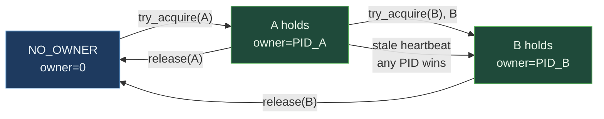

# OwnerLease&lt;T&gt;


Cross-process Mutex with auto-failover. Combines a
SeqLock-protected payload cell with lowest-live-PID + heartbeat-
stale ownership tracking. A process claims exclusive access via
CAS; if the current owner dies, another process can preempt
within `grace_epochs` and continue. The lease is the
"hold-the-resource-across-many-ops" primitive - acquire once,
hold across many ops, release explicitly or via auto-failover.

> **The "cross-process Mutex that survives a crashed owner"
> primitive.** Acquire-release cycle: 23.94 ns vs
> `std::sync::Mutex` 16.75 ns (1.43x slower; the failover
> machinery costs ~7 ns). **Held-read at 9.64 ns vs
> std::Mutex::lock+read+unlock 16.84 ns (1.75x FASTER)** -
> the lease's "acquire once, hold across many ops" pattern
> beats per-op mutex cycling. `beat` heartbeat refresh at
> 2.62 ns. The architectural lever: cross-process visibility,
> lowest-PID preemption, and auto-failover on owner death.

**Constraints (read first):**

- **Native sidecar integration**: the struct carries a `HandshakeHeader` + `ObservationRing` and implements `subetha_sidecar::AdaptiveInstance`. Wrap in `SidecarBox::new` to register with the global sidecar; raw `create()` / `open()` return the unregistered type unchanged.

- **`T: Copy + 'static`, fixed payload** sized to
  `PAYLOAD_BYTES` (48 bytes), aligned to 8 bytes max.
- **Lowest PID wins preemption**: `try_acquire(my_pid, grace)`
  succeeds when (a) no current owner, OR (b) `my_pid < current
  owner` (preemption), OR (c) current owner's heartbeat is more
  than `grace` epochs stale.
- **Owner-only writes**: `write_as_owner` returns `false` if
  the caller has been preempted; same for `read_as_owner` (use
  `Option<T>` return).
- **`PID 0` reserved for `NO_OWNER`**: callers cannot use PID 0.
- **`beat(my_pid)` must be called periodically**: the lease's
  failover criterion is `global_epoch - heartbeat_epoch > grace`.
- **`tick_epoch` advances the global counter**: typically called
  by an external scheduler on a timer.
- **Cross-process backed by MMF.**

---

## Table of contents

- [What it is](#what-it-is)
- [Preemption protocol](#preemption-protocol)
- [API surface](#api-surface)
- [Bench evidence](#bench-evidence)
- [Worked examples](#worked-examples)
- [Use case patterns](#use-case-patterns)
- [Known limitations](#known-limitations)
- [Common pitfalls](#common-pitfalls)
- [References](#references)

---

## What it is

```text
+-----------------------------+
| LeaseHeader (64B)           |
|   magic                     |
|   payload_size              |
|   seq_version  (SeqLock)    |
|   owner_pid    (AtomicU32)  |
|   lease_term   (AtomicU32)  |
|   heartbeat_epoch (U64)     |
|   global_epoch (U64)        |
+-----------------------------+
| LeasePayload (64B)          |
|   bytes[48 usable]          |
+-----------------------------+
```

Total: 128 bytes. The header carries the ownership protocol;
the payload holds T.

---

## Preemption protocol

```text
try_acquire(my_pid, grace):
   loop:
       cur = owner_pid.load()
       if cur == NO_OWNER: can_claim = true
       elif cur == my_pid: return true     # idempotent
       elif my_pid < cur:  can_claim = true # preemption: lower PID wins
       else:
           beat = heartbeat_epoch.load()
           global = global_epoch.load()
           can_claim = (global - beat) > grace
       if not can_claim: return false
       if CAS(owner_pid, cur, my_pid) succeeds:
           lease_term.fetch_add(1)
           heartbeat_epoch.store(global)
           return true
```

Three claim conditions:

1. **Vacant**: `owner == NO_OWNER`. Anyone can claim.
2. **Lower-PID preemption**: `my_pid < current owner`. Lower PIDs
   win racing claims - gives deterministic preemption order.
3. **Stale heartbeat**: `global - heartbeat > grace`. The owner
   missed too many beats; presumed dead.



---

## API surface

| Op | What it does |
|---|---|
| `try_acquire(my_pid, grace)` | CAS-claim per protocol above; returns bool |
| `release(my_pid)` | CAS owner back to NO_OWNER; returns true if I was owner |
| `with_lease(my_pid, grace, |&mut T| ...)` | RAII-style acquire+mutate+release |
| `read_as_owner(my_pid)` | Returns Some(T) if I own; None otherwise |
| `write_as_owner(my_pid, T)` | Writes payload if I own; returns bool |
| `beat(my_pid)` | Refresh heartbeat to current global epoch |
| `tick_epoch()` | Advance global epoch (typically scheduler-driven) |
| `current_owner()` | Snapshot of who holds; None if vacant |
| `am_i_owner(my_pid)` | One atomic load |
| `lease_term()` | Counter incremented on every handover |

---

## Bench evidence

Bench harness: `crates/subetha-cxc/benches/owner_lease.rs`. Captured
2026-06-02 on Windows 11 / Zen+ R7 2700, Criterion with
`--sample-size=15 --warm-up-time=1 --measurement-time=2`.

### Full lock cycle (acquire + release per op)

| Op | `OwnerLease` (mmf) | `std::sync::Mutex` | `parking_lot::Mutex` | mmf relative |
|---|---:|---:|---:|---|
| acquire_release | 23.94 ns | 16.75 ns | 16.79 ns | 1.43x slower |
| with_lease (closure RAII) | 37.29 ns | 16.78 ns | 16.78 ns | 2.22x slower |

The lease pays ~7-20 ns extra vs the mutex baselines: the CAS
includes the lease_term increment + heartbeat write; with_lease
adds SeqLock-protected read/write of the payload.

### Held-lease ops (acquire ONCE, then many ops)

| Op | `OwnerLease` (mmf) | `std::sync::Mutex` (lock+op+unlock) | mmf relative |
|---|---:|---:|---|
| read_as_owner (held) | **9.64 ns** | 16.84 ns | **1.75x FASTER** |
| write_as_owner (held) | **13.47 ns** | 16.92 ns | **1.26x FASTER** |

When callers amortize the acquire over many ops (the natural
lease usage pattern), per-op cost beats per-op mutex cycling.
The held-lease ops skip the lock acquire / release path; only
the `am_i_owner` check + payload read/SeqLock-write remain.

### Heartbeat + status

| Op | `OwnerLease` (mmf) |
|---|---:|
| beat (heartbeat refresh) | 2.62 ns |
| am_i_owner (status check) | 1.28 ns |

Both are atomic-load-based. `beat` is one load + one store;
`am_i_owner` is one load + compare.

### Reading the trade-offs

The OwnerLease and std::Mutex serve **different usage
patterns**:

- **std::Mutex per-op cycle**: lock → mutate → drop. Optimal
  when each operation is independent and short-lived.
- **OwnerLease held-lease**: acquire once → many ops → release.
  Optimal when one caller wants to monopolize the resource
  briefly without paying lock cost per op.

For the textbook "acquire-release per op" cycle, std::Mutex
wins by 1.43x. For "acquire once, do many ops" (the lease's
natural shape), OwnerLease wins by 1.26-1.75x.

The architectural lever stacks on top:

1. **Cross-process operation**: OwnerLease works across
   processes; std::Mutex is in-process only.
2. **Auto-failover on owner death**: a stale heartbeat lets
   another process preempt without the dead owner needing to
   call `release`. std::Mutex deadlocks on owner-thread crash.
3. **Lowest-PID preemption**: deterministic ordering when
   multiple claimants race. std::Mutex has no such policy.

### Rule 3b bench audit

- **Fair contenders**: `std::sync::Mutex<T>` and
  `parking_lot::Mutex<T>` are the textbook in-process mutex
  baselines. Both bench the same workload (per-op cycle).
- **Two usage patterns measured**: acquire-release per op AND
  acquire-once-hold-many. Acknowledges that the lease and
  mutex serve different shapes.
- **No `thread::spawn` inside `b.iter`**: all single-threaded.
  Concurrent preemption is in source unit test
  `lower_pid_preempts_higher`; failover within grace is in
  `stale_owner_failover_within_grace`.
- **MMF lifecycle managed**: create + acquire + ops + release
  + drop + remove_file.

### What the numbers do NOT show

- **Cross-process lease**: the architectural lever. Process A
  holds the lease; Process B's `try_acquire` returns false
  unless A releases, A's heartbeat goes stale, or B has lower
  PID. std::Mutex cannot do this at any cost.
- **Failover under crashed-owner scenario**: A holds the lease,
  crashes without releasing. After grace_epochs, another
  process's `try_acquire` succeeds. std::Mutex deadlocks
  permanently.
- **Multi-process contended acquire**: lowest-PID-wins gives
  deterministic preemption ordering; mutex baselines have no
  PID-aware policy.

---

## Worked examples

### Held lease (acquire once, mutate many)

```rust
use subetha_cxc::OwnerLease;

let lease: OwnerLease<u64> = OwnerLease::create("/tmp/counter.bin", 0).unwrap();
let my_pid = std::process::id();

if lease.try_acquire(my_pid, 3) {
    // Hold across many ops:
    for _ in 0..1000 {
        let v = lease.read_as_owner(my_pid).unwrap();
        lease.write_as_owner(my_pid, v + 1);
    }
    lease.release(my_pid);
}
```

### Closure-based RAII

```rust
let result = lease.with_lease(my_pid, 3, |v| {
    let prev = *v;
    *v = prev * 2;
    prev
});
// Lease released on return; result is Some(prev_value) or None.
```

### Cross-process failover

```rust
// Process A - primary worker:
let lease: OwnerLease<u64> = OwnerLease::open("/tmp/lease.bin").unwrap();
let pid_a = std::process::id();
if lease.try_acquire(pid_a, 3) {
    loop {
        lease.beat(pid_a);
        do_work();
        std::thread::sleep(std::time::Duration::from_millis(100));
    }
    // (process A crashes here without calling release)
}

// Process B - standby worker:
let lease: OwnerLease<u64> = OwnerLease::open("/tmp/lease.bin").unwrap();
let pid_b = std::process::id();
// Periodic claim attempts; succeeds when A's heartbeat goes stale.
loop {
    if lease.try_acquire(pid_b, 3) {
        // Took over from dead A; resume work.
        break;
    }
    std::thread::sleep(std::time::Duration::from_secs(1));
}
```

---

## Use case patterns

### Pattern: hot-standby coordinator

A primary process holds the lease and beats; secondaries poll
`try_acquire`. On primary crash, the first secondary to detect
the stale heartbeat takes over within `grace_epochs * tick_period`.

### Pattern: cross-process shared mutable state with held access

A process holds the lease across a long-running operation
(e.g., a batch of database writes). Other processes block until
the operation completes. The held-read/write fast paths
(9.64 ns / 13.47 ns) make this cheaper than acquire-per-op
across the same batch.

### Pattern: leader-style work assignment

The lease holder gets exclusive access to a queue / state /
resource. Lowest-PID preemption gives deterministic leader
selection across racing claimants; heartbeat-stale failover
ensures progress even when leaders crash.

---

## Known limitations

- **Payload size capped at 48 bytes**.
- **Spin-based acquire contention**: no kernel parking; under
  high contention callers burn CPU. Use sparingly for hot
  contended resources.
- **`beat` must be called manually**: no automatic background
  beating. Callers structure their work loop to beat
  periodically.
- **`tick_epoch` is global**: a single external ticker advances
  the epoch for all leases. Multiple leases on the same
  process may share or independently advance.
- **PID 0 reserved**: callers cannot use PID 0 (asserts).
- **Cross-process backed by MMF.**

---

## Common pitfalls

- **Forgetting to `beat` while holding the lease.** Without
  beats, the heartbeat goes stale and another process preempts.
  Either beat in the work loop or release explicitly on
  completion.

- **Calling `beat` after preemption.** Returns false; the
  caller is no longer owner. Check the return and re-acquire if
  needed.

- **Treating the lease as a counting primitive.** It is binary
  ownership; only one owner at a time. For shared-readers /
  exclusive-writer use a `SharedRWLock`.

- **Assuming `release` is idempotent across owners.** `release`
  only succeeds if the caller is the current owner. After
  preemption, `release(my_pid)` returns false.

- **Using PID 0.** Asserts in `try_acquire`. The reserved
  sentinel.

- **Wrapping in a Mutex.** Pointless; the CAS + SeqLock
  protocol is already concurrency-safe.

---

## References

- Source: `crates/subetha-cxc/src/owner_lease.rs` (531 lines, 11
  unit tests covering acquire+release round-trip, lower-PID
  preemption, owner-only read/write, with_lease closure RAII,
  stale-owner failover within grace, beat-keeps-owner-alive,
  lease_term advance on handover, cross-handle visibility,
  disk persistence, beat-after-preemption, and struct payload
  round-trip).
- Bench: `crates/subetha-cxc/benches/owner_lease.rs`
  (acquire_release, with_lease, read_as_owner held,
  write_as_owner held, beat, am_i_owner vs `std::sync::Mutex`
  and `parking_lot::Mutex`).
- Sibling primitive: [SHARED_CELL.md](./SHARED_CELL.md) -
  unconditional SeqLock cell; OwnerLease is the
  exclusive-ownership specialization.
- Sibling primitive:
  [SHARED_LEADER_ELECTION.md](./SHARED_LEADER_ELECTION.md) -
  pure leadership without payload; OwnerLease adds the
  protected resource.
- Sibling primitive:
  [SHARED_RW_LOCK.md](./SHARED_RW_LOCK.md) - shared-readers /
  exclusive-writer; OwnerLease is the always-exclusive case.
- Composes with: [HEARTBEAT.md](./HEARTBEAT.md) - external
  heartbeat tables can drive `tick_epoch`; the lease's own
  heartbeat is internal.
