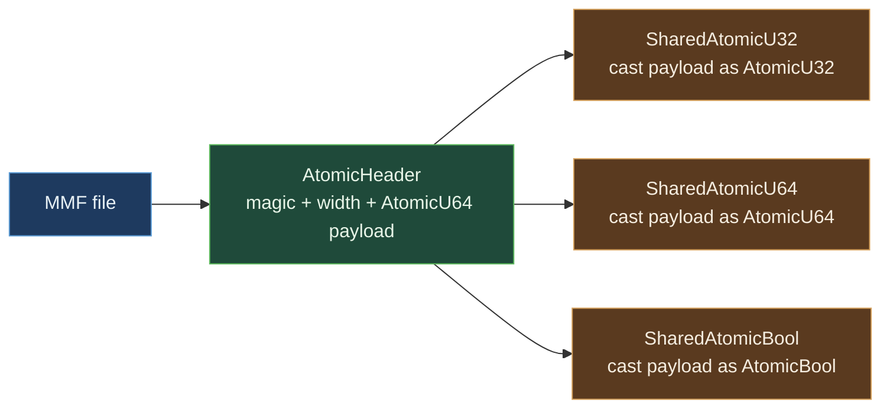

# SharedAtomicU32 / SharedAtomicU64 / SharedAtomicBool


Cross-process atomic counter / flag / bitset cell. The MMF payload
is interpreted directly as `AtomicU32`, `AtomicU64`, or `AtomicBool`;
atomic operations are sound across process boundaries because
hardware cache coherence guarantees the semantics when both
processes map the same physical page (which the OS guarantees for
the same MMF file).

> **The "atomic-but-shared-across-processes" primitive.** Three
> concrete types ship: `SharedAtomicU32`, `SharedAtomicU64`,
> `SharedAtomicBool`. Each is a thin wrapper around the matching
> `std::sync::atomic::*` type, with the atomic's storage living in
> a memory-mapped file. Multiple processes opening the same path see
> the same counter value via direct atomic ops; no IPC round-trip.

**Constraints (read first):**

- **Native sidecar integration**: the struct carries a `HandshakeHeader` + `ObservationRing` and implements `subetha_sidecar::AdaptiveInstance`. Wrap in `SidecarBox::new` to register with the global sidecar; raw `create()` / `open()` return the unregistered type unchanged.

- **MMF-backed**: requires a writable backing file path. The file
  is `ATOMIC_FILE_SIZE` bytes (the size of one cache-line-aligned
  `AtomicHeader`).
- **Header layout**: `magic: u32 = 0x4150_5443`
  + `width: u32` + `payload_u64: AtomicU64` (the payload field is
  re-cast to the requested atomic width on access).
- **Three width values**:
  width=4 → `SharedAtomicU32`;
  width=8 → `SharedAtomicU64`;
  width=1 → `SharedAtomicBool`.
- **Open rejects mismatched width**:
  opening a u64 file via `SharedAtomicU32::open` returns
  `SharedAtomicError::LayoutMismatch`.
- **Hardware atomic semantics across processes**: x86_64 / ARM /
  RISC-V all guarantee cache-coherent atomic ops on shared memory.
  No software lock; no IPC overhead.
- **All standard atomic ops shipped**: `load`, `store`, `fetch_add`,
  `fetch_sub`, `fetch_or`, `fetch_and`, `fetch_xor`, `swap`,
  `compare_exchange`.
  `SharedAtomicBool` ships `load`, `store`, `swap` - no fetch_add
  semantics for bool.
- **`flush` / `flush_async` for durability**: `flush` calls
  `msync` (POSIX) or `FlushViewOfFile + FlushFileBuffers`
  (Windows). `flush_async` skips the file-buffers sync on Windows
  (page-cache only).
- **Send + Sync** unconditional.
  Multiple threads in the same process can share an `Arc<SharedAtomicU64>`;
  multiple processes share via the file path.
- **No on-disk persistence guarantee until flush**: writes hit the
  page cache via the atomic op; durable persistence requires
  `flush`.
- **Cross-process backed by MMF.**

---

## Table of contents

- [What it is](#what-it-is)
- [Three concrete types](#three-concrete-types)
- [Header layout](#header-layout)
- [Hardware atomics across processes](#hardware-atomics-across-processes)
- [Worked examples](#worked-examples)
- [Bench evidence](#bench-evidence)
- [Use case patterns](#use-case-patterns)
- [Known limitations](#known-limitations)
- [Common pitfalls](#common-pitfalls)
- [References](#references)

---

## What it is

Three concrete types in one source file, each generated by the
`shared_atomic_impl!` macro:

```rust
pub struct SharedAtomicU32 { _file: File, mmap: MmapMut }
pub struct SharedAtomicU64 { _file: File, mmap: MmapMut }
pub struct SharedAtomicBool { _file: File, mmap: MmapMut }
```

Each owns a `MmapMut` over the MMF backing file. The header at
offset 0 carries the magic + width discriminant; the atomic payload
starts at `offset_of!(AtomicHeader, payload_u64)`. The `atomic()`
accessor casts the payload pointer to the requested
`Atomic{U32,U64,Bool}` type.



---

## Three concrete types

| Type | Width | Ops shipped |
|---|---:|---|
| `SharedAtomicU32` | 4 bytes | load, store, fetch_add, fetch_sub, fetch_or, fetch_and, fetch_xor, swap, compare_exchange |
| `SharedAtomicU64` | 8 bytes | same as U32 |
| `SharedAtomicBool` | 1 byte (in 8-byte payload slot) | load, store, swap |

`SharedAtomicBool` does not ship `fetch_add` / `fetch_or` / etc.
because boolean semantics do not map cleanly to those ops.

---

## Header layout

```rust
#[repr(C, align(64))]
struct AtomicHeader {
    magic: u32,            // 0x4150_5443
    width: u32,            // 1, 4, or 8
    payload_u64: AtomicU64,  // re-cast on access
}
```

- 64-byte cache-line aligned to keep the atomic in its own cache
  line (no false sharing with neighboring file content).
- `magic` validates the file is actually a SharedAtomic; `open`
  rejects mismatches.
- `width` discriminates the atomic type; `open` rejects width
  mismatches (e.g., opening a U64 file as U32 returns
  `LayoutMismatch`).

---

## Hardware atomics across processes

The atomic ops on the MMF-backed payload are sound cross-process
because:

1. The OS maps the same physical page into each process that opens
   the file.
2. CPU cache coherence (MESI / MOESI) operates at the physical-page
   level, not at the virtual-address level.
3. The `lock`-prefixed atomic instructions on x86 (`LDAR/STLR` on
   ARM) flush the relevant cache line across all cores regardless
   of which process holds it.

No software synchronization is needed. The `fetch_add` from process A
is visible to the `load` in process B as soon as the cache coherence
protocol completes (sub-microsecond on shared L3).

---

## Worked examples

### Cross-process counter

```rust
use std::sync::atomic::Ordering;
use subetha_cxc::shared_atomic::SharedAtomicU64;

// Process A:
let counter = SharedAtomicU64::create("/tmp/counter.bin", 0).unwrap();
for _ in 0..100 {
    counter.fetch_add(1, Ordering::AcqRel);
}

// Process B (or thread B):
let reader = SharedAtomicU64::open("/tmp/counter.bin").unwrap();
let value = reader.load(Ordering::Acquire);
// value is between 0 and 100 depending on when B reads.
```

### Cross-process leader flag

```rust
use std::sync::atomic::Ordering;
use subetha_cxc::shared_atomic::SharedAtomicBool;

let leader = SharedAtomicBool::create("/tmp/leader.bin", false).unwrap();

// Atomic test-and-set: only one process wins.
let was_leader = leader.swap(true, Ordering::AcqRel);
if !was_leader {
    // This process became the leader.
}
```

### Compare-exchange for race-free initialization

```rust
use std::sync::atomic::Ordering;
use subetha_cxc::shared_atomic::SharedAtomicU64;

let v = SharedAtomicU64::create("/tmp/version.bin", 0).unwrap();
let init_value = 12345;

// First process to set the value wins; others observe and proceed.
match v.compare_exchange(0, init_value, Ordering::AcqRel, Ordering::Acquire) {
    Ok(_) => {
        // Won the race; we initialized.
    }
    Err(observed) => {
        // Lost; observed = current value the other process set.
        assert_ne!(observed, 0);
    }
}
```

### Durability

```rust
use std::sync::atomic::Ordering;
use subetha_cxc::shared_atomic::SharedAtomicU64;

let v = SharedAtomicU64::create("/tmp/persistent.bin", 12345).unwrap();
v.flush().unwrap();  // sync to disk

// Crash + restart: contents survive.
drop(v);
let v2 = SharedAtomicU64::open("/tmp/persistent.bin").unwrap();
assert_eq!(v2.load(Ordering::Acquire), 12345);
```

---

## Bench evidence

Bench harness: `crates/subetha-cxc/benches/shared_atomic.rs`.
Captured 2026-06-01 on Windows 11 / Zen+ R7 2700, Criterion with
`--sample-size=15 --warm-up-time=1 --measurement-time=2`.

**Single-thread atomic ops:**

| Op | `std::sync::atomic::AtomicU64` | `SharedAtomicU64` | Delta |
|---|---:|---:|---:|
| `load(Acquire)` | 808.98 ps | 867.11 ps | +58 ps |
| `fetch_add(1, AcqRel)` | 8.69 ns | 8.72 ns | +30 ps |
| `compare_exchange` | 8.81 ns | 8.70 ns | -110 ps (within noise) |

The architectural claim validates: SharedAtomic per-op cost is
within noise of native std::atomic. The only measurable overhead
is the ~60 ps mmap pointer-load on the load path; atomic
operations themselves (`lock cmpxchg`, `lock xadd`) run at native
hardware speed.

### Rule 3b bench audit

- **Fair contender**: `std::sync::atomic::AtomicU64` is the
  textbook baseline.
- **Same ops on both**: load, fetch_add, compare_exchange.
- **Single-thread workloads**: no cross-process contention measured.
- **MMF lifecycle managed**: bench creates the file, runs ops,
  deletes the file at end. No leakage across runs.

### What the numbers do NOT show

- **Cross-process visibility cost**: in-process bench cannot
  measure cross-process round-trip; cache coherence completes
  in sub-microsecond on shared L3.
- **Multi-thread contention**: bench is single-threaded.
  Multi-writer contention on the SAME atomic incurs cache-line
  bounce; SharedAtomic and std::Atomic share this characteristic.

---

## Use case patterns

### Pattern: cross-process global epoch / generation counter

A long-running monolith that wants to bump an epoch counter visible
to all workers / consumers. Each worker reads the epoch on each
iteration; the master fetch_adds when state changes.

### Pattern: leader-election flag

`SharedAtomicBool::swap(true, ...)` is the test-and-set primitive
for cross-process leader election. The winner sees `was_leader = false`;
losers see `was_leader = true`.

### Pattern: lock-free statistics counter

Workers fetch_add their per-iteration counts to a shared counter.
A monitor process opens the same file and load()s periodically to
report current rate.

### Pattern: signal flag for graceful shutdown

A controller sets a `SharedAtomicBool` to true; workers check it
each iteration. No IPC pipe / socket needed.

---

## Known limitations

- **Width is fixed at create time**: a u32 file cannot be reopened
  as u64. The `open` API enforces this.
- **No CAS on bool**: `SharedAtomicBool` ships `swap` instead of
  `compare_exchange`. For bool-valued state machines, prefer
  `SharedAtomicU32` with 0/1 encoding.
- **MMF size is one cache line per atomic**: there is no array form
  in this primitive. For arrays of cross-process counters use
  [SHARED_VEC.md](./SHARED_VEC.md) or a custom MMF layout.
- **Durability requires explicit flush**: writes are visible
  cross-process immediately (cache coherence), but durable to disk
  only after `flush`. Crash-before-flush loses the latest writes.
- **No process-crash detection**: if a process crashes mid-update
  (e.g., between two related atomics), the others see the partial
  state. Use a higher-level coordination primitive (epoch barrier,
  versioned chain) when atomicity across multiple cells matters.
- **The single u64 payload slot is reused for all widths**: writes
  via the cast atomic touch only the first `width` bytes; the rest
  of the 8-byte slot is zeroed at create.
- **MMF backing required**: there is no "in-process only" mode.
  For single-process atomic ops, use `std::sync::atomic` directly.

---

## Common pitfalls

- **Opening a SharedAtomic file with the wrong width.** The header
  rejects mismatches via `LayoutMismatch`; check the result rather
  than `.unwrap()`.

- **Reading a SharedAtomic file that the writer has not yet
  initialized.** `create` initializes the magic / width / value
  atomically (single page write before returning); a reader that
  opens during creation may see zeros and reject via
  LayoutMismatch. Retry with backoff if both processes start at
  the same time.

- **Forgetting `flush` before relying on cross-process durability.**
  Cross-process VISIBILITY is immediate via cache coherence;
  cross-process DURABILITY (survives process crash) requires
  explicit flush.

- **Wrapping `SharedAtomicU64` in a Mutex.** Pointless; the atomic
  is already lock-free and cross-process safe. The Mutex adds
  latency and serializes call sites the atomic was designed to
  parallelize.

- **Treating MMF-backed atomics as faster than in-process atomics.**
  They are not. The mmap pointer-deref + atomic-op is the same as
  in-process atomic-op; the win is the cross-process visibility,
  not raw speed.

---

## References

- Source: `crates/subetha-cxc/src/shared_atomic.rs` (438 lines, 8 unit
  tests covering U64 round-trip, U32 fetch_add, cross-handle
  visibility, concurrent fetch_add summation, compare_exchange,
  bool swap, disk persistence survives reopen, open rejects wrong
  width).
- Sibling primitive: [OFFSET_PTR.md](./OFFSET_PTR.md) - the
  foundational MMF-backed pointer that other shared types
  compose on.
- Sibling primitive: [SHARED_CELL.md](./SHARED_CELL.md) - the
  non-atomic cross-process cell. Use SharedAtomic when concurrent
  ops are required; use SharedCell for single-writer scenarios.
