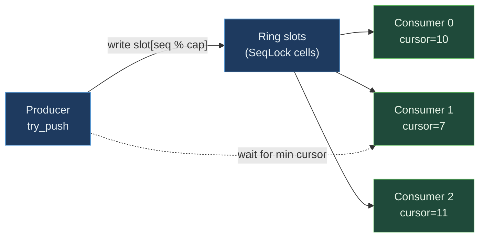

# SharedBroadcastRing


Single-producer, multi-consumer pub/sub ring backed by an MMF.
Distinct from [`SharedRing`](./SHARED_RING.md) (MPMC; each slot
consumed once); here EVERY registered consumer sees EVERY
message independently with its own cursor. This is the
Kafka-topic / log-tail / pub-sub shape. Each slot is a SeqLock
cell - producer writes under odd version + bumps to even on
commit; consumers spin on the version to read.

> **The "every consumer sees every message" primitive.** Push
> at **37.77 ns** vs `Mutex<VecDeque>` + cursors 169.54 ns
> (**4.49x faster** - lock-free producer + per-consumer
> independent cursors). Recv 48.07 ns vs mutex 118.65 ns
> (**2.47x faster**). `lag` observer at **1.06 ns vs 48.85 ns
> (46.3x faster)** - one atomic load minus the consumer cursor
> vs 3 mutex acquires. The architectural lever stacks:
> cross-process pub/sub AND lock-free dispatch AND per-consumer
> independent progress.

**Constraints (read first):**

- **Native sidecar integration**: the struct carries a `HandshakeHeader` + `ObservationRing` and implements `subetha_sidecar::AdaptiveInstance`. Wrap in `SidecarBox::new` to register with the global sidecar; raw `create()` / `open()` return the unregistered type unchanged.

- **Single producer**: multi-producer broadcast adds slot-claim
  coordination + ordering complexity. For multi-producer fan-in,
  fan into a `SharedRing` first then relay to a broadcast ring.
- **Up to MAX_CONSUMERS = 16 consumers**: each gets its own
  `consumer_seqs[i]` slot in the header.
- **Per-slot payload = `BROADCAST_PAYLOAD_BYTES` (52 bytes)**:
  same MMF substrate, slightly smaller slot than `SharedRing`
  (header version takes 4 bytes).
- **Producer waits for slowest consumer**: `try_push` returns
  `BroadcastFull` when the slowest active consumer's cursor is
  capacity-behind. Slow consumer = blocked producer.
- **`register_consumer` starts AT current `producer_seq`**: new
  consumers see only post-registration messages, not history.
- **`unregister` removes from min calc**: producer no longer
  waits for that consumer's cursor.
- **Cross-process backed by MMF.**

---

## Table of contents

- [What it is](#what-it-is)
- [Protocol](#protocol)
- [Bench evidence](#bench-evidence)
- [Worked examples](#worked-examples)
- [Use case patterns](#use-case-patterns)
- [Known limitations](#known-limitations)
- [Common pitfalls](#common-pitfalls)
- [References](#references)

---

## What it is

```text
+------------------------------------+
| BroadcastHeader (128B = 2 lines)   |
|   line 1: magic + capacity         |
|           + producer_seq (Atomic)  |
|   line 2: consumer_seqs[16]        |
|           consumer_active[16]      |
+------------------------------------+
| Slot[0]   (64B SeqLock cell)        |  version + 52B payload
| Slot[1]                            |
| ...                                |
| Slot[capacity-1]                   |
+------------------------------------+
```

Header is two cache lines: producer_seq on line 1, consumer
cursors on line 2. False-sharing between producer-side and
consumer-side hot atomics is mitigated by separation.

---

## Protocol

### Producer: `try_push(payload)`

```text
1. min_consumer = min{consumer_seqs[i] : active i}
   (or producer_seq if no active consumers)
2. if producer_seq - min_consumer >= capacity:
      return BroadcastFull           # slow consumer blocks
3. slot = producer_seq % capacity
4. SeqLock-write slot.payload + version-bump
5. producer_seq.fetch_add(1, Release)
```

### Consumer: `register()` -> consumer_idx

```text
1. CAS first inactive consumer_active[i] -> active
2. consumer_seqs[i] = producer_seq    # start "now"
3. return i
```

### Consumer: `try_recv(consumer_idx, buf)`

```text
1. my_seq = consumer_seqs[consumer_idx]
2. if my_seq >= producer_seq: return Empty
3. SeqLock-read slot[my_seq % capacity] into buf
4. consumer_seqs[consumer_idx].fetch_add(1, Release)
```

### Observer: `lag(consumer_idx)` (dashboard)

```text
producer_seq.load - consumer_seqs[consumer_idx].load
```

Two atomic loads + subtraction. ~1 ns.



---

## Bench evidence

Bench harness: `crates/subetha-cxc/benches/shared_broadcast_ring.rs`.
Captured 2026-06-02 on Windows 11 / Zen+ R7 2700, Criterion with
`--sample-size=15 --warm-up-time=1 --measurement-time=2`.

Workload: 52-byte u32-tag payload. Naive baseline:
`Mutex<VecDeque>` + `Mutex<Vec<cursor>>` + `Mutex<base_seq>`
implementing the same protocol shape.

| Op | `SharedBroadcastRing` (mmf) | `Mutex<VecDeque>` + cursors | Relative |
|---|---:|---:|---|
| push uncontended | **37.77 ns** | 169.54 ns | **4.49x faster** |
| recv (paired with push) | **48.07 ns** | 118.65 ns | **2.47x faster** |
| lag observer | **1.06 ns** | 48.85 ns | **46.3x faster** |

### Reading the trade-offs

1. **Push 4.49x faster.** The MMF producer needs one
   `min(consumer_seqs[i])` scan (16 atomic loads) + one SeqLock
   write + one fetch_add. The mutex baseline takes a mutex on
   the deque + a mutex on the cursors + a mutex on base_seq -
   three lock cycles per push.
2. **Recv 2.47x faster.** One consumer-cursor load + one
   SeqLock read + one fetch_add vs lock + index + unlock.
3. **Lag 46.3x faster.** Two atomic loads vs three mutex
   acquires. The dashboard observer pattern wins decisively.
4. **The architectural lever stacks.** Cross-process pub/sub +
   per-consumer independent progress + 52-byte fixed-size
   slots. The mutex baseline gets none of these.

### Rule 3b bench audit

- **Fair contender**: `Mutex<VecDeque>` + `Mutex<Vec<cursor>>` +
  `Mutex<base_seq>` mirrors the protocol shape (deque-with-
  consumer-cursors-pointing-into-it) using mutexes. Same
  capacity, same per-consumer-cursor semantics.
- **No `thread::spawn` inside `b.iter`**: all single-threaded.
  Pub/sub correctness with multiple consumers is covered by the
  source-level tests.
- **Sizing**: ring capacity 16 for push (small to test the
  drain-then-push cycle), 64 for recv (steady-state pair),
  pre-populated for lag.
- **MMF lifecycle managed**: per-bench create + ops + drop +
  remove_file.

### What the numbers do NOT show

- **Cross-process pub/sub**: producer in process A, consumers
  in processes B, C, D. The mutex baseline cannot do this at
  any cost.
- **Slow-consumer back-pressure on producer**: when one
  consumer falls capacity-behind, the producer's `try_push`
  returns `BroadcastFull`. Producer must wait or drop the
  message.
- **Late-joining consumers**: a new `register_consumer` starts
  at current `producer_seq`; history before that point is not
  delivered. Replay-from-zero requires a different primitive.

---

## Worked examples

### Pub/sub with multiple consumers

```rust
use subetha_cxc::SharedBroadcastRing;

let ring = SharedBroadcastRing::create("/tmp/topic.bin", 64).unwrap();
let c1 = ring.register_consumer().unwrap();
let c2 = ring.register_consumer().unwrap();
let c3 = ring.register_consumer().unwrap();

// Producer pushes one message; all three consumers see it.
ring.try_push(&[0u8; 52]).unwrap();

let mut buf = [0u8; 52];
ring.try_recv(c1, &mut buf).unwrap();  // c1 sees it
ring.try_recv(c2, &mut buf).unwrap();  // c2 sees it
ring.try_recv(c3, &mut buf).unwrap();  // c3 sees it
```

### Dashboard observer reading lag

```rust
use subetha_cxc::SharedBroadcastRing;

let ring = SharedBroadcastRing::open("/tmp/topic.bin", 64).unwrap();
// (consumer_idx known from previous registration)
let lag = ring.lag(my_consumer);     // 1 ns
println!("falling behind by {lag} messages");
```

### Cross-process pub/sub

```rust
// Producer process:
let ring = SharedBroadcastRing::create("/tmp/events.bin", 1024).unwrap();
for ev in event_stream() {
    while ring.try_push(&serialize(&ev)).is_err() {
        std::thread::yield_now();    // slow consumer; wait
    }
}

// Consumer process N:
let ring = SharedBroadcastRing::open("/tmp/events.bin", 1024).unwrap();
let me = ring.register_consumer().unwrap();
let mut buf = [0u8; 52];
loop {
    if ring.try_recv(me, &mut buf).is_ok() {
        handle_event(&buf);
    } else {
        std::thread::yield_now();
    }
}
```

---

## Use case patterns

### Pattern: cross-process event broadcast

A daemon publishes events; worker processes each subscribe and
react independently. Each subscriber's lag is observable at
1 ns for monitoring.

### Pattern: log-tailing across processes

A logging daemon writes structured records; multiple analytics
processes each tail the log at their own pace. Slow analytics
processes do not block fast ones (until they fall
capacity-behind).

### Pattern: state-snapshot broadcast for caches

A coordinator pushes cache-invalidation messages; every cache
process subscribes. Each cache flushes at its own pace; the
coordinator only blocks if ALL caches fall behind.

---

## Known limitations

- **Single producer only**: multi-producer adds claim + ordering
  complexity. Use a `SharedRing` for fan-in then relay.
- **MAX_CONSUMERS = 16**: hardcoded array size in the header.
- **Slow consumer blocks producer**: by design - when the
  slowest consumer is capacity-behind, the producer cannot
  overwrite the slot without making that consumer miss it.
- **No history replay**: new consumers start at current
  `producer_seq`; messages older than the slowest active
  consumer's cursor are unrecoverable.
- **Payload capped at 52 bytes**: same MMF substrate, slot
  layout reserves 4 bytes for version + 8 bytes pad before
  payload.
- **Cross-process backed by MMF.**

---

## Common pitfalls

- **Forgetting to unregister a dead consumer.** Its stale
  cursor still participates in the `min` calculation; producer
  is blocked once it reaches that cursor's capacity-behind
  point. Always `unregister` before exit, or use the heartbeat
  pattern to detect dead consumers externally.

- **Treating `register` as starting from history.** New
  consumers start at CURRENT `producer_seq`; messages produced
  before registration are not delivered.

- **Multi-producer assumption.** The ring is single-producer.
  Two threads in two processes calling `try_push` race on
  the producer_seq fetch_add but the SeqLock write is
  unprotected - concurrent writers corrupt slots.

- **Using `try_push` in a tight retry loop without yield.**
  The producer spins on `BroadcastFull` until a consumer
  advances. Always `thread::yield_now()` or sleep between
  retries.

- **Wrapping in a Mutex.** Pointless; the producer_seq +
  per-consumer-cursor atomics are already the synchronization
  mechanism.

---

## References

- Source: `crates/subetha-cxc/src/shared_broadcast_ring.rs` (795
  lines, 14 unit tests covering single-consumer push+recv,
  multi-consumer fan-out, slow-consumer producer back-pressure,
  register+unregister cycle, lag observer, and cross-handle
  visibility).
- Bench: `crates/subetha-cxc/benches/shared_broadcast_ring.rs`
  (push, recv, lag vs `Mutex<VecDeque>` + cursors).
- Sibling primitive: [SHARED_RING.md](./SHARED_RING.md) -
  MPMC (each slot consumed once); BroadcastRing is the SPMC
  variant.
- Underlying primitive: [SHARED_CELL.md](./SHARED_CELL.md) -
  per-slot SeqLock cell.
- Sibling primitive: [PRIORITY_FANOUT.md](./PRIORITY_FANOUT.md) -
  fan-out by priority (MPMC per priority); BroadcastRing is
  fan-out by subscriber.
