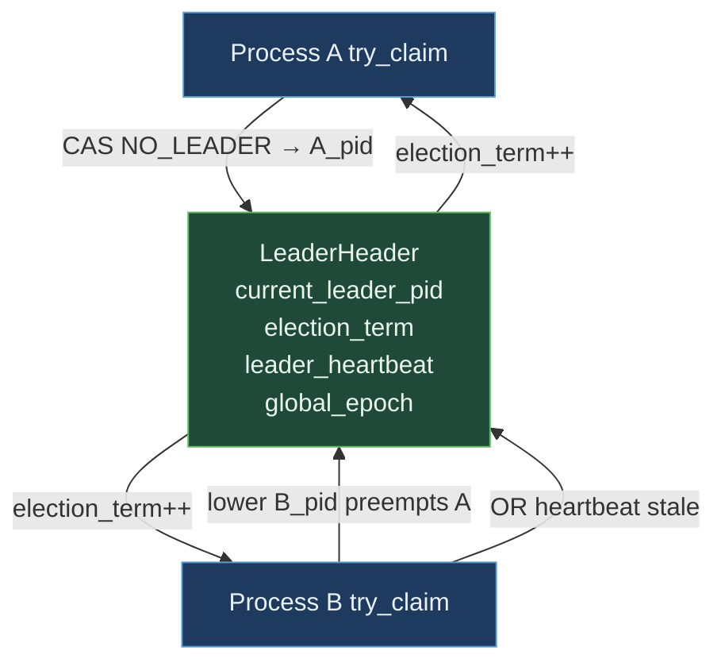

# SharedLeaderElection


Cross-process leader election via lowest-live-PID semantics +
heartbeat-driven failover. Any process can call
`try_claim_leadership(my_pid, grace_epochs)`; a claim succeeds if
there is no current leader, the caller's PID is lower than the
current leader's, or the current leader's heartbeat has gone stale
(more than `grace_epochs` behind the global epoch).

> **The "lowest-PID-wins + heartbeat" primitive.** No quorum,
> no two-round Paxos, no Raft term-advance vote: just a CAS protocol
> over an MMF that anyone opening the same file agrees on. Per-op
> cost is ~947 ps for the idempotent-success fast path (within
> noise of raw `AtomicU32::compare_exchange`).

**Constraints (read first):**

- **Native sidecar integration**: the struct carries a `HandshakeHeader` + `ObservationRing` and implements `subetha_sidecar::AdaptiveInstance`. Wrap in `SidecarBox::new` to register with the global sidecar; raw `create()` / `open()` return the unregistered type unchanged.

- **Lowest-live-PID semantics**: the process with the lowest live
  PID always wins. Higher-PID processes can only claim when the
  current leader's heartbeat has gone stale beyond `grace_epochs`.
- **`NO_LEADER = 0` is the reserved sentinel**.
  PID 0 cannot be a real claimant; the API asserts this.
- **Global-epoch monotonic counter**: leader (or
  any caller) advances via `tick_epoch()`. Heartbeat freshness is
  measured in epoch units, not wall-clock seconds.
- **`grace_epochs`** is the staleness window:
  default `DEFAULT_GRACE_EPOCHS = 3`. A leader whose heartbeat is
  more than 3 epochs behind global_epoch is presumed dead.
- **`election_term`** increments on each successful handover.
  Subscribers poll the term to detect leadership
  changes.
- **`step_down(my_pid)`** voluntarily releases leadership.
  Only succeeds if the caller was the leader.
- **Header layout**: magic + leader_pid +
  election_term + leader_heartbeat + global_epoch + padding, 64-
  byte cache-line aligned.
- **Cross-process backed by MMF.**

---

## Table of contents

- [What it is](#what-it-is)
- [Election protocol](#election-protocol)
- [Heartbeat and staleness](#heartbeat-and-staleness)
- [Worked examples](#worked-examples)
- [Bench evidence](#bench-evidence)
- [Use case patterns](#use-case-patterns)
- [Known limitations](#known-limitations)
- [Common pitfalls](#common-pitfalls)
- [References](#references)

---

## What it is

`SharedLeaderElection` is an MMF-backed cell with the leader's PID
+ election term + heartbeat + global epoch:

```rust
#[repr(C, align(64))]
pub struct LeaderHeader {
    pub magic: u64,
    pub current_leader_pid: AtomicU32,
    pub election_term: AtomicU32,
    pub leader_heartbeat: AtomicU64,
    pub global_epoch: AtomicU64,
    _pad: [u8; 32],
}
```

Three fundamental operations:

| Op | Purpose |
|---|---|
| `try_claim_leadership(my_pid, grace_epochs)` | Attempt to become leader |
| `beat_as_leader(my_pid)` | Refresh heartbeat (only if still leader) |
| `tick_epoch()` | Advance global epoch by 1 |



---

## Election protocol

`try_claim_leadership(my_pid, grace_epochs)`:

```rust
loop {
    let cur_pid = load(current_leader_pid);
    let can_claim =
        cur_pid == NO_LEADER ||
        my_pid < cur_pid ||
        (cur_pid != my_pid && (global_epoch - leader_heartbeat) > grace_epochs);
    if cur_pid == my_pid { return true; }   // idempotent success
    if !can_claim { return false; }
    if cas(current_leader_pid, cur_pid, my_pid).is_ok() {
        election_term.fetch_add(1);
        leader_heartbeat.store(global_epoch);
        return true;
    }
    // CAS lost; another process raced. Retry.
}
```

Three claim conditions:
1. **No leader** (`NO_LEADER` sentinel) - empty slot.
2. **Lower PID preempts** - the lowest-PID-wins rule.
3. **Heartbeat stale** - the current leader has not beat within
   `grace_epochs` of the global epoch.

---

## Heartbeat and staleness

`beat_as_leader(my_pid)` refreshes the
heartbeat only if the caller is still leader:

```rust
if current_leader_pid != my_pid { return false; }
leader_heartbeat.store(global_epoch);
true
```

The global epoch advances via `tick_epoch()`. A common pattern is
for the leader to call `tick_epoch()` periodically; followers
observe the epoch + heartbeat and notice when the leader has
fallen behind.

---

## Bench evidence

Bench harness: `crates/subetha-cxc/benches/shared_leader_election.rs`.
Captured 2026-06-01 on Windows 11 / Zen+ R7 2700, Criterion with
`--sample-size=15 --warm-up-time=1 --measurement-time=2`.

| Op | Baseline | SharedLeaderElection |
|---|---:|---:|
| try_claim (idempotent success on already-leader) | 820 ps (raw AtomicU32 CAS loop) | 947 ps |
| `beat_as_leader` (already leader) | n/a | 1.84 ns |
| `tick_epoch` (fetch_add) | n/a | 8.73 ns |

The protocol overhead vs raw atomic CAS is ~130 ps (one mmap
pointer-deref). The architectural claim validates: lowest-live-
PID election is essentially the same per-op cost as raw atomic
CAS.

### Rule 3b bench audit

- **Baseline**: raw `AtomicU32::compare_exchange` CAS loop with
  the same shape as `try_claim_leadership` but without
  leader-election semantics. There is no std-library cross-process
  leader-election baseline; this baseline shows the irreducible
  CAS cost.
- **Fast-path measured**: bench pre-claims the leader role so
  every iter takes the idempotent-success path.
- **MMF lifecycle managed**.

### What the numbers do NOT show

- **Multi-process claim race**: bench is single-process. The
  CAS retry loop fires when the current leader's PID changes
  mid-claim; in production the retry is rare (one preemption
  per leader change).
- **Cross-process visibility**: the bench is in-process. Cross-
  process opens use the same MMF + cache-coherence pathway.

---

## Worked examples

### Single-process leadership

```rust
use subetha_cxc::shared_leader_election::SharedLeaderElection;

let e = SharedLeaderElection::create("/tmp/leader.bin").unwrap();
let my_pid = std::process::id();

if e.try_claim_leadership(my_pid, 3) {
    // I'm the leader; do leader work.
    e.beat_as_leader(my_pid);
} else {
    let leader = e.current_leader();
    println!("Leader is {:?}", leader);
}
```

### Periodic heartbeat from the leader

```rust
use subetha_cxc::shared_leader_election::SharedLeaderElection;

let e = SharedLeaderElection::create("/tmp/leader.bin").unwrap();
let my_pid = std::process::id();

e.try_claim_leadership(my_pid, 3);

loop {
    let _epoch = e.tick_epoch();
    if !e.beat_as_leader(my_pid) {
        // Lost leadership; another process took over.
        break;
    }
    std::thread::sleep(std::time::Duration::from_secs(1));
}
```

### Detecting leadership changes via term

```rust
use subetha_cxc::shared_leader_election::SharedLeaderElection;

let e = SharedLeaderElection::create("/tmp/leader.bin").unwrap();
let term0 = e.election_term();

// ... time passes; leader may change ...

let term1 = e.election_term();
if term1 != term0 {
    println!("Leadership changed; new leader is {:?}", e.current_leader());
}
```

---

## Use case patterns

### Pattern: one-of-N workers does the bookkeeping

A pool of identical worker processes (one per core, started by
systemd / launchd). One of them needs to do periodic bookkeeping
(GC, snapshot rotation, telemetry flush). Lowest-PID wins.

### Pattern: failover after process crash

Leader periodically calls `beat_as_leader`. If the leader process
dies, its heartbeat stops advancing; followers detect the staleness
after `grace_epochs * tick_period` and any of them can claim.

### Pattern: monotonic global epoch

Even when there is no real leadership concern, `tick_epoch` +
`global_epoch` provides a cross-process monotonic counter. Useful
for ordering events across processes.

### Pattern: cooperative voluntary handover

Leader is about to shut down cleanly. Calls `step_down(my_pid)`
to publish `NO_LEADER`; the next claim immediately wins (no
need to wait for `grace_epochs`).

---

## Known limitations

- **PID-based election is single-host**: PIDs are unique within a
  host but not across hosts. Cross-host elections need a different
  primitive (e.g., consensus protocol).
- **PID 0 reserved**: a process with PID 0 cannot claim leadership.
  Real systems never have PID 0 (kernel-only).
- **Heartbeat staleness is epoch-relative**: if no one calls
  `tick_epoch`, the global epoch stays at 0 and no stale-leader
  detection happens. The leader is expected to tick; if leader
  dies before its first tick, no one moves the epoch forward.
- **No leadership lease**: leaders hold leadership until pre-empted
  or stale. A leader that pauses for >`grace_epochs` (e.g., due to
  GC) can be unexpectedly pre-empted.
- **No quorum or split-brain prevention**: lowest-PID wins is
  deterministic but does not require N-process consensus. In a
  scenario where the MMF is replicated across machines and
  replicas diverge, this primitive does not handle the merge.
- **Cross-process backed by MMF.**

---

## Common pitfalls

- **Forgetting to call `tick_epoch`.** No epoch advance means no
  stale-leader detection. The leader (or a coordinator process)
  must tick.

- **Using small `grace_epochs` with low tick rate.** If the leader
  ticks every second and `grace_epochs = 3`, a 3-second GC pause
  on the leader triggers pre-emption. Tune `grace_epochs` to the
  expected pause budget.

- **Claiming leadership with a hardcoded PID.** Use
  `std::process::id()`; hardcoded PIDs collide across processes.

- **Treating `current_leader()` returning `Some(pid)` as proof the
  process is alive.** It only proves the PID was the leader as of
  the last heartbeat. Check the heartbeat freshness for liveness.

- **Wrapping in a Mutex.** The internal CAS is already
  concurrency-safe. Outer Mutex serializes call sites the CAS was
  designed to handle.

---

## References

- Source: `crates/subetha-cxc/src/shared_leader_election.rs` (408
  lines, 10 unit tests covering empty-claim, preemption,
  idempotent same-PID, stale-leader replacement after grace
  window, step-down, term advance).
- Bench: `crates/subetha-cxc/benches/shared_leader_election.rs`
  (try_claim idempotent + beat_as_leader + tick_epoch).
- Sibling primitive: [SHARED_ATOMIC.md](./SHARED_ATOMIC.md) - the
  underlying atomic primitive the CAS protocol builds on.
- Sibling primitive: [HEARTBEAT.md](./HEARTBEAT.md) - the
  process-liveness primitive that pairs with leader election for
  general fault-detection.
- Sibling primitive: [FAILOVER.md](./FAILOVER.md) - the
  higher-level orchestration primitive that uses leader election
  for primary/secondary failover.
