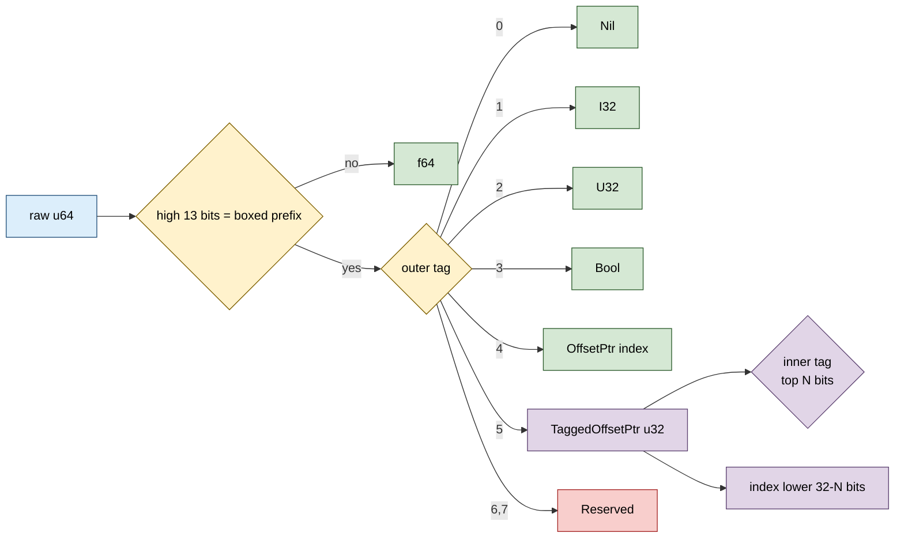

# SharedNaNTaggedValue


Two-level discrimination in 8 bytes: SharedNaNTaggedValue extends
`SharedNaNValue` by taking the reserved tag-5 slot and using it
to hold a `TaggedOffsetPtr<T, TAG_BITS>`. The OUTER tag is the
broad type (f64 / nil / i32 / u32 / bool / OffsetPtr /
**TaggedOffsetPtr**); when the outer tag is `TaggedOffsetPtr`, an
INNER tag (top N bits of the payload index) discriminates the
fine type within that pointer family (Leaf / Internal /
Tombstone, etc.). Position-independent across processes, zero
heap allocation.

> **The "8-byte heterogeneous value with typed-pointer kinds"
> primitive.** Heap-allocated `Box<dyn Trait>` is the textbook
> in-process alternative; it costs 16 bytes (fat pointer = data
> + vtable) PLUS one heap allocation per value PLUS vtable
> dispatch on every method call. The bench measures this as 32
> bytes total per slot and a 27-40x slowdown on construct /
> batch workloads.

**Constraints (read first):**

- **Layout-compatible superset of `SharedNaNValue`.**
  Every `SharedNaNValue` lifts losslessly into
  `SharedNaNTaggedValue::from_nan_value(v)` because the encoding
  is identical for tags 0-4; tag 5 is the new variant.
- **`TaggedOffsetPtr<T, TAG_BITS>` const generic must be known
  at extraction.** The `T` and `TAG_BITS`
  parameters used at construction must match at extraction.
  This is the caller's discipline: store the (T, TAG_BITS) pair
  alongside the value, or commit to one shape globally.
- **`T` is type-erased in the slot.** Same as `SharedNaNValue`;
  the inner pointer carries only the index, not type info.
- **3-bit outer tag = 8 slots; 7 used now (tag 5 = TaggedOffsetPtr),
  1 reserved (tag 6, tag 7).** Tag 5 was reserved by
  `SharedNaNValue`; this struct claims it.
- **48-bit payload, of which the low 32 bits hold
  `TaggedOffsetPtr::raw()`.** The packer masks to 48 bits
  via `0x0000_FFFF_FFFF_FFFF` then the extractor masks again to
  32 bits via `0xFFFF_FFFF`. TaggedOffsetPtr's `raw()` IS a
  u32; the higher 16 bits of the 48-bit payload area are zero.
- **Discriminator type is `NaNTaggedType`**,
  a strict superset of `NaNValueType` adding `TaggedOffsetPtr`
  and keeping `Reserved(u64)` for forward compat.
- **`to_nan_value()` downcast loses the discriminator.**
  A `SharedNaNTaggedValue` holding a
  TaggedOffsetPtr converted to `SharedNaNValue` reports as
  `NaNValueType::Reserved(5)`. The bits are preserved; only the
  interpretation differs.
- **Layout 8 bytes, `#[repr(C)]`.** Same slot
  size as `SharedNaNValue`. Verified by `size_is_8_bytes` test.
- **Bench shows 27-40x speedup over `Box<dyn Trait>` for the
  construct/batch paths,** primarily because there is no heap
  allocation per value. Heap pressure (allocator contention,
  cache evictions from spread heap allocations) dominates at
  scale.
- **Hash/Eq are over the raw u64.** Two values are equal exactly
  when their bits match. Two `TaggedOffsetPtr<T, TAG_BITS>` with
  the same index and tag but DIFFERENT (T, TAG_BITS) constants
  hash and compare equal at the SharedNaNTaggedValue level.

---

## Table of contents

- [What it is](#what-it-is)
- [Two levels of discrimination](#two-levels-of-discrimination)
- [Outer tag values](#outer-tag-values)
- [Layout](#layout)
- [API at a glance](#api-at-a-glance)
- [Worked examples](#worked-examples)
- [Benchmark results](#benchmark-results)
- [Use case patterns](#use-case-patterns)
- [Known limitations (verified)](#known-limitations-verified)
- [Common pitfalls](#common-pitfalls)

---

## What it is

```rust
#[derive(Debug, Clone, Copy, PartialEq, Eq, Hash)]
#[repr(C)]
pub struct SharedNaNTaggedValue {
    raw: u64,
}
```

The 8-byte slot uses the NaN-boxed encoding from `SharedNaNValue`:

```text
bit  63        bit 51   bits 50-48      bits 47-0
  +-------+-----------+--------------+--------------+
  | sign  | exp 0x7FF | qNaN | outer |   payload    |
  | =1    | (all 1s)  | =1   | tag(3)|     (48)     |
  +-------+-----------+--------------+--------------+
```

When the OUTER tag is `5` (TaggedOffsetPtr), the low 32 bits of
the payload area hold a `TaggedOffsetPtr<T, TAG_BITS>`:

```text
TaggedOffsetPtr<T, TAG_BITS=N> packed u32:
  +---------------------+---------------------+
  | inner tag : N bits  | index : (32-N) bits |
  +---------------------+---------------------+
```

The two-level shape: outer tag picks the variant family
(f64 / nil / scalars / pointers), inner tag picks the specific
kind WITHIN the pointer family. Total 8 bytes, no heap allocation.

---

## Two levels of discrimination

| Level | Field | Bits | Purpose |
|---|---|---|---|
| Outer | NaN tag | 3 | f64 / nil / i32 / u32 / bool / OffsetPtr / TaggedOffsetPtr / reserved |
| Inner | TaggedOffsetPtr tag | const N (1..=24) | Within-pointer kind (Leaf / Internal / Tombstone / ...) |
| Index | TaggedOffsetPtr index | 32 - N | SharedRegion slot index |

The TaggedOffsetPtr's `TAG_BITS` is a const generic chosen at
construction. Common choices:
- `TAG_BITS = 2` -> 4 kinds, 2^30 (~1 G) index space.
- `TAG_BITS = 4` -> 16 kinds, 2^28 (~256 M) index space.
- `TAG_BITS = 8` -> 256 kinds, 2^24 (~16 M) index space.

---

## Outer tag values

| Tag | Variant | Payload | Notes |
|---|---|---|---|
| 0 | `Nil` | - | Inherited from `SharedNaNValue`. |
| 1 | `I32` | low 32 bits | Inherited. |
| 2 | `U32` | low 32 bits | Inherited. |
| 3 | `Bool` | low 1 bit | Inherited. |
| 4 | `OffsetPtr` | low 32 bits (index) | Inherited. T type-erased. |
| 5 | **`TaggedOffsetPtr`** | low 32 bits (TaggedOffsetPtr::raw()) | This struct's addition. |
| 6, 7 | `Reserved(u64)` | - | Reserved for caller extensions. |

Tag values 0-4 forward to the same encoding as `SharedNaNValue`,
so the lift / downcast methods (`from_nan_value`, `to_nan_value`)
are byte-identity for those variants.

---

## Layout



`#[repr(C)]` 8-byte slot identical to `SharedNaNValue`. Bit-level
compatible: every byte pattern that is a valid `SharedNaNValue`
is also a valid `SharedNaNTaggedValue` (the tag-5 path is the
extension; tags 0-4 round-trip identically).

---

## API at a glance

```rust
use subetha_cxc::{SharedNaNTaggedValue, TaggedOffsetPtr};

// All SharedNaNValue constructors are mirrored.
let i = SharedNaNTaggedValue::from_i32(42);
let f = SharedNaNTaggedValue::from_f64(2.5);
let n = SharedNaNTaggedValue::NIL;

// The new variant: TaggedOffsetPtr<T, TAG_BITS> stored as outer
// tag 5. Construction takes the const generic at the same site.
let p: TaggedOffsetPtr<Node, 2> = TaggedOffsetPtr::new(42, 1);
let v = SharedNaNTaggedValue::from_tagged_offset_ptr(p);

// Extraction requires the caller to remember the (T, TAG_BITS).
let extracted: TaggedOffsetPtr<Node, 2>
    = v.as_tagged_offset_ptr().unwrap();
assert_eq!(extracted.index(), 42);
assert_eq!(extracted.tag(), 1);

// Conversion to / from SharedNaNValue (loses the
// TaggedOffsetPtr discriminator when downcasting; preserves
// it when lifting).
let nv = v.to_nan_value();   // tag-5 decodes as Reserved(5)
let v2 = SharedNaNTaggedValue::from_nan_value(nv);  // bit-identity round trip
assert_eq!(v, v2);
```

The discriminator type for `type_tag()` is `NaNTaggedType`,
a strict superset of `NaNValueType` adding the
`TaggedOffsetPtr` variant.

---

## Worked examples

### Heterogeneous graph nodes with typed kinds

A graph database where each node can be Leaf, Internal, or
Tombstone:

```rust
use subetha_cxc::{SharedHashMap, SharedNaNTaggedValue, SharedRegion,
              TaggedOffsetPtr};
use subetha_cxc::shared_region::OffsetPtr;

const TAG_LEAF: u32 = 0;
const TAG_INTERNAL: u32 = 1;
const TAG_TOMBSTONE: u32 = 2;

#[repr(C)]
struct Node { key: u64, value: u64 }

// SharedRegion holds the actual nodes; SharedHashMap holds the
// (key -> SharedNaNTaggedValue) index.
let region: SharedRegion<Node> = SharedRegion::create(&node_path, 1024)?;
let index: SharedHashMap<u64, SharedNaNTaggedValue>
    = SharedHashMap::create(&idx_path, 1024)?;

// Insert a leaf node.
let leaf = region.allocate(Node { key: 1, value: 100 })?;
let p_leaf: TaggedOffsetPtr<Node, 2>
    = TaggedOffsetPtr::new(leaf.index, TAG_LEAF);
index.insert(1, SharedNaNTaggedValue::from_tagged_offset_ptr(p_leaf))?;

// Dispatch on kind at lookup time.
let v = index.get(&1)?.unwrap();
match v.type_tag() {
    NaNTaggedType::TaggedOffsetPtr => {
        let p: TaggedOffsetPtr<Node, 2> = v.as_tagged_offset_ptr().unwrap();
        match p.tag() {
            TAG_LEAF      => handle_leaf(region.get(OffsetPtr::new(p.index()))?),
            TAG_INTERNAL  => handle_internal(...),
            TAG_TOMBSTONE => skip_tombstone(),
            _ => {}
        }
    },
    NaNTaggedType::Nil => { /* deleted */ },
    _ => { /* scalar value, not a pointer */ },
}
```

Every value is 8 bytes; the dispatch is two switches (outer
NaN tag, inner pointer tag).

### Lifting from SharedNaNValue

If the caller starts with `SharedNaNValue` and later needs the
TaggedOffsetPtr variant, the lift is bit-identity:

```rust
use subetha_cxc::{SharedNaNValue, SharedNaNTaggedValue};

let nv = SharedNaNValue::from_i32(42);
let ntv = SharedNaNTaggedValue::from_nan_value(nv);
assert_eq!(ntv.raw(), nv.raw());
assert_eq!(ntv.as_i32(), Some(42));
// ntv can also hold a TaggedOffsetPtr later via from_tagged_offset_ptr.
```

---

## Benchmark results

Bench: `crates/subetha-cxc/benches/shared_nan_tagged_value.rs`. Four
contender groups; SharedNaNTaggedValue vs `Box<dyn Trait>` baseline
(the textbook in-process heterogeneous-values pattern).

### Construction

| Op | SharedNaNTaggedValue | `Box<dyn Trait>` | Ratio |
|---|---|---|---|
| `construct_tagged_ptr` | **2.17 ns** | 58.5 ns | **27x faster** |

The NaN-tagged path is shift + OR; the Box path is a heap
allocation + vtable pointer write + fat-pointer setup. The
allocator is the dominant cost.

### Extract / dispatch on kind

| Op | SharedNaNTaggedValue | `Box<dyn Trait>` | Ratio |
|---|---|---|---|
| `extract_kind` | **1.13 ns** | 2.71 ns | **2.4x faster** |

The NaN-tagged extraction is a u64 mask + 32-bit-tag extract.
The Box path is an indirect call through the vtable to `kind()`.

### Storage size

| Type | Footprint |
|---|---|
| SharedNaNTaggedValue | **8 bytes** (inline, no heap) |
| `Box<dyn Trait>` | **32 bytes** (16-byte fat pointer + 16-byte heap allocation) |

**4x size difference per slot.** The Box path additionally pays
heap fragmentation cost (allocations spread across the heap,
hurting cache locality on iteration).

### Batch build + count (1 024 heterogeneous values)

| Op | SharedNaNTaggedValue | `Box<dyn Trait>` | Ratio |
|---|---|---|---|
| `batch_build_count_1024` | **1.13 us** | 44.8 us | **40x faster** |

This is the killer number. Building 1 024 Box-ed values runs
1 024 separate heap allocations; building 1 024 NaN-tagged values
is 1 024 shift-and-OR operations into a Vec. The count step is
also faster (vtable dispatch vs inline switch), but the heap-
allocation cost dominates the gap.

**The bench audit (rule 3b) confirms the bench is fair:** both
contenders build the same logical 1 024 heterogeneous values
(3 kinds in equal proportion), filter for kind=1, and count. The
only difference is the representation. The 40x ratio is the
architectural cost of "1 heap allocation per value" vs "0 heap
allocations".

---

## Use case patterns

| Pattern | Use SharedNaNTaggedValue for | Why |
|---|---|---|
| **Heterogeneous graph / tree nodes** | Index map values with typed-kind discriminator | 4-256 kinds in 1 slot; cross-process; no heap. |
| **JIT-compiled scripting** | Object shapes / hidden-class discriminators | V8-shape NaN boxing extended for typed pointer kinds. |
| **Tagged-union values in shared region** | JSON-style state with typed pointer variants | Outer tag = primitive type, inner tag = object kind. |
| **MVCC version chains** | Each chain entry is a tagged pointer (Live / Tombstone / Migrated) | Inner tag distinguishes lifecycle state. |
| **Slot tables with type-classified entries** | One vec, multiple kinds discriminated inline | Avoid Box per slot; 40x batch wins on large tables. |

---

## Known limitations (verified)

All confirmed against the source or the bench:

- **`(T, TAG_BITS)` discipline is the caller's job.**
  Mismatched const generics at construction vs
  extraction yield a `TaggedOffsetPtr` with the wrong tag /
  index split. The slot itself just holds a u32.
- **Outer tag 5 is now taken.** Only tags 6
  and 7 remain reserved as extension points for the NaN-box
  family.
- **Downcast to `SharedNaNValue` loses the discriminator.**
  The bits round-trip but the type is
  reported as `Reserved(5)` by the simpler `SharedNaNValue`.
- **`Hash` is over the raw u64.** Two `TaggedOffsetPtr<u64, 2>`
  values with the same index AND same tag hash to the same
  bucket. Two values with DIFFERENT (T, TAG_BITS) const generics
  but the same raw bits ALSO hash equal. Caller's responsibility
  to discipline.
- **Construction does not validate `TaggedOffsetPtr` invariants.**
  The packer writes the raw u32 directly. If the
  `TaggedOffsetPtr` constructor accepts an over-large tag
  (debug_assert! is the only check there), the value silently
  truncates. Validate at the trust boundary.
- **`reserve_for_TaggedOffsetPtr` IS this struct's claim on
  tag 5.** A separate codebase using `SharedNaNValue::from_raw`
  to construct a value with tag-5 will be readable by
  `SharedNaNTaggedValue` as a TaggedOffsetPtr, regardless of
  whether the raw bits were intended for that purpose.
- **40x batch wins assume the `Box<dyn>` allocator is
  general-purpose.** A bump allocator (e.g. `bumpalo`) for the
  Box path closes some of the gap, but inline 8-byte encoding
  still wins on storage density and on dispatch (no vtable).

---

## Common pitfalls

- **Don't mix `(T, TAG_BITS)` across construction and extraction.**
  Pick a single shape per code path; commit at construction time
  what the extractor needs.
- **Don't downcast to `SharedNaNValue` if the caller might hold
  a `TaggedOffsetPtr` variant.** The `to_nan_value()` path reports
  the type as `Reserved(5)` and the value is effectively opaque.
  Use `as_tagged_offset_ptr` directly.
- **Don't store a `TaggedOffsetPtr` index that exceeds
  `2^(32-TAG_BITS)`.** The TaggedOffsetPtr encoding will truncate
  silently (debug_assert! is the only check on construction).
- **Don't share a `SharedNaNTaggedValue` across machines without
  endianness coordination.** The slot is u64-le or u64-be
  depending on the host; cross-host transit over a network needs
  explicit serialization.
- **Don't use the `Hash` impl as a content-equality check for
  the underlying `T`.** The hash is over bits; two
  `TaggedOffsetPtr<u64, 2>` values pointing to different regions
  but with the same (index, tag) hash equally.
- **Don't construct outside of `from_*` if you don't know the
  raw encoding.** A hand-built `from_raw(0xFFF8_0000_0000_0000 |
  (5 << 48) | 0x4242)` is technically a TaggedOffsetPtr but the
  decoder will treat `0x4242` as `TaggedOffsetPtr::from_raw(0x4242)`
  with whatever `(T, TAG_BITS)` the caller asks for at
  extraction. Type-discipline is on the caller.
- **Don't claim tag 6 or 7 in a new module without coordinating
  with the SharedNaNValue / SharedNaNTaggedValue maintainers.**
  The bit pattern budget is small; adding a third tag-5-shape
  variant on top of this one requires a different encoding
  family.

---
