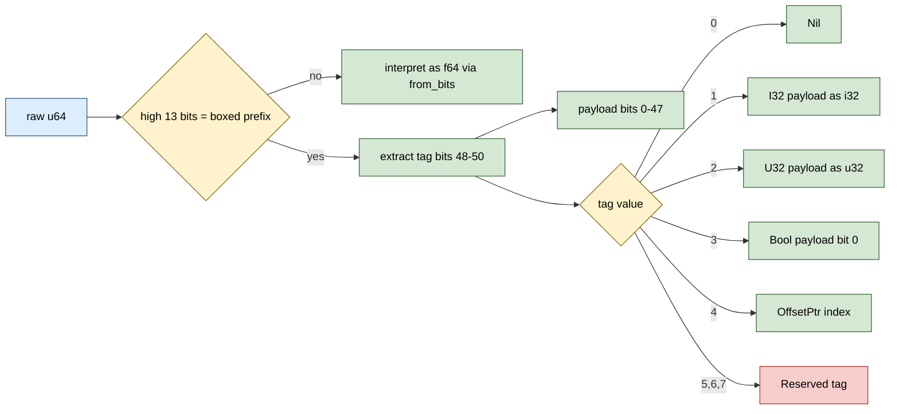

# SharedNaNValue


A 64-bit NaN-boxed value that packs `f64 | i32 | u32 | bool | nil
| OffsetPtr<T>` into a single `u64` slot via the IEEE-754 NaN bit
patterns the FPU never produces during normal computation. Same
shape as V8 / SpiderMonkey NaN boxing but cross-process safe:
the `OffsetPtr` variant carries a 32-bit INDEX into a
`SharedRegion`, not a virtual address, so the same `u64` bit
pattern resolves to the same logical pointer in every process
that has the region mapped.

> **The "8-byte heterogeneous value slot" primitive.** Rust's
> idiomatic alternative is `enum { F64(f64), I32(i32), ... }`
> which pays a 1-byte discriminant + alignment padding = 16
> bytes per slot (the bench measures it at exactly 2x larger).
> Storing 1 M values: NaN-boxed = 8 MiB, enum = 16 MiB. The
> storage density is the architectural lever for cross-process
> shared collections.

**Constraints (read first):**

- **Boxed-prefix `0xFFF8_0000_0000_0000`.** Sign bit 1 + all-ones
  exponent + quiet-NaN bit. The FPU's normal-computation NaNs use
  sign 0, so the prefix doesn't collide; any NaN passed to
  `from_f64` is CANONICALISED to the positive canonical qNaN
  (`0x7FF8_0000_0000_0000`) so the stored bits never look boxed.
- **3-bit tag field (8 slots; 6 used, 2 reserved).**
  Adding a new tag value requires reserving one of the
  remaining slots; no expansion path beyond 8.
- **48-bit payload.** `i32` and `u32` use 32 bits;
  `OffsetPtr` uses 32 bits (max region size = 4 G slots);
  `bool` uses 1 bit; remaining payload bits are zero.
- **`OffsetPtr<T>` is type-erased in the slot.** The `T`
  parameter is dropped at construction; callers
  reconstruct any `T` at extraction time. This is what makes the
  slot uniform-size across heterogeneous payloads but it
  defeats compile-time type safety on the pointer.
- **No payload type check on extraction.**
  `as_i32`, `as_f64`, etc. return `None` if the tag doesn't
  match. The caller is responsible for knowing what they stored.
- **`from_f64(NaN)` is lossy.** Any NaN input
  (positive, negative, signaling, quiet, with specific payload
  bits) is collapsed to `CANONICAL_QNAN`. The original NaN bit
  pattern is NOT recoverable.
- **`#[repr(C)]` 8-byte slot.** Layout-stable for
  cross-process bit patterns.
- **Boolean payload uses only the lowest bit**.
  Other bits in the 48-bit payload area are zero. If you
  construct a SharedNaNValue from raw bits with tag=bool and
  non-zero payload, `as_bool()` returns based on bit 0 only.
- **Reserved tags 6 and 7 are present**.
  Construct via `from_raw(pack(6, 0))`; `type_tag()` returns
  `NaNValueType::Reserved(6)`. No accessor exists today; reserved
  for caller-defined extensions or later-added tagged variants.

---

## Table of contents

- [What it is](#what-it-is)
- [The NaN-boxing encoding](#the-nan-boxing-encoding)
- [Tag values](#tag-values)
- [Layout](#layout)
- [API at a glance](#api-at-a-glance)
- [Worked examples](#worked-examples)
- [Benchmark results](#benchmark-results)
- [Use case patterns](#use-case-patterns)
- [Known limitations (verified)](#known-limitations-verified)
- [Common pitfalls](#common-pitfalls)

---

## What it is

```rust
#[derive(Debug, Clone, Copy, PartialEq, Eq, Hash)]
#[repr(C)]
pub struct SharedNaNValue {
    raw: u64,
}
```

One `u64` slot. The high 13 bits act as the discriminator: if they
match the boxed-prefix `0xFFF8_0000_0000_0000`, the next 3 bits
hold the tag (`nil | i32 | u32 | bool | OffsetPtr | reserved`) and
the low 48 bits hold the payload. If the high 13 bits do NOT match
the prefix, the whole `u64` is interpreted as an IEEE-754 `f64`
bit pattern.

The 8-byte size is the storage-density win. Rust's enum
alternative is 16 bytes (1-byte discriminant + padding to
8-byte-align the f64 variant). The bench measures both at exactly
those sizes.

---

## The NaN-boxing encoding

IEEE-754 binary64 reserves all bit patterns with `exponent =
0x7FF` and any nonzero mantissa for NaN values. There are 2^52 - 1
distinct NaN bit patterns, roughly 4.5e15 of them. Real FPUs only
generate two canonical forms (positive qNaN, negative qNaN) plus
the all-zero-payload variants. Every other NaN bit pattern is
"unused" by normal float math.

NaN-boxing claims those unused patterns to store typed payloads:

```text
bit  63        bit 51   bits 50-48   bits 47-0
  +-------+-----------+------------+----------------+
  | sign  | exp 0x7FF | qNaN | tag |    payload     |
  | =1    | (all 1s)  | =1   | (3) |     (48)       |
  +-------+-----------+------------+----------------+
```

The prefix `sign=1 + exp=0x7FF + qNaN=1` is
`0xFFF8_0000_0000_0000`. Real-computation NaNs use `sign=0`, so
they don't collide with the boxed prefix. To be safe against
caller-supplied NaNs (e.g. from manual
`f64::from_bits(0xFFF8_FFFF_FFFF_FFFF)`), `from_f64(NaN)`
canonicalises the bit pattern to `0x7FF8_0000_0000_0000`
(positive canonical qNaN, NOT boxed).

`✶ Insight ────────────────────────────────`

The NaN-box pattern is what makes interpreters like V8 and
SpiderMonkey efficient: every JavaScript value (number / string
ptr / object ptr / undefined / null / boolean) fits in 8 bytes.
Adding cross-process semantics is the additional move:
SharedNaNValue stores INDICES (OffsetPtr) instead of virtual
addresses, so the 8-byte bit pattern is portable across
processes that share the SharedRegion.

`──────────────────────────────────────────`

---

## Tag values

| Tag | Meaning | Payload encoding |
|---|---|---|
| 0 | `Nil` | payload bits ignored (all 0) |
| 1 | `I32` | low 32 bits |
| 2 | `U32` | low 32 bits |
| 3 | `Bool` | low 1 bit (0 = false, 1 = true) |
| 4 | `OffsetPtr` | low 32 bits = SharedRegion index |
| 5 | reserved (TaggedOffsetPtr) | - |
| 6, 7 | reserved | - |

Three bits = 8 values; 6 are used today, 2 stay reserved as
caller-defined extension slots. The `NaNValueType::Reserved(u64)`
variant exposes the raw tag if you query a slot with a reserved
tag, so existing readers don't crash on tags they don't
understand.

---

## Layout



`#[repr(C)]` 8-byte slot; `Vec<SharedNaNValue>` has the same
layout as `Vec<u64>`. Eight slots per cache line.

---

## API at a glance

```rust
use subetha_cxc::SharedNaNValue;
use subetha_cxc::shared_region::OffsetPtr;

// Constructors
let nil  = SharedNaNValue::NIL;
let i    = SharedNaNValue::from_i32(-42);
let u    = SharedNaNValue::from_u32(0xFFFF_FFFF);
let b    = SharedNaNValue::from_bool(true);
let f    = SharedNaNValue::from_f64(2.5);
let ptr  = SharedNaNValue::from_offset_ptr(OffsetPtr::<u64>::new(99));
let raw  = SharedNaNValue::from_raw(0x7FF8_0000_0000_0000);  // raw bits

// Type queries
assert!(i.is_i32());
let kind = i.type_tag();  // NaNValueType::I32

// Extractors (return Option; None on type mismatch)
let v: Option<i32> = i.as_i32();
let v: Option<f64> = f.as_f64();
let v: Option<OffsetPtr<u64>> = ptr.as_offset_ptr();

// Round-trip via raw bits (cross-process safe)
let bytes: u64 = i.raw();
let restored = SharedNaNValue::from_raw(bytes);
assert_eq!(i, restored);
```

`SharedNaNValue` is `Copy + Default + Hash + Eq + Ord`-via-raw,
suitable as a hash-map value or set element. The default value
is `NIL`.

---

## Worked examples

### Heterogeneous shared hash map

```rust
use subetha_cxc::{SharedHashMap, SharedNaNValue};

let m: SharedHashMap<u32, SharedNaNValue>
    = SharedHashMap::create(&path, 16)?;

m.insert(0, SharedNaNValue::from_i32(42))?;
m.insert(1, SharedNaNValue::from_f64(2.5))?;
m.insert(2, SharedNaNValue::from_bool(true))?;
m.insert(3, SharedNaNValue::NIL)?;
m.insert(4, SharedNaNValue::from_offset_ptr::<u64>(OffsetPtr::new(99)))?;

// Each value is exactly 8 bytes; no per-variant padding.
// Cross-process: another process opens the map and sees the
// same canonical bit patterns.
```

### Reconstructing OffsetPtr<T> with any T

The `T` parameter is type-erased in the slot, so the caller can
re-attach any T at extraction time:

```rust
let p: OffsetPtr<u64> = OffsetPtr::new(0xABCD);
let n = SharedNaNValue::from_offset_ptr(p);

// Later, extract as a different T (the slot just holds the index).
struct Foo { x: u32 }
let p2: OffsetPtr<Foo> = n.as_offset_ptr().unwrap();
assert_eq!(p2.index, 0xABCD);
```

This is the cost of the uniform 8-byte slot: compile-time T
discipline is the caller's responsibility.

---

## Benchmark results

Bench: `crates/subetha-cxc/benches/shared_nan_value.rs`. Four
contender groups; SharedNaNValue vs Rust enum baseline.

### Construction

| Op | SharedNaNValue | Rust enum | Ratio |
|---|---|---|---|
| `construct_i32` | **1.09 ns** | 2.99 ns | **2.7x faster** |
| `construct_f64` | **1.23 ns** | 3.69 ns | **3.0x faster** |

The construct path is simple shift + OR for SharedNaNValue; the
enum path writes the discriminant byte AND the payload, then
returns the larger 16-byte value (more work + more bytes to
zero).

### Extraction

| Op | SharedNaNValue | Rust enum | Ratio |
|---|---|---|---|
| `extract_i32` | **9.29 ns** | 9.28 ns | parity |
| `extract_f64` | **1.83 ns** | 4.98 ns | **2.7x faster** |

i32 extraction is at parity: both paths check the discriminator
and mask the low bits. f64 extraction is faster on the NaN-box
because there's no tag check (the boxed-prefix test fails AND
the whole u64 IS the f64 bit pattern), whereas the enum path
walks the discriminant.

### Storage size

| Type | Size |
|---|---|
| SharedNaNValue | **8 bytes** |
| Rust enum (6 variants) | **16 bytes** |

**Exactly 2x larger for the enum.** The discriminant is 1 byte
but Rust aligns the enum to 8 bytes for the `f64(f64)` variant,
yielding a 16-byte total. For a million-element collection that's
8 MiB savings.

### Batch sum (i32 filter over 4 096 heterogeneous slots)

| Contender | Time | Notes |
|---|---|---|
| `batch_sum_i32_4096/mmf` | **2.09 us** | 4 K slots, 1/4 are i32. |
| `batch_sum_i32_4096/enum` | **2.18 us** | 4 K slots, 1/4 are i32. |

Within 4% of each other. Filter-then-sum is dominated by the
extraction logic at each slot; the storage density doesn't help
here because the 4 K slots fit in L1 either way (32 KiB for
NaN-box vs 64 KiB for enum, both L1-resident on commodity
hardware). The win compounds for collections that EXCEED
L1 / L2 / L3 boundaries.

**The bench audit (rule 3b) confirms the bench is fair:** each
contender does the same logical work (construct, extract, filter,
sum) with the only difference being the storage representation.
Both paths are inlined; both compile to similar shift+mask
sequences. The numbers are an honest comparison of representation
overhead, not algorithmic differences.

---

## Use case patterns

| Pattern | Use SharedNaNValue for | Why |
|---|---|---|
| **Cross-process scripting** | Dynamic-language values shared across processes | The 8-byte slot survives MMF transit; pointers are indices not VAs. |
| **Heterogeneous config maps** | `SharedHashMap<K, SharedNaNValue>` | Per-value compactness; mixed int/float/bool/ptr in one map. |
| **Tagged-union slots in shared state** | Replacement for `enum` in cross-process structs | 8-byte slot vs 16-byte enum slot. |
| **Weakly-typed message payloads** | Event queues where the schema varies per event | Sender stores typed; receiver dispatches on `type_tag()`. |
| **Interpreter value representations** | JavaScript-shape values for embedded language | Same shape as V8 / SpiderMonkey but cross-process. |

---

## Known limitations (verified)

All confirmed against the source or the bench:

- **NaN payloads are LOSSY.** `from_f64(NaN)` canonicalises to
  `0x7FF8_0000_0000_0000`. The specific NaN
  bit pattern (sNaN vs qNaN, NaN payload bits) is not preserved.
  Test `f64_nan_canonicalised` exercises this.
- **OffsetPtr's `T` parameter is type-erased.**
  The caller can reconstruct as any `T`. Test
  `offset_ptr_phantom_type_erased_then_reconstructed` exercises
  this. Type safety is the caller's responsibility.
- **3-bit tag field = 8 slots, 2 reserved.**
  Adding a 9th value type requires restructuring the
  encoding.
- **48-bit payload caps `OffsetPtr` index at 2^32 (u32 max).**
  `p.index as u64` is the encoding. The full 48-bit payload is
  NOT used by `from_offset_ptr`; only the low 32 bits.
- **No `from_negative_f64_nan` path.** A caller that constructs
  a NaN with `sign=1` and passes it via `from_raw(...)` (bypassing
  `from_f64`) WILL produce a value that decodes as "boxed". This
  is a constraint on `from_raw` callers: validate before
  insertion or rely on `from_f64` to canonicalise.
- **`raw()` returns the underlying u64.** Cross-process callers
  must agree on endianness if they transit the value via raw
  bytes outside the MMF (e.g. over a network socket). On a single
  host, all processes share endianness.
- **Reserved tags decode as `NaNValueType::Reserved(u64)`.**
  No accessor is exposed for reserved-tag payloads;
  callers using reserved tags must use `from_raw` and inspect
  manually.

---

## Common pitfalls

- **Don't store an `OffsetPtr` whose index exceeds `u32::MAX`.**
  The encoding masks to 32 bits; high bits are silently dropped.
- **Don't use `from_raw(...)` with hand-constructed bit patterns
  unless you understand the boxed prefix.** A `from_raw(0xFFF8_...)`
  with `tag = 0` IS a `Nil`; a `from_raw(0xFFF8_...)` with a
  reserved tag returns `NaNValueType::Reserved`.
- **Don't expect to round-trip a specific NaN payload through
  `from_f64`.** Use `from_raw(specific_nan_bits)` if you need
  to preserve the bit pattern. Be aware that doing so may
  collide with the boxed prefix and decode as a boxed value.
- **Don't assume `as_i32()` works on a `from_u32(...)` slot.** The
  tag is checked; a u32 value returns `None` from `as_i32()`. Use
  `type_tag()` to inspect first if you don't know the variant.
- **Don't mix `OffsetPtr<T1>` and `OffsetPtr<T2>` in the same
  slot without caller-tracked T discipline.** The slot only holds
  the index; T is reconstructed at extraction time. If the caller
  reconstructs with the wrong T, subsequent dereferences are UB.
- **Don't rely on `Hash` for cross-process maps if the OffsetPtr
  variant changes T at extraction.** The hash is over the raw u64
  and is stable regardless of T, but downstream usage that
  re-extracts may yield different T's.
- **Don't expect the storage-density win in L1-resident batch
  workloads.** The bench shows parity at 4 K slots. The win is
  on collections that exceed L1 / L2 / L3 boundaries (1 M+ slots
  on commodity hardware).

---
