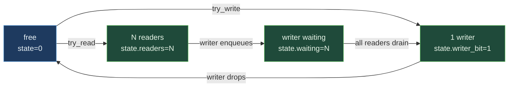

# SharedRWLock


-brightgreen)


Cross-process reader-writer lock with writer priority. Multiple
concurrent readers OR exactly one writer. When a writer is waiting,
new readers block to prevent writer starvation. State is one
`AtomicU64` packed as 1-bit writer-active + 31-bit waiting-writers
count + 32-bit reader count; all transitions are single CAS.

> **The "cross-process RwLock" primitive.** Per-op cost is within
> noise of std::RwLock and parking_lot::RwLock; the architectural
> lever is cross-process visibility (the lock state lives in an
> MMF that any process can open).

**Constraints (read first):**

- **Native sidecar integration**: the struct carries a `HandshakeHeader` + `ObservationRing` and implements `subetha_sidecar::AdaptiveInstance`. Wrap in `SidecarBox::new` to register with the global sidecar; raw `create()` / `open()` return the unregistered type unchanged.

- **One AtomicU64 state**: bit 63 =
  writer-active; bits 32-62 = writers-waiting (31 bits); bits 0-31
  = reader count (32 bits).
- **Writer priority**: when `waiting_writers > 0`, new readers
  block. Prevents writer starvation in read-heavy workloads.
- **All transitions single CAS**: observers never see torn state.
- **Try-only / blocking APIs**: `try_read` / `try_write` are
  non-blocking and return `WouldBlock`; blocking variants spin
  (or yield).
- **Header is 64 bytes** (a `const` assert enforces it): one
  cache line.
- **Cross-process backed by MMF.**

---

## Table of contents

- [What it is](#what-it-is)
- [State encoding](#state-encoding)
- [Worked examples](#worked-examples)
- [Bench evidence](#bench-evidence)
- [Use case patterns](#use-case-patterns)
- [Known limitations](#known-limitations)
- [Common pitfalls](#common-pitfalls)
- [References](#references)

---

## What it is

`SharedRWLock` is an MMF-backed reader-writer lock. State is
packed into one `AtomicU64`:

```text
+------+----------------+--------------------------------+
| bit  | 63             | 62..32                | 31..0  |
+------+----------------+-----------------------+--------+
| use  | writer-active  | writers-waiting count | readers|
+------+----------------+-----------------------+--------+
```

The packed representation means every state transition is a single
CAS - no torn observation.



---

## State encoding

```rust
const WRITER_BIT: u64 = 1u64 << 63;
const WAITING_SHIFT: u64 = 32;
const WAITING_MASK: u64 = 0x7FFF_FFFF << WAITING_SHIFT;
const READERS_MASK: u64 = 0xFFFF_FFFF;
```

A reader checks `state.writer_bit == 0 && state.waiting == 0`
before CAS-incrementing the reader count. A writer CAS-sets the
writer bit only when both reader count and writer bit are zero.
A waiting writer increments the waiting count to block new
readers.

---

## Bench evidence

Bench harness: `crates/subetha-cxc/benches/shared_rw_lock.rs`.
Captured 2026-06-01 on Windows 11 / Zen+ R7 2700, Criterion with
`--sample-size=15 --warm-up-time=1 --measurement-time=2`.

**Single-thread try_read:**

| Variant | Time |
|---|---:|
| `SharedRWLock` | 16.77 ns |
| `std::sync::RwLock` | 17.22 ns |
| `parking_lot::RwLock` | 17.23 ns |

**Single-thread try_write:**

| Variant | Time |
|---|---:|
| `SharedRWLock` | 15.95 ns |
| `std::sync::RwLock` | 17.62 ns |
| `parking_lot::RwLock` | 17.63 ns |

**4 concurrent readers (10k iters):**

| Variant | Time |
|---|---:|
| `SharedRWLock` | 608.81 us |
| `std::sync::RwLock` | 644.44 us |

The packed-state design is slightly faster than both std and
parking_lot in the uncontended fast path (~1 ns) and ties under
4-reader concurrency.

### Rule 3b bench audit

- **Fair contenders**: `std::sync::RwLock` and
  `parking_lot::RwLock` are the two production RwLock crates.
- **Same workload**: try_read / try_write / 4-reader concurrent.
- **MMF lifecycle managed**.

### What the numbers do NOT show

- **Cross-process contention**: bench is in-process. The
  architectural lever (cross-process visibility) is what std and
  parking_lot cannot do.

---

## Worked examples

### Cross-process RwLock

```rust
use subetha_cxc::shared_rw_lock::SharedRWLock;

// Process A:
let lock = SharedRWLock::create("/tmp/rw.bin").unwrap();
{
    let _w = lock.write().unwrap();
    // Exclusive access; readers in OTHER processes block.
}

// Process B:
let lock = SharedRWLock::open("/tmp/rw.bin").unwrap();
{
    let _r = lock.read().unwrap();
    // Shared access with other readers; writers block.
}
```

### Try-only non-blocking

```rust
use subetha_cxc::shared_rw_lock::{SharedRWLock, RWLockError};

let lock = SharedRWLock::create("/tmp/rw.bin").unwrap();
match lock.try_read() {
    Ok(_guard) => {
        // Got reader access.
    }
    Err(RWLockError::WouldBlock) => {
        // Writer holds or is waiting.
    }
    Err(_) => unreachable!(),
}
```

---

## Use case patterns

### Pattern: cross-process state cache

A read-mostly state cache (loaded config, schema, lookup tables)
shared across processes. Readers concurrent; writers rare.

### Pattern: serialize cross-process writes

When two processes need to coordinate writes to the SAME
SharedCell / SharedVec / etc., wrap the access in a SharedRWLock
to serialize the write critical sections.

### Pattern: writer-priority queue draining

A worker process holds the writer; other processes read snapshots.
Writer-priority semantics ensure the writer eventually acquires
even under reader pressure.

---

## Known limitations

- **Reader count capped at 2^32**: practically unreachable but
  formally a limit.
- **Waiting writers cap at 2^31**: same.
- **No recursive locking**: a thread that already holds a reader
  cannot upgrade to writer (deadlock-by-design); call drop+reclaim.
- **Spin-based blocking**: there is no parking; high-contention
  workloads burn CPU rather than blocking on a kernel object.
- **Cross-process backed by MMF.**

---

## Common pitfalls

- **Holding the writer guard across long operations.** Readers
  block; throughput collapses. Keep writer-held critical sections
  short.

- **Mixing try_read with blocking read in the same code path.**
  Returns inconsistent semantics under contention.

- **Wrapping in another Mutex.** The internal CAS is already the
  synchronization mechanism.

---

## References

- Source: `crates/subetha-cxc/src/shared_rw_lock.rs` (507 lines, 12 unit tests).
- Bench: `crates/subetha-cxc/benches/shared_rw_lock.rs` (try_read,
  try_write, 4-thread concurrent readers vs std::sync::RwLock
  and parking_lot::RwLock).
- Sibling primitive: [SHARED_SEMAPHORE.md](./SHARED_SEMAPHORE.md) -
  counting variant; SharedRWLock is a specialization with
  one-writer-many-readers semantics.
- Sibling primitive: [SHARED_ATOMIC.md](./SHARED_ATOMIC.md) - the
  underlying atomic primitive the packed state builds on.
