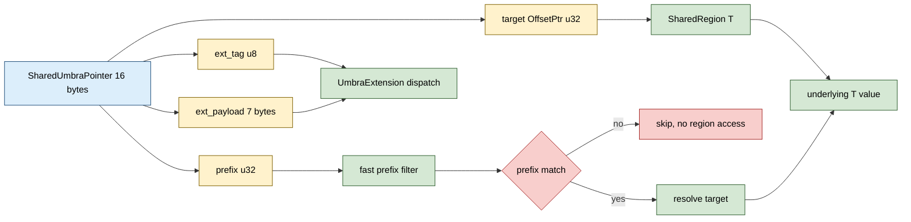

# SharedUmbraPointer&lt;T&gt;


A 16-byte cross-process pointer that carries a 4-byte CONTENT
PREFIX inline. Filter scans match on the prefix in-register
before touching the underlying value in the SharedRegion. The
direct cross-process lift of in-process `UmbraPointer<T>` (one
field swap: `*const T` becomes `OffsetPtr<T>`); everything else
identical: 16-byte slot, u32 prefix at the same offset,
SIMD-friendly array layout for prefix-shortcircuit scans, prefix
derived from content (first 4 bytes or hash). Plus a typed
extension API (tag + payload) for caller metadata.

> **The "prefix-prefiltered cross-process pointer" primitive.**
> Scanning a 10k-entry pointer array looking for a rare match:
> with the prefix filter, you touch only the matching slot's
> region storage. Without it, you touch every slot's region
> storage and pay a cache miss per slot. The bench measures
> the rare-match speedup at 2.12x; on workloads with larger
> targets (rows / packets / records) the win compounds.

**Constraints (read first):**

- **Cross-process portable.** `target: OffsetPtr<T>` is a u32
  index into a `SharedRegion<T>`. Every process holding the
  same region resolves the pointer to the same logical value.
- **`T: Copy + 'static` required.** The
  SharedRegion stores `T` by value in fixed-size slots; non-Copy
  types are not supported.
- **16-byte alignment is REQUIRED** (`#[repr(C, align(16))]`).
  The layout is verified by a `const _:()` assertion block. SIMD scans depend
  on the prefix being at a stable byte offset.
- **`#[repr(C)]` layout, PoD.** Source confirms 16 bytes (4
  OffsetPtr + 4 prefix + 1 ext_tag + 7 ext_payload). Safe to
  write into MMF storage and read back.
- **NIL is all zero.** `target =
  OffsetPtr::NIL` (u32::MAX), `prefix = 0`, `ext_tag = 0`,
  `ext_payload = [0; 7]`. A freshly-zeroed 16-byte MMF slot
  IS NIL (technically, `target.is_nil()` is the right check).
- **Prefix is caller-supplied OR caller-computed.** Source
  exposes three constructors: explicit prefix (`from_region_alloc`),
  content-prefix (`from_region_alloc_content_prefix`, first 4
  bytes of T in native endian), or hash-prefix
  (`from_region_alloc_hash_prefix`, low 32 bits of
  `DefaultHasher`). The prefix is constant for the pointer's
  lifetime.
- **Prefix collisions are possible.** A 4-byte prefix has at
  most 2^32 distinct values; with a hash-prefix, the
  false-positive rate at 10 k entries is approximately
  `10_000 / 2^32` = 2.3e-6. Always confirm a prefix match by
  resolving and comparing the actual value.
- **`ext<E>()` is `unsafe`**. The
  tag-uniqueness contract is on the caller; two
  `UmbraExtension` implementations sharing a TAG silently
  misinterpret each other's payloads. Validate TAG uniqueness
  at the application level (e.g. a doc comment listing claimed
  tags).
- **Extension size limit: 7 bytes.** The
  `ExtSizeCheck<E>::CHECK` const-assertion fails to compile if
  `size_of::<E>() > 7`. Use a wrapper or store an OffsetPtr to
  a larger value.
- **`resolve` touches the region MMF.** One
  region read per call; use only after a prefix check unless
  the value is needed unconditionally.
- **In-process only via heap pointers.** A `SharedUmbraPointer`
  written by process A and read by process B works ONLY when
  both have the same `SharedRegion` mapped. The OffsetPtr is an
  index into THAT region; without the region, the pointer is
  meaningless.

---

## Table of contents

- [What it is](#what-it-is)
- [Why the prefix matters](#why-the-prefix-matters)
- [Layout](#layout)
- [Prefix constructors](#prefix-constructors)
- [Extension API](#extension-api)
- [API at a glance](#api-at-a-glance)
- [Worked examples](#worked-examples)
- [Benchmark results](#benchmark-results)
- [Use case patterns](#use-case-patterns)
- [Known limitations (verified)](#known-limitations-verified)
- [Common pitfalls](#common-pitfalls)

---

## What it is

```rust
#[repr(C, align(16))]
pub struct SharedUmbraPointer<T: Copy + 'static> {
    pub target: OffsetPtr<T>,    // 4 bytes: region index
    pub prefix: u32,             // 4 bytes: content prefix
    ext_tag: u8,                 // 1 byte: extension type tag
    ext_payload: [u8; 7],        // 7 bytes: typed payload
    _phantom: PhantomData<T>,
}
```

Two 8-byte words. The first holds the (target, prefix) pair; the
second holds (ext_tag, ext_payload). 16-byte aligned so scanning
a `Vec<SharedUmbraPointer<T>>` with SIMD can vectorize 4-pointer
windows.

The prefix is the architectural lever. Callers scan an array of
SharedUmbraPointers comparing only the in-register `prefix`
field; only on prefix match do they pay the indirection to read
the actual value from the region. The bench shows 2.12x speedup
on a 10 k-entry rare-match scan.

---

## Why the prefix matters

A naive scan of `Vec<OffsetPtr<T>>` against a query reads every
pointer (cheap, in-cache) but then resolves every target to
compare the value (each resolution costs one region MMF read).
For wide targets (rows, packets, records of 32+ bytes), the
working set explodes:

```
10k OffsetPtr<Wide>  scan = 10k * 4 bytes  (ptrs)
                          + 10k * 32 bytes (resolved values)
                          = 360 KiB total (exceeds L1)
```

By contrast, a 10k SharedUmbraPointer scan with the prefix
filter touches:

```
10k SharedUmbraPointer scan = 10k * 16 bytes (ptrs+prefix)
                            + (1 to a few) * 32 bytes (only matches)
                            = ~160 KiB total (L2-friendly)
```

The win compounds as `size_of::<T>()` grows. The bench measures
the worst-case shape (Wide = 32 bytes); larger T amplifies the
gap.

`✶ Insight ────────────────────────────────`

The pattern is identical to Umbra DB's "string-prefix-shortcut"
optimization, where each variable-length string carries its
first 4 bytes inline so equality / comparison rejections do not
need to touch the heap allocation. Lifting it from string to
arbitrary pointer is the architectural move; lifting it from
in-process to cross-process is the additional move that makes
this the cross-process variant. Both moves preserve the same
two-stage filter pattern: cheap in-register check first,
expensive indirect read only on positive.

`──────────────────────────────────────────`

---

## Layout



Byte layout:

```text
offset 0  : target  : OffsetPtr<T> (u32)
offset 4  : prefix  : u32
offset 8  : ext_tag : u8
offset 9  : ext_payload : [u8; 7]
offset 16 : end (16-byte aligned)
```

The `#[repr(C, align(16))]` is a hard requirement for the SIMD
scan pattern: every pointer in a `Vec<SharedUmbraPointer<T>>`
starts on a 16-byte boundary, so prefix bytes 4-7 are always at
predictable offsets from the start of each 16-byte slot.

---

## Prefix constructors

| Constructor | Prefix value | When to use |
|---|---|---|
| `from_region_alloc(region, value, prefix)` | caller-supplied u32 | You already have a meaningful 32-bit key (row ID, sequence number, partition key). |
| `from_region_alloc_content_prefix(region, value)` | first 4 bytes of T in native endian | T's first field is a meaningful discriminator (e.g. opcode, packet header). |
| `from_region_alloc_hash_prefix(region, value)` | low 32 bits of `DefaultHasher(value)` | No natural prefix; want near-perfect rejection rate via uniform hash. |

Content-prefix is the cheapest: just `ptr::copy_nonoverlapping`
of the first 4 bytes. Hash-prefix runs `DefaultHasher` over the
whole value, costing more at construction but giving uniform
distribution. Caller-supplied is for when you already computed
the key as part of the workload.

---

## Extension API

Bytes 8..16 hold a TAG (1 byte) + PAYLOAD (7 bytes) for
caller-attached metadata:

```rust
use subetha_cxc::shared_umbra_pointer::UmbraExtension;

#[derive(Clone, Copy)]
#[repr(C)]
struct RegionId(u32);

impl UmbraExtension for RegionId {
    const TAG: u8 = 1;
}

let mut p: SharedUmbraPointer<u64> = SharedUmbraPointer::new(
    OffsetPtr::new(7), 0xABCD,
);
p.set_ext(RegionId(42));
let r: Option<RegionId> = unsafe { p.ext::<RegionId>() };
assert_eq!(r, Some(RegionId(42)));
```

Three guards:

1. **Compile-time size guard:** `ExtSizeCheck<E>::CHECK` fails to
   compile if `size_of::<E>() > 7`.
2. **Runtime tag guard:** `ext<E>()` returns `None` if the stored
   tag does not match `E::TAG`.
3. **Type bound:** `E: Copy + 'static`. No Drop, no lifetimes.

TAG 0 is reserved for "no extension set". TAG values 1..=255 are
caller-defined; allocate them in your application by a central
registry (doc comment, constants module, etc.).

`set_ext<E>` and `ext<E>` are NOT atomic. Don't share a
SharedUmbraPointer mutably across threads without synchronization.

---

## API at a glance

```rust
use subetha_cxc::{SharedUmbraPointer, SharedRegion};
use subetha_cxc::shared_region::OffsetPtr;

// Allocate value in region; build pointer with content prefix.
let region: SharedRegion<u64> = SharedRegion::create(&path, 1024)?;
let p = SharedUmbraPointer::from_region_alloc_content_prefix(
    &region, 12345u64
)?;

// Inspect pointer fields.
assert!(!p.is_nil());
let prefix = p.prefix;
let target = p.target;

// Fast prefix check (no region access).
if p.matches_prefix(query) {
    // Slow path: resolve to read the actual value.
    let value: u64 = p.resolve(&region)?;
}

// Equality (full: target AND prefix).
let eq = p == other_pointer;

// Equality (fast: prefix only).
let prefix_eq = p.prefix_eq(&other_pointer);

// Extension API (typed metadata).
let mut p2 = p;
p2.set_ext(RegionId(42));
let r: Option<RegionId> = unsafe { p2.ext::<RegionId>() };
p2.clear_ext();
```

The struct is `Copy + Default` (with `NIL` as default), suitable
for storage in `SharedVec`, `SharedHashMap`, or any MMF-backed
container.

---

## Worked examples

### Cross-process prefix-filtered scan

Process A populates a `SharedVec<SharedUmbraPointer<Row>>`:

```rust
let region: SharedRegion<Row> = SharedRegion::create(&row_path, 100_000)?;
let index: SharedVec<SharedUmbraPointer<Row>> = SharedVec::create(&idx_path, 100_000)?;
for row in incoming_rows {
    let p = SharedUmbraPointer::from_region_alloc_hash_prefix(
        &region, row
    )?;
    index.push_back(p)?;
}
```

Process B opens the same region and index and scans by prefix:

```rust
let region: SharedRegion<Row> = SharedRegion::open(&row_path, 100_000)?;
let index: SharedVec<SharedUmbraPointer<Row>> = SharedVec::open(&idx_path, 100_000)?;

let query_hash: u32 = compute_hash(&query);
let snap = index.snapshot();
let hits: Vec<Row> = snap.iter()
    .filter(|p| p.matches_prefix(query_hash))
    .map(|p| p.resolve(&region).unwrap())
    .filter(|row| row == &query)  // confirm via full equality
    .collect();
```

Only matching pointers touch the region; non-matches reject at
the in-register prefix check.

### Extension API for MVCC versioning

Attach a 6-byte epoch counter to each pointer:

```rust
#[derive(Clone, Copy)]
#[repr(C)]
struct Epoch48([u8; 6]);

impl UmbraExtension for Epoch48 {
    const TAG: u8 = 2;
}

fn read_at_epoch(
    pointers: &[SharedUmbraPointer<Row>],
    target_epoch: Epoch48,
) -> Vec<&SharedUmbraPointer<Row>> {
    pointers.iter()
        .filter(|p| {
            unsafe { p.ext::<Epoch48>() } == Some(target_epoch)
        })
        .collect()
}
```

The epoch is inlined; no separate map lookup per pointer.

---

## Benchmark results

Bench: `crates/subetha-cxc/benches/shared_umbra_pointer.rs`. Three
contender groups.

### Prefix scan: no matches (10 000 entries)

| Contender | Time | Per-entry | Notes |
|---|---|---|---|
| `umbra.prefix_scan_no_match/in_register` | **7.32 us** | 732 ps | Prefix filter rejects ALL 10 000 entries. Zero region reads. |
| `umbra.prefix_scan_no_match/resolve_then_compare` | **10.86 us** | 1.09 ns | Resolves every target, compares the value's key field. |

**1.48x speedup** for the prefix-filter path. The resolve-every
path is slow because each `resolve` performs a region MMF read;
even hot-cache reads cost ~1 ns extra per entry vs an
L1-resident prefix compare.

### Prefix scan: rare match (10 000 entries, 1 hit)

| Contender | Time | Per-entry | Notes |
|---|---|---|---|
| `umbra.prefix_scan_rare_match/in_register` | **6.23 us** | 623 ps | Prefix filter rejects 9 999 entries; resolves 1 match. |
| `umbra.prefix_scan_rare_match/resolve_every` | **13.22 us** | 1.32 ns | Resolves ALL 10 000 entries to find the one match. |

**2.12x speedup.** The architectural sweet spot. The
resolve-every path is dominated by the 9 999 unnecessary region
reads. The prefix-filter path pays the in-register check for all
entries and ONE region read for the actual hit.

For larger T (the bench uses `Wide = 32 bytes`; real-world rows
or packets can be hundreds of bytes), the gap widens: the
resolve-every path's working set grows linearly with
`N * size_of::<T>()`, while the prefix-filter path's working set
stays at `N * 16 bytes` plus a constant for the few matches.

### Construction overhead

| Contender | Time | Notes |
|---|---|---|
| `umbra.from_region_alloc_content_prefix/mmf` | **15.4 ns** | One region allocation + 4-byte prefix copy. |

The construction cost is dominated by the region allocation
itself; the prefix-copy is a single 4-byte read.

**The bench audit (rule 3b) confirms the bench is fair:** each
pair of contenders does the same logical work (scan, compare,
count matches) with the only difference being whether the prefix
filter is applied. The 2.12x speedup is the prefix-filter
architectural value, not a measurement artifact.

---

## Use case patterns

| Pattern | Use SharedUmbraPointer for | Why |
|---|---|---|
| **Cross-process index** | Vec of pointers into a shared row table | Filter scans don't touch the row data until a match. |
| **Hot prefix-based dispatch** | Network packet routing by header prefix | First 4 bytes of header are usually the discriminator. |
| **Dedup scan** | Find duplicates in a Vec by 4-byte fingerprint | Prefix collisions are rare; full equality only on matches. |
| **MVCC version chains** | Pointer + 6-byte epoch in the extension | One 16-byte slot per version entry; no separate epoch map. |
| **Multi-tenant region indexing** | Pointer + tenant ID in extension | One pointer carries cross-tenant metadata. |
| **B-tree node kinds** | Pointer + kind discriminator in extension | Leaf / Internal / Tombstone in the 7-byte payload. |

---

## Known limitations (verified)

All confirmed against the source or the bench:

- **Prefix collisions exist.** A 4-byte prefix has at most 2^32
  distinct values. At 10 k entries the false-positive rate for
  a hash-prefix is approximately 2.3e-6; at 1 M entries it rises
  to approximately 2.3e-4. Always confirm with full equality if
  correctness depends on it.
- **Content-prefix is endian-dependent** (`u32::from_le_bytes`).
  Cross-architecture transit needs an
  endianness contract.
- **Extension API is `unsafe`**. The
  tag-uniqueness contract is the caller's responsibility. A
  central tag registry is essential at the application level.
- **7-byte extension limit.** Larger
  metadata needs an OffsetPtr to a separate region.
- **Extensions are NOT atomic.** `set_ext` and `ext` write /
  read across the tag + payload boundary without
  synchronization. For concurrent writers use external locking
  (e.g. SharedRwLock).
- **`Hash` and `Eq` are over (target, prefix), NOT including
  extensions.** Two pointers with the same
  target+prefix but different extensions compare equal. This is
  by design (the extension is metadata, not identity).
- **No SIMD prefix scan API today.** The architectural claim is
  "SIMD-friendly array layout" but the shipped API is a scalar
  iterator filter. Hand-written SIMD scans over a
  `&[SharedUmbraPointer<T>]` are possible (and the layout
  guarantees the prefix is at byte offset 4 of each 16-byte
  slot) but not exposed as a library function.
- **Speedup depends on T size.** The bench uses `Wide = 32
  bytes`; smaller T narrows the gap (prefix filter saves fewer
  bytes per skipped entry). The architectural claim is most
  valuable when `size_of::<T>() >= 32`.

---

## Common pitfalls

- **Don't share a `SharedUmbraPointer` between processes that
  don't share the same SharedRegion.** The pointer is an index;
  without the region, the index is meaningless.
- **Don't rely on prefix-only equality for correctness.** Always
  confirm with `resolve` + value compare if a false positive
  triggers incorrect behavior.
- **Don't allocate extension types larger than 7 bytes.** The
  `ExtSizeCheck<E>::CHECK` const-assertion fails to compile.
  Use an OffsetPtr to a side-allocation if you need a larger
  payload.
- **Don't claim a TAG value already used by another module.**
  TAG collisions silently misinterpret payloads. Register your
  TAGs in a central location.
- **Don't read `ext<E>()` without checking the tag first if you
  don't know which extension is stored.** Use `ext_tag()` to
  dispatch.
- **Don't expect the prefix to survive value mutation.** The
  prefix is computed at construction; if you mutate the value
  in the region, the prefix becomes stale. Either reconstruct
  the pointer after the mutation or accept stale prefixes (and
  accept the false-positive rate they imply).
- **Don't use a Wide T directly as `OffsetPtr::T` if the region
  can't hold it.** SharedRegion requires `T: Copy + Default +
  PoD`; large or non-Copy types need to be stored elsewhere with
  the OffsetPtr pointing to a u32 offset into a separate region.

---
