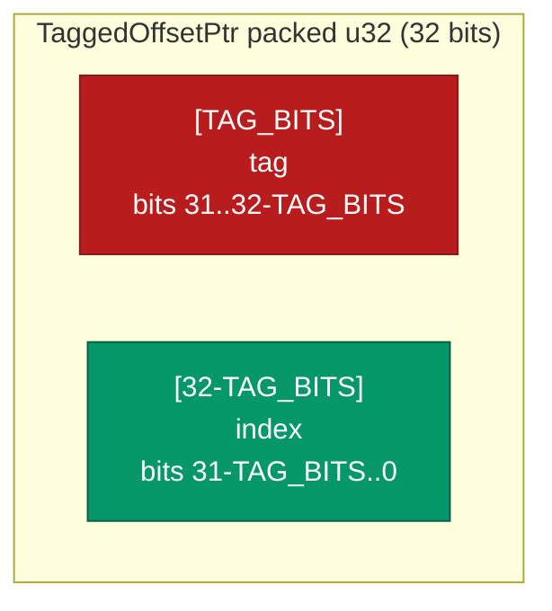

# TaggedOffsetPtr&lt;T, const TAG_BITS: u32&gt;


A 32-bit position-independent pointer that packs a small caller-
defined tag into the high bits of an [`OffsetPtr`](OFFSET_PTR.md)
index. Still 4 bytes total, same as `OffsetPtr<T>`, but now also
carries a `TAG_BITS`-wide discriminator that travels with the
pointer through arrays, hash maps, and cross-process MMF storage.

> **Use it when you want both a slot reference and a small
> classifier in the same word.** Tree-node kind, color (for tri-
> color GC or red-black trees), generation parity, dirty bit,
> tombstone flag, version tag are all common candidates. With
> `TAG_BITS = 4` you keep 268 million slots and gain 16 tag values
> at zero size cost.

**Constraints (read first):**

- **Pointer encoding only, not an allocator.** Pair with a
  [`SharedRegion`](OFFSET_PTR.md) or any slot-indexed structure.
  The crate inherits every `SharedRegion` constraint (cross-
  process MMF, `T: Copy + 'static`, fixed capacity, non-thread-
  safe `clear`).
- **`TAG_BITS` must be in `0..=31`.** A compile-time const
  assertion blocks invalid choices; `TAG_BITS = 32` leaves
  zero index bits.
- **Index range shrinks as `TAG_BITS` grows.** `TAG_BITS = 4`
  leaves 268 M slots; `TAG_BITS = 16` collapses both halves to
  65 K. Pick the smallest tag width that covers your discriminator.
- **Reader and writer must agree on `TAG_BITS` out of band.**
  `TAG_BITS` is a const generic; it is not stored in the MMF. A
  reader decoding with a different `TAG_BITS` than the writer
  splits the packed u32 differently and silently reads the wrong
  index.
- **`new()` panics on out-of-range arguments.** Use `try_new()`
  for fallible construction at the API boundary.
- **`NIL = u32::MAX` collides with `(tag = max_tag, index =
  max_index)`.** Reserve the top tag value OR the top index slot
  to keep the sentinel unambiguous.

---

## Table of contents

- [What it is](#what-it-is)
- [Why high-bit stealing instead of low-bit stealing](#why-high-bit-stealing-instead-of-low-bit-stealing)
- [Typical TAG_BITS choices](#typical-tag_bits-choices)
- [Bit layout](#bit-layout)
- [API at a glance](#api-at-a-glance)
- [Worked example](#worked-example)
- [Benchmark results](#benchmark-results)
- [Integration with SharedRegion](#integration-with-sharedregion)
- [Known limitations (verified)](#known-limitations-verified)
- [Common pitfalls](#common-pitfalls)
- [Use case patterns](#use-case-patterns)

---

## What it is

`TaggedOffsetPtr<T, const TAG_BITS: u32>` is a `#[repr(C)]` struct
with one field plus a phantom marker:

```rust
pub struct TaggedOffsetPtr<T, const TAG_BITS: u32> {
    packed: u32,
    _phantom: PhantomData<T>,
}
```

`TAG_BITS` is a const generic. Each instantiation of the type
produces a distinct memory layout with the chosen split between tag
bits and index bits. A compile-time assertion blocks invalid
choices (`TAG_BITS > 31`).

The four-byte width and `#[repr(C)]` make this type interchangeable
with `OffsetPtr<T>` at the byte level for any data structure that
needs to embed pointers in an MMF. Two processes that map the same
file see the same `packed` u32 and decode the same `(tag, index)`
pair.

## Why high-bit stealing instead of low-bit stealing

Classical tagged pointers steal the **low** bits because aligned
machine pointers have low bits guaranteed zero. A `*const Node`
whose `Node` has 8-byte alignment is guaranteed to have its bottom
3 bits as `000`, free for the taking.

This crate works with **indices**, not addresses. An index is just a
u32 counter, with no alignment guarantees. The natural free bits in
an index are the **high** bits, because most regions do not fill
all 4 billion u32 slots:

| TAG_BITS | Max tag | Max index | Index space |
|---:|---:|---:|---:|
| 0 | 0 | 4 294 967 295 | (degenerates to plain index) |
| 1 | 1 | 2 147 483 647 | over 2 billion |
| 2 | 3 | 1 073 741 823 | over 1 billion |
| 3 | 7 | 536 870 911 | 537 million |
| 4 | 15 | 268 435 455 | 268 million |
| 8 | 255 | 16 777 215 | 16.8 million |
| 16 | 65 535 | 65 535 | 64K each side |

For most workloads `TAG_BITS = 4` is the sweet spot: 16 tag values
covers most node-kind / state-flag use cases, and 268M slots
remains a large region.

## Typical TAG_BITS choices

| TAG_BITS | Common use |
|---:|---|
| 1 | Dirty/clean bit, generation parity, lock-acquire flag |
| 2 | 4-state machine (e.g. RB-tree color + extension flag) |
| 3 | 8-kind discriminator (RB-tree color, tri-color GC + spare states) |
| 4 | 16 node types in a tree, or 16-way arity hint |
| 8 | 256 distinct kinds; 16M-slot region (still huge for most workloads) |

## Bit layout



Pack and unpack are pure bit operations:

```text
packed = (tag << (32 - TAG_BITS)) | index
index  = packed & ((1 << (32 - TAG_BITS)) - 1)
tag    = packed >> (32 - TAG_BITS)
```

The `NIL` sentinel is `u32::MAX` (all bits set). It is
distinguishable from any meaningful `(tag, index)` pair so long as
the caller does not construct one with `tag == max_tag` AND
`index == max_index` simultaneously. Use the `NIL` constant to
avoid collision.

## API at a glance

<details open>
<summary><b>Construction</b></summary>

| Method | Notes |
|---|---|
| `TaggedOffsetPtr::new(index, tag)` | Panics if either component exceeds its range |
| `TaggedOffsetPtr::try_new(index, tag)` | Returns `Err(TagOutOfRange)` or `Err(IndexOutOfRange)` instead of panicking |
| `TaggedOffsetPtr::from_raw(packed)` | Caller-supplied raw u32; useful for deserialisation |
| `TaggedOffsetPtr::NIL` | All-ones sentinel |

</details>

<details open>
<summary><b>Inspection</b></summary>

| Method | Returns | Notes |
|---|---|---|
| `index()` | `u32` | Low `(32 - TAG_BITS)` bits |
| `tag()` | `u32` | High `TAG_BITS` bits (or 0 when TAG_BITS == 0) |
| `raw()` | `u32` | Packed representation; cross-process stable |
| `is_nil()` | `bool` | Compares packed to `u32::MAX` |

</details>

<details>
<summary><b>Mutation</b></summary>

| Method | Returns | Notes |
|---|---|---|
| `with_tag(new_tag)` | `Self` | Same index, different tag |
| `with_index(new_index)` | `Self` | Different index, same tag |

</details>

<details>
<summary><b>Constants</b></summary>

| Method | Returns | Notes |
|---|---|---|
| `max_tag()` | `u32` | `(1 << TAG_BITS) - 1` |
| `max_index()` | `u32` | `(1 << (32 - TAG_BITS)) - 1` |
| `index_mask()` | `u32` | Same as `max_index()` |
| `tag_shift()` | `u32` | `32 - TAG_BITS` |

</details>

## Worked example

```rust
use subetha_cxc::{OffsetPtr, SharedRegion, TaggedOffsetPtr};

// Type alias: 4 tag bits => 16 node kinds, 268M slot indices.
type NodePtr = TaggedOffsetPtr<Node, 4>;

#[derive(Clone, Copy)]
#[repr(C)]
struct Node {
    key: u64,
    left: u32,   // packed NodePtr.raw()
    right: u32,
}

// Tag values: caller-defined.
const KIND_LEAF: u32 = 0;
const KIND_INTERNAL: u32 = 1;
const KIND_TOMBSTONE: u32 = 2;

let region: SharedRegion<Node> = SharedRegion::create("/tmp/tree.bin", 1024)?;

// Allocate a leaf node.
let raw = region.allocate(Node { key: 42, left: 0, right: 0 })?;
let leaf_ptr = NodePtr::new(raw.index, KIND_LEAF);

// Allocate an internal node pointing at the leaf.
let internal_node = Node {
    key: 100,
    left: leaf_ptr.raw(),
    right: leaf_ptr.raw(),
};
let internal_raw = region.allocate(internal_node)?;
let internal_ptr = NodePtr::new(internal_raw.index, KIND_INTERNAL);

// Dispatch on tag without touching the slot.
match leaf_ptr.tag() {
    KIND_LEAF => { /* handle leaf */ }
    KIND_INTERNAL => { /* handle internal */ }
    KIND_TOMBSTONE => { /* skip */ }
    _ => unreachable!(),
}

// Resolve via SharedRegion using the index portion.
let node = region.get(OffsetPtr::new(leaf_ptr.index()))?;
```

## Benchmark results

Baseline: `(OffsetPtr<T>, u8)`, a Rust tuple of an `OffsetPtr` plus
a `u8` tag. The natural alternative when a developer wants to keep
a tag alongside a pointer.

Numbers are median of 10 samples, 2-second measurement window, on
Windows x86-64. Each iteration is one operation. Lower is faster.

| Workload | TaggedOffsetPtr | (OffsetPtr, u8) tuple | Ratio |
|---|---:|---:|---:|
| construct | **3.0 ns** | 10.3 ns | **3.4x faster** |
| extract index | 1.7 ns | 2.0 ns | 1.2x (within noise) |
| extract tag | 1.7 ns | 1.8 ns | 1.06x (within noise) |
| count entries with given tag, N=1024 | **321 ns** | 566 ns | **1.76x faster** |
| Pointer size | **4 bytes** | 8 bytes (with padding) | **2x smaller** |

### Why each result lands where it does

<details>
<summary><b>construct: 3.4x faster</b></summary>

The tuple version constructs an `OffsetPtr` (which itself
initialises a `PhantomData<T>` zero-sized field and copies the u32
index) plus a `u8` separately, then packs them into a 2-field
struct with padding. The compiler emits multiple stores and the
struct's layout demands aligned writes.

`TaggedOffsetPtr::new` does one bounds check on the tag, one bounds
check on the index, one shift, one OR, and one store. The compiler
collapses the bounds checks under `--release` when arguments are
known at compile time, but even in the dynamic case the operation
is a handful of instructions.

</details>

<details>
<summary><b>extract index / tag: within noise</b></summary>

Both pointer types extract their components in a few instructions.
The tuple reads a struct field. `TaggedOffsetPtr::index` masks and
returns; `tag` shifts and returns. At ~1.7 ns per op the
measurement floor is dominated by Criterion's per-iteration overhead
plus a single L1-cached load, leaving little headroom for the
encoding choice to matter.

The tuple's tag extraction may even be slightly faster on its own
because reading a struct field can sometimes use a different
register without the shift, but the difference is below the noise
floor at this scale.

</details>

<details>
<summary><b>count entries with given tag (N=1024): 1.76x faster</b></summary>

This is the storage-density payoff. The bench iterates 1024 entries
and counts those whose tag matches a target value.

`TaggedOffsetPtr` packs each entry into 4 bytes, so the 1024-entry
array is exactly 4 KB. The whole array fits in L1 cache on every
modern CPU (typical L1d is 32 to 64 KB). The iterator reads packed
u32s, shifts, compares, increments.

The tuple version packs each entry into 8 bytes (4 bytes for the
OffsetPtr's u32, 1 byte for the u8 tag, 3 bytes of padding to
restore 4-byte struct alignment). The 1024-entry array is 8 KB.
Still L1-resident, but the iterator reads 2x the bytes per entry
and the compiler cannot fold the tag-check into a single SIMD
gather as easily over a non-uniform layout.

In a real workload with arrays large enough to spill L1, the
density gap widens: at N = 10M, `TaggedOffsetPtr` fits in L3 cache
on common server CPUs (32 to 64 MB) while the tuple form spills
to DRAM.

</details>

<details>
<summary><b>Pointer size: 2x smaller</b></summary>

`TaggedOffsetPtr<T, 4>` is exactly 4 bytes. The phantom marker is
zero-sized. The packed u32 is the only data.

`(OffsetPtr<u64>, u8)` is 8 bytes because Rust pads the tuple to
align to the larger of its fields' alignments (`OffsetPtr` has u32
alignment = 4 bytes; the tuple ends at 4 + 1 = 5 bytes; padding to
the next multiple of 4 yields 8 bytes).

The 2x memory ratio is structural, not a measurement artifact.

</details>

## Integration with SharedRegion

`TaggedOffsetPtr` does not own storage. It is a pointer encoding,
not a container. Use it alongside [`SharedRegion`](OFFSET_PTR.md)
or any other slot-indexed structure:

```rust
let r: SharedRegion<Node> = SharedRegion::create(path, 1024)?;

// Allocate via SharedRegion (returns an OffsetPtr).
let raw = r.allocate(node)?;
// Wrap with a tag.
let tagged: TaggedOffsetPtr<Node, 4> = TaggedOffsetPtr::new(raw.index, tag);

// Later, resolve back through SharedRegion.
let resolved = r.get(OffsetPtr::new(tagged.index()))?;
```

The pattern is: `SharedRegion` is the allocator, `TaggedOffsetPtr`
is the address book entry, and the tag is metadata the caller
attaches at the allocation site.

## Known limitations (verified)

Each limitation below is observable in the source.

1. **`TAG_BITS` must be in `0..=31`.** A compile-time `const`
   assertion (`_ASSERT_TAG_BITS`) blocks invalid choices when the
   type is instantiated. `TAG_BITS = 32` leaves zero index
   bits and triggers UB on the shift; the assertion prevents it.

2. **No type-level distinction between different `TAG_BITS`.**
   `TaggedOffsetPtr<T, 4>` and `TaggedOffsetPtr<T, 8>` are
   different types and cannot be assigned to each other. Switching
   tag width requires changing every type annotation.

3. **No automatic association with a SharedRegion.** The type
   carries `PhantomData<T>` for type safety, but the relationship
   to a specific region instance is the caller's responsibility.
   A `TaggedOffsetPtr<Node, 4>` from region A is the same Rust
   type as one from region B; passing the wrong region to `get`
   silently reads the wrong bytes (or returns `Err(InvalidPtr)`
   if the index exceeds the wrong region's capacity).

4. **NIL collision risk.** `NIL = u32::MAX` overlaps with the
   pair `(tag = max_tag, index = max_index)`. Most callers will
   never construct that exact pair, but if a workload uses every
   tag value AND every index, the NIL sentinel becomes ambiguous.
   For safety, treat the bottom slot or top slot as reserved.

5. **`new()` panics on out-of-range arguments.** Use `try_new()`
   for fallible construction. The panic message names the
   offending value and the limit, which helps diagnosis but
   does not help recovery.

6. **The tag is not validated against any type-level enum.**
   `tag()` returns a `u32` regardless of whether the caller
   defined exactly N distinct tag values. A newly-introduced tag
   value added by one process can be misinterpreted by an older
   process that does not know about it.

7. **Equality and hashing operate on the packed word.** Two
   pointers are equal only when both index and tag match. Two
   pointers to the same index with different tags hash to
   different buckets. This is usually desired; callers wanting
   "same slot regardless of tag" semantics must extract `index()`
   first.

## Common pitfalls

<details>
<summary><b>Pitfall 1: passing index() to SharedRegion::get is required</b></summary>

`SharedRegion::get` takes an `OffsetPtr<T>`, not a `TaggedOffsetPtr`.
The bridge is `OffsetPtr::new(tagged.index())`. Passing
`tagged.raw()` works only when `TAG_BITS = 0` because the high tag
bits land in the index portion of the raw u32 and resolve to a
different slot.

```rust
// CORRECT:
let value = region.get(OffsetPtr::new(tagged.index()))?;

// WRONG when TAG_BITS > 0:
let value = region.get(OffsetPtr::new(tagged.raw()))?;
```

</details>

<details>
<summary><b>Pitfall 2: tag width mismatch between writer and reader</b></summary>

If process A writes `TaggedOffsetPtr<T, 4>` and process B reads the
same MMF bytes as `TaggedOffsetPtr<T, 8>`, both decode the same
packed u32 but split it differently:

| Writer's interpretation | Reader's interpretation |
|---|---|
| tag = high 4 bits | tag = high 8 bits |
| index = low 28 bits | index = low 24 bits |

The reader's `index()` returns a different value. There is no
runtime check that catches this; the `TAG_BITS` is a compile-time
parameter not stored in the MMF. Callers must coordinate on the
chosen `TAG_BITS` out of band.

</details>

<details>
<summary><b>Pitfall 3: assuming NIL is unique</b></summary>

If your workload uses tag value `max_tag` AND index value
`max_index` legitimately, the resulting packed u32 equals
`u32::MAX` and collides with `NIL`. Treat one or the other as
reserved (e.g. reserve `tag = max_tag` for "deleted" and never
allocate `index = max_index`).

</details>

## Use case patterns

<details>
<summary><b>Red-black tree color bit + parent pointer</b></summary>

A red-black tree node stores `parent: TaggedOffsetPtr<Node, 1>`
where the 1 tag bit is the node color (red = 1, black = 0).
Allocator gives you 2^31 slots (over 2 billion) which is more than
enough for any practical tree, and the color bit travels with
every parent reference at zero extra storage.

</details>

<details>
<summary><b>Generation parity for safe-after-free detection</b></summary>

Each slot allocation increments a generation parity bit. Every
returned `TaggedOffsetPtr` carries the parity-at-allocation.
Before dereferencing, compare the pointer's parity bit to the
slot's current parity. Mismatch means the slot was freed and
reallocated; the pointer is stale. (Not full generation tracking;
this is the cheapest possible "did this slot get reused once"
detector.)

</details>

<details>
<summary><b>16-way trie node kind discriminator</b></summary>

`TAG_BITS = 4` gives 16 node kinds. A trie that has Leaf, Internal,
Branch4, Branch16, Branch64, Branch256 variants packs the
discriminator into the parent pointer without an extra byte per
node. Saves 8 bytes per parent reference (vs a separate `kind:
u8` field aligned to 8) in the storage hot path.

</details>

<details>
<summary><b>Tombstone bit for safe deletion</b></summary>

A concurrent skip list that marks nodes as deleted before unlinking
them stores the tombstone flag in the `next` pointer rather than
in a separate field. Readers see "is this next pointer tombstoned"
in the same load that resolved the pointer, eliminating a second
memory read.

</details>

---

[back to subetha docs](../../README.md)
