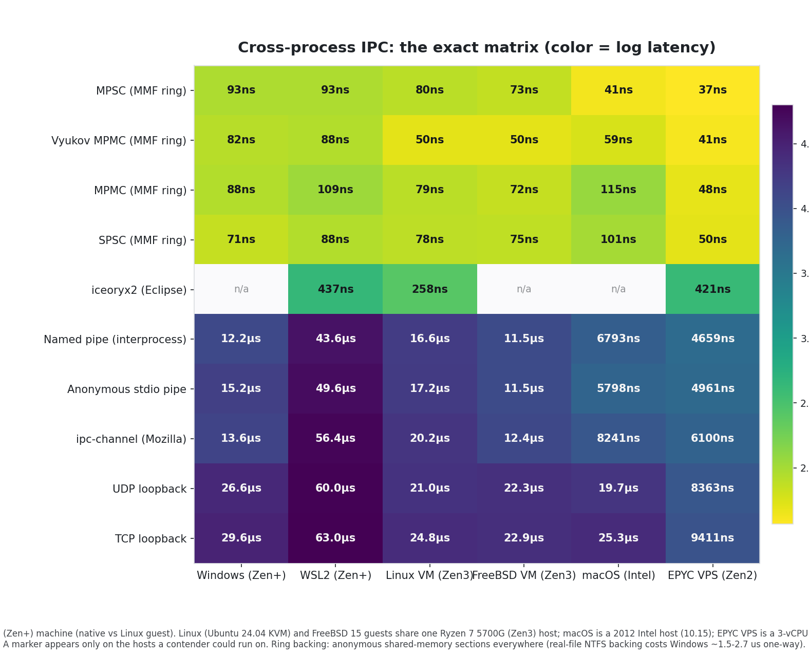
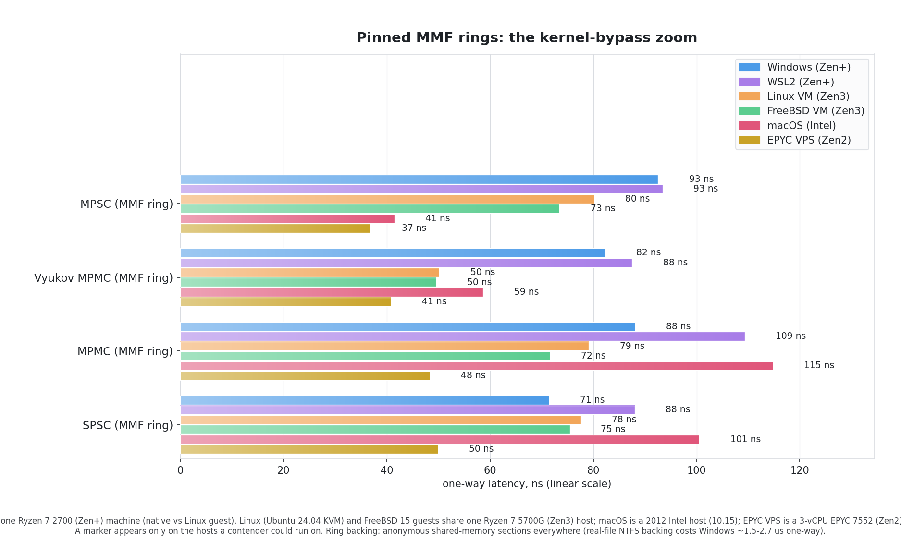

# Cross-Process IPC Performance Comparison

The four SubEtha pinned channel shapes measured against every canonical local cross-process IPC mechanism, on six platforms. Same 8-byte payload, same N=10000 round-trips per contender. Numbers reproduced by [`examples/cross_process_compare.rs`](../crates/subetha-cxc/examples/cross_process_compare.rs); per-platform results live in `cross_process_ipc_results-{windows,wsl,linux,freebsd,macos,epyc-vps}.json`, from which the committed chart set (light + `_dark` variants) is rendered.






## Leaderboard by platform (one-way latency, lower = better)

Hosts: native Windows 11 and WSL2 share one Ryzen 7 2700 (Zen+); the Ubuntu 24.04 (KVM) and FreeBSD 15 guests share one Ryzen 7 5700G (Zen3); macOS is a 2012 Intel host (10.15); the EPYC VPS is a 3-vCPU EPYC 7552 (Zen2) datacenter guest. Magnitudes are stable across runs but absolute ns drift with load; the four SubEtha rows sit within a small band of each other and their internal ordering varies run to run.

| Method | Windows | WSL2 | Linux VM | FreeBSD VM | macOS (Intel) | EPYC VPS |
|---|---:|---:|---:|---:|---:|---:|
| **SubEtha pinned shapes (MMF, kernel-bypass)** | **71-93 ns** | **88-109 ns** | **50-80 ns** | **50-75 ns** | **41-115 ns** | **37-50 ns** |
| iceoryx2 (Eclipse, shared-memory zero-copy) | n/a (POSIX user info) | 437 ns | 258 ns | n/a (libclang build dep) | n/a (MSG_NOSIGNAL) | 421 ns |
| Named pipe (`interprocess` crate) | 12,168 ns | 43,622 ns | 16,591 ns | 11,511 ns | 6,793 ns | 4,659 ns |
| `ipc-channel` (Mozilla) | 13,585 ns | 56,415 ns | 20,157 ns | 12,383 ns | 8,241 ns | 6,100 ns |
| Anonymous stdio pipe | 15,157 ns | 49,626 ns | 17,219 ns | 11,507 ns | 5,798 ns | 4,961 ns |
| UDP loopback | 26,586 ns | 59,994 ns | 21,042 ns | 22,285 ns | 19,718 ns | 8,363 ns |
| TCP loopback | 29,617 ns | 62,961 ns | 24,813 ns | 22,856 ns | 25,277 ns | 9,411 ns |
| ZeroMQ (`ipc://` REQ/REP, libzmq) | n/a | n/a | 70,891 ns* | n/a | n/a | n/a |

\* ZeroMQ is the earlier single-host Linux figure (optional `zmq-bench` feature, links system `libzmq`); it was not re-measured in this round.

Windows and the shared-tenancy EPYC VPS report per-scenario aggregates
over repeated idle-machine runs (medians on Windows, best-of-2 on the
VPS): a single draw on those hosts lands one pinned scenario several
times high at random (process scheduling / noisy neighbors), so one
run misleads in either direction.

On every platform the pinned rings beat the fastest kernel transport by two orders of magnitude or more, comparing each platform's best pinned row against its fastest kernel transport: 170x on Windows (71 vs 12,168 ns), 498x on WSL2 (88 vs 43,622 ns), 331x on the Linux VM (50 vs 16,591 ns), 232x on FreeBSD (50 vs 11,507 ns), 140x on the Intel Mac (41 vs 5,798 ns), and 126x on the 3-vCPU EPYC VPS (37 vs 4,659 ns).

## Ring backing matters: shared-memory sections, not real files

The SubEtha contenders back their rings with NAMED ANONYMOUS SHARED-MEMORY sections (`AdaptiveRing::create_shmfs`: pagefile-backed sections on Windows, shmfs on unix). Backing the same rings with a real file in the temp directory is invisible on Linux (`/tmp` is tmpfs - memory either way) but costs native Windows **1.5-2.7 µs one-way against ~75-100 ns section-backed**: NTFS's mapped-file dirty-page machinery sits on the store path of every cross-process handoff. The effect survives affinity pinning, power-plan changes, and wait-discipline changes - it is purely the backing.

Guidance: on Windows, latency-critical rings use `create_shmfs` / `ShmFile` backings; reserve real-file backings for rings that need persistence or attach-by-path. `SUBETHA_COMPARE_FILE=1` re-runs this bench file-backed to measure the penalty on a given host.

The pop wait in the bench is the production discipline: a short bounded spin, then a budgeted hardware monitor-wait (`monitor_wait_u64`) armed on the shape's publish signal (`PinnedRing::recv_signal`) - the producer's store itself is the wake. On hosts without a monitor family the wait call returns immediately and the loop degrades to pure spin.

## What the SubEtha rows measure

Each SubEtha contender is an `AdaptiveRing` pair (one per direction), backed by default by named shared-memory sections - the backing the leaderboard above measures, per *Ring backing matters* above - morphed to the target shape and PINNED via `pin_current_shape()` in BOTH processes - the production hot path of the adaptive system, not a hand-rolled single-purpose MMF. Both sides name the same section: the parent calls `create_shmfs` and each child calls `create_shmfs` too. The shm region itself is open-or-create, but `create_shmfs` re-lays-out the ring on every call, so this ping-pong is only safe because the rings are EMPTY at attach time - the re-init writes the same zero state and loses nothing. A child that must attach to a region the parent has already ENQUEUED into calls `AdaptiveRing::open_shmfs` instead, which validates each backing's magic and attaches WITHOUT re-initialising ([`examples/open_shmfs_attach_e2e.rs`](../crates/subetha-cxc/examples/open_shmfs_attach_e2e.rs) proves the snapshot survives). (The `SUBETHA_COMPARE_FILE=1` A/B instead has the parent `AdaptiveRing::create` a temp-file backing and the child `AdaptiveRing::open` it - the file-locale attach that always validated magic rather than re-initialising.) Every contender declares `max_producers = 1, max_consumers = 1`, so all four shapes run the same 1P/1C workload through four different dispatch paths: the deltas between the four rows are pure shape-dispatch cost, not peer-count scan overhead.

The two MPMC rows are different algorithms, not duplicates:

- **MPMC (composed)** is N independent Lamport SPSC rings (one per producer) with consumers statically partitioned across them. Zero CAS anywhere; per-producer FIFO only.
- **Vyukov MPMC** is the classic Dmitry Vyukov bounded queue (`SharedRing`): one ring, per-slot sequence numbers, producers CAS a shared head and consumers CAS a shared tail. Global FIFO across all producers; any consumer can take any item. On these runs the single-ring Vyukov is the fastest pinned shape on both guests - 49.7 vs 74.3 ns against composed MPMC on the Linux VM, and 69 vs 121 ns on the Intel Mac - so the per-slot CAS is outweighed by the composed shape's ring-array indexing here; the four rows still sit within a small band and their internal ordering varies run to run, which is why the leaderboard note flags it.

## Reading the results

- **SubEtha 49-121 ns**: cross-core MESI cache-line handoff (~50-120 ns) plus an Acquire/Release atomic pair. After mapping, the data path never enters the kernel. The four shapes differ only in dispatch structure (direct Lamport pair vs ring-array indexing vs Vyukov per-slot sequence CAS).
- **iceoryx2 268-471 ns**: also shared-memory zero-copy, with publish/subscribe bookkeeping on top of the slot handoff.
- **Named pipe 5-43 µs**: kernel pipe buffer; two syscalls per round-trip; data copy through kernel space. This is what most Rust users reach for when they think "fast local IPC" via the `interprocess` crate.
- **Stdio pipe 5-50 µs**: anonymous pipe via `std::process::Command` stdin/stdout, plus text-encoding overhead.
- **ipc-channel 6-57 µs**: Mozilla's IPC channel, used in Servo and Firefox. Wraps the kernel pipe and adds bincode serialization.
- **UDP / TCP loopback 8-65 µs**: kernel network stack overhead, irreducible even with `TCP_NODELAY` on the loopback device.

## Why SubEtha is so much faster

Every kernel-mediated contender forces every byte through two syscalls per round-trip, kernel-space data copies, and scheduler wakeups. That syscall floor is single-digit to tens of microseconds even for the fastest pipe implementations.

SubEtha's MMF design pays the kernel cost ONCE at construction (`mmap()`) and then runs the entire data path in user space: atomic ops on memory shared by mapping the same file in both processes. The "sync point" between producer and consumer is a Release-store followed by an Acquire-load on a shared atomic, which is a single MOV instruction on x86 TSO. No syscalls, no scheduler wakeups, no kernel data copies.

## Bench methodology

For each contender, the bench:

1. **Invokes the primitive's named feature**. SubEtha uses the pinned per-shape native calls (`spsc_try_push` / `mpsc_try_push(0, ..)` / `mpmc_try_push(0, ..)` / `vyukov_try_push` and matching pops) on handles obtained from `pin_current_shape()`; TCP uses `write_all` and `read_exact`; named pipe uses the same on `Stream`; ipc-channel uses `IpcSender::send` and `IpcReceiver::recv`; ZeroMQ uses `Socket::send`/`recv_bytes` on a `REQ`/`REP` pair over `ipc://`. No shortcuts.
2. **Imposes no surplus overhead**. All contenders ship the same 8-byte payload through the same spin-until-echo ping-pong. TCP uses `set_nodelay(true)` to remove batching delays. Named pipes and stdio pipes use the canonical blocking-IO calls.
3. **Sized for the workload**. SubEtha rings use 16384-slot capacity and declare exactly the peer counts the workload has (1P/1C); TCP/UDP have unlimited buffering; stdio pipes use OS-default buffer sizes. None of these affect the steady-state one-op latency that the bench measures.

## Reproducing the numbers

```bash
cd crates/subetha-cxc
cargo run --release --example cross_process_compare
# save the emitted JSON for the host you ran it on
cp ../../docs/cross_process_ipc_results.json ../../docs/cross_process_ipc_results-<platform>.json
```

Add `--features zmq-bench` (single-host Linux, requires `libzmq`) to fold in the ZeroMQ `ipc://` REQ/REP contender:

```bash
cargo run --release --example cross_process_compare --features zmq-bench
```

The binary writes `docs/cross_process_ipc_results.json` (machine-readable, timestamped, machine-tagged); save it per host with a `-<platform>` suffix (`windows`, `wsl`, `linux`, `freebsd`, `macos`, `epyc-vps`). The committed chart PNGs (light + `_dark` variants) are rendered from that per-host JSON set.

## Platform notes

| Contender | Note |
|---|---|
| iceoryx2 (Eclipse zero-copy) | Requires POSIX user info (`/etc/passwd`); initialises on Linux/WSL, exits silently on native Windows, and is excluded from the FreeBSD build (libclang/bindgen) and the macOS build (its platform layer needs `MSG_NOSIGNAL`, absent on Darwin). |
| ZeroMQ (`ipc://` REQ/REP) | Optional, behind the `zmq-bench` feature; links the system `libzmq` (a C dependency), so it is a single-host Linux contender rather than part of the cross-platform sweep. A full messaging framework, not a minimal channel: its framing and socket round-trip land it well behind the kernel pipes on an 8-byte ping-pong. |
| SubEtha shmfs on macOS | Darwin caps POSIX `shm_open` names at `PSHMNAMLEN` (31 chars) and permits `ftruncate` on a region only once, at creation. `ShmFile` hashes an over-long name to a short fixed form and sizes the region only when it is not already sized, so the create-then-open handshake (parent creates, child opens the same region) works cross-process. Without those two the bench masked the failures as `PayloadTooLarge`. |

## Tested versions

- SubEtha AdaptiveRing pinned handles (this repo)
- `interprocess` 2.2
- `ipc-channel` 0.22
- `iceoryx2` 0.9
- `zmq` 0.10 (optional `zmq-bench` feature; links system `libzmq`)
- Rust stdlib `std::net::TcpStream`, `std::net::UdpSocket`, `std::process::Command` pipes

## Related results

- [`docs/cross_process_ipc_results.json`](cross_process_ipc_results.json) - the raw numbers
- [Tier 1-5 stress test](../crates/subetha-cxc/examples/stress_test.rs) - in-process safety + throughput stress
- [`benches/concurrent_methods.rs`](../crates/subetha-cxc/benches/concurrent_methods.rs) - cross-thread channel comparison: streaming 10k items producer->consumer, this Windows host measures the bare `SharedRing` at 0.90x `std::sync::mpsc` (faster than the stdlib channel) and the full `AdaptiveIpc<u64>` convenience layer - per-item `Marshal` plus adaptive shape dispatch over the same ring - at ~2.9x, the honest cost of cross-process visibility over an in-process-only channel
