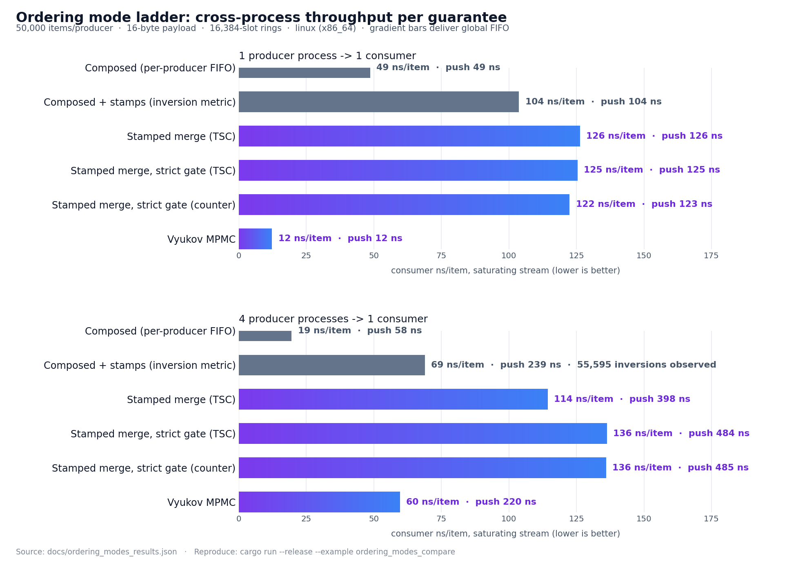
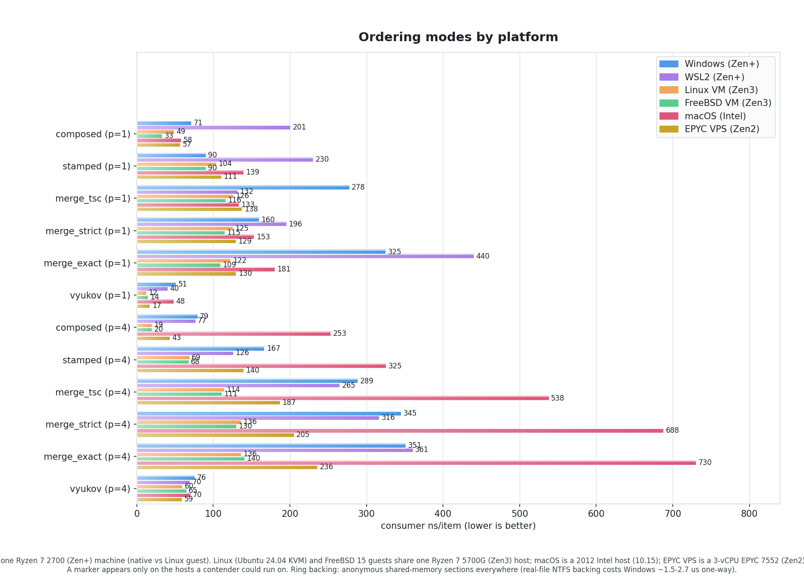

# Ordering Mode Ladder Performance

What each rung of the cross-producer ordering ladder costs, measured
cross-process: real producer PROCESSES stream into a file-backed
`AdaptiveRing` while the consumer process drains and ASSERTS the
guarantee the rung charges for. Numbers reproduced by
[`examples/ordering_modes_compare.rs`](../crates/subetha-cxc/examples/ordering_modes_compare.rs);
results saved to [`ordering_modes_results.json`](ordering_modes_results.json).





## The ladder (4 producer processes -> 1 consumer)

Numbers below are from a run on a Ryzen 7 5700G (Zen3) Linux host,
reached as a KVM guest. The invariant-TSC probe does not pass inside
that guest, so every stamped rung uses the `SharedCounter` stamp here -
the `stamp_kind` the live JSON records for each rung. A bare-metal host
with invariant TSC selects the cheaper `rdtsc` stamp for the by-stamp
merge rungs instead; that run is in
[Stamp source: TSC vs counter](#stamp-source-tsc-vs-counter) below.
These are SATURATING-STREAM throughput costs (50,000
items per producer, 16-byte payload, 16384-slot rings), not the
ping-pong one-way latency of the
[cross-process IPC comparison](CROSS_PROCESS_IPC_PERFORMANCE.md) -
the two benches measure different regimes on purpose. Magnitudes
are stable across runs; absolute ns drift with system load.

| Rung | Guarantee | Stamp (this host) | Consumer ns/item | Producer ns/push | Inversions |
|---|---|---|---:|---:|---:|
| Composed (unstamped MPSC) | per-producer FIFO | none | 19 | 58 | (unobservable) |
| Composed + stamps, `Unordered` | per-producer FIFO + inversion metric | counter | 69 | 239 | 55,595 reported |
| Stamped merge, `MergeByStamp` | global FIFO within stamp skew | counter | 114 | 398 | 0 (reported, within skew) |
| Stamped merge, `MergeStrict` (by stamp) | exact global FIFO, in-flight gate | counter | 136 | 484 | **0 (asserted)** |
| Stamped merge, `MergeStrict` (total order) | exact global FIFO, total stamp order | counter | 136 | 485 | **0 (asserted)** |
| Vyukov MPMC shape | global FIFO (shared CAS) | none | 60 | 220 | (exact by construction) |

At 1P/1C the same ladder runs as a degenerate single-ring workload
(the merge scans one head); the merge rungs land near ~120-125
ns/item while Vyukov runs at ~12 ns/item (its slot lines stay
core-local with one producer and one consumer), every assertion
holding.

## Reading the results

- **The stamp overhead is the composed-vs-stamped delta**: several
  times the per-push cost at 4P (58 -> 239 ns/push) for the TSC read
  + stamp write + watermark store - the price of making the
  invisible ordering property observable (55k inversions REPORTED
  instead of silently delivered). Callers that never need ordering
  skip it entirely by not calling `with_ordering_stamps()`.
- **The ordered switch costs ~1.7x the stamped-unordered rate at the
  consumer** (114 vs 69 ns/item): the merge pop peeks every producer
  ring per pop instead of round-robining one. Producers pay
  backpressure (398 vs 239 ns/push) because the ordered consumer
  drains slower than the partition pop.
- **Vyukov is the fastest global-FIFO rung** (~60 ns/item at 4P,
  about half the by-stamp merge's 114): one shared-counter CAS per push -
  with `producer_seq` and `consumer_seq` on separate cache lines -
  costs less than the consumer-side k-way merge plus the stamped
  push the merge rungs carry, and at 1P/1C its core-local slot lines
  put it ~10x ahead. The merge's value is therefore not throughput
  but the RUNTIME dial: a stamped ring serves per-producer mode at
  ~69 ns/item and flips to global FIFO with one store, retroactively
  ordering the backlog; it is also the global-FIFO
  path for a ring that must stay stamped (Vyukov's 56-byte slots
  cannot hold a stamp). Vyukov is the construction-time or morph-time
  commitment that wins on raw throughput.
- **Strictness is a ~20% surcharge over `MergeByStamp`**: the
  per-producer watermark gate adds one cache-line read per
  registered producer per pop and couples release latency to the
  slowest in-use producer.
- **The counter rung shows the detection-cost paradox**: exact
  total order via a shared `fetch_add` per push costs the most of
  any rung at both producer and consumer - paying the contended
  cache line that the composed shapes exist to avoid. It exists for
  callers that need a total order with zero clock assumptions.

## Stamp source: TSC vs counter

The table above is the KVM-guest run, where every stamped rung falls back
to the `SharedCounter` stamp. On a bare-metal host with an invariant TSC
the by-stamp merge rungs select the cheaper `rdtsc` stamp instead. The
same bench on a Windows Ryzen 7 2700 (Zen+, bare metal, 4 producers ->
1 consumer) confirms the selection - the `stamp_kind` each rung actually
used:

| Rung | Stamp used | Consumer ns/item | Producer ns/push |
|---|---|---:|---:|
| Composed (unstamped MPSC) | none | 79 | 332 |
| Composed + stamps, `Unordered` | **Tsc** | 167 | 587 |
| Stamped merge, `MergeByStamp` | **Tsc** | 289 | 1000 |
| Stamped merge, `MergeStrict` (by stamp) | **Tsc** | 345 | 1222 |
| Stamped merge, `MergeStrict` (total order) | counter | 351 | 1324 |
| Vyukov MPMC shape | none | 76 | 276 |

Windows numbers are per-field MEDIANS of 3 idle-machine runs: a single
Windows draw lands one scenario several times high at random (process
scheduling), so one run misleads. The absolute ns run higher than the
5700G Linux table - this is the slower part, and Windows process
scheduling dominates the per-push backpressure - so this is not a
cross-machine number comparison; its job is to show the stamp source
the transport selects when invariant TSC is present. `rdtsc` reads in ~20 cycles with no coherence traffic, so it is
the default whenever the invariant-TSC probe passes; the `SharedCounter`
stamp (a contended `fetch_add`) is the fallback, and the mandatory choice
for `MergeStrict` total order, which needs strictly increasing stamps a
clock cannot guarantee. Raw numbers in
[`ordering_modes_results-windows-tsc.json`](ordering_modes_results-windows-tsc.json).

## What the consumer asserts (the assertion IS the feature)

Per the bench-audit discipline, a rung that cannot uphold its
claimed guarantee fails the run instead of posting a number:

| Rung | Check in the drain loop |
|---|---|
| every rung | per-producer payload sequence strictly increases |
| strict merge rungs (`MergeStrict`) | popped stamps monotone (strictly increasing for the counter total-order rung) AND the inversion counter reads zero; a violation kills the producer children and fails the run with a non-zero exit |
| by-stamp merge (`MergeByStamp`) | best-effort "within stamp skew": merged-order inversions are REPORTED, not asserted - without the freshness guard (time stamps) or the watermark gate (`MergeStrict`) a lagging producer can legitimately invert |
| stamped unordered | inversions are REPORTED (the metric, not a violation) |

This assertion discipline is what caught a real ordering hole
during bring-up: on WSL2, a producer vCPU descheduled mid-push
stretched the stamp-to-publish window to ~63,000 cycles - far past
any fixed freshness window - and the merge briefly delivered a
newer stamp first. The in-flight gate both merge modes now carry
closes THAT window: producers reserve their stamp slot before reading
the clock and finalize the watermark after the push, so the merge holds
any candidate that an in-flight (reserved-but-unpublished) stamp
undercuts, no matter how long the producer stalls. A separate window -
a producer that PUBLISHES a lower stamp between the consumer's scan and
its pop - is not covered by the in-flight gate; see
[Exact delivery on the counter path](#exact-delivery-on-the-counter-path).

## Exact delivery on the counter path

`MergeByStamp` is best-effort: "global FIFO within stamp skew". On a
host without an invariant TSC the stamps fall back to `SharedCounter`
(no freshness guard), and the merge can then deliver a lower stamp late
under producer lag. The cause is a scan/pop TOCTOU, not a memory-ordering
bug - a WRC litmus test confirmed the KVM guest is multi-copy-atomic
(zero violations, same as bare metal). The k-way scan is a non-atomic
snapshot; the in-flight gate only holds candidates above a
reserved-but-unpublished stamp; a producer that PUBLISHES a lower stamp
between the scan (which saw its ring empty) and the pop is caught by
neither. `MergeStrict`'s watermark gate is immune: it waits until every
empty in-use ring's watermark proves no lower stamp exists.

Proven on the 16-vCPU KVM guest by the library's OWN inversion counter
plus an independent harness ([`examples/ordering_race_proof.rs`](../crates/subetha-cxc/examples/ordering_race_proof.rs)):
raw `MergeByStamp` delivers concrete out-of-order pairs (e.g. 512->511,
1753->1752); `MergeStrict` never does; same host, same workload.
Bare-metal 8-core x86 did not reproduce it (the scan/pop window is far
narrower). The displacement is bounded by the concurrent producer count
(off-by-one in practice).

The fix keeps the cheap merge's throughput without the strict tax.
[`crate::reorder::AdaptiveOrderedReceiver`](../crates/subetha-cxc/src/reorder.rs)
auto-selects the exact strategy per ring: SharedCounter with `<= 256`
producers keeps `MergeByStamp` and corrects on the consumer with a
reorder buffer sized to the producer count (provably exact); more
producers morph the ring to `MergeStrict`; time-based / unstamped rings
deliver directly. Consumer drain cost on the same host (one coherent
measurement set; its raw-merge baseline sat at ~106 that day - the
ladder above drifts a few ns run-to-run, the RATIOS are the result):

| Strategy | ns/item | exact? |
|---|---:|---|
| raw `MergeByStamp` | ~106 | no (off-by-one) |
| reorder buffer | ~115 (raw + ~9%) | yes |
| `MergeStrict` | ~135 | yes |

## Bench methodology

1. **Real processes, production hot path.** Each producer is a
   separate OS process pushing through the PINNED per-shape calls
   (`stamped_try_push` / `mpsc_try_push` / `vyukov_try_push`); the
   consumer drains through `ordered_try_pop_with_stamp` /
   `mpsc_try_pop` / `vyukov_try_pop`. No bench-only shortcuts.
2. **Same workload everywhere.** 16-byte `[producer; 8][seq; 8]`
   payload, 16384-slot rings sized for the declared peer counts,
   identical spin-on-full / spin-on-empty discipline. The stamped
   rungs add only the 8-byte stamp their mode requires.
3. **Both sides of the cost reported.** Consumer ns/item is
   first-pop to last-pop; producer ns/push includes backpressure
   spin time by design (that IS the producer-side cost of a mode
   under a saturating stream).
4. **Strict-rung lifecycle.** Producers retire their stamp slots on
   clean exit (`retire_producer`) so the strict watermark gate
   never waits on an exited process - the documented liveness
   protocol, exercised by the bench itself.

## Reproducing the numbers

```bash
cargo run --release -p subetha-cxc --example ordering_modes_compare
```

The binary writes `docs/ordering_modes_results.json` (the raw
numbers behind the table above); the committed light/dark PNG pair
in `docs/` and `wiki/static/images/` is rendered from that JSON.

## Related results

- [`ordering_modes_results.json`](ordering_modes_results.json) - the raw numbers
- [Cross-process IPC comparison](CROSS_PROCESS_IPC_PERFORMANCE.md) -
  one-way latency of the four pinned shapes vs kernel IPC (the
  ping-pong regime)
- [`examples/ordering_xproc_consumer.rs`](../crates/subetha-cxc/examples/ordering_xproc_consumer.rs) -
  the cross-process E2E that flips the flag mid-traffic and asserts
  zero post-flip inversions, verified on Windows + WSL Linux
