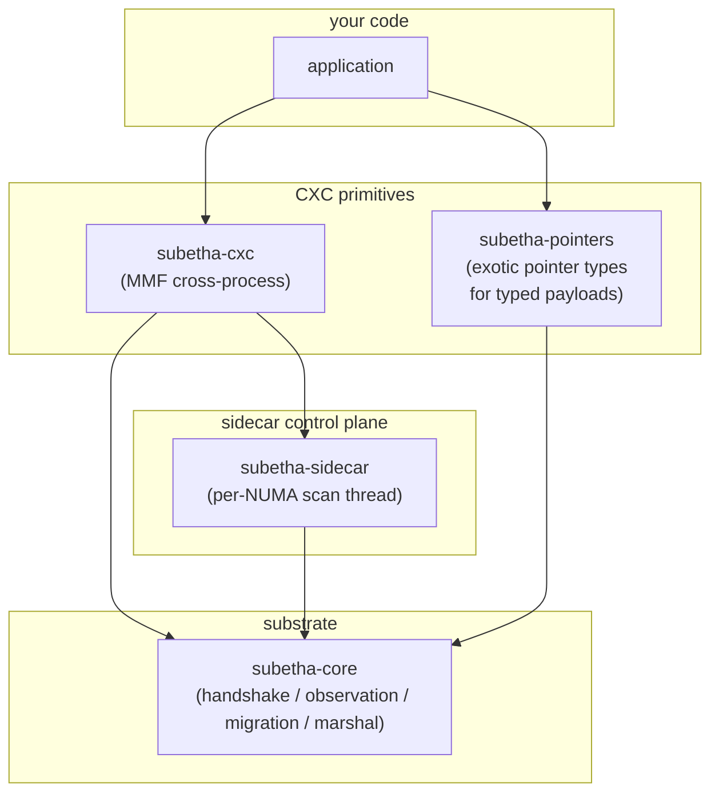

# Architecture

SubEtha is four crates with one shared substrate. The split is
deliberate; the rest of the design follows from it.

## The four crates

Two of the boxes are interesting. The rest are mechanics.

The substrate (`subetha-core`) defines the contract every CXC
primitive satisfies: a `HandshakeHeader` at a known offset, an
`ObservationRing` for op-stream samples, a `migration` protocol
for non-blocking strategy swaps, and a `Marshal` trait for "this
value can cross an address-space boundary byte-identically." None
of these touch threads or scheduling; they are pure data structures.

The control plane (`subetha-sidecar`) is the loop that does the
scheduling. One background thread per NUMA node polls every 200 µs,
drains each registered instance's observation ring, folds it into
`InstanceStats`, and asks the per-instance `Policy` whether to
swap strategies. When the policy says yes, the sidecar calls
`apply_migration(new_tag)` on the instance.

## Why split substrate from sidecar

The substrate is on the hot path. Every op enters and exits the
handshake header, every flagged op pushes one observation. Those
costs must be in the single-digit-nanosecond range or the rest of
the architecture does not survive contact with real workloads.

The sidecar is off the hot path entirely. It runs on its own
thread, it sleeps 200 µs between scans, and it touches each
instance's stats once per scan. None of its work blocks any
op-side thread.

Splitting them lets each side optimise for its actual constraint.
`HandshakeHeader::enter_op` is `#[inline(always)]` and compiles
to two atomic RMWs. `Sidecar::scan_instances` is a normal Rust
loop with locks and allocations; nobody cares.

## What `subetha-cxc` ships

CXC is the **Cross-Context Channel**: a typed channel that spans
every execution context users actually have. Cross-thread within
a process. Cross-process on the same machine. Persisted to disk
through the OS page cache. Cross-machine with a QUIC tunnel at the
edge. One byte layout, one API, **no kernel on the data path**
after construction.

The headline type is `Channel<T>`. Underneath are roughly forty
MMF-backed primitives the dispatcher picks between based on
declarative workload hints:

- `SharedRing` for lock-free MPMC streaming.
- The `SharedDeque` family (Chase-Lev plus the novel KHL / KHPD /
  LOH / URD variants) for work-stealing.
- `SharedHashMap`, `SharedRWLock`, `SharedSemaphore`, `SharedLRUCache`,
  `SharedBTreeMap` for shaped storage.
- `OwnerLease`, `HeartbeatTable`, `EpochBarrier`,
  `SharedLeaderElection`, `FailoverWatchdog` for coordination.

Same MMF, three deployment modes. Map the file from a second
thread and it works cross-thread. Map it from a second process
and it works cross-process. Let the kernel flush dirty pages to
disk and it persists. **There is no separate "shared memory"
abstraction versus a "disk" abstraction. The MMF is both at once.**

## What `subetha-pointers` ships

A kit of eight exotic pointer types built for the typed payloads
CXC carries. Each one is a thin struct over `*const T` / `*mut T`
with extra bytes packed alongside the address. The point is that
the consumer can take a useful action - skip a deref, prune a hash
bucket, branch on type, validate a bound - without going through
the data.

- `UmbraPointer<T>` carries a 4-byte content prefix for
  short-circuit equality before deref.
- `BloomPointer<T>` carries a 64-bit Bloom filter for probabilistic
  set membership.
- `CardinalityPointer<T>` carries a log2 cardinality estimate.
- `KStepPointer<T>` encodes a log2 stride for SIMD-friendly indexing.
- `KTower2<T>` / `KTower3<T>` encode multi-segment zone/region/
  offset addresses.
- `SelfDescPointer<T>` carries a type discriminant for heterogeneous
  channels.
- `VersionedPointer<T>` / `HlcVersionedPointer<T>` carry version
  metadata for MVCC and hybrid-logical-clock ordering.
- `ReadableCapability<T>` / `WritableCapability<T>` carry runtime
  bounds for capability-secured channels (CHERI-style).

Every pointer here is `Marshal`-compatible, so it rides through
any CXC primitive without translation.

## How `send::<u64>` specialises

`AdaptiveIpc::send` carries an in-source
`TypeId::of::<T>() == TypeId::of::<u64>()` branch
([`adaptive_ipc.rs`](https://github.com/Variably-Constant/SubEtha/blob/main/crates/subetha-cxc/src/adaptive_ipc.rs)).
LLVM monomorphises the comparison to a constant per instantiation
and dead-code-eliminates the unused arm, so the right
specialisation is picked at codegen time with no opt-in and no
nightly. The hand-rolled `send_u64` body runs with an 8-byte stack
buffer (not the generic 56-byte `Marshal` payload) so the ring
dispatch sees a concrete known-size payload LLVM inlines directly.
The A/B harness (`benches/adaptive_send_specialized_ab.rs`)
measures the two paths within noise of each other on the current
toolchain - LLVM already inlines the generic `Marshal` path for
`u64` to equivalent code - so the branch's value is the GUARANTEE
of the small-buffer path across toolchains, not a separate
measured win.

## See also

- [Frozen handshakes](frozen-handshake.md) - the thesis the
  architecture serves.
- [Observation pipeline](observation-pipeline.md) - end-to-end
  flow from op push to policy decision.
- [MMF substrate](mmf-substrate.md) - why one byte layout serves
  three deployment modes.
- [`subetha-core` reference](../reference/subetha-core/_index.md) -
  the substrate types in detail.
- [`subetha-sidecar` reference](../reference/subetha-sidecar/_index.md) -
  the control plane in detail.
- [`subetha-cxc` reference](../reference/subetha-cxc/_index.md) -
  the cross-process primitive catalog.
- [`subetha-pointers` reference](../reference/subetha-pointers/_index.md) -
  the exotic pointer kit.
