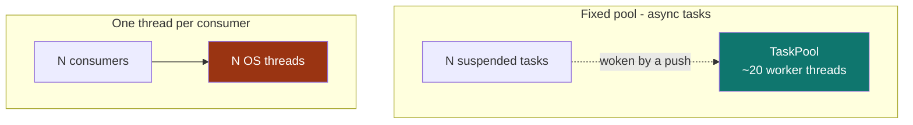

# Choosing sync, blocking, or async - and what async costs

A [`Channel` / `AdaptiveIpc`](../reference/subetha-cxc/high-level-api.md)
handle answers all three
calling conventions; the choice is per call site, not baked into the
type. This guide covers when to reach for each, and the measured cost
of the async path so the choice is informed.

## One handle, three conventions

| Convention | Call | Blocks what | Reach for it when |
|---|---|---|---|
| Sync | `send` / `recv` | nothing (returns `Full` / `Empty`) | you have your own loop or poll cadence and want the floor. |
| Blocking | `send_blocking` / `recv_blocking` | the calling thread (parks it) | one dedicated thread per endpoint, and you want it asleep when idle. |
| Async | `send_async` / `recv_async` | the task (suspends it) | many endpoints multiplexed onto few threads. |

Async runs on any executor: tokio, smol, async-std, or the crate's
runtime-free [`block_on`](../reference/subetha-cxc/async-engine.md). The
wake crosses a
process boundary (a per-receiver reactor) and a machine boundary
(`net_bridge` over blocking `std::net`) behind the same `.await`.

## Async is the scaling path, not the latency path

Async on this substrate is not a faster single operation. The sync
`recv` skips all `Waker` machinery (one relaxed load on an internal
gate); the async `recv` constructs a future and, once async is engaged,
every op drives the wake machinery the sync path avoids. The cost is
real and measurable.

### Per-op overhead

A single-threaded round-trip on one `Channel<u64>`, item always
available (the fast path, nothing parks), 8-byte payload. Measured on
an AMD Ryzen 7 2700 (Zen+); reproduce with `cargo bench --bench
async_overhead -p subetha-cxc`.

| Convention | Round-trip | vs sync |
|---|---|---|
| `send` / `recv` | ~28 ns | 1.0x |
| `send_blocking` / `recv_blocking` | ~55 ns | ~2x |
| `send_async` / `recv_async` (on `block_on`) | ~359 ns | ~13x |

<picture>
  <source media="(prefers-color-scheme: dark)" srcset="/images/async_overhead-dark.png">
  
</picture>

The async path is an order of magnitude heavier per op. If you are
optimizing a single hot producer-consumer pair for latency, use sync.

### What async buys: fan-out on a fixed thread count

The payoff is structural. An awaiting consumer is a suspended task, not
a parked thread, so one bounded executor drives an unbounded number of
them. Delivering the same item stream two ways - a `TaskPool` of
`available_parallelism` workers vs one OS thread per consumer running
`block_on` - over the same `WakerRing` primitive. Measured on an AMD
Ryzen 7 2700; reproduce with `cargo bench --bench async_fanout -p
subetha-cxc`.

| Driver | N = 1,000 | N = 10,000 | N = 100,000 | OS threads |
|---|---|---|---|---|
| Fixed pool (async tasks) | 5.97 M items/s | 6.87 M items/s | 6.71 M items/s | 20 (constant) |
| Thread per consumer | 0.80 M items/s | 0.89 M items/s | (needs 100,004 threads) | N + 4 |

<picture>
  <source media="(prefers-color-scheme: dark)" srcset="/images/async_scaling-dark.png">
  
</picture>

The fixed pool holds 6-7 M items/s on a constant 20 OS threads from a
thousand consumers to a hundred thousand. The thread-per-consumer
design sits below 1 M items/s and needs one OS thread per consumer -
10,004 threads at N = 10,000, and 100,004 at N = 100,000, which is the
point at which it stops being practical. Same ring, same `recv()`
future; only the driver differs.

## Rule of thumb

- One hot pair, latency-sensitive: **sync**, in your own loop.
- A handful of long-lived endpoints, each on its own thread: **blocking**.
- Hundreds to hundreds of thousands of endpoints, or composing under an
  existing async app: **async**, on a `TaskPool` / `RingExecutor` or
  your runtime.

## See also

- [High-level API](../reference/subetha-cxc/high-level-api.md): the three
  conventions
  on one handle.
- [Async engine](../reference/subetha-cxc/async-engine.md):
  `block_on`, the reactor bridge, the executors, and `WakerRing`.
