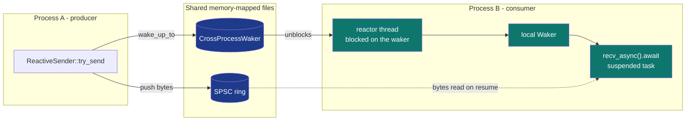

# block_on, reactor, executors, WakerRing


The async conventions on [`Channel` / `AdaptiveIpc`](high-level-api.md)
are plain `std::future::Future`s. They run on
tokio, smol, async-std, or the crate's own runtime-free driver, and a
suspended consumer never costs a thread per future. This page documents
the engine the futures ride on.

## `reactor::block_on` - the runtime-free driver

```rust
pub fn block_on<F: Future>(future: F) -> F::Output;
```

Drives one future to completion on the calling thread, parking the
thread (not spinning) while the future is `Pending`. No runtime, no
dependency. It is what lets the substrate's async surface run with no
tokio in the build:

```rust
use subetha_cxc::reactor::block_on;

let sum = block_on(async {
    let mut s = 0u64;
    for _ in 0..n {
        s += chan.recv_async().await?;
    }
    Ok::<_, subetha_cxc::ApiError>(s)
})?;
```

The same `recv_async()` future also drives from inside a
`#[tokio::main]` runtime, so the substrate sits under an existing async
app when you want it to ([`tokio_interop`](https://github.com/Variably-Constant/SubEtha/blob/main/crates/subetha-cxc/examples/tokio_interop.rs)).

## The reactor - bridging a shared-memory wake to a `Waker`

A future parked on a ring needs something to fire its `Waker` when an
item arrives. In-process, the producer's push fires it directly.
Across a process boundary, a per-receiver reactor thread blocks on the
shared `CrossProcessWaker` and fires the local `Waker` when the
producing process publishes.



| Item | Signature | Role |
|---|---|---|
| `anon_pair(capacity)` | `-> Result<(ReactiveSender, ReactiveReceiver), RingError>` | In-process pair over an anonymous ring; the sender's push wakes the receiver's local `Waker` directly. |
| `sender_cross(ring, xwaker)` | `-> ReactiveSender` | Cross-process producer half over a shared MMF ring + named waker. |
| `receiver_cross(ring, xwaker)` | `-> ReactiveReceiver` | Cross-process consumer half; spawns the reactor thread that turns a shared-memory wake into a local `Waker` fire. |

`ReactiveSender::try_send(payload: &[u8]) -> Result<(), RingError>`
pushes and signals (the signal is sent only on a successful push);
`published() -> u64` is the producer's published count.
`ReactiveReceiver::recv() -> ReactiveRecv` is the awaitable future;
`try_recv(out: &mut [u8]) -> Result<usize, RingError>` drains without
awaiting. The `ReactiveRecv` future owns `Arc` clones, so it is
`Send + 'static`.

This bridge is what `Channel` / `AdaptiveIpc` use internally: the first
`recv_async()` / `send_async()` call spins up the reactor so a wake
crosses the process boundary; an in-process wake takes the direct path.

## `WakerRing` - the minimal awaitable ring

The smallest async ring: one SPSC lane with a `Waker` cell. It is the
primitive the fixed-pool scaling story is built on, with no
marshalling or shape dispatch in the way.

```rust
pub fn create_anon_pair(capacity) -> Result<(WakerProducer, WakerConsumer), RingError>;
```

- `WakerProducer::try_push(payload: &[u8]) -> Result<(), RingError>` -
  push and fire the consumer's registered `Waker`.
- `WakerConsumer::recv() -> WakerRecv` - a `Future` resolving to
  `[u8; SPSC_PAYLOAD_BYTES]`.
- `WakerConsumer::try_recv(out: &mut [u8]) -> Result<usize, RingError>` -
  drain without awaiting.

## Executors - driving many futures on few threads

Two bounded executors drive awaiting tasks without a thread per task.

### `TaskPool`

A fixed pool of worker threads with a shared ready queue.

| Method | Purpose |
|---|---|
| `TaskPool::new(n_workers)` | Spawn `n_workers` worker threads. |
| `spawn(future)` | Enqueue a `Future<Output = ()> + Send + 'static`. |
| `worker_count()` | Worker thread count. |
| `shutdown(self)` | Stop the workers and join. |

### `RingExecutor`

A work-stealing executor whose per-worker ready queues are themselves
Vyukov rings, with workers pinned to cores.

| Method | Purpose |
|---|---|
| `RingExecutor::new(n_workers, max_tasks)` | Construct with an explicit worker count and task ceiling. |
| `RingExecutor::with_available_parallelism(max_tasks)` | Construct sized to `available_parallelism`. |
| `spawn(future)` | Enqueue a `Future<Output = ()> + Send + 'static`. |
| `pending()` | Tasks not yet complete. |
| `worker_count()` / `shard_count()` / `pinned_workers()` / `shard_capacity()` | Topology inspection. |
| `wait_idle()` | Block until the executor drains. |
| `shutdown(self)` | Stop the workers and join. |

## Cross-host: `net_bridge`

The async wake crosses a machine boundary over blocking `std::net`
sockets, with no async runtime in the build.

| Function | Signature | Role |
|---|---|---|
| `ship` | `ship(addr: SocketAddr, producer_ring: Arc<SpscRingCore>, n_items: u64) -> io::Result<()>` | Drain a producer ring to a remote `addr`. |
| `serve_one` | `serve_one(listener: &TcpListener, consumer_ring: &Arc<SpscRingCore>, xwaker: &Arc<CrossProcessWaker>) -> io::Result<u64>` | Accept one connection and feed arriving bytes into a consumer ring, firing the waker so a parked `recv_async()` resolves. |

## E2E proofs

- [`channel_async`](https://github.com/Variably-Constant/SubEtha/blob/main/crates/subetha-cxc/examples/channel_async.rs) - `block_on` driving sync + blocking + async, 300k items.
- [`xproc_async_ring`](https://github.com/Variably-Constant/SubEtha/blob/main/crates/subetha-cxc/examples/xproc_async_ring.rs) - a `recv_async().await` parked in one process, woken by a push from a separate process through the reactor bridge.
- [`net_async_ring`](https://github.com/Variably-Constant/SubEtha/blob/main/crates/subetha-cxc/examples/net_async_ring.rs) - the same await woken by a TCP packet through `net_bridge`, on blocking `std::net` sockets.
- [`async_subscriber_scale`](https://github.com/Variably-Constant/SubEtha/blob/main/crates/subetha-cxc/examples/async_subscriber_scale.rs) - 10,000 `WakerRing` consumers on a `TaskPool`, no thread per subscriber.
- [`ring_async_executor`](https://github.com/Variably-Constant/SubEtha/blob/main/crates/subetha-cxc/examples/ring_async_executor.rs) - the `RingExecutor` driving awaiting tasks.

## See also

- [High-level API](high-level-api.md): the `Channel` /
  `AdaptiveIpc` async conventions these futures back.
- [Async: cost and scaling](../../how-to/async-paths.md):
  measured cost of the async path and the scaling it unlocks.
