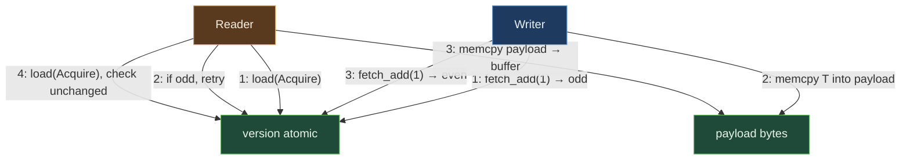

# SharedCell&lt;T&gt;


Cross-process single-value cell with SeqLock protocol. `T: Copy +
'static + repr(C)`, payload up to 52 bytes. Reads never observe a
torn write across the writer's payload-update window; writers use
an odd-version-then-memcpy-then-even-version sequence.

> **The "snapshot-able cross-process struct cell" primitive.** When
> a producer wants to publish a small struct (config, transform,
> world-state header) such that readers in other processes always
> see a consistent snapshot, SharedCell is the lock-free answer.
> Cross-handle visibility tested at sub-microsecond.

**Constraints (read first):**

- **Native sidecar integration**: the struct carries a `HandshakeHeader` + `ObservationRing` and implements `subetha_sidecar::AdaptiveInstance`. Wrap in `SidecarBox::new` to register with the global sidecar; raw `create()` / `open()` return the unregistered type unchanged.

- **`T: Copy + 'static`** (source line 66). Stable `#[repr(C)]`
  layout is the caller's responsibility for cross-language /
  cross-version use.
- **Payload size up to `PAYLOAD_BYTES = 52`** (source line 41).
  `create` returns `PayloadTooLarge` for larger T. Bigger structs
  use [SHARED_VEC.md](../specialized/shared-vec/) or a custom layout.
- **Alignment up to 8 bytes**: `align_of::<T>() > 8` is rejected.
- **One writer at a time**: source line 130 has
  `debug_assert!(v_old & 1 == 0)` catching concurrent writers in
  debug. Multi-writer use is UB.
- **Multi-reader is safe**: the SeqLock retry loop ensures every
  reader observes a consistent value.
- **Header layout** (source lines 43-50): magic (4) + size (4) +
  version (4 atomic) + pad (4) + payload (52) = 68 bytes,
  cache-line aligned.
- **SeqLock protocol** (rustdoc lines 20-30):
  Writer: bump version V -> V+1 (odd); memcpy payload; bump V+1 -> V+2 (even).
  Reader: load version; if odd retry; memcpy payload; reload
  version; if changed retry.
- **`open` rejects mismatched payload size** (source line 104):
  opening a u64 file via `SharedCell<u32>::open` returns
  `LayoutMismatch`.
- **Durability via `flush` / `flush_async`** (source lines 173-181).
- **Cross-process backed by MMF.**

---

## Table of contents

- [What it is](#what-it-is)
- [SeqLock protocol](#seqlock-protocol)
- [Layout](#layout)
- [Worked examples](#worked-examples)
- [Bench evidence](#bench-evidence)
- [Use case patterns](#use-case-patterns)
- [Known limitations](#known-limitations)
- [Common pitfalls](#common-pitfalls)
- [References](#references)

---

## What it is

`SharedCell<T>` is an MMF-backed single-value cell with consistent
cross-process snapshot semantics:

```rust
#[repr(C, align(64))]
pub struct CellHeader {
    pub magic: u32,
    pub size: u32,
    pub version: AtomicU32,
    pub _pad_to_payload: u32,
    pub payload: [u8; 52],
}
```

The payload bytes are reinterpreted as `T` via
`ptr::write_unaligned` / `ptr::read_unaligned`. The version field
parity (odd during write, even when stable) is the SeqLock
synchronization mechanism.



---

## SeqLock protocol

The writer's three-step sequence guarantees readers can detect a
torn read:

1. **Bump version to odd**: `fetch_add(1, AcqRel)` from V (even)
   to V+1 (odd). The Acquire pairs with any prior reader's
   Release; the Release publishes the "I'm writing" flag.
2. **Memcpy payload**: `ptr::write_unaligned` copies the new T
   into the payload bytes. Single-writer assumption means no
   other writer interferes.
3. **Bump version to even**: `fetch_add(1, Release)` from V+1 to V+2.
   The Release publishes the new payload bytes.

The reader's four-step sequence is symmetric:

1. **Load version**: `load(Acquire)`. If odd, the writer is
   mid-update; spin and retry.
2. **Memcpy payload**: `ptr::read_unaligned` copies into a local
   buffer.
3. **Reload version**: `load(Acquire)`. If different from step 1,
   a writer raced; retry.
4. **Return local buffer**: the payload is guaranteed consistent.

The retry is bounded by writer frequency, not by reader count.
N readers do not slow each other down.

---

## Layout


Total: 68 bytes, cache-line-aligned. The padding to the payload
ensures the payload starts at a known offset that the
`payload.as_ptr() as *const T` cast finds valid.

The 52-byte payload limit comes from fitting the header + payload
in a single cache line (64 bytes) plus 4 padding. Larger T need a
different primitive.

---

## Worked examples

### Cross-process struct publication

```rust
use subetha_cxc::shared_cell::SharedCell;

#[derive(Clone, Copy, Debug, PartialEq)]
#[repr(C)]
struct Config {
    version: u32,
    sample_rate: u32,
    buffer_size: u32,
}

// Process A: publish.
let cell: SharedCell<Config> = SharedCell::create("/tmp/cfg.bin").unwrap();
cell.set(Config { version: 1, sample_rate: 48000, buffer_size: 1024 });

// Process B: subscribe.
let reader: SharedCell<Config> = SharedCell::open("/tmp/cfg.bin").unwrap();
let cfg = reader.get();
assert_eq!(cfg.sample_rate, 48000);
```

### Versioned snapshot (monotonic check)

```rust
use subetha_cxc::shared_cell::SharedCell;

let cell: SharedCell<u64> = SharedCell::create("/tmp/monotonic.bin").unwrap();
let v0 = cell.version();
cell.set(1);
let v1 = cell.version();
cell.set(2);
let v2 = cell.version();

assert_eq!(v1, v0 + 2);
assert_eq!(v2, v0 + 4);
```

Each set advances version by 2 (odd transit, then even resting).

### Concurrent readers + single writer

```rust
use std::sync::Arc;
use std::thread;
use subetha_cxc::shared_cell::SharedCell;

let cell: Arc<SharedCell<u64>> = Arc::new(
    SharedCell::create("/tmp/concurrent.bin").unwrap()
);
cell.set(0);

let writer_c = cell.clone();
let writer = thread::spawn(move || {
    for i in 1..1000u64 { writer_c.set(i); }
});

let readers: Vec<_> = (0..4).map(|_| {
    let reader_c = cell.clone();
    thread::spawn(move || {
        let mut last = 0u64;
        for _ in 0..1000 {
            let v = reader_c.get();
            // SeqLock ensures monotonic observation.
            assert!(v >= last);
            last = v;
        }
    })
}).collect();

writer.join().unwrap();
for r in readers { r.join().unwrap(); }
```

The source's `concurrent_readers_during_writes` unit test
verifies the monotonicity invariant under 4-reader contention.

---

## Bench evidence

Bench harness: `crates/subetha-cxc/benches/shared_cell.rs`.
Captured 2026-06-01 on Windows 11 / Zen+ R7 2700, Criterion with
`--sample-size=15 --warm-up-time=1 --measurement-time=2`.

Workload: 24-byte struct (`State { epoch: u64, counter: u64,
flags: u32, pad: u32 }`).

| Op | `std::sync::RwLock<State>` | `SharedCell<State>` | Ratio |
|---|---:|---:|---:|
| get | 17.50 ns | 2.48 ns | **7.0x faster** |
| set | 17.14 ns | 14.06 ns | 1.22x faster |

The architectural claim validates: SeqLock readers do not acquire
a lock, so they skip the RwLock's reader-acquire serialization.
The 7x get win is the architectural lever; the set win is more
modest because both paths write to memory + atomic version bump.

### Rule 3b bench audit

- **Fair contender**: `std::sync::RwLock<State>` is the
  textbook in-process baseline for "snapshot-of-a-struct."
- **Both backings store the same 24-byte struct**.
- **No surplus indirection on the SeqLock side**: bench calls
  `get` / `set` directly.
- **MMF lifecycle managed**: file created at bench start, deleted
  at end.

### What the numbers do NOT show

- **Multi-reader scaling**: SeqLock's win widens with reader
  count (no contention); RwLock's reader-acquire still serializes
  cache-line traffic at the lock state. Unit test
  `concurrent_readers_during_writes` covers correctness; bench
  is single-threaded.
- **Writer-frequency-driven reader retry**: at very high writer
  rates the SeqLock retry can dominate; the bench measures one
  write per iter so retry never fires.

---

## Use case patterns

### Pattern: cross-process configuration cell

A monolith's config struct that all child processes need to read.
Master writes via set; children open and call get on each loop
iteration. No IPC channel; no daemon process; just the MMF.

### Pattern: snapshot of small world-state

Game / simulation tick state (camera transform, time-of-day,
weather flags) published every frame. Renderer / audio / network
threads in separate processes read the current snapshot.

### Pattern: leader's view of cluster topology

Leader process writes the current cluster topology (small fixed-
size record); followers read on demand.

### Pattern: telemetry headline

A monitor cell that holds the latest summary metrics (current
RPS, last-update timestamp, error flag). External monitor process
reads it.

---

## Known limitations

- **52-byte payload limit**: larger T are rejected at create with
  `PayloadTooLarge`. For larger structs, use SHARED_VEC or a custom
  MMF layout.
- **Single-writer assumption**: source debug-asserts on concurrent
  writers (the v_old & 1 == 0 check). Multi-writer use corrupts
  the version protocol.
- **`Copy + 'static + repr(C)` bound**: types with Drop or
  unstable layout cannot use SharedCell. Use a serialization
  layer for arbitrary types.
- **Reader retry loop is unbounded**: theoretically a high-rate
  writer can stall readers indefinitely. In practice writers run
  at a known rate (config update, tick rate) so reader retry is
  bounded.
- **Open rejects mismatched T size**: opening a 16-byte struct file
  via `SharedCell<u32>::open` returns LayoutMismatch. The type
  identity is not encoded; size is the only check.
- **No on-disk durability until flush**: visibility is immediate
  via the MMF mapping; durable persistence requires flush.
- **Cross-process backed by MMF.**

---

## Common pitfalls

- **Concurrent writers.** UB; the SeqLock protocol assumes single
  writer. For multi-writer scenarios use an external mutex on the
  writer side or pick a different primitive.

- **Sending a `SharedCell<T>` reference across processes.** The
  reference is process-local; cross-process visibility is achieved
  via opening the same path with `SharedCell::open`.

- **Wrapping `SharedCell` in `Mutex`.** Pointless; SeqLock is
  already lock-free for readers, and the assumed-single-writer
  contract means no inner mutex is needed.

- **Using `SharedCell` for large T.** Hits PayloadTooLarge.
  SharedCell is for small fixed-size snapshots; large state goes
  through SHARED_VEC or a streaming primitive.

- **Treating `version()` as a monotonic clock.** It is a per-cell
  counter that advances by 2 per set. Cross-cell monotonicity
  requires a [SHARED_FENCE_CLOCK.md](../locks/shared-fence-clock/) or
  similar.

---

## References

- Source: `crates/subetha-cxc/src/shared_cell.rs` (344 lines, 8 unit
  tests: round-trip, cross-handle visibility, version advances on
  set, disk persistence survives reopen, open rejects wrong size,
  struct payload round-trip, concurrent readers during writes,
  payload-too-large at create).
- Sibling primitive: [SHARED_ATOMIC.md](../atomics/shared-atomic/) - for
  cross-process atomic ops on primitive widths. SharedAtomic
  for fetch_add semantics; SharedCell for struct snapshots.
- Sibling primitive: [SHARED_ONCE_CELL.md](shared-once-cell/) -
  for write-once initialization across processes.
- Sibling primitive: [OFFSET_PTR.md](../pointers/offset-ptr/) - the
  foundational MMF-backed pointer.
