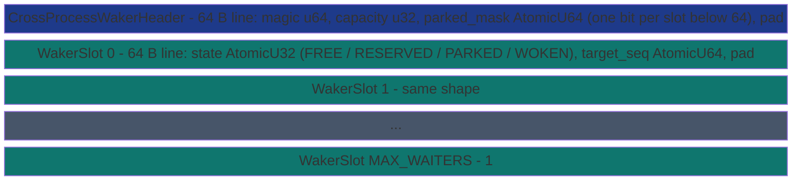

# CrossProcessWaker


Cross-process wake / park primitive: a fixed-size array of waiter
slots stored inside a memory-mapped file (MMF). Each slot is the
state atom that a parked consumer waits on AND that a remote
producer can flip via a single direct-syscall wake. The pattern
is the userspace `futex`, ported to MMF substrate so it works
across process boundaries on Linux (via SHARED `futex`) and
across threads anywhere else.

> **The "futex slot in MMF" primitive.** Two cooperating processes
> map the same waker file. A consumer reserves a slot, writes its
> wake target into it, and parks via the platform wait syscall.
> A producer in another process publishes data, then scans the
> waker slots and calls the platform wake syscall on every slot
> whose target it just passed. Both sides talk through one shared
> 32-bit atom per slot; no kernel event handle is needed.

## Constraints

- **MAX_WAITERS slots per waker**, fixed at construction
  ([`MAX_WAITERS_DEFAULT = 32`](#tuning)); `try_park` returns
  `WakerError::Full` if every slot is in use. Caller's fallback
  is to spin via the underlying primitive's non-blocking surface.
- **Anonymous (`create_anon`)**, **file-backed (`create` / `open`)**,
  or **shmfs-backed (`create_from_shm` / `open_from_shm`)**: same
  byte layout, same protocol.
- **Cross-process wake works on Linux/WSL via SHARED `futex`**
  (no `FUTEX_PRIVATE_FLAG`) **and on FreeBSD via
  `_umtx_op(UMTX_OP_WAIT_UINT / UMTX_OP_WAKE)`** - the non-PRIVATE
  umtx ops, whose sleep queues the kernel keys by PHYSICAL address
  precisely so process-shared synchronization works (per
  `_umtx_op(2)`); proven by the cross-process waker sweep on
  FreeBSD 15 (5/5 runs, parks observed and woken across two
  processes sharing an MMF). **On Windows, cross-process wake
  rides the hardware [monitor tier](#the-monitor-wait-tier)**:
  `WaitOnAddress` is intra-process only, but MONITORX/UMONITOR
  monitors key on PHYSICAL addresses, so a store from another
  process to the shared MMF line wakes the waiter - proven by the
  two-process waker E2E on Windows (50,000 items, parks observed,
  producer completing in 336 ms where the monitor-less baseline
  deadlocks into its timeout recovery). Windows hosts without
  MONITORX/WAITPKG, and macOS, degrade to wait-timeout +
  re-check for cross-process callers.

## Storage layout



One cache line per slot keeps parkers from false-sharing; the
header's `parked_mask` word is what lets a producer's wake scan
answer the nobody-is-parked case from a single line.

Slot `state` IS the wait/wake atomic. The platform wait syscall
takes `&slot.state` plus the expected `PARKED` value; the wake
syscall takes the same address.

## Slot states

- **FREE (0)**: unused, available for `try_park`.
- **RESERVED (1)**: caller has claimed the slot via CAS and is
  about to publish its target sequence.
- **PARKED (2)**: consumer has published target + is waiting on
  the platform syscall.
- **WOKEN (3)**: producer or another waker fired; the consumer's
  `wait` returns; the slot transitions back to FREE on `release`
  (or on the next `try_park` finding it).

## Protocol

### Park (consumer side)

1. CAS some slot's `state` from FREE to RESERVED (linear probe
   from slot 0; the first FREE slot wins).
2. Release-store the target sequence into `slot.target_seq`.
3. Release-store `state = PARKED`.
4. Platform wait on `&slot.state` expecting `PARKED`. Every wait
   first runs the bounded MONITOR tier (below); on budget expiry:
   - Linux: `futex(FUTEX_WAIT)` SHARED, no `FUTEX_PRIVATE_FLAG`;
     crosses process boundaries.
   - FreeBSD: `_umtx_op(UMTX_OP_WAIT_UINT)`, non-PRIVATE;
     crosses process boundaries.
   - Windows, anon-backed: `WaitOnAddress(state, &PARKED,
     sizeof(u32), timeout_ms)`; intra-process only per Microsoft
     docs.
   - Windows, file/shm-backed: stays on the monitor tier for the
     whole wait (the only non-polling cross-process wake the
     platform has).
   - macOS 14.4+: `os_sync_wait_on_address` (the public futex),
     with `OS_SYNC_WAIT_ON_ADDRESS_SHARED` selected for file /
     shm backings so the wake crosses process boundaries.
   - Other: spin-and-recheck loop.

### The monitor-wait tier

`subetha_cxc::monitor_wait` slots hardware MONITOR-class waiting
between spin and park: `MONITORX`/`MWAITX` (AMD, CPUID
`8000_0001` ECX bit 29), `UMONITOR`/`UMWAIT` (WAITPKG, CPUID
`7.0` ECX bit 5), or `LDAXR`+`WFE` on aarch64 (base ISA - a
remote store to the armed line flips the global exclusive
monitor Exclusive-to-Open, which IS the wake event, no `SEV`
required; the budget runs on `CNTVCT_EL0` ticks), probed once
and cached. The waiter arms a
monitor on the slot's cache line and light-sleeps (C0.1) with a
hardware deadline; ANY store to the line wakes it - so the
producer's state-CAS IS the wake, no syscall on either side, and
the wake crosses process boundaries because monitors are
physical-address based. The tier takes a bounded budget
(`SUBETHA_MONITOR_WAIT_CYCLES`, default ~90k cycles = tens of
microseconds) and hands off to the kernel park on expiry;
`SUBETHA_NO_MONITOR_WAIT=1` disables it.

Measured on Windows / Zen+ 2700 by
`examples/monitor_wait_probe.rs` (3,000 wake-latency rounds):
kernel park p50 9,321 ns; integrated waker with the monitor tier
p50 **120 ns** - and the tier's p99 (410 ns raw) is tighter than
a PAUSE spin's (1,624 ns). Hypervisors may hide the CPUID bits
from guests (the FreeBSD VM does), in which case the tier
reports unavailable and the ladder skips straight to the kernel
park.

### Wake (producer side)

`wake_up_to(seq)` first loads the header's `parked_mask` word
(one bit per slot index below 64, maintained at park/release):
a zero mask answers the common nobody-is-parked case from ONE
cache line instead of touching every slot line. For each
candidate slot whose `state == PARKED` and `target_seq <= seq`:

1. CAS `state` from PARKED to WOKEN.
2. Platform wake syscall on `&slot.state`:
   - Linux: `futex(FUTEX_WAKE)` SHARED.
   - FreeBSD: `_umtx_op(UMTX_OP_WAKE)` SHARED.
   - Windows: `WakeByAddressSingle(&state)`.
   - macOS 14.4+: `os_sync_wake_by_address_any` (SHARED for
     cross-process backings).

Returns the count woken. Two narrower variants share this scan:
`wake_one_up_to(seq)` wakes AT MOST ONE qualifying slot (the
Mesa-condvar `notify_one` shape, so the other parked waiters stay
parked) and returns 0 or 1; `wake_all()` wakes every PARKED slot
regardless of `target_seq` (shutdown / drain, so blocked consumers
see a terminate signal).

### Wake-before-park race

Classic futex idiom: between the consumer's "ring empty" check
and `try_park`, a producer can publish and call `wake_up_to`
which finds zero PARKED slots. The fix is the caller's
double-check after `try_park`: re-poll the underlying primitive's
non-blocking surface BEFORE actually calling `wait`. If data is
now present, `release` the slot and proceed. The combined
unsafe window is the few nanoseconds between `state = PARKED`
and the re-poll load.

The blocking ring wrappers ([`BlockingSpscRing`](), [`BlockingMpscRing`](), [`BlockingMpmcRing`]()) implement the
double-check pattern correctly so callers do not need to think
about it.

## Operations

```rust
pub struct CrossProcessWaker { /* fields */ }

impl CrossProcessWaker {
    pub fn create_anon(max_waiters: usize) -> Result<Self, WakerError>;
    pub fn create(path: impl AsRef<Path>, max_waiters: usize) -> Result<Self, WakerError>;
    pub fn open(path: impl AsRef<Path>, expected_max_waiters: usize) -> Result<Self, WakerError>;
    pub fn create_from_shm(shm: ShmFile, max_waiters: usize) -> Result<Self, WakerError>;
    pub fn open_from_shm(shm: ShmFile, expected_max_waiters: usize) -> Result<Self, WakerError>;

    pub fn capacity(&self) -> usize;

    pub fn try_park(&self, target_seq: u64) -> Result<WakerToken, WakerError>;
    pub fn wait(&self, token: WakerToken, timeout: Option<Duration>) -> Result<(), WakerError>;
    pub fn release(&self, token: WakerToken);

    pub fn wake_up_to(&self, seq: u64) -> usize;       // all parked with target_seq <= seq
    pub fn wake_one_up_to(&self, seq: u64) -> usize;   // at most one (condvar notify_one)
    pub fn wake_all(&self) -> usize;                   // every parked slot (drain / shutdown)
}
```

`waker_region_size(capacity)` is a public `const fn` for callers sizing a
`ShmFile` by hand, and `WakerToken::slot_index()` exposes the reserved slot for
instrumentation. `WakerError` has four variants: `Full` (every slot in use -
fall back to spinning), `Timeout` (a `wait` deadline elapsed with no wake),
`LayoutMismatch` (an `open` / `open_from_shm` whose magic or capacity
disagrees), and `IoError(std::io::ErrorKind)`; it implements `Display` +
`std::error::Error`.

## Worked example (intra-process)

```rust
use std::sync::Arc;
use std::thread;
use std::time::Duration;
use subetha_cxc::CrossProcessWaker;

let waker = Arc::new(CrossProcessWaker::create_anon(32)?);

// Park a consumer waiting for seq >= 5.
let w_consumer = Arc::clone(&waker);
let consumer = thread::spawn(move || {
    let token = w_consumer.try_park(5).expect("park");
    w_consumer.wait(token, Some(Duration::from_secs(1))).expect("wait");
});

// Producer wakes anything parked at seq <= 7.
thread::sleep(Duration::from_millis(10));
let woken = waker.wake_up_to(7);
assert_eq!(woken, 1);

consumer.join().unwrap();
```

For the cross-process two-binary shape, see the file-backed
worked example pair: `examples/waker_xproc_producer.rs` +
`examples/waker_xproc_consumer.rs` in the `subetha-cxc` crate.

## Tuning

- **`MAX_WAITERS_DEFAULT`** is 32 slots per waker. Each slot is
  64 bytes (cache-line padded), so the header plus 32 slots is
  about 2 KB before mmap rounding. Bump for workloads with more
  simultaneous parkers than producers.
- **Pre-park spin** in the blocking ring wrappers retries the
  non-blocking surface 32 times before calling `try_park`, so
  imminent items skip the kernel round-trip entirely. Increase
  for very bursty producers; decrease for steady-rate producers
  that always park.
- **Linux raw-futex feature**: the `linux-futex-raw` Cargo
  feature exposes the direct `FUTEX_WAIT_BITSET` / `FUTEX_REQUEUE`
  surface for callers that need primitives the portable wrapper
  does not expose.

## E2E proof

- **Intra-process (Windows + Linux):** `examples/waker_intra_process_e2e.rs`
  ships 50000 items under producer-paced cadence, verifies
  FIFO + asserts `parks > 0` so a regression on the wait path
  would fail the test (parks observed: ~3125 / 50000 calls).
- **Cross-process (Linux/WSL):** `examples/waker_xproc_producer.rs` +
  `examples/waker_xproc_consumer.rs` ship 50000 items between
  two SEPARATE binaries through a file-backed MMF; observe
  ~290 to 320 cross-process parks per run (0.6% of recvs), both
  processes exit `rc=0`.
- **Sweep:** the intra-process e2e (Windows) and the cross-process
  e2e (Linux) were each run N times back-to-back to rule out
  flakiness.

## See also

- Source: `crates/subetha-cxc/src/cross_process_waker.rs` (1177
  lines, 6 unit tests; the platform wait/wake ladder lives in the
  in-file `platform_wait` module, and the monitor tier in
  `crate::monitor_wait`).
- [`BlockingSpscRing`]():
  single-producer / single-consumer ring with cross-process
  blocking send / recv.
- [`BlockingMpscRing`]():
  N producers / 1 consumer.
- [`BlockingMpmcRing`]():
  N producers / M consumers, round-robin partition.
- [Coordination types overview]().
