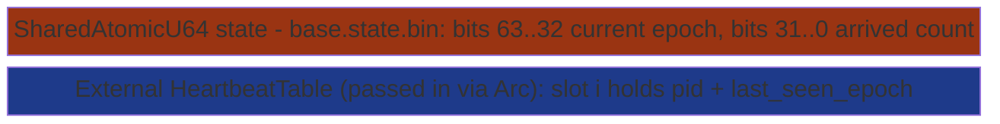
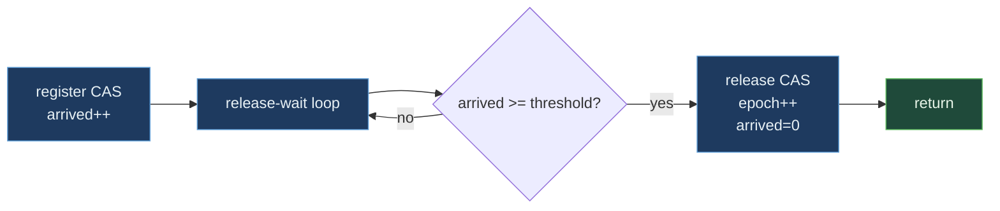

# EpochBarrier


Multi-process phase-synchronization barrier with heartbeat-driven
dead-peer exclusion. Composes one `SharedAtomicU64` (packed
state) with a `HeartbeatTable` (live-peer source). Releases when
all currently-live peers have called `wait` at the current epoch
- a peer whose heartbeat has lapsed past the grace window is
automatically excluded, so one crashed worker cannot deadlock the
barrier the way `std::sync::Barrier` or `MPI_Barrier` does.

> **The "barrier that survives a crashed peer" primitive.**
> `std::sync::Barrier` 4-thread release: 13.39 µs.
> `EpochBarrier` 4-thread release: 21.73 µs (1.62x slower -
> heartbeat scan + adaptive backoff cost). The architectural
> lever is what std cannot do at any cost: cross-process barrier,
> dead-peer exclusion, quorum-based release.

**Constraints (read first):**

- **Native sidecar integration**: the struct carries a `HandshakeHeader` + `ObservationRing` and implements `subetha_sidecar::AdaptiveInstance`. Wrap in `SidecarBox::new` to register with the global sidecar; raw `create()` / `open()` return the unregistered type unchanged.

- **State is ONE packed `AtomicU64`**: `(epoch << 32) | arrived`.
  Both register-as-arrived and release-the-barrier are single CAS
  ops, so there is no ordering puzzle between two separate
  atomics.
- **Live-peer count comes from an external `HeartbeatTable`**:
  EpochBarrier does not own the heartbeat; pass it in via
  `Arc<HeartbeatTable>`.
- **`grace_epochs` controls staleness**: a slot is live when
  `global_epoch - slot.last_seen_epoch <= grace`.
- **Adaptive backoff**: 32 spins -> yield -> 50 µs sleep. No
  parking on a kernel object.
- **Capacity**: 32-bit epoch counter (4 billion barrier rounds);
  32-bit arrived count (4 billion participants per epoch).
- **Cross-process backed by MMF.**

---

## Table of contents

- [What it is](#what-it-is)
- [Protocol](#protocol)
- [Quorum variant](#quorum-variant)
- [Bench evidence](#bench-evidence)
- [Worked examples](#worked-examples)
- [Use case patterns](#use-case-patterns)
- [Known limitations](#known-limitations)
- [Common pitfalls](#common-pitfalls)
- [References](#references)

---

## What it is



The state file holds nothing except the packed `(epoch, arrived)`
u64. The heartbeat table is shared with other primitives
(failover, leader election, etc.) and EpochBarrier just reads
from it.

---

## Protocol

`wait(my_epoch)` runs in two parts.

### Part 1: register-as-arrived

```text
load(state) -> (cur_epoch, cur_arrived)

if cur_epoch > my_epoch: epoch already passed, return
if cur_epoch < my_epoch: I'm early, yield + retry
else:
   CAS state -> (cur_epoch, cur_arrived + 1)
   on success: break out of registration loop
   on failure: another peer registered concurrently, retry
```

### Part 2: release-wait

```text
loop:
   load(state) -> (cur_epoch, cur_arrived)
   if cur_epoch > my_epoch: someone released, return
   threshold = quorum or live_peer_count()
   if cur_arrived >= threshold:
       CAS state -> (cur_epoch + 1, 0)  # release + reset
       on success: return
   else:
       spin -> yield -> sleep backoff
```

Any arriving peer can be the releaser - whichever one wins the
release-CAS first. Losers see `cur_epoch > my_epoch` on the next
load and return.



---

## Quorum variant

`wait_quorum(my_epoch, quorum)` is identical except the release
threshold is `arrived >= quorum` rather than
`arrived >= live_peer_count`. Use cases:

- Two-phase commit prepare: need MAJORITY commitment, not
  unanimity.
- Read quorums: any 3 of 5 replicas confirm before proceeding.
- Speculative parallel work: stop as soon as N out of M finish.

`wait_timeout` and `wait_quorum_timeout` add deadline support;
return `Err(Timeout)` if the deadline passes before release.

### Accessors and errors

`current_epoch()`, `arrived_count()`, and `snapshot() -> (epoch, arrived)` read
the packed state without participating; `live_peer_count()` counts live
heartbeat slots; `flush()` / `flush_async()` persist the state file (the async
path is page-cache-only on Windows). The default grace constant is
`DEFAULT_BARRIER_GRACE_EPOCHS = 3`. `BarrierError` has four variants:
`Atomic(SharedAtomicError)`, `Timeout`, `NoLivePeers` (a non-quorum `wait`
found zero live peers), and `EpochTooFarBehind` - which is **reserved and never
returned** by the current implementation (an early `my_epoch` yields and
retries rather than erroring).

---

## Bench evidence

Bench harness: `crates/subetha-cxc/benches/epoch_barrier.rs`.
Captured 2026-06-02 on Windows 11 / Zen+ R7 2700, Criterion with
`--sample-size=15 --warm-up-time=1 --measurement-time=2`.

Pre-spawned-worker pattern: workers spawn once outside `b.iter`
and synchronize via a cyclic `std::sync::Barrier` (kick + done).
Both contenders pay the same two gate-syncs per iter, so the
ratio comparison isolates the EpochBarrier-vs-`std::sync::Barrier`
cost.

| Op | `EpochBarrier` (mmf) | `std::sync::Barrier` | Relative |
|---|---:|---:|---:|
| current_epoch (atomic load) | 944.68 ps | n/a | observer-only |
| wait_quorum(0, 1) single-participant | 15.32 ns | n/a | fast path |
| live_peer_count (8 slots, 4 live) | 13.48 ns | n/a | scan cost |
| 4-thread release cycle | 21.73 µs | 13.39 µs | **1.62x slower** |

### Reading the trade-offs

The 4-thread release shows EpochBarrier 1.62x slower than
`std::sync::Barrier`. The cost difference is:

- **`live_peer_count` scan per release-wait iteration**: ~13 ns
  to count slots in the heartbeat. `std::sync::Barrier` knows
  the count at construction.
- **Adaptive spin-yield-sleep backoff**: cheaper than parking on
  a kernel object when contention is brief, but pessimistic on
  release latency. `std::sync::Barrier` uses Mutex+Condvar and
  wakes the waiter directly.
- **CAS-based register and release**: every state transition is a
  single CAS on the packed u64.

The architectural lever - **what std::sync::Barrier cannot do at
any cost** - is:

1. **Cross-process operation**: every process opens the same MMF
   and participates in the same barrier.
2. **Dead-peer exclusion**: a crashed peer's heartbeat lapses
   past the grace window; the barrier counts only live peers.
3. **Quorum threshold**: release on majority rather than
   unanimity.

### Rule 3b bench audit

- **Fair contender**: `std::sync::Barrier` is the in-process
  textbook baseline. No third-party barrier crate ships
  cross-process semantics, so there is no fair "cross-process
  barrier" baseline to compare against.
- **No `thread::spawn` inside `b.iter`**: workers pre-spawned;
  per-iter cost is two `std::sync::Barrier` gate-syncs +
  whichever barrier op is under test.
- **MMF lifecycle managed**: state file + heartbeat file
  created, ops run, dropped, both files removed.
- **Heartbeat scan workload**: 8-slot table, 4 live peers, 4
  empty slots - representative of typical worker-pool sizes.

### What the numbers do NOT show

- **Cross-process release**: the barrier runs unchanged across
  processes; the `std::sync::Barrier` baseline cannot.
- **Dead-peer scenario**: a crashed process leaves a stale
  heartbeat. After grace_epochs, `live_peer_count` drops by 1
  and the barrier releases without it. `std::sync::Barrier`
  deadlocks.
- **Large-N scaling**: at 32+ peers the per-release heartbeat
  scan grows linearly; consider quorum-based release if scan
  cost dominates.

---

## Worked examples

### Distributed phase synchronization

```rust
use std::sync::Arc;
use std::time::Duration;
use subetha_cxc::{EpochBarrier, HeartbeatTable};

// Process A - daemon registers the table:
let hb = Arc::new(HeartbeatTable::create("/tmp/hb.bin", 32).unwrap());
let barrier = EpochBarrier::create("/tmp/barrier.bin", hb.clone(), 5).unwrap();

// Worker process - open the same table + barrier:
let hb = Arc::new(HeartbeatTable::open("/tmp/hb.bin", 32).unwrap());
let barrier = EpochBarrier::open("/tmp/barrier.bin", hb.clone(), 5).unwrap();
let slot = hb.register(std::process::id()).unwrap();

// Each phase: do work, beat, wait at barrier:
for epoch in 0..n_phases {
    do_work_for_phase(epoch);
    hb.beat(slot);
    barrier.wait_timeout(epoch, Duration::from_secs(30)).unwrap();
}
```

### Quorum release for 2-phase commit prepare

```rust
use subetha_cxc::EpochBarrier;

let barrier = EpochBarrier::open("/tmp/prepare.bin", hb.clone(), 5).unwrap();
let n_replicas = 5;
let majority = n_replicas / 2 + 1;   // 3
barrier.wait_quorum(epoch, majority).unwrap();
// At least 3 of 5 replicas have prepared; commit can proceed.
```

### Survive a crashed peer

```rust
use std::sync::Arc;
use subetha_cxc::{EpochBarrier, HeartbeatTable};

let hb = Arc::new(HeartbeatTable::create("/tmp/hb.bin", 4).unwrap());
let live = hb.register(1000).unwrap();
let _crashed = hb.register(1001).unwrap();  // never beats

let barrier = EpochBarrier::create("/tmp/b.bin", hb.clone(), 2).unwrap();
hb.beat(live);
for _ in 0..3 { hb.tick_global_epoch(); }
hb.beat(live);  // refresh live; crashed slot is now stale
assert_eq!(barrier.live_peer_count(), 1);  // grace window expired
barrier.wait(0).unwrap();  // releases on 1/1 - no deadlock
```

---

## Use case patterns

### Pattern: distributed bulk-synchronous-parallel (BSP) compute

Workers proceed in phases; phase transitions are barrier
synchronized. A crashed worker drops out automatically without
hanging the cluster.

### Pattern: cross-process pipeline staging

Stage-i workers wait at a barrier; once all (live) stage-i
workers arrive, stage-i+1 starts. Dead workers don't block the
stage transition.

### Pattern: speculative parallel quorum

K independent algorithms race; first quorum (e.g., majority)
threshold reached wins. The `wait_quorum` variant releases as
soon as the threshold is met without waiting for stragglers.

---

## Known limitations

- **Heartbeat dependency**: EpochBarrier requires a working
  `HeartbeatTable`. If the heartbeat itself is faulty, the
  barrier's live-peer accounting is wrong.
- **Spin-based blocking**: no kernel parking; high-contention
  workloads burn CPU rather than blocking on a kernel object.
  Long-blocking waits should use `wait_timeout` to bound
  CPU burn.
- **grace_epochs is fixed at create**: tuning the staleness
  threshold requires destroying and recreating the barrier.
- **Epoch wraparound at 2^32**: 4 billion epochs; impractical
  to hit but formally a limit.
- **Cross-process backed by MMF.**

---

## Common pitfalls

- **Forgetting to beat before waiting.** A peer that registers
  in the heartbeat but never beats counts as stale immediately;
  the barrier will release without it (or never release if
  every peer makes this mistake).

- **grace_epochs too small.** A peer with slow heartbeat cadence
  may be excluded prematurely. Set grace to several times the
  expected beat interval.

- **Calling `wait` with `my_epoch >> current_epoch`.** The
  registration loop yields-and-retries forever. Use
  `wait_timeout` to bound the wait.

- **Sharing the same heartbeat between two barriers with
  different grace windows.** Both barriers count peers from the
  same heartbeat slot states; tune the heartbeat cadence so both
  grace windows are reasonable.

- **Using `wait` with zero live peers.** Returns
  `Err(NoLivePeers)`. Either register first, or use
  `wait_quorum` with an explicit threshold.

---

## References

- Source: `crates/subetha-cxc/src/epoch_barrier.rs` (537 lines, 12
  unit tests covering single-peer release, multi-peer arrival,
  quorum threshold, timeout, dead-peer exclusion, cross-handle
  visibility, multi-epoch sequence, and arrived-count reset).
- Bench: `crates/subetha-cxc/benches/epoch_barrier.rs`
  (current_epoch, wait_quorum_1, live_peer_count, 4-thread
  release vs `std::sync::Barrier`).
- Underlying primitive: [SHARED_ATOMIC.md](../atomics/shared-atomic/) -
  the packed-state AtomicU64 EpochBarrier sits on.
- Dependency: [HEARTBEAT.md](heartbeat/) - the live-peer
  source EpochBarrier reads each release-wait iteration.
- Sibling primitive:
  [SHARED_LEADER_ELECTION.md](../ownership-types/shared-leader-election/) -
  same heartbeat dependency, different protocol
  (lowest-live-PID claims leadership).
- Sibling primitive: [FAILOVER.md](failover/) -
  same heartbeat dependency; failover triggers on staleness
  rather than synchronizing on liveness.
