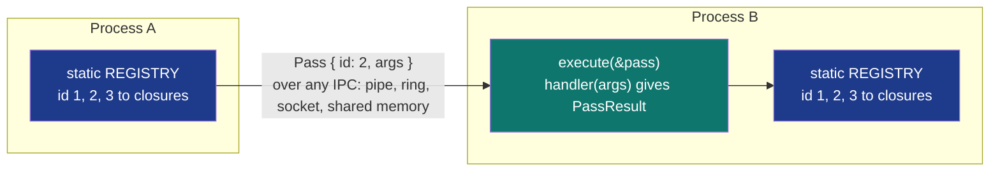

# pass_registry


In-process closure registry for cross-process `Pass<F>` dispatch.
Rust closures cannot be safely serialised across process
boundaries (they reference function pointers that are not
position-stable, and capture variables of arbitrary types).
The Ray / Akka pattern is to register closures by ID at
startup; the wire protocol carries the ID + serialised args,
not the closure code. Each process registers the SAME
ID -> closure mapping; any process can dispatch via
`Pass { id, args }`.

> **The "ship a closure across processes via ID indirection"
> primitive.** `execute` at 78.40 ns vs direct closure call
> 59.39 ns (the registry adds ~19 ns of RwLock-read + HashMap
> lookup + Box deref). `register` at 53.00 ns. `is_registered`
> at 17.97 ns. The architectural value is the dispatch
> convention, not raw perf: closures can't cross processes,
> but ID+args can.

**Constraints (read first):**

- **In-process static registry**: each process maps `u32 id` to
  its own `Box<dyn Fn(&[u8]) -> PassResult>`. There is no
  shared MMF; cross-process value is the convention.
- **Same ID must register the same closure in every
  participating process**: if process A's id=42 differs from
  process B's id=42, the dispatch is silently wrong.
- **Args are raw bytes**: caller chooses (de)serialisation. The
  registry does not interpret args.
- **Re-register overwrites**: `register(id, f)` returns the
  previous handler if any.
- **PassError::UnknownClosureId** when dispatched with an
  unregistered id.
- **No MMF backing**: this primitive is purely in-process.
- **`register_pass!` macro** for startup convention: each
  participating binary calls it for every closure.

---

## Table of contents

- [What it is](#what-it-is)
- [Dispatch protocol](#dispatch-protocol)
- [Bench evidence](#bench-evidence)
- [Worked examples](#worked-examples)
- [Use case patterns](#use-case-patterns)
- [Known limitations](#known-limitations)
- [Common pitfalls](#common-pitfalls)
- [References](#references)

---

## What it is



The registry is the per-process mapping; the wire format is the
Pass struct. Both processes must have registered id=2 with the
same closure semantics.

---

## Dispatch protocol

### register(id, f)

```text
guard = REGISTRY.write()
prev = guard.insert(id, Box::new(f))
return prev    # Some(old_handler) or None
```

One RwLock write + HashMap insert. The replaced handler (if any)
is returned; in the `register_pass!` macro it is dropped
immediately.

### execute(pass)

```text
guard = REGISTRY.read()
match guard.get(&pass.closure_id):
   Some(handler) -> handler(&pass.args)
   None -> Err(UnknownClosureId(pass.closure_id))
```

One RwLock read + HashMap lookup + Box dispatch. The handler
runs while the read guard is held; long-running handlers block
concurrent registrations (but not concurrent executes).

### `register_pass!` macro

```rust
register_pass!(42, "uppercase", |args| {
    Ok(args.iter().map(|b| b.to_ascii_uppercase()).collect())
});
```

The macro is a convention helper: each participating binary
calls it at startup for every closure. The macro drops the
return of `register` (in case a prior handler was replaced) and
binds the name only for documentation.

### Lifecycle accessors

`unregister(id) -> Option<PassHandler>` removes a handler (returning it if
present) - call it on graceful shutdown so the boxed `dyn Fn` and anything it
captured drop. `is_registered(id) -> bool` and `registered_count() -> usize`
are the read-side probes (one RwLock-read each); `registered_count` reports the
number of handlers in THIS process's registry.

---

## Bench evidence

Bench harness: `crates/subetha-cxc/benches/pass_registry.rs`.
Captured 2026-06-02 on Windows 11 / Zen+ R7 2700, Criterion with
`--sample-size=15 --warm-up-time=1 --measurement-time=2`.

Workload: registry pre-populated with 10 closures; dispatch
selects id=5; args = 5-byte buffer; closure allocates a Vec for
the result.

| Op | Time | Notes |
|---|---:|---|
| execute / global | **78.40 ns** | RwLock-read + HashMap lookup + dispatch |
| direct_call / baseline | 59.39 ns | closure-only, no lookup layer |
| execute / local_rwlock | 81.74 ns | same protocol, local instance |
| execute / local_mutex | 80.71 ns | Mutex<HashMap> baseline |
| register / global | 53.00 ns | RwLock-write + HashMap insert |
| is_registered / global | 17.97 ns | RwLock-read + HashMap contains |

### Reading the trade-offs

1. **Registry indirection costs ~19 ns** over a direct closure
   call (78.40 ns vs 59.39 ns). The lookup layer adds:
   RwLock-read acquire + HashMap u32 lookup + Box deref +
   RwLock-read release.
2. **RwLock vs Mutex is tied on single-thread reads**
   (81.74 ns vs 80.71 ns). The RwLock advantage materializes
   under concurrent readers, which this bench does not measure.
3. **register at 53 ns** includes RwLock-write + HashMap insert
   (Vec allocation for the new Box) + drop of any prior handler.
4. **is_registered at 17.97 ns** is the cheapest probe:
   RwLock-read + HashMap contains + RwLock-read release.

### Rule 3b bench audit

- **Fair contenders**: direct call (no registry; pure closure
  cost), local `RwLock<HashMap>` (same protocol as global
  static), local `Mutex<HashMap>` (alternate sync primitive).
- **No `thread::spawn` inside `b.iter`**: single-threaded.
  Concurrent-correctness lives in source unit tests.
- **Sizing**: 10 pre-registered closures (representative working
  set; HashMap lookup is O(1) so size barely matters).
- **Per-bench unique IDs**: the global REGISTRY is shared across
  the binary's benches; each function uses a distinct ID range
  to avoid cross-contamination.

### What the numbers do NOT show

- **Cross-process dispatch**: the architectural claim. Process
  A sends `Pass { id, args }` via any IPC; Process B's registry
  executes the same closure. Neither closures themselves nor
  function pointers can cross processes, but IDs + bytes can.
- **Concurrent reader scaling**: under N concurrent executors,
  the RwLock allows N readers in parallel; the Mutex
  serializes. Single-thread bench does not capture this.
- **Closure-result allocation**: the bench's closure allocates
  a Vec for the result, dominating the 59 ns direct-call cost.
  Stateless closures (`Fn(&[u8]) -> Ok(())`) show a much
  smaller indirection ratio in the dispatch path.

---

## Worked examples

### Register a closure at startup

```rust
use subetha_cxc::pass_registry::{register, Pass, execute};

const ID_UPPERCASE: u32 = 0x0001;

// In main() or once per process:
register(ID_UPPERCASE, |args| {
    Ok(args.iter().map(|b| b.to_ascii_uppercase()).collect())
});

// Anywhere in this process:
let pass = Pass {
    closure_id: ID_UPPERCASE,
    args: b"hello".to_vec(),
};
let result = execute(&pass).unwrap();
assert_eq!(result, b"HELLO");
```

### Macro-based registration

```rust
use subetha_cxc::register_pass;
use subetha_cxc::pass_registry::{Pass, execute};

const ID_ROT13: u32 = 0x0002;

register_pass!(ID_ROT13, "rot13", |args: &[u8]| {
    Ok(args.iter().map(|&b| match b {
        b'a'..=b'm' | b'A'..=b'M' => b + 13,
        b'n'..=b'z' | b'N'..=b'Z' => b - 13,
        _ => b,
    }).collect())
});
```

### Cross-process pattern

```rust
// Both processes execute this at startup:
const ID_COUNT_BYTES: u32 = 0x1234;
register(ID_COUNT_BYTES, |args| {
    Ok((args.len() as u32).to_le_bytes().to_vec())
});

// Process A - sends:
let pass = Pass { closure_id: ID_COUNT_BYTES, args: b"hello world".to_vec() };
ipc_send_to_b(&pass);

// Process B - receives and dispatches:
let received: Pass = ipc_receive();
let result = execute(&received).unwrap();   // bytes: [11, 0, 0, 0]
```

---

## Use case patterns

### Pattern: Ray-style remote function dispatch

A pool of worker processes each register the same set of
closures at startup. A scheduler ships `Pass { id, args }` to
the least-loaded worker. The worker's `execute` runs the
closure locally and returns the result via another IPC channel.

### Pattern: supervisor with pluggable event handlers

A supervisor process registers handlers for events (config
reload, health probe, graceful shutdown). The supervisor's
event loop dispatches incoming events via `execute(pass)`.
Plug-in modules register additional handlers at load time.

### Pattern: failover-safe work units

A primary worker holds an OwnerLease and processes work units
via `execute(pass)`. On primary crash and lease failover, the
secondary worker has already registered the same closure IDs
at startup; it picks up the work unchanged.

---

## Known limitations

- **In-process static registry**: not MMF-backed. Multiple
  processes do NOT share the registry; each registers its own
  mapping.
- **Registration is global per-process**: there is one
  registry, not multiple instances. Calling `register` from a
  library affects every other library in the same binary.
- **No type safety on args**: `&[u8]` -> `PassResult`. Callers
  must agree on serialisation format.
- **Replaced handler is dropped immediately**: any state
  captured by the prior handler is dropped on re-register.
- **RwLock-write on register blocks all readers**: high-
  frequency re-registration starves dispatchers. Typical use
  is one-time startup registration.
- **No automatic unregister on drop**: the registry holds
  Box<dyn Fn> indefinitely. Long-lived processes should
  unregister on graceful shutdown.

---

## Common pitfalls

- **Different processes registering different closures with the
  same id.** Silently produces wrong results. The convention
  must be enforced by build-time mechanisms (shared constants
  module, code-generation, etc.).

- **Holding the read guard across slow IO inside the closure.**
  `execute` runs the handler while the read guard is held;
  registrations from other threads block. Keep handlers fast
  or move slow IO outside the registry.

- **Calling `execute` from inside another `execute`.** Nested
  reads work (RwLock is recursive on the read side in many
  platforms), but assumes the inner closure does not try to
  register. Avoid mixing registration and execution within one
  closure chain.

- **Treating the registry as cross-process state.** It is not.
  Each process has its own `static REGISTRY`. Cross-process
  consistency comes from the convention, not the storage.

- **Forgetting that `register` returns the prior handler.**
  Ignoring the return when a prior handler held resources
  leaks until the boxed `dyn Fn` is dropped. The
  `register_pass!` macro drops the return explicitly.

---

## References

- Source: `crates/subetha-cxc/src/pass_registry.rs` (178 lines, 6
  unit tests covering register+execute round-trip, unknown
  closure id, re-register overwrites, execution error,
  is_registered + count accuracy, and macro registration).
- Bench: `crates/subetha-cxc/benches/pass_registry.rs` (execute,
  direct_call baseline, local RwLock, local Mutex, register,
  is_registered).
- Composes with: [PROGRESS_TASK.md](progress-task/) and
  [PRIORITY_FANOUT.md](priority-fanout/) - the
  cross-process dispatch substrates that ship `Pass { id, args }`
  payloads.
- Composes with: [OWNER_LEASE.md](../ownership-types/owner-lease/) - the
  failover primitive that lets a secondary worker take over
  pass dispatch when the primary dies.
- Architectural reference: Ray (task dispatch via function IDs),
  Akka (typed actor handlers by name).
