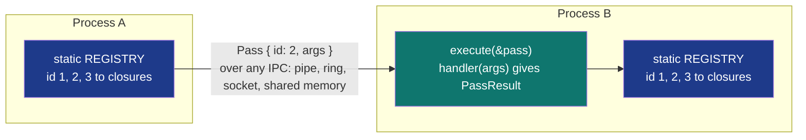

# pass_registry


In-process closure registry for cross-process `Pass<F>` dispatch.
Rust closures cannot be safely serialized across process
boundaries (they reference function pointers that are not
position-stable, and capture variables of arbitrary types).
The Ray / Akka pattern is to register closures by ID at
startup; the wire protocol carries the ID + serialized args,
not the closure code. Each process registers the same
ID -> closure mapping; any process can dispatch via
`Pass { id, args }`.

> **The "ship a closure across processes via ID indirection"
> primitive.** The architectural value is the dispatch
> convention, not raw perf: closures can't cross processes,
> but ID+args can. The map is copied on write, so a dispatch
> never waits on a registration and a registration never waits
> on a running handler.

**Constraints (read first):**

- **In-process static registry**: each process maps `u32 id` to
  its own `Arc<dyn Fn(&[u8]) -> PassResult>`. There is no
  shared MMF; cross-process value is the convention.
- **Same ID must register the same closure in every
  participating process**: if process A's id=42 differs from
  process B's id=42, the dispatch is silently wrong.
- **Args are raw bytes**: caller chooses (de)serialization. The
  registry does not interpret args.
- **Re-register overwrites**: `register(id, f)` returns the
  previous handler if any.
- **PassError::UnknownClosureId** when dispatched with an
  unregistered id.
- **No MMF backing**: this primitive is purely in-process.
- **`register_pass!` macro** for startup convention: each
  participating binary calls it for every closure.

---

## Table of contents

- [What it is](#what-it-is)
- [Dispatch protocol](#dispatch-protocol)
- [Bench evidence](#bench-evidence)
- [Worked examples](#worked-examples)
- [Use case patterns](#use-case-patterns)
- [Known limitations](#known-limitations)
- [Common pitfalls](#common-pitfalls)
- [References](#references)

---

## What it is


```mermaid
flowchart LR
    subgraph A["Process A"]
        RA["static REGISTRY<br/>id 1, 2, 3 to closures"]
    end
    subgraph B["Process B"]
        RB["static REGISTRY<br/>id 1, 2, 3 to closures"]
        EX["execute(&amp;pass)<br/>handler(args) gives PassResult"]
    end
    RA -- "Pass { id: 2, args }<br/>over any IPC: pipe, ring, socket, shared memory" --> EX
    EX --> RB
    classDef regC fill:#1e3a8a,color:#ffffff
    classDef exC fill:#0f766e,color:#ffffff
    class RA,RB regC
    class EX exC
```

The registry is the per-process mapping; the wire format is the
Pass struct. Both processes must have registered id=2 with the
same closure semantics.

---

## Dispatch protocol

### register(id, f)

```text
replaced = REGISTRY.rcu(|map| copy of map with id -> Arc::new(f))
return replaced.get(id)    # Some(old_handler) or None
```

One copy of the map, one HashMap insert and one atomic swap of
the map pointer; a registration that loses the swap to another
copies the newer map and tries again. The replaced handler (if
any) is returned; in the `register_pass!` macro it is dropped
immediately.

### execute(pass)

```text
handler = REGISTRY.load().get(&pass.closure_id).cloned()
match handler:
   Some(handler) -> handler(&pass.args)
   None -> Err(UnknownClosureId(pass.closure_id))
```

One atomic load, one HashMap lookup and one reference-count
increment, then the handler runs holding nothing: a
registration during the call swaps in a new map without
waiting, and the call keeps the handler it found.

### `register_pass!` macro

```rust
register_pass!(42, "uppercase", |args| {
    Ok(args.iter().map(|b| b.to_ascii_uppercase()).collect())
});
```

The macro is a convention helper: each participating binary
calls it at startup for every closure. The macro drops the
return of `register` (in case a prior handler was replaced) and
binds the name only for documentation.

### Lifecycle accessors

`unregister(id) -> Option<PassHandler>` removes a handler (returning it if
present) - call it on graceful shutdown so the handler and anything it
captured drop once no dispatch still holds it. `is_registered(id) -> bool` and
`registered_count() -> usize` are the read-side probes (one atomic load each);
`registered_count` reports the number of handlers in this process's registry.

---

## Bench evidence

Bench harness: `crates/subetha-cxc/benches/pass_registry.rs`, run
with Criterion's defaults (3 s warm-up, 100 samples over 5 s) on
Windows 11 Pro 10.0.26200 on an AMD Ryzen 9 7900X, built for the
x86-64 baseline, while other work kept 3.5 to 4.0 of the machine's 24
hardware threads busy.

Workload: registry pre-populated with 10 closures; dispatch
selects id=5; args = 5-byte buffer; closure allocates a Vec for
the result.

| Op | Time | Notes |
|---|---:|---|
| execute / global | **37.62 ns** | map load + HashMap lookup + reference-count increment + dispatch |
| direct_call / baseline | 33.69 ns | closure-only, no lookup layer |
| execute / local_rwlock | 40.88 ns | the same lookup behind a local `RwLock<HashMap>` |
| execute / local_mutex | 44.80 ns | the same lookup behind a local `Mutex<HashMap>` |
| register / global | 148.35 ns | copy of the map + HashMap insert + pointer swap |
| is_registered / global | 8.04 ns | map load + HashMap contains |

### Reading the trade-offs

1. **Registry indirection costs ~3.9 ns** over a direct closure
   call (37.62 ns vs 33.69 ns): one atomic load of the map, one
   HashMap u32 lookup and one reference-count increment.
2. **The copy-on-write map dispatches faster than a lock around
   the same map**, single-threaded: 37.62 ns against 40.88 ns
   behind an `RwLock` and 44.80 ns behind a `Mutex`.
3. **register at 148 ns** pays for the copy: the 10-entry map is
   cloned, the handler inserted and the new map swapped in.
4. **is_registered at 8.04 ns** is the cheapest probe: one
   atomic load and one HashMap contains.

### Rule 3b bench audit

- **Fair contenders**: direct call (no registry; pure closure
  cost), local `RwLock<HashMap>` and local `Mutex<HashMap>` (the
  same lookup behind a lock).
- **No `thread::spawn` inside `b.iter`**: single-threaded.
  Concurrent-correctness lives in source unit tests.
- **Sizing**: 10 pre-registered closures (representative working
  set; HashMap lookup is O(1) so size barely matters).
- **Per-bench unique IDs**: the global REGISTRY is shared across
  the binary's benches; each function uses a distinct ID range
  to avoid cross-contamination.

### What the numbers do not show

- **Cross-process dispatch**: the architectural claim. Process
  A sends `Pass { id, args }` via any IPC; Process B's registry
  executes the same closure. Neither closures themselves nor
  function pointers can cross processes, but IDs + bytes can.
- **Concurrent scaling**: executors read the map in parallel,
  and a registration does not stall them. The single-threaded
  bench does not capture this.
- **Closure-result allocation**: the bench's closure allocates
  a Vec for its result, and every row that calls it, the
  33.69 ns direct call included, pays for that allocation.

---

## Worked examples

### Register a closure at startup

```rust
use subetha_cxc::pass_registry::{register, Pass, execute};

const ID_UPPERCASE: u32 = 0x0001;

// In main() or once per process:
register(ID_UPPERCASE, |args| {
    Ok(args.iter().map(|b| b.to_ascii_uppercase()).collect())
});

// Anywhere in this process:
let pass = Pass {
    closure_id: ID_UPPERCASE,
    args: b"hello".to_vec(),
};
let result = execute(&pass).unwrap();
assert_eq!(result, b"HELLO");
```

### Macro-based registration

```rust
use subetha_cxc::register_pass;
use subetha_cxc::pass_registry::{Pass, execute};

const ID_ROT13: u32 = 0x0002;

register_pass!(ID_ROT13, "rot13", |args: &[u8]| {
    Ok(args.iter().map(|&b| match b {
        b'a'..=b'm' | b'A'..=b'M' => b + 13,
        b'n'..=b'z' | b'N'..=b'Z' => b - 13,
        _ => b,
    }).collect())
});
```

### Cross-process pattern

```rust
// Both processes execute this at startup:
const ID_COUNT_BYTES: u32 = 0x1234;
register(ID_COUNT_BYTES, |args| {
    Ok((args.len() as u32).to_le_bytes().to_vec())
});

// Process A - sends:
let pass = Pass { closure_id: ID_COUNT_BYTES, args: b"hello world".to_vec() };
ipc_send_to_b(&pass);

// Process B - receives and dispatches:
let received: Pass = ipc_receive();
let result = execute(&received).unwrap();   // bytes: [11, 0, 0, 0]
```

---

## Use case patterns

### Pattern: Ray-style remote function dispatch

A pool of worker processes each register the same set of
closures at startup. A scheduler ships `Pass { id, args }` to
the least-loaded worker. The worker's `execute` runs the
closure locally and returns the result via another IPC channel.

### Pattern: supervisor with pluggable event handlers

A supervisor process registers handlers for events (config
reload, health probe, graceful shutdown). The supervisor's
event loop dispatches incoming events via `execute(pass)`.
Plug-in modules register additional handlers at load time.

### Pattern: failover-safe work units

A primary worker holds an OwnerLease and processes work units
via `execute(pass)`. On primary crash and lease failover, the
secondary worker has already registered the same closure IDs
at startup; it picks up the work unchanged.

---

## Known limitations

- **In-process static registry**: not MMF-backed. Multiple
  processes do not share the registry; each registers its own
  mapping.
- **Registration is global per-process**: there is one
  registry, not multiple instances. Calling `register` from a
  library affects every other library in the same binary.
- **No type safety on args**: `&[u8]` -> `PassResult`. Callers
  must agree on serialization format.
- **Replaced handler outlives its registration only as long as
  someone holds it**: `register` returns it, and a dispatch that
  found it before the swap finishes running it.
- **Every registration copies the whole map**: its cost grows
  with the number of handlers, and a registration that races
  another copies again. Typical use is one-time startup
  registration.
- **No automatic unregister on drop**: the registry holds each
  handler indefinitely. Long-lived processes should
  unregister on graceful shutdown.

---

## Common pitfalls

- **Different processes registering different closures with the
  same id.** Silently produces wrong results. The convention
  must be enforced by build-time mechanisms (shared constants
  module, code-generation, etc.).

- **Treating the registry as cross-process state.** It is not.
  Each process has its own `static REGISTRY`. Cross-process
  consistency comes from the convention, not the storage.

- **Forgetting that `register` returns the prior handler.**
  A prior handler's captured resources live until the returned
  handler is dropped. The `register_pass!` macro drops the
  return explicitly.

---

## References

- Source: `crates/subetha-cxc/src/pass_registry.rs` (6 unit
  tests covering register+execute round-trip, unknown
  closure id, re-register overwrites, execution error,
  is_registered + count accuracy, and macro registration).
- Bench: `crates/subetha-cxc/benches/pass_registry.rs` (execute,
  direct_call baseline, local RwLock, local Mutex, register,
  is_registered).
- Composes with: [Progress Task](progress-task/) and
  [Priority Fanout](priority-fanout/) - the
  cross-process dispatch substrates that ship `Pass { id, args }`
  payloads.
- Composes with: [Owner Lease](../ownership-types/owner-lease/) - the
  failover primitive that lets a secondary worker take over
  pass dispatch when the primary dies.
- Architectural reference: Ray (task dispatch via function IDs),
  Akka (typed actor handlers by name).
