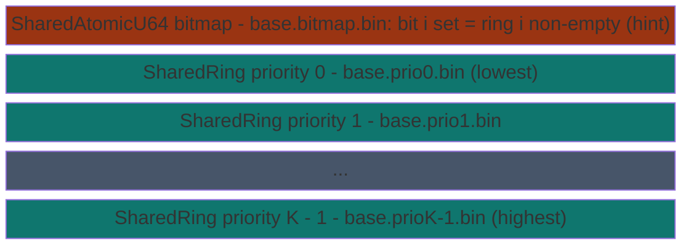
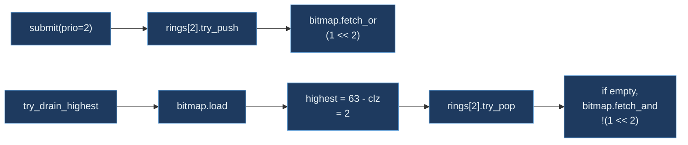

# PriorityFanout


_CLZ_bitmap-brightgreen)


Tiered work queue with O(1) priority selection. Composes K
[`SharedRing`](../rings/shared-ring/)s (one per priority level) with
a single [`SharedAtomicU64`](../atomics/shared-atomic/) bitmap of
active priorities. Consumers find the highest non-empty priority
in one CLZ instruction; producers route by priority tag. The
bitmap is a hint (set after push, cleared on observed-empty pop),
not a source of truth; the rings are authoritative.

> **The "O(1) priority queue without a heap" primitive.** Drain
> at **31.47 ns** vs `Mutex<BinaryHeap>` 66.87 ns
> (**2.13x faster** - one CLZ + one ring pop vs lock + O(log N)
> heap pop with reheap). Submit and submit+drain cycle are tied
> with the binaryheap (~34 ns each). The architectural lever is
> the drain path: priority selection is O(1) regardless of the
> number of pending items.

**Constraints (read first):**

- **Native sidecar integration**: the struct carries a `HandshakeHeader` + `ObservationRing` and implements `subetha_sidecar::AdaptiveInstance`. Wrap in `SidecarBox::new` to register with the global sidecar; raw `create()` / `open()` return the unregistered type unchanged.

- **Up to 64 priorities**: one bit per priority in the u64
  bitmap. Larger fanouts need a Vec<u64> bitmap (separate
  primitive).
- **Producer protocol**: ring push, then `fetch_or` the bitmap
  bit. The push happens BEFORE the bitmap set; readers may
  transiently miss a just-pushed item until the producer
  completes the fetch_or.
- **Consumer protocol**: CLZ-find highest set bit, try ring pop;
  on Empty, clear the bit and retry next-highest. Bitmap-as-hint
  means rings are authoritative.
- **Race-safe**: producer's fetch_or overrides any concurrent
  bit-clear from a consumer. No items lost; bitmap may be
  transiently inconsistent with ring state.
- **Bounded retry on `try_drain_highest`**: at most
  `2 * n_priorities` retries before returning Empty.
- **K+1 MMF files**: one bitmap file + one ring file per
  priority.
- **Cross-process backed by MMF.**

---

## Table of contents

- [What it is](#what-it-is)
- [Submit / drain protocol](#submit--drain-protocol)
- [Race analysis](#race-analysis)
- [Bench evidence](#bench-evidence)
- [Worked examples](#worked-examples)
- [Use case patterns](#use-case-patterns)
- [Known limitations](#known-limitations)
- [Common pitfalls](#common-pitfalls)
- [References](#references)

---

## What it is



Total: K+1 files. Bitmap fits in one cache line; each ring is
its own MMF.

---

## Submit / drain protocol

### submit(priority, payload)

```text
1. priority bounds-check
2. rings[priority].try_push(payload)?
3. bitmap.fetch_or(1 << priority, AcqRel)
```

The fetch_or is idempotent. If the bit is already set,
the operation is a no-op. The ordering guarantees that any
subsequent loader sees the push before the bitmap update.

### try_drain_highest(out)

```text
for _ in 0..(n_priorities * 2):       # bounded retry
   bitmap = bitmap.load(Acquire)
   if bitmap == 0: return Err(Empty)
   highest = 63 - bitmap.leading_zeros()   # one CLZ
   match rings[highest].try_pop(out):
       Ok: if ring now empty, bitmap.fetch_and(!(1<<highest))
           return Ok(highest)
       Err(Empty): bitmap.fetch_and(!(1<<highest)); continue
       Err(other): return Err(other)
return Err(Empty)
```

One CLZ + one ring pop in the fast path. On the slow path
(stale bit), one fetch_and + retry on next-highest.



---

## Race analysis

- **Producer pushed but hasn't set bit**: consumer transiently
  sees Empty for that priority; next consumer call sees the
  bit. Acceptable: weakly-consistent fairness.
- **Consumer cleared bit; concurrent producer set it via
  fetch_or**: producer's set overrides the clear; consumer's
  clear was for a real Empty observation at one point in time.
  No item is ever lost; the bitmap is transiently inconsistent
  with ring state.
- **Stale bit (bit set, ring empty)**: bounded retry clears the
  bit and moves to next-highest priority.

The bitmap-as-hint pattern decouples bitmap state from ring
state. Correctness comes from the rings; the bitmap is an
optimization for O(1) priority selection.

---

## Observability, errors, durability

Two depth accessors sit alongside the bitmap snapshots: `approx_pending(prio)`
returns `Some(approx_len)` for that priority's ring (`None` if `prio` is
out of range), and `approx_total_pending()` sums every ring's `approx_len`.
Both are best-effort like the bitmap hint; do not gate correctness on them.
`n_priorities()` reports the configured level count, and the payload ceiling is
re-exported as the associated const `PriorityFanout::PAYLOAD_BYTES` (= 56, the
SharedRing payload).

`FanoutError` has five variants: `Ring(RingError)` (e.g. `Ring(Full)` on a full
priority ring, `Ring(Empty)` from `try_drain_priority`), `Atomic(SharedAtomicError)`
(from the bitmap file), `PriorityOutOfBounds` (a `submit`/`try_drain_priority`
index `>= n_priorities`), `NPrioritiesOutOfBounds` (a `create`/`open` with
`n_priorities == 0` or `> 64`), and `Empty` (every ring drained, from
`try_drain_highest`). Durability: `flush()` syncs the bitmap and all rings to
disk; `flush_async()` is the non-blocking variant, only partially asynchronous
on Windows (syncs to the page cache, not all the way to disk).

---

## Bench evidence

Bench harness: `crates/subetha-cxc/benches/priority_fanout.rs`.
Captured 2026-06-02 on Windows 11 / Zen+ R7 2700, Criterion with
`--sample-size=15 --warm-up-time=1 --measurement-time=2`.

Workload: 4-priority fanout, ring capacity 16384, payload =
56-byte u32-tag buffer. Naive baseline: `Mutex<BinaryHeap<(u8,
u32)>>` (max-heap orders by priority descending).

| Op | `PriorityFanout` (mmf) | `Mutex<BinaryHeap>` | Relative |
|---|---:|---:|---|
| submit single | 34.56 ns | 34.06 ns | tied (within 2%) |
| drain single (highest of 4 priorities) | **31.47 ns** | 66.87 ns | **2.13x cascade win** |
| cycle (submit + drain) | 35.50 ns | 33.47 ns | tied (mmf 1.06x slower) |

### Reading the trade-offs

1. **Submit is tied.** PriorityFanout does ring push + bitmap
   fetch_or. BinaryHeap does mutex lock + heap push (O(log N))
   + unlock. At 4-priority depth and small heap size, the costs
   balance out.
2. **Drain is 2.13x faster.** The architectural win. CLZ + ring
   pop is O(1) regardless of pending items; the binaryheap pays
   O(log N) per pop with reheap that gets worse as heap grows.
3. **Cycle ties.** Submit + drain together balances the submit
   tie and drain win against the protocol overhead per op.

The drain advantage compounds at larger queue depths: with N
pending items, the fanout still pops in O(1), the binaryheap
pops in O(log N).

### Rule 3b bench audit

- **Fair contender**: `Mutex<BinaryHeap<(u8, u32)>>` is the
  textbook in-process priority queue pattern most ad-hoc code
  reaches for. Same workload shape, same payload type.
- **Sized for workload**: ring capacity 16384 (no overflow at
  criterion's iter counts); heap baseline grows naturally.
- **No `thread::spawn` inside `b.iter`**: all single-threaded.
  Multi-producer contention is covered by the source unit test
  `concurrent_producers_route_to_correct_priorities`.
- **Drain bench pre-fills then drains**: both contenders refill
  when their structure goes empty. Symmetric amortization.
- **MMF lifecycle managed**: per-bench create + ops + drop +
  cleanup of bitmap + per-priority ring files.

### What the numbers do NOT show

- **Cross-process operation**: any process can submit; any
  process can drain. The mutex baseline is in-process only.
- **Drain advantage at larger N**: at N=1000 pending items, the
  binaryheap's O(log N) ≈ 10x its O(1) base; the fanout stays at
  O(1). The 2.13x advantage at small N grows.
- **Multi-producer scaling**: the fanout's per-ring lock-free
  pushes don't serialize across priorities; the mutex baseline
  serializes every producer.

Multi-producer contention is exercised by the source unit test
`concurrent_producers_route_to_correct_priorities` (4 threads,
Barrier-synced, asserts all items routed to correct priorities).
The architectural claim of lock-free scaling is validated by the
source-level concurrent test.

---

## Worked examples

### Basic priority routing

```rust
use subetha_cxc::PriorityFanout;

let f = PriorityFanout::create("/tmp/work", 4, 1024).unwrap();
f.submit(0, b"low-prio").unwrap();
f.submit(2, b"med-prio").unwrap();
f.submit(3, b"high-prio").unwrap();

let mut buf = [0u8; 56]; // drain buffer must be >= SharedRing PAYLOAD_BYTES (56)
// High-priority drained first.
assert_eq!(f.try_drain_highest(&mut buf).unwrap(), 3);
assert_eq!(f.try_drain_highest(&mut buf).unwrap(), 2);
assert_eq!(f.try_drain_highest(&mut buf).unwrap(), 0);
```

### Dedicated worker for a specific priority

```rust
use subetha_cxc::PriorityFanout;

let f = PriorityFanout::open("/tmp/work", 4, 1024).unwrap();
let mut buf = [0u8; 56]; // drain buffer must be >= SharedRing PAYLOAD_BYTES (56)
// High-priority worker: only drain priority 3.
loop {
    if let Ok(()) = f.try_drain_priority(3, &mut buf) {
        process_high_priority(&buf);
    } else {
        std::thread::sleep(std::time::Duration::from_micros(10));
    }
}
```

### Cross-process producer + consumer

```rust
// Producer process:
let f = PriorityFanout::create("/tmp/jobs", 8, 4096).unwrap();
for (prio, job) in jobs {
    f.submit(prio, &job).unwrap();
}

// Consumer process (any number of them):
let f = PriorityFanout::open("/tmp/jobs", 8, 4096).unwrap();
let mut buf = [0u8; 56]; // drain buffer must be >= SharedRing PAYLOAD_BYTES (56)
loop {
    match f.try_drain_highest(&mut buf) {
        Ok(prio) => handle_job(prio, &buf),
        Err(_) => std::thread::sleep(std::time::Duration::from_millis(1)),
    }
}
```

---

## Use case patterns

### Pattern: tiered work queue

Critical work goes to high priority; background work to low.
The CLZ-based selection guarantees critical work drains first
without scanning lower priorities.

### Pattern: cross-process job scheduler

Multiple worker processes drain from the same fanout. The
lock-free per-priority rings let workers scale without
mutex contention on lower-priority items when a higher-priority
item is available.

### Pattern: priority-class quotas via dedicated workers

Reserve some workers for `try_drain_priority(N)` on a specific
class so that class always gets serviced regardless of bursts
at other priorities.

---

## Known limitations

- **Cap of 64 priorities**: one u64 bitmap.
- **Ring capacity is per-priority**: all rings have the same
  capacity, configured at create. Workload bursts on one
  priority do not borrow capacity from other priorities.
- **Bitmap is a hint, not authoritative**: rare false-positive
  reads (bit set, ring transiently empty) cause a bounded retry.
- **No starvation prevention**: high-priority floods can starve
  low priorities. Mix with explicit `try_drain_priority` calls
  for per-class quotas.
- **K+1 files per fanout**: capacity-fixed at create.
- **Cross-process backed by MMF.**

---

## Common pitfalls

- **Treating `active_priorities()` as authoritative.** It is the
  bitmap hint; an empty ring may briefly have its bit set, and
  a non-empty ring may briefly have its bit clear. Use it for
  observability or short-circuit checks only.

- **Mismatched n_priorities at open.** `open` requires the same
  `n_priorities` and `ring_capacity` as create. Pin in a shared
  spec.

- **Confusing priority semantics.** Priority 0 is LOWEST, N-1 is
  HIGHEST. The bitmap's MSB direction matches this: highest set
  bit = highest priority.

- **Submitting to an out-of-bounds priority.** Returns
  `PriorityOutOfBounds`; not silent.

- **Wrapping the fanout in a Mutex.** Pointless; per-ring
  lock-free atomics + lock-free bitmap fetch_or are already
  concurrency-safe.

---

## References

- Source: `crates/subetha-cxc/src/priority_fanout.rs` (587 lines, 13
  unit tests including bitmap initialization, priority bit
  setting, highest-first drain, within-priority FIFO, OOB
  rejection, dedicated-priority drain, full-ring error,
  cross-handle visibility, interleaved submit+drain ordering,
  4-thread concurrent routing, observer-sees-bitmap-update,
  capacity boundary, and disk persistence).
- Bench: `crates/subetha-cxc/benches/priority_fanout.rs` (submit,
  drain, cycle vs `Mutex<BinaryHeap<(u8, u32)>>`).
- Underlying primitive: [SHARED_RING.md](../rings/shared-ring/) -
  the Vyukov MPMC ring per-priority.
- Underlying primitive: [SHARED_ATOMIC.md](../atomics/shared-atomic/) -
  the AtomicU64 bitmap.
- Sibling primitive:
  [SHARED_BROADCAST_RING.md](../rings/shared-broadcast-ring/) -
  fanout-by-subscriber instead of fanout-by-priority.
