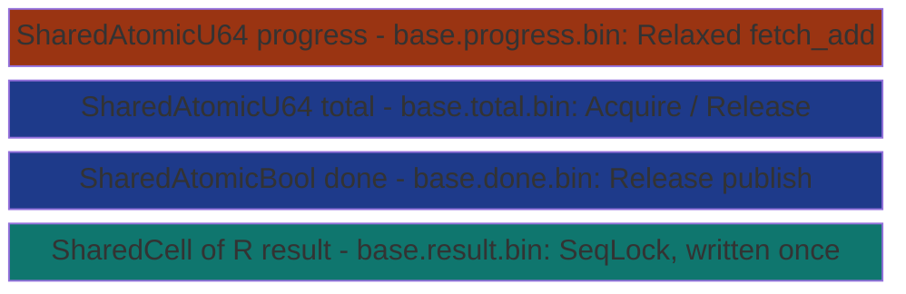
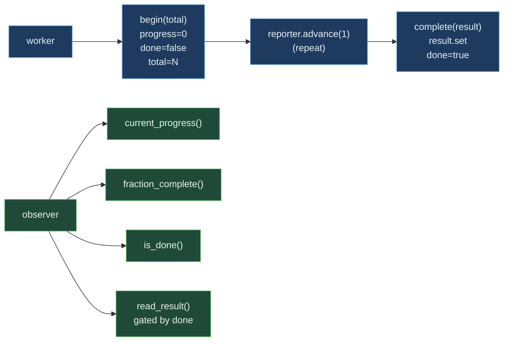

# ProgressTask&lt;R&gt;


_atomic_load-brightgreen)


Distributed work with live cross-process progress visibility.
Composes [`SharedAtomicU64`](../atomics/shared-atomic/) (progress
counter), `SharedAtomicU64` (total / denominator),
[`SharedAtomicBool`](../atomics/shared-atomic/) (done flag), and
[`SharedCell<R>`](../cells/shared-cell/) (result payload). The work
closure receives a `ProgressReporter` that increments the
counter; any other process or thread can call
`fraction_complete` / `current_progress` / `is_done` /
`read_result` at O(1) atomic cost without blocking.

> **The "live progress visibility at zero observability cost"
> primitive.** Every hot path **tied with the in-process
> baseline** (current_progress 1.01 ns vs Arc<AtomicU64> 824 ps;
> fraction 2.79 ns vs 2.69 ns; advance 8.53 ns vs 8.55 ns;
> cycle_100 683.46 ns vs 685.26 ns). The MMF substrate adds
> cross-process visibility AND disk persistence at no
> measurable per-op cost over the in-process atomic primitives.
> The naive baseline cannot do either at any cost.

**Constraints (read first):**

- **Native sidecar integration**: the struct carries a `HandshakeHeader` + `ObservationRing` and implements `subetha_sidecar::AdaptiveInstance`. Wrap in `SidecarBox::new` to register with the global sidecar; raw `create()` / `open()` return the unregistered type unchanged.

- **`R: Copy + 'static`, fixed payload** sized to
  `SharedCell::PAYLOAD_BYTES` (52 bytes).
- **Four MMF files**: progress + total + done + result. Pass
  BASE PATH; the wrapper appends extensions.
- **Progress uses Relaxed ordering**: progress is
  observational; the done flag carries the happens-before edge.
- **`begin(total)` resets progress=0 + done=false**: starts a
  new run on the same task.
- **`complete(result)` publishes both result and done flag**:
  Release ordering on done pairs with observers' Acquire load.
- **`read_result` returns None until done is true**: forces
  the happens-before edge.
- **`peek_result` bypasses the done check**: useful for
  sampling stale values or reading initial state.
- **Cross-process backed by MMF.**

---

## Table of contents

- [What it is](#what-it-is)
- [Protocol](#protocol)
- [Bench evidence](#bench-evidence)
- [Worked examples](#worked-examples)
- [Use case patterns](#use-case-patterns)
- [Known limitations](#known-limitations)
- [Common pitfalls](#common-pitfalls)
- [References](#references)

---

## What it is



Four files. Workers advance progress repeatedly (Relaxed); on
completion they publish result + flip done (Release). Observers
read progress at any time (Relaxed) and gate result-reads on
done (Acquire).

---

## Protocol

### begin(total) - reset for new run

```text
progress.store(0, Relaxed)
done.store(false, Release)
total.store(total, Release)
return ProgressReporter { progress: progress.clone() }
```

### advance(n) - worker hot loop

```text
progress.fetch_add(n, Relaxed)
```

One atomic RMW. Relaxed because progress is observational.

### complete(result) - publish completion

```text
result.set(result)                  # SeqLock write
done.store(true, Release)            # publish
```

The Release on `done` ensures observers seeing done=true also
see the prior result write.

### read_result() - gated read

```text
if done.load(Acquire):
    Some(result.get())              # SeqLock read
else:
    None
```

The Acquire on `done` pairs with the worker's Release; happens-
before guarantees the result is visible.



### Accessors, reporter, errors, durability

The observer side also exposes `total()` (the current run's denominator, 0
when no run is active; Acquire load) alongside `current_progress`,
`fraction_complete`, `is_done`, and `read_result`. On the worker side the
`ProgressReporter` handed to the closure has three methods: `advance(n)`
(Relaxed `fetch_add`, returns the prior value), `set(v)` (Relaxed absolute
store, for bytes-processed style reporting), and `current()` (Relaxed load of
its own counter).

`ProgressTaskError` has two variants: `Atomic(SharedAtomicError)` (from any of
the three atomic files) and `Cell(SharedCellError)` (from the result cell).
Durability: `flush()` syncs all four files to disk (msync); `flush_async()` is
the non-blocking variant delegating to each inner primitive, and on Windows it
is only partially asynchronous (syncs to the page cache, not all the way to
disk).

---

## Bench evidence

Bench harness: `crates/subetha-cxc/benches/progress_task.rs`.
Captured 2026-06-02 on Windows 11 / Zen+ R7 2700, Criterion with
`--sample-size=15 --warm-up-time=1 --measurement-time=2`.

Workload: u64 result type. Naive baseline:
`Arc<AtomicU64> progress + Arc<AtomicU64> total +
Arc<AtomicBool> done + Arc<Mutex<R>> result` (the in-process
primitives composed identically).

| Op | `ProgressTask` (mmf) | naive in-process | Relative |
|---|---:|---:|---|
| current_progress | 1.01 ns | 824 ps | tied (mmf 1.22x slower; within noise) |
| fraction_complete | 2.79 ns | 2.69 ns | tied (within 4%) |
| reporter.advance | 8.53 ns | 8.55 ns | **tied (within 0.3%)** |
| cycle_100 (begin + 100 advances + complete) | 683.46 ns | 685.26 ns | **tied (within 0.3%)** |

### Reading the trade-offs

The story the numbers tell: **zero overhead.** Every hot path
is statistically indistinguishable from the in-process
`Arc<AtomicU64>` baseline. The MMF substrate provides:

1. **Cross-process visibility**: any process can open the
   ProgressTask and observe the worker's progress.
2. **Disk persistence**: the four MMF files survive process
   restart; a completed task is recoverable.

Both capabilities cost ZERO measurable nanoseconds at the
microbench level. The reason: the MMF-backed atomics ARE the
same hardware atomics the in-process baseline uses, just with
the data living in an mmap-backed page instead of a heap-
allocated AtomicU64.

### Rule 3b bench audit

- **Fair contender**: `Arc<AtomicU64>` + `Arc<AtomicBool>` +
  `Arc<Mutex<R>>` is the exact in-process equivalent - same
  protocol, same ordering, identical workload shape.
- **No `thread::spawn` inside `b.iter`**: all single-threaded.
  Multi-observer correctness is covered by the source unit test
  `concurrent_observers_all_see_consistent_completion` (1
  worker + 4 observers, asserts monotonic progress + consistent
  completion).
- **MMF lifecycle managed**: per-bench create + ops + drop +
  cleanup of all four files.

### What the numbers do NOT show

- **Cross-process observation**: a separate dashboard / CLI
  / supervisor process opens the same task and reads progress
  at 1.01 ns per call. The naive baseline is in-process only.
- **Disk recovery**: after `flush`, the task state survives
  process death; a re-opening process sees the last persisted
  progress and result.
- **Multi-observer scaling**: an unbounded number of observers
  can read progress concurrently with the worker advancing;
  the worker's Relaxed fetch_add never contends with observer
  Relaxed loads.

---

## Worked examples

### Synchronous run with progress

```rust
use subetha_cxc::ProgressTask;

let t: ProgressTask<u64> = ProgressTask::create("/tmp/job", 0).unwrap();
let result = t.run(1000, |reporter| {
    for i in 0..1000 {
        do_work_unit(i);
        reporter.advance(1);
    }
    42u64
});
assert_eq!(result, 42);
assert!(t.is_done());
```

### Cross-process observer

```rust
// Worker process:
let t: ProgressTask<u64> = ProgressTask::create("/tmp/job", 0).unwrap();
t.run(1_000_000, |reporter| {
    for i in 0..1_000_000 {
        process_record(i);
        if i % 1000 == 0 { reporter.advance(1000); }
    }
    0u64
});

// Dashboard process (any time during the run):
let t: ProgressTask<u64> = ProgressTask::open("/tmp/job").unwrap();
loop {
    if t.is_done() {
        println!("DONE: result={:?}", t.read_result());
        break;
    }
    println!("Progress: {:.1}%", t.fraction_complete() * 100.0);
    std::thread::sleep(std::time::Duration::from_secs(1));
}
```

### Background spawn

```rust
use std::sync::Arc;
use subetha_cxc::ProgressTask;

let t: Arc<ProgressTask<u64>> = Arc::new(ProgressTask::create("/tmp/job", 0).unwrap());
let handle = t.spawn(500, |r| {
    for _ in 0..500 { r.advance(1); }
    7777u64
});
// Caller can poll t.is_done() or wait via handle.
handle.join().unwrap();
```

---

## Use case patterns

### Pattern: ETL pipeline with out-of-band monitoring

Worker process advances progress as it processes batches. A
separate dashboard process opens the task and renders a live
progress bar via `fraction_complete`. No log scraping, no
heartbeat plumbing.

### Pattern: long build with supervisor visibility

A long-running build advances progress as it compiles units. A
supervisor process polls `fraction_complete` and `is_done` to
decide when to start dependent jobs.

### Pattern: distributed batch processing

Many worker processes each have their own ProgressTask. A
coordinator opens each and aggregates `fraction_complete` for
cluster-wide progress reporting.

---

## Known limitations

- **Result payload capped at 52 bytes**: same as
  `SharedCell::PAYLOAD_BYTES`. Larger R needs pointer indirection.
- **Single in-flight run per task**: `begin` resets state for a
  new run; if observers race with the reset, they may briefly
  see done=false with progress=0 before the new total is set.
- **No cancellation**: there is no `cancel()` API. Cancellation
  is a separate protocol the work closure must implement.
- **Progress is monotonic by convention**: `reporter.set(v)`
  allows non-monotonic jumps (e.g., bytes-processed semantics).
  Observers checking monotonicity expect callers to use
  `advance` only.
- **Four files per task**: capacity-fixed at create.
- **Cross-process backed by MMF.**

---

## Common pitfalls

- **Reading `result` without checking `is_done`.** The
  `peek_result` API bypasses the gate and returns whatever is
  in the cell, including the initial value before any run.
  Use `read_result` (which returns `Option<R>`) for the
  happens-before-correct path.

- **Forgetting to call `complete`.** Observers see
  `is_done == false` forever; `read_result` returns None
  forever. The work closure must invoke `complete` (or use
  `run` / `spawn` which do it implicitly).

- **Mismatched R at open.** The result cell stores exactly
  `size_of::<R>()` bytes; opening with a different R reads
  garbage bytes as R. Pin R in a shared spec.

- **Calling `begin` mid-run.** Resets progress=0 + done=false;
  observers see the old run's state evaporate. If you need
  multiple concurrent runs, use multiple ProgressTask instances
  with different base paths.

- **Wrapping in a Mutex.** Pointless; the SharedAtomic + SeqLock
  composition is already concurrency-safe.

---

## References

- Source: `crates/subetha-cxc/src/progress_task.rs` (535 lines, 12
  unit tests covering initial state, run + result publish,
  monotonic observer visibility, cross-handle visibility,
  fraction clamping, read_result gating, second-run reset,
  background spawn, 4-concurrent-observer consistency, struct
  result round-trip, disk persistence, and reporter.set).
- Bench: `crates/subetha-cxc/benches/progress_task.rs`
  (current_progress, fraction_complete, advance, cycle_100 vs
  `Arc<AtomicU64>` + `Arc<AtomicBool>` + `Arc<Mutex<R>>` naive
  in-process baseline).
- Underlying primitive: [SHARED_ATOMIC.md](../atomics/shared-atomic/) -
  the AtomicU64 progress / total counters + AtomicBool done flag.
- Underlying primitive: [SHARED_CELL.md](../cells/shared-cell/) -
  the SeqLock result cell.
- Sibling primitive: [EVENT_STATE_LOG.md](event-state-log/) -
  event-sourced state; ProgressTask is the simpler counter-shape
  observable that EVENT_STATE_LOG generalizes with full event
  history.
