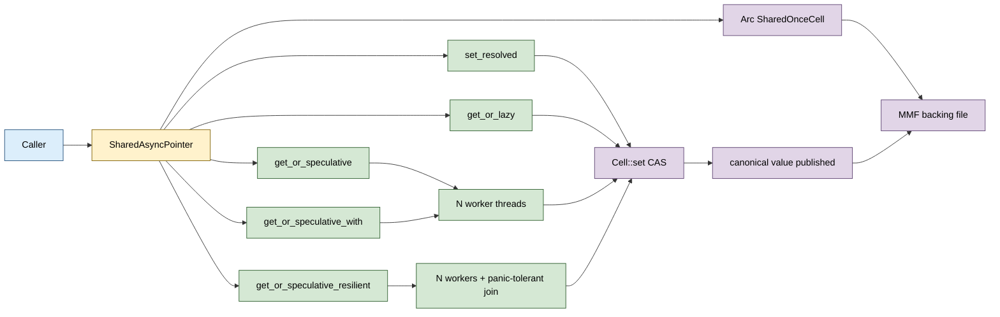

# SharedAsyncPointer&lt;T&gt;


Cross-process lazy / speculative resolution layered on
`SharedOnceCell<T>`. A `SharedAsyncPointer<T>` is initially EMPTY;
the first caller to publish a value (via any of the three strategies)
becomes the canonical owner. Losers in the publish race silently
discard their computed result. Every process that opens the same
backing file sees the same canonical value once published.

> **The "shared MMF-backed lazy/speculative cell" primitive.**
> Equivalent to `std::sync::OnceLock<T>` but cross-process via a
> memory-mapped file, AND with a speculative race variant that
> spawns N workers to redundantly compute the value with
> first-publisher-wins. The redundant-compute pattern targets
> survivability (any one worker can publish) and value-quality
> (the fastest result wins) more than wall-clock latency
> (see Known Limitations).

**Constraints (read first):**

- **Native sidecar integration**: the struct carries a `HandshakeHeader` + `ObservationRing` and implements `subetha_sidecar::AdaptiveInstance`. Wrap in `SidecarBox::new` to register with the global sidecar; raw `create()` / `open()` return the unregistered type unchanged.

- **`T: Copy + Send + Sync + 'static`.** The cell stores T by value
  in a fixed-size mapped slot; non-`Copy` types are not supported.
- **Backed by `SharedOnceCell<T>` over a memory-mapped file.** The
  underlying file is created or opened at construction; multiple
  processes can `open` the same path and share state.
- **First-publisher-wins, NOT first-finisher-wins.** Speculative
  workers race to publish via the cell's CAS; the first to CAS-in
  becomes canonical. The bench shows wall-clock time is bounded
  by the SLOWEST worker because the implementation joins all
  spawned threads before returning. See Known Limitations.
- **`get_or_lazy` runs the closure on the first `is_initialized`
  miss.** Multiple threads racing the same lazy cell may each
  run the closure once; only the first published value becomes
  canonical. The cell guarantees a single canonical value, NOT
  single-execution of the closure.
- **`get_or_speculative` panics if `n < 1`.**
- **`get_or_speculative_with` panics if the iterator yields no
  closures.**
- **Closures must satisfy `Send + 'static`.** They run on spawned
  threads. `get_or_speculative` additionally requires `Fn() -> T
  + Sync + Clone` because the closure is cloned to each worker.
- **`get_or_speculative_resilient` is the only variant that
  tolerates worker panics.** Panicking
  workers do not propagate the panic; if every worker panics
  AND nothing was published, returns `Err(AllWorkersDied)`.
- **No timeout / deadline knob.** A slow / hung worker blocks the
  enclosing call until it finishes (or panics into a join-ok). No
  cancellation primitive is exposed.
- **`flush_async` is partially-async on Windows.** Source rustdoc
  on the method notes that Windows only flushes to the page cache,
  not to durable storage. Real disk durability needs `flush`
  (synchronous `msync`).
- **The path's parent directory must exist before `create`.**
  `SharedOnceCell::create` does not auto-create parents.

---

## Table of contents

- [What it is](#what-it-is)
- [Three resolution strategies](#three-resolution-strategies)
- [Layout](#layout)
- [API at a glance](#api-at-a-glance)
- [Worked examples](#worked-examples)
- [Benchmark results](#benchmark-results)
- [Use case patterns](#use-case-patterns)
- [Known limitations (verified)](#known-limitations-verified)
- [Common pitfalls](#common-pitfalls)

---

## What it is

```rust
pub struct SharedAsyncPointer<T: Copy + Send + Sync + 'static> {
    cell: Arc<SharedOnceCell<T>>,
}
```

A thin wrapper around a memory-mapped `SharedOnceCell<T>`. The
cell starts empty and transitions to filled exactly once. The
wrapper adds three resolution strategies for the initial fill:

| Strategy | Method | Workers | Failover |
|---|---|---|---|
| Resolved | `set_resolved(value)` | n/a | n/a (value pre-set) |
| Lazy | `get_or_lazy(f)` | 1 (caller) | first caller to set wins |
| Speculative | `get_or_speculative(n, f)` | N (threads) | first-publisher-wins; losers discard |

Once the cell is filled, every subsequent call (any strategy)
returns the canonical value without re-running the closure. The
canonical value is visible to every process that has the file
mapped.

---

## Three resolution strategies

### Resolved

Pre-set the value. The first call wins; subsequent calls return
the cached value:

```rust
let sap: SharedAsyncPointer<u64> = SharedAsyncPointer::create(&path)?;
let won = sap.set_resolved(42);  // true if we won; false if pre-filled
assert_eq!(sap.try_get(), Some(42));
```

Use this when you have the value upfront and want to publish it
to other processes via the MMF.

### Lazy

The caller runs the closure; if the cell is empty, the result is
published. If another concurrent caller publishes first, the
caller's result is silently discarded (the canonical value
returned is the winner's):

```rust
let value = sap.get_or_lazy(|| {
    // potentially-expensive computation
    expensive_resolve()
});
```

Multiple threads racing `get_or_lazy` may each run the closure
once; the cell's CAS ensures only one published value is
canonical.

### Speculative

Spawn N workers that all independently run the closure; the first
to CAS-publish wins, the others discard their results. The CAS
protocol IS the coordination - no central coordinator needed:

```rust
// Same closure, N workers (all interchangeable).
let value = sap.get_or_speculative(4, || expensive_resolve());

// Per-worker closures (e.g. different backends).
let value = sap.get_or_speculative_with([
    Box::new(|| backend_a()),
    Box::new(|| backend_b()),
    Box::new(|| backend_c()),
]);

// Survivor-tolerant: panicking workers do not propagate.
let value: Result<T, _> = sap.get_or_speculative_resilient(4, || try_fetch());
```

The architectural use cases are survivability (any worker can
publish) and value selection (whichever finishes first
contributes the canonical value). The wall-clock latency does
NOT decrease (see Known Limitations).

---

## Layout



The `Arc<SharedOnceCell<T>>` is the synchronization point;
multiple `SharedAsyncPointer` handles in one process share the
Arc (they can be cloned via the cell pointer). Across processes,
each process's `SharedAsyncPointer::open(&path)` constructs an
independent Arc wrapping its own `SharedOnceCell` mapping, but
the underlying MMF file is the shared canonical store.

---

## API at a glance

```rust
use subetha_cxc::SharedAsyncPointer;

// Construct (create or open).
let sap: SharedAsyncPointer<u64> = SharedAsyncPointer::create(&path)?;
let sap2: SharedAsyncPointer<u64> = SharedAsyncPointer::open(&path)?;

// Peek without forcing resolution.
let v: Option<u64> = sap.try_get();
let resolved: bool = sap.is_resolved();

// Resolved strategy: pre-set the value.
let won: bool = sap.set_resolved(42);

// Lazy strategy: compute once if needed.
let v: u64 = sap.get_or_lazy(|| compute_value());

// Speculative strategy: N workers race.
let v: u64 = sap.get_or_speculative(4, || compute_value());

// Per-worker closures (heterogeneous backends).
let v: u64 = sap.get_or_speculative_with([
    Box::new(|| backend_a()),
    Box::new(|| backend_b()),
]);

// Survivor-tolerant.
let v: Result<u64, _> = sap.get_or_speculative_resilient(4, || risky_op());

// Flush to disk.
sap.flush()?;          // synchronous (msync)
sap.flush_async()?;    // partially-async (page-cache on Windows)
```

---

## Worked examples

### Cross-process speculative race for a fetched value

Process A:

```rust
let sap = SharedAsyncPointer::<u64>::create(&shared_path)?;
let v = sap.get_or_speculative(4, || fetch_from_backend());
// `v` is the fastest backend's result.
```

Process B (started later):

```rust
let sap = SharedAsyncPointer::<u64>::open(&shared_path)?;
// Cell already filled by process A; no work runs.
let v = sap.get_or_lazy(|| panic!("must not run"));
assert_eq!(v, ...);  // same value process A saw
```

The shared MMF carries the canonical value; process B sees it
without running any closure.

### Survivor-tolerant resolver with panicking workers

```rust
let result = sap.get_or_speculative_resilient(8, move || {
    // Maybe one of the workers panics due to a transient failure.
    let response = http_client.fetch(&url)?;
    response.parse_value()
});
match result {
    Ok(v) => use_value(v),
    Err(_) => fall_back_to_default(),
}
```

If 7 of 8 workers panic and one succeeds, the cell is filled and
the call returns `Ok(value)`. If all 8 panic, the cell stays empty
and the call returns `Err(AllWorkersDied)`.

---

## Benchmark results

Bench: `crates/subetha-cxc/benches/shared_async_pointer.rs`. Five
contender groupings.

### Resolved peek (pre-filled cell)

| Contender | Time | Notes |
|---|---|---|
| `shared_async.resolved_peek/mmf` | **9.84 ns** | Atomic load through MMF-backed cell. |
| `shared_async.resolved_peek/oncelock` | **9.87 ns** | `std::sync::OnceLock::get`. |

**Parity.** The MMF backing pays nothing extra over the in-memory
`OnceLock::get` for the pre-filled fast path. Both compile to a
single atomic load + branch.

### Lazy first compute (no contention)

| Contender | Time | Notes |
|---|---|---|
| `shared_async.lazy_first_compute/mmf` | **263 us** | MMF: file create + set + flush + cleanup. |
| `shared_async.lazy_first_compute/oncelock` | **60.7 ns** | In-memory: closure + atomic store. |

**The MMF path is dominated by file I/O setup.** The 263 us
figure measures `create + write + cleanup` of a temp file; the
actual `get_or_lazy` body (closure + CAS) is a small fraction.
For the apples-to-apples cell-write cost, callers should re-use
the same `SharedAsyncPointer` across many gets (the file is
created once, queried many times).

### Speculative N=2 with 20 ms / 2 ms hedge workload

| Contender | Time | Notes |
|---|---|---|
| `shared_async.speculative_2_hedged/mmf` | **21.07 ms** | Spawn 2 workers (one 20 ms, one 2 ms); wait both. |
| `shared_async.speculative_2_hedged/sequential_slow` | **20.44 ms** | Just take the slow path (no hedging). |
| `shared_async.speculative_2_hedged/sequential_fast` | **2.47 ms** | Oracle: knew which path was fast. |

**The honest finding** (and the most important number in this
doc): the speculative race takes ~21 ms, not ~2.5 ms. The fast
worker DOES publish first (the canonical value is the fast
worker's `100`), but the implementation joins ALL spawned
threads before returning. Wall-clock latency is bounded by the
SLOWEST worker.

The rustdoc on the module suggests "Latency hedging: race 2-3
backend lookups, take the fastest". The current implementation
provides the value-quality guarantee (you get the fast worker's
result) but NOT the wall-clock guarantee (you wait for the slow
worker to finish). See Known Limitations.

### Speculative N=4 same-speed workers (overhead vs lazy)

| Contender | Time | Notes |
|---|---|---|
| `shared_async.speculative_4_same/mmf` | **3.12 ms** | 4 workers each running 2 ms work in parallel. |
| `shared_async.speculative_4_same/lazy_single` | **2.65 ms** | 1 worker running 2 ms work. |

**Overhead: ~470 us for 4-way thread spawn + join.** The 4
workers run their 2 ms work in parallel (otherwise the bench
takes 8 ms), so the extra time is purely thread-management
overhead. For workloads dominated by the closure cost, the
speculative path is essentially free vs lazy.

---

## Use case patterns

| Pattern | Use SharedAsyncPointer for | Why |
|---|---|---|
| **Cross-process lazy init** | One value, computed once, visible everywhere | Mapped file plus single-publisher CAS. |
| **Fault-tolerant fetch** | Speculative race with `_resilient` | Surviving workers publish; panicking workers do not. |
| **Value-quality race** | Speculative race with different backends | First publisher wins; you get whichever backend was fastest. |
| **Shared computed config** | Set once at startup, read everywhere | `set_resolved` + cross-process `open`. |
| **Persistent memoization** | Lazy compute, persist to disk | The MMF survives process restart; subsequent processes see the cached value. |

**Do NOT use for:**

- **Mutable values.** The cell is write-once; for mutable shared
  state use `SharedRing`, `SharedHashMap`, or a different
  primitive.
- **Wall-clock latency hedging.** As shipped, the speculative
  race waits for all workers.
- **Bounded-time fetches.** No timeout is exposed; a hung worker
  blocks the call indefinitely.

---

## Known limitations (verified)

All confirmed against the source or the bench:

- **Speculative race waits for ALL workers** (the join-all loop
  at the end of each `get_or_speculative*` method). The
  "first-publisher-wins" CAS determines which
  VALUE becomes canonical, but the call does not return until
  every spawned thread has joined. Bench evidence:
  speculative_2_hedged is 21 ms with 20 ms slow + 2 ms fast
  workers, not 2.5 ms. The module-level rustdoc mentions
  "Latency hedging" which is misleading at this protocol shape.
- **No timeout / deadline.** Source has no method that bounds
  the wait. A hung worker blocks until OS-level intervention.
- **No cancellation.** Stoping the race once a publisher has won
  requires the workers to voluntarily check `cell.is_initialized()`
  (the implementation does this at the TOP of each worker, but
  not mid-closure). Inside the user-supplied closure, the
  speculation cannot be canceled.
- **Closure cloning for `get_or_speculative`.** Its bound
  `Fn() -> T + Send + Sync + 'static + Clone` means the
  closure is cloned N times. Heavy state captured by the closure
  is duplicated per worker.
- **`flush_async` is sync-to-page-cache on Windows.** Source
  rustdoc on `flush_async`. Real durable persistence requires
  `flush` (synchronous `msync`).
- **No support for non-`Copy` T.** The struct bound is
  `T: Copy + Send + Sync + 'static`. Heavy/large values must be
  stored elsewhere (e.g. in a `SharedRegion`) and the cell holds
  an offset.
- **The MMF file persists across process restarts.** Until the
  caller manually deletes the file (or wraps it with
  `tempfile::NamedTempFile` etc.), the value survives. This is
  intentional for memoization use cases but a surprise for
  callers expecting per-process semantics.

---

## Common pitfalls

- **Don't expect the speculative race to reduce wall-clock
  latency.** As shipped, you get the fast worker's VALUE but
  pay the slow worker's TIME. Use a different pattern (e.g.,
  spawn workers + check `try_get` in a loop with a timeout) if
  you need wall-clock hedging.
- **Don't share a `SharedAsyncPointer` across threads without
  `Arc`.** The struct is `Send + Sync` (via `Arc<SharedOnceCell>`)
  but cloning the wrapper requires explicit `Arc<SharedAsyncPointer>`
  or constructing a fresh handle via `open(&path)`.
- **Don't ignore the return of `set_resolved`.** It returns `true`
  if you won the init race; `false` means the cell was already
  filled (your value was silently discarded).
- **Don't call `get_or_lazy` with side-effecting closures.** The
  closure may run multiple times across racing threads (only one
  result becomes canonical, but the others did execute). Idempotent
  closures only.
- **Don't put a `&` reference inside the closure (`get_or_speculative`).**
  The closure must be `'static`. Capture by clone or by
  `Arc`-wrapped reference instead.
- **Don't use `_resilient` to mask correctness bugs.** Panicking
  workers are silently absorbed; if every panic indicates a bug,
  you'll get `AllWorkersDied` and no diagnostic about WHY they
  panicked. Log inside the closure to retain context.
- **Don't reuse the same MMF path across unrelated processes
  without coordination.** The first to `create` wins; later
  processes must `open`. Mismatched `create / open` calls can
  produce confusing errors.

---
