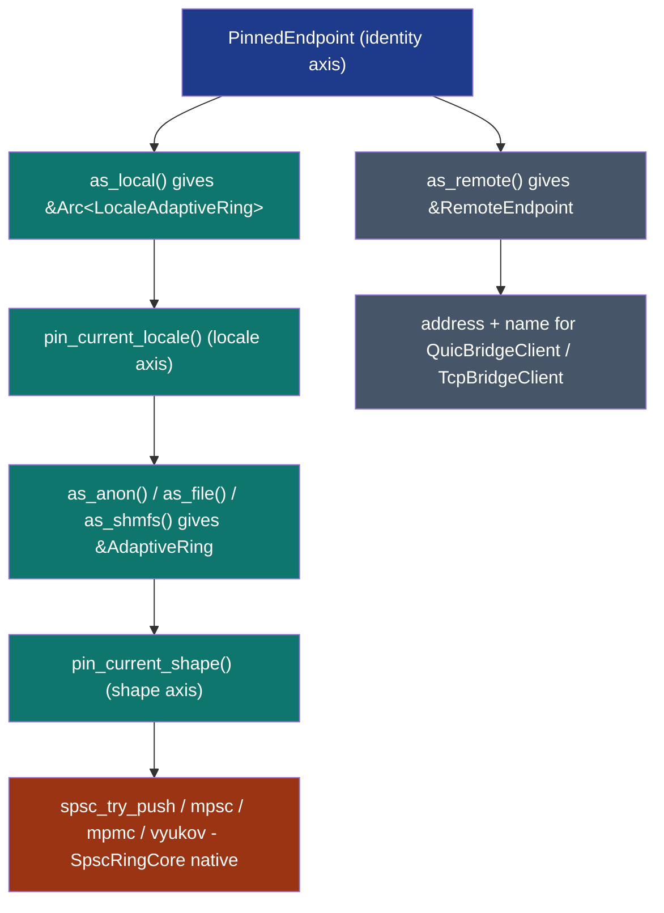

# VirtualEndpoint + VirtualEndpointRegistry


Substrate-level endpoint identity that resolves to either a local
[`LocaleAdaptiveRing`](../../rings/locale-adaptive-ring/) or a
remote address at runtime. Lets application code call
`endpoint.pin_current_target()` -> `as_local()` / `as_remote()`
without grepping config for "is this peer local or remote".

## Types

| Type | Role |
|---|---|
| `EndpointId(pub u64)` | Application-supplied opaque endpoint id. |
| `EndpointTarget` | Enum: `Local(Arc<LocaleAdaptiveRing>)` or `Remote(RemoteEndpoint)`. |
| `RemoteEndpoint` | `{ server_addr: SocketAddr, server_name: String }`. |
| `VirtualEndpointRegistry` | Process-local registry mapping id -> target. Atomic generation counter. |
| `VirtualEndpoint` | Holds `Arc<VirtualEndpointRegistry>` + `EndpointId`. |
| `PinnedEndpoint<'_>` | Pinned snapshot of an endpoint's target. `Send` but `!Sync` (via `PhantomData<Cell<()>>` marker). |

## Constructors + lifecycle

| Call | Behavior |
|---|---|
| `VirtualEndpointRegistry::new()` | Empty registry, generation = 0. |
| `registry.bind(id, target)` | Insert / replace; bumps generation. |
| `registry.unbind(id) -> Option<EndpointTarget>` | Remove; bumps generation if present. |
| `registry.lookup(id) -> Option<EndpointTarget>` | Read; returns a clone. |
| `registry.generation() -> u64` | Acquire load. |
| `registry.len() -> usize` / `is_empty()` | Count active bindings. |
| `VirtualEndpoint::bind(registry, id, target)` | Calls `registry.bind` + returns a handle. |
| `VirtualEndpoint::attach(registry, id) -> Option<Self>` | Handle for an existing binding. |
| `endpoint.id() -> EndpointId` | The endpoint's id. |
| `endpoint.pin_current_target() -> Option<PinnedEndpoint<'_>>` | Snapshot the target. |

## Pin semantics

`PinnedEndpoint::is_still_valid()` is one Acquire load on the
registry's generation counter. The check is **registry-wide**:
ANY bind / unbind / rebind on ANY endpoint in the registry bumps
the generation, so all outstanding pins see invalidation. This is
intentional: one Acquire-load per validity check vs per-endpoint
generation tracking. Callers pinning many endpoints in a tight
loop trade a small false-positive re-acquire rate for a cheaper
validity check.

## Pin composition



Five composable axis levels under one substrate-level identifier.

## Worked example

```rust,no_run
use std::sync::Arc;
use subetha_cxc::virtual_endpoint::{
    EndpointId, EndpointTarget, RemoteEndpoint,
    VirtualEndpoint, VirtualEndpointRegistry,
};
use subetha_cxc::LocaleAdaptiveRing;

let registry = Arc::new(VirtualEndpointRegistry::new());
let local = Arc::new(LocaleAdaptiveRing::create("/tmp/lar", 1, 1, 64)?);
local.register_producer()?;
local.register_consumer()?;

let endpoint = VirtualEndpoint::bind(
    registry.clone(),
    EndpointId(42),
    EndpointTarget::Local(local),
);

let pin = endpoint.pin_current_target().expect("pinned");
let ring = pin.as_local().expect("local target");
// pin is_still_valid() returns false on any rebind/unbind in the registry.

// Rebind to a remote target; pin invalidates.
registry.bind(EndpointId(42), EndpointTarget::Remote(RemoteEndpoint {
    server_addr: "127.0.0.1:8080".parse().unwrap(),
    server_name: "peer".to_string(),
}));
assert!(!pin.is_still_valid());
# Ok::<(), Box<dyn std::error::Error>>(())
```

## E2E proof

[`examples/virtual_endpoint_lifecycle.rs`](https://github.com/Variably-Constant/subetha/blob/main/crates/subetha-cxc/examples/virtual_endpoint_lifecycle.rs)
walks the full five-axis pin chain end-to-end across two local
targets + one remote target; deterministic integrity across 3
runs.

## When to reach for this primitive

- Application code wants one substrate-level addressing surface
  that covers both same-host and cross-host peers.
- The local vs remote decision lives outside the application
  (config, service discovery, runtime policy).

## When NOT to reach for this

- All peers are statically local AND the application holds the
  `Arc<LocaleAdaptiveRing>` directly.
- The endpoint table is single-binding (a `VirtualEndpoint` for
  one peer adds indirection without flexibility).

`PinnedEndpoint` also exposes `id()` and `pinned_generation()` alongside
`is_still_valid()` / `as_local()` / `as_remote()`. There is no `send()` method:
callers dispatch on the pinned target themselves (a local ring's `try_send` or
a bridge client for the remote address).

## References

- Source: `crates/subetha-cxc/src/virtual_endpoint.rs` (367 lines, 7
  unit tests: bind+lookup, rebind-bumps-generation, pin-invalidates-on-rebind,
  pin-invalidates-on-unbind, plus attach / remote-target / multi-endpoint
  coverage). The registry is process-local (`RwLock<HashMap>` + atomic
  generation), not MMF-backed; `virtual_endpoint` is a `pub mod`.
- [`LocaleAdaptiveRing`](../../rings/locale-adaptive-ring/) - the
  local-target type that PinnedEndpoint chains into.
- [`QuicBridgeClient` / `QuicBridgeServer`](../../bridges/quic-bridge/),
  [`TcpBridgeClient` / `TcpBridgeServer`](../../bridges/tcp-bridge/) -
  consume RemoteEndpoint addresses for cross-host transport.
- [Polymorphic substrate design doc](https://github.com/Variably-Constant/subetha/blob/main/docs/POLYMORPHIC_SUBSTRATE_AXES.md).
