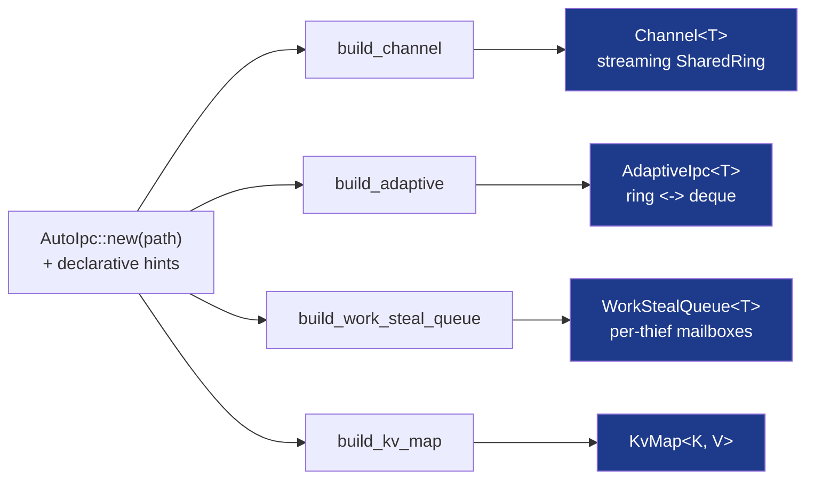

# AutoIpc, Channel, AdaptiveIpc


The front door to the crate. `AutoIpc` is a builder that reads a few
declarative hints, infers the workload shape, and hands back one typed
handle backed by the empirically-best MMF primitive. The file path is
the channel: the same handle works cross-thread (two threads map the
same file), cross-process (two processes open it and the kernel
page-aliases them), and disk-persistent (the file survives a restart).

```rust
use subetha_cxc::AutoIpc;

let chan = AutoIpc::new("/tmp/events.bin")
    .capacity(64)
    .build_channel::<u64>()?;

chan.send(&42)?;            // non-blocking
let v = chan.recv()?;       // -> 42
```



## The `AutoIpc` builder

`AutoIpc::new(path)` starts with these defaults: 1 producer, 1
consumer, no batch hint, capacity 64, per-producer ordering, no
auto-order threshold. Each method below is a chained hint; the
terminal `build_*` call infers the shape and constructs the handle.

| Method | Effect |
|---|---|
| `new(path)` | Start an endpoint at `path` (anything `Into<PathBuf>`). |
| `producers(n)` | Number of producers expected to push concurrently (clamped to `>= 1`). |
| `consumers(n)` | Number of consumers expected to drain concurrently (clamped to `>= 1`). |
| `batch_size(k)` | Hint that the producer publishes batches of `k`; this is what flips a single-producer streaming workload into work-stealing routing. |
| `idle_wait(on)` | Hint that consumers idle-wait between batches (WAITPKG on capable silicon, PAUSE-spin otherwise). |
| `capacity(n)` | Ring slot capacity, clamped to `>= 2` and rounded to the next power of two. |
| `ordering(ordering)` | Declare the ordering requirement. `GlobalFifo` pins inference to the streaming family and, through `build_adaptive`, turns on the stamped merge. |
| `auto_order(threshold)` | Pre-authorize automatic global-FIFO when observed cross-producer inversions per second exceed `threshold`. Effective through `build_adaptive`. |
| `inferred_shape()` | The `MmfWorkloadShape` the hints resolve to (no construction). |
| `inferred_family()` | The `MmfFamily` pick (informational; no construction). |

### Terminals

| Terminal | Returns | Routes here when |
|---|---|---|
| `build_channel::<T>()` | [`Channel<T>`](#channelt) | streaming MPMC (the default; no batch hint). `WrongFamily` if the inference resolves elsewhere. |
| `build_adaptive::<T>()` | [`AdaptiveIpc<T>`](#adaptiveipct) | a migrating endpoint with the ordering axis wired through the stamped ring. |
| `build_work_steal_queue::<T>()` | `WorkStealQueue<T>` | forces work-stealing routing. `WrongFamily` if `GlobalFifo` ordering was declared. |
| `build_kv_map::<K, V>()` | `KvMap<K, V>` | key-value access (declared by calling this terminal). |

The inference is observable before you build. `.batch_size(64)` flips to
work-stealing, `.consumers(4)` widens to streaming MPMC, no shape hint
is one-to-one streaming. `inferred_shape()` returns the resolved
`MmfWorkloadShape` so a caller can assert the route.

## `Channel<T>`

A streaming MPMC channel over `SharedRing`. One handle answers three
calling conventions; async is a convention, not a second type.

| Convention | Send | Recv | Behavior |
|---|---|---|---|
| Sync | `send(&item) -> Result<(), ApiError>` | `recv() -> Result<T, ApiError>` | Non-blocking. Returns `Full` / `Empty` immediately. |
| Blocking | `send_blocking(&item, timeout) -> Result<(), ApiError>` | `recv_blocking(timeout) -> Result<T, ApiError>` | Parks the calling thread until there is room / an item. `timeout: Option<Duration>`; `None` waits indefinitely. |
| Async | `send_async(&item) -> SendFut` | `recv_async() -> RecvFut` | Suspends the task. The futures resolve to `Result<(), ApiError>` / `Result<T, ApiError>` and run on any executor. |

`Channel::create(path, shape, capacity)` and `Channel::open(path,
capacity)` construct directly when you already know the shape;
`family()` reports the `MmfFamily` chosen at construction.

## `AdaptiveIpc<T>`

The migrating endpoint: it starts as a ring and morphs between ring and
work-stealing deque as the observed traffic shape changes. It answers
the same three conventions as `Channel`, plus shape-aware extras.

| Method | Purpose |
|---|---|
| `send(&item)` / `recv()` | Sync send / recv (`Result`). |
| `send_u64(item)` | Specialized `u64` send; collapses the marshal branch to a direct ring push. |
| `send_batch(items)` | Push a slice in one call. A batch of ≥ 2 items whose payload is ≤ 16 bytes publishes through a KHL deque (three items per cache-line write), drained transparently by `recv`; larger payloads take the per-item path. |
| `send_blocking(&item, timeout)` / `recv_blocking(timeout)` | Thread-parking send / recv. |
| `send_async(&item)` / `recv_async()` | Task-suspending send / recv (`AdaptiveSendFut` / `AdaptiveRecvFut`). |
| `active_family()` | The family the endpoint is currently morphed to. |
| `migrate_to(family)` | Force a migration to a target family. |
| `maybe_promote()` | Promote based on the observed profile; returns the new family if it changed. |
| `set_ordering(ordering)` / `ordering()` | Read or change the stamped-merge ordering. |
| `profile_snapshot()` | A snapshot of the observed batch / inversion profile. |

## Worked example: one handle, three conventions

```rust
use std::sync::Arc;
use subetha_cxc::reactor::block_on;
use subetha_cxc::AutoIpc;

let chan = Arc::new(
    AutoIpc::new("/tmp/events.bin")
        .producers(4)
        .consumers(4)
        .capacity(1024)
        .build_channel::<u64>()?,
);

// Sync.
chan.send(&1)?;
let _ = chan.recv()?;

// Blocking (parks the thread).
chan.send_blocking(&2, None)?;
let _ = chan.recv_blocking(None)?;

// Async (suspends the task), on the crate's runtime-free block_on.
block_on(async {
    chan.send_async(&3).await?;
    let _ = chan.recv_async().await?;
    Ok::<_, subetha_cxc::ApiError>(())
})?;
```

## E2E proof

[`examples/channel_async.rs`](https://github.com/Variably-Constant/subetha/blob/main/crates/subetha-cxc/examples/channel_async.rs)
drives both front doors - `build_channel` -> `Channel<u64>` and
`build_adaptive` -> `AdaptiveIpc<u64>` - through all three conventions,
pushing 300,000 items through each endpoint split evenly across sync,
blocking, and async, and asserts the summed integrity. It is the
load-bearing proof that async is a calling convention on the one
handle, not a parallel surface.

## See also

- [Async engine](async-engine.md): `block_on`, the
  cross-process reactor bridge, `RingExecutor`, `TaskPool`, and
  `WakerRing` that drive the async conventions.
- [Async: cost and scaling](../../how-to/async-paths.md): when to use
  each convention, with the measured overhead and fan-out scaling.
- [Async SPSC Ring](rings/async-spsc-ring.md): the
  `Future` adapter over a single `BlockingSpscRing`.
- [SharedRing](rings/shared-ring.md): the streaming
  primitive `Channel` is built on.
