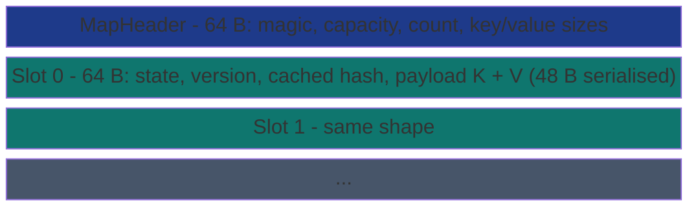

# SharedHashMap&lt;K, V&gt;


-informational)

Cross-process open-addressing hash map. All storage inline (no
allocator, no pointer indirection). Each slot is a 64-byte cache
line. Hash is FNV-1a (deterministic across processes, runs, and
OSes; std's BuildHasher uses a per-process random seed which
makes keys irreproducible).

> **The "cross-process HashMap without allocator coupling"
> primitive.** Get hits at 16.78 ns vs Mutex<HashMap> 29.41 ns
> (1.75x faster - lock-free reads). Insert is slower than a
> Mutex<HashMap> insert (linear-probe + SeqLock overhead), but
> cross-process visibility is the architectural lever.

**Constraints (read first):**

- **`K + V: Copy + 'static`, fixed payload** packed into 48 bytes
  (`MAP_PAYLOAD_BYTES`).
- **FNV-1a hash** (rustdoc lines 14-18): deterministic across
  processes / OSes / runs. std's BuildHasher uses random seed and
  cannot serve cross-process.
- **Linear probing** (rustdoc lines 6-12): each slot is one cache
  line; sequential access dominates probe-variance on
  speculative-prefetch CPUs.
- **Per-slot SeqLock** (rustdoc line 30): version field per slot
  drives the read protocol; a torn read retries.
- **State per slot**: EMPTY / OCCUPIED / TOMBSTONE.
- **Capacity fixed at create**: no auto-grow.
- **Cross-process backed by MMF.**
- **Native sidecar integration**: the struct carries a `HandshakeHeader` + `ObservationRing` and implements `subetha_sidecar::AdaptiveInstance`. Wrap in `SidecarBox::new` to register with the global sidecar; raw `create()` / `open()` return the unregistered type unchanged.

---

## Table of contents

- [What it is](#what-it-is)
- [Insert / Get protocol](#insert-get-protocol)
- [Bench evidence](#bench-evidence)
- [Worked examples](#worked-examples)
- [Use case patterns](#use-case-patterns)
- [Known limitations](#known-limitations)
- [Common pitfalls](#common-pitfalls)
- [References](#references)

---

## What it is

`SharedHashMap<K, V>` is an MMF-backed open-addressing hash map:



Each slot is 64 bytes (one cache line): state + version + cached
hash + payload (K + V serialised in 48 bytes).

---

## Insert / Get protocol

### Insert

1. Hash key (FNV-1a).
2. Probe linearly from `hash % capacity`.
3. At each slot:
   - **Empty**: CAS state Empty -> Occupied; SeqLock-write (K, V) +
     hash; bump count. Return Inserted.
   - **Occupied + hash matches + key matches**: SeqLock-update V.
     Return Updated.
   - **Occupied + no match**: probe next slot.
   - **Tombstone**: track first tombstone; use it preferentially
     if no live match found in the probe chain.

### Get

1. Hash key.
2. Linear-probe from `hash % capacity`.
3. At each slot:
   - **Empty**: not found.
   - **Occupied + hash matches + key matches**: SeqLock-read V;
     return Some(V).
   - **Tombstone or no-match**: continue probing.

---

## Bench evidence

Bench harness: `crates/subetha-cxc/benches/shared_hash_map.rs`.
Captured 2026-06-01 on Windows 11 / Zen+ R7 2700, Criterion with
`--sample-size=15 --warm-up-time=1 --measurement-time=2`.

| Op | `SharedHashMap` (mmf) | `Mutex<HashMap>` | `RwLock<HashMap>` |
|---|---:|---:|---:|
| insert | 68.60 ns | 33.92 ns | 32.52 ns |
| get | 16.78 ns | 29.41 ns | 28.51 ns |
| len | 991 ps | (atomic load equivalent) | n/a |

**Get wins 1.75x** vs Mutex<HashMap> (lock-free reads). **Insert
loses 2.1x** (linear-probe + SeqLock + FNV overhead vs Mutex's
single CAS + std::HashMap's optimized insert).

### Reading the trade-offs

The architectural shape (open-addressing + per-slot SeqLock +
deterministic FNV) optimizes for read-heavy cross-process
workloads. Insert-heavy in-process workloads are better served
by `RwLock<HashMap>`. The cross-process capability is the strict
architectural lever.

### Rule 3b bench audit

- **Fair contenders**: `Mutex<HashMap>` and `RwLock<HashMap>` are
  the textbook in-process baselines.
- **Same key/value type** (u64/u64) across all variants.
- **MMF lifecycle managed**.

### What the numbers do NOT show

- **Cross-process get throughput**: each process can read the same
  map concurrently with no lock acquire.
- **Multi-thread insert contention on the SAME slot**: the CAS
  protocol handles it via retry; the bench is single-threaded.

---

## Worked examples

### Cross-process key-value store

```rust
use subetha_cxc::shared_hash_map::SharedHashMap;

// Process A:
let m: SharedHashMap<u64, u64> = SharedHashMap::create("/tmp/kv.bin", 1024).unwrap();
m.insert(42, 100);
m.insert(99, 200);

// Process B:
let m: SharedHashMap<u64, u64> = SharedHashMap::open("/tmp/kv.bin", 1024).unwrap();
assert_eq!(m.get(&42), Some(100));
```

### Pre-populated lookup table

```rust
use subetha_cxc::shared_hash_map::SharedHashMap;

let table: SharedHashMap<u64, u64> = SharedHashMap::create("/tmp/lookup.bin", 4096).unwrap();
for (k, v) in standard_lookup_pairs() {
    table.insert(k, v);
}
table.flush().unwrap();

// Subsequently, any process can SharedHashMap::open and read.
```

---

## Use case patterns

### Pattern: cross-process configuration / registry

Daemon writes; workers read. Read-heavy workload favors the
lock-free read path.

### Pattern: distributed-counter side-table

Counters indexed by entity ID, shared across processes. Inserts
rare (one per new entity); reads frequent.

### Pattern: hot path lookup

Pre-populated table at startup; subsequent ops are reads only.
The 16.78 ns get latency is competitive with in-process maps.

---

## Known limitations

- **Capacity fixed at create**: no auto-grow.
- **Payload size capped at 48 bytes per slot**: larger K/V need
  pointer indirection.
- **FNV-1a is not DoS-resistant**: adversarial input can collide
  the hash. Use only for trusted keys.
- **Insert is slower than in-process baselines** (~2x): the
  open-addressing + SeqLock overhead doesn't pay back unless
  cross-process visibility is needed.
- **No iterator API**: random-access by key only.
- **Cross-process backed by MMF.**

---

## Common pitfalls

- **Treating SharedHashMap as a drop-in for std::HashMap.** It
  has fixed capacity and slower inserts; the architectural lever
  is cross-process visibility.

- **Using non-deterministic-hash K types.** K bytes are hashed
  via FNV-1a; types with internal padding or differing layouts
  across runs see hash mismatch.

- **Tombstone buildup degrading probe chains.** A delete-heavy
  workload accumulates tombstones until inserts probe through
  them. There is no automatic compaction in the shipped primitive.

- **Wrapping in a Mutex.** Pointless; the SeqLock + CAS protocol
  is already concurrency-safe.

---

## References

- Source: `crates/subetha-cxc/src/shared_hash_map.rs`.
- Bench: `crates/subetha-cxc/benches/shared_hash_map.rs` (insert, get,
  len vs Mutex<HashMap> and RwLock<HashMap> baselines).
- Sibling primitive: [SHARED_HANDLE_TABLE.md](../arenas/shared-handle-table/) -
  handle-keyed counterpart with generation-parity safe-after-free.
- Sibling primitive: [SHARED_CELL.md](../cells/shared-cell/) - the
  underlying per-slot SeqLock primitive.
