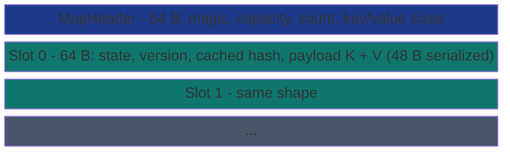

# SharedHashMap&lt;K, V&gt;


-informational)

Cross-process open-addressing hash map. All storage inline (no
allocator, no pointer indirection). Each slot is a 64-byte cache
line. Hash is FNV-1a (deterministic across processes, runs, and
OSes; std's BuildHasher uses a per-process random seed which
makes keys irreproducible).

> **The "cross-process HashMap without allocator coupling"
> primitive.** Get hits at 16.78 ns vs Mutex<HashMap> 29.41 ns
> (1.75x faster - lock-free reads). Insert is slower than a
> Mutex<HashMap> insert (linear-probe + SeqLock overhead), but
> cross-process visibility is the architectural lever.

**Constraints (read first):**

- **`K + V: Copy + 'static`, fixed payload** packed into 48 bytes
  (`MAP_PAYLOAD_BYTES`).
- **FNV-1a hash** (rustdoc lines 14-18): deterministic across
  processes / OSes / runs. std's BuildHasher uses random seed and
  cannot serve cross-process.
- **Linear probing** (rustdoc lines 6-12): each slot is one cache
  line; sequential access dominates probe-variance on
  speculative-prefetch CPUs.
- **Per-slot SeqLock** (rustdoc line 30): version field per slot
  drives the read protocol; a torn read retries.
- **State per slot**: EMPTY / OCCUPIED / TOMBSTONE.
- **Capacity fixed at create**: no auto-grow.
- **Cross-process backed by MMF.**
- **`create` obtains, `reset` truncates**: `create(path, capacity)` initializes an empty map only when the path does not yet exist, and otherwise attaches with live entries intact - racing creators all reach the same map, with exactly one initializing it. A region built with a different capacity or K/V layout is a `LayoutMismatch`. `reset(path, capacity)` truncates and reinitializes, for a caller that owns the path; on Windows it succeeds only once every process has unmapped the region.
- **Native sidecar integration**: the struct carries a `HandshakeHeader` + `ObservationRing` and implements `subetha_sidecar::AdaptiveInstance`. Wrap in `SidecarBox::new` to register with the global sidecar; raw `create()` / `open()` return the unregistered type unchanged.

---

## Table of contents

- [What it is](#what-it-is)
- [Insert / Get protocol](#insert--get-protocol)
- [Bench evidence](#bench-evidence)
- [Worked examples](#worked-examples)
- [Use case patterns](#use-case-patterns)
- [Known limitations](#known-limitations)
- [Common pitfalls](#common-pitfalls)
- [References](#references)

---

## What it is

`SharedHashMap<K, V>` is an MMF-backed open-addressing hash map:


```mermaid
block-beta
  columns 1
  hdr["MapHeader - 64 B: magic, capacity, count, key/value sizes"]
  s0["Slot 0 - 64 B: state, version, cached hash, payload K + V (48 B serialized)"]
  s1["Slot 1 - same shape"]
  dots["..."]
  classDef hdrC fill:#1e3a8a,color:#ffffff
  classDef slotC fill:#0f766e,color:#ffffff
  classDef padC fill:#475569,color:#ffffff
  class hdr hdrC
  class s0,s1 slotC
  class dots padC
```

Each slot is 64 bytes (one cache line): state + version + cached
hash + payload (K + V serialized in 48 bytes).

---

## Insert / Get protocol

### Insert

1. Hash key (FNV-1a; a hash of 0 becomes 1, since 0 marks a slot
   whose contents are not yet published).
2. Read the header's removal count, then probe linearly from
   `hash % capacity`.
3. At each slot:
   - **Empty**: the key is absent. CAS the first tombstone passed,
     else this Empty, to Occupied. If the removal count has moved since
     step 2, give the slot back as a tombstone and start again;
     otherwise SeqLock-write (K, V), then store the hash as the
     publish; bump count. Return Inserted.
   - **Occupied + hash 0**: a writer holds the slot and has not
     published it. Wait for the hash, then compare; a claim given back
     is a tombstone.
   - **Occupied + hash matches + key matches**: take the slot's lock,
     confirm it is still the key's published entry, write V, release.
     Return Updated. An entry removed in between sends the probe back
     to step 2.
   - **Occupied + no match**: probe next slot.
   - **Tombstone**: track the first one and keep probing. A tombstone
     claim another writer wins restarts the probe, because what that
     writer placed may be this key.

`insert_if_absent` runs the same probe and, on a present key, returns
the value found without writing. `swap` runs it too and returns the
value it replaced, read and overwritten under the slot's lock.
`compare_exchange` finds the key's slot, takes its lock, confirms it is
still the key's published entry, compares the stored value byte for
byte with `expected`, and writes `new` only on a match; a differing
value comes back as `Err(current)` and an absent key as
`MapError::KeyAbsent`.

### Get

1. Hash key.
2. Linear-probe from `hash % capacity`.
3. At each slot:
   - **Empty**: not found.
   - **Occupied + hash 0**: forming; wait for the publish.
   - **Occupied + hash matches + key matches**: SeqLock-read V;
     return Some(V).
   - **Tombstone or no-match**: continue probing.

### Remove

Find the key, take its slot's lock and confirm it is still the key's
published entry, bump the removal count, CAS state Occupied ->
Tombstone, and clear the hash to 0 so a later claim of the slot reads
as forming from its first instant. The value returned is the one the
entry held when it went.

### Why the hash is the publish

A slot is claimed by one CAS on its state byte, and its contents land
afterward. A prober that read the hash before the payload landed
would conclude a different key lived there, probe on, and plant the
same key in a second slot - two writers racing `insert_if_absent` on
one absent key would do exactly that. Publishing the hash last, and
waiting on a hash of 0, is what makes the claim and the contents one
event to every other prober. Every writer takes a slot's SeqLock by
CAS even -> odd, so two writers updating one key take turns rather
than overlapping.

A walk is held to the same rule. `SharedHashMap::snapshot`, and
`RawHashMap::next_entry` behind it, pass over a slot that is claimed
and not yet published, rather than handing back its zeroed payload -
which is what a lookup for that key already does by waiting on a hash
of 0.

### Why a remove is counted

Two inserts of one new key meet at the first Empty or first tombstone
of the key's chain, where one CAS decides between them. A remove during
their walks breaks that: it can open a slot one insert has already
passed, the other insert claims it, and the first claims further on, so
the key lands twice and a later remove brings the other copy back. A
remove therefore bumps the header's removal count before its tombstone
lands, and an insert whose claim finds the count moved since its walk
began gives the claim back and walks again, which brings it to the
other insert's entry.

Every write to a published entry (an update, `swap`,
`compare_exchange`, `remove`) takes the slot's lock and confirms the
state, hash and key under it. Between a hash matching and the lock, a
remove and another key's claim can take the slot; a write that checked
first and locked second would land on that other key's entry. Under
the lock it acts on the entry it matched or on nothing, so a value
leaves the map exactly once.

---

## Bench evidence

Bench harness: `crates/subetha-cxc/benches/shared_hash_map.rs`.
Captured 2026-06-01 on Windows 11 / Zen+ R7 2700, Criterion with
`--sample-size=15 --warm-up-time=1 --measurement-time=2`.

| Op | `SharedHashMap` (mmf) | `Mutex<HashMap>` | `RwLock<HashMap>` |
|---|---:|---:|---:|
| insert | 68.60 ns | 33.92 ns | 32.52 ns |
| get | 16.78 ns | 29.41 ns | 28.51 ns |
| len | 991 ps | (atomic load equivalent) | n/a |

**Get wins 1.75x** vs Mutex<HashMap> (lock-free reads). **Insert
loses 2.1x** (linear-probe + SeqLock + FNV overhead vs Mutex's
single CAS + std::HashMap's optimized insert).

### Reading the trade-offs

The architectural shape (open-addressing + per-slot SeqLock +
deterministic FNV) optimizes for read-heavy cross-process
workloads. Insert-heavy in-process workloads are better served
by `RwLock<HashMap>`. The cross-process capability is the strict
architectural lever.

### Rule 3b bench audit

- **Fair contenders**: `Mutex<HashMap>` and `RwLock<HashMap>` are
  the textbook in-process baselines.
- **Same key/value type** (u64/u64) across all variants.
- **MMF lifecycle managed**.

### What the numbers do not show

- **Cross-process get throughput**: each process can read the same
  map concurrently with no lock acquire.
- **Multi-thread insert contention on the same slot**: the CAS
  protocol handles it via retry; the bench is single-threaded.

---

## Worked examples

### Cross-process key-value store

```rust
use subetha_cxc::shared_hash_map::SharedHashMap;

// Process A:
let m: SharedHashMap<u64, u64> = SharedHashMap::create("/tmp/kv.bin", 1024).unwrap();
m.insert(42, 100);
m.insert(99, 200);

// Process B:
let m: SharedHashMap<u64, u64> = SharedHashMap::open("/tmp/kv.bin", 1024).unwrap();
assert_eq!(m.get(&42), Some(100));
```

### Pre-populated lookup table

```rust
use subetha_cxc::shared_hash_map::SharedHashMap;

let table: SharedHashMap<u64, u64> = SharedHashMap::create("/tmp/lookup.bin", 4096).unwrap();
for (k, v) in standard_lookup_pairs() {
    table.insert(k, v);
}
table.flush().unwrap();

// Subsequently, any process can SharedHashMap::open and read.
```

---

## Use case patterns

### Pattern: cross-process configuration / registry

Daemon writes; workers read. Read-heavy workload favors the
lock-free read path.

### Pattern: distributed-counter side-table

Counters indexed by entity ID, shared across processes. Inserts
rare (one per new entity); reads frequent.

### Pattern: hot path lookup

Pre-populated table at startup; subsequent ops are reads only.
The 16.78 ns get latency is competitive with in-process maps.

---

## Known limitations

- **Capacity fixed at create**: no auto-grow.
- **Payload size capped at 48 bytes per slot**: larger K/V need
  pointer indirection.
- **FNV-1a is not DoS-resistant**: adversarial input can collide
  the hash. Use only for trusted keys.
- **Insert is slower than in-process baselines** (~2x): the
  open-addressing + SeqLock overhead doesn't pay back unless
  cross-process visibility is needed.
- **No iterator API**: random-access by key only.
- **Cross-process backed by MMF.**

---

## Common pitfalls

- **Treating SharedHashMap as a drop-in for std::HashMap.** It
  has fixed capacity and slower inserts; the architectural lever
  is cross-process visibility.

- **Using non-deterministic-hash K types.** K bytes are hashed
  via FNV-1a; types with internal padding or differing layouts
  across runs see hash mismatch.

- **Tombstone buildup degrading probe chains.** An insert reuses the
  first tombstone its probe passes, so steady insert/remove churn
  recycles them; a long insert-only stretch after heavy removes does
  not, and `compact()` reclaims in bulk.

- **Wrapping in a Mutex.** Pointless; the SeqLock + CAS protocol
  is already concurrency-safe.

---

## References

- Source: `crates/subetha-cxc/src/shared_hash_map.rs`.
- Bench: `crates/subetha-cxc/benches/shared_hash_map.rs` (insert, get,
  len vs Mutex<HashMap> and RwLock<HashMap> baselines).
- Sibling primitive: [Shared Handle Table](../arenas/shared-handle-table/) -
  handle-keyed counterpart with generation-parity safe-after-free.
- Sibling primitive: [Shared Cell](../cells/shared-cell/) - the
  underlying per-slot SeqLock primitive.
