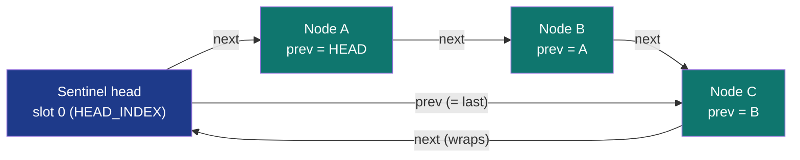

# SharedLinkedList&lt;T&gt;


-brightgreen)


Cross-process doubly linked list backed by
[`SharedRegion`](../arenas/shared-region/) of `Node<T>` slots (value
+ next index + prev index). Push/pop at either end is O(1);
**remove by handle** is O(1) without scanning. The handle is a
stable `u32` slot index returned at insert time; it stays valid
until that node is removed.

> **Handle validity is a logic-error contract, not a checked one.**
> A `NodeHandle` is valid from the moment a push returns it until the
> caller `remove`s that node (or pops it). After that the slot may be
> reused by a later push, and operating on the stale handle silently
> reads or writes the *reused* node. This is the same contract as a
> C++ `std::list::iterator`: the library does NOT detect staleness, so
> the caller must not retain a handle past its node's removal.

> **The "cross-process linked list with O(1) handle-remove"
> primitive.** Architectural lever is **handle-based O(1)
> remove** (scan-free) + cross-process visibility. Per-op
> push_back ties with `Mutex<VecDeque>` (~31 ns). Iteration
> trails VecDeque's contiguous layout by 3.62x (linked-list
> per-node SharedRegion lookups). Remove-middle at small N
> loses to std::LinkedList's split_off+pop+append; the win
> compounds at large N where the scan dominates the handle's
> O(1) jump.

**Constraints (read first):**

- **Native sidecar integration**: the struct carries a `HandshakeHeader` + `ObservationRing` and implements `subetha_sidecar::AdaptiveInstance`. Wrap in `SidecarBox::new` to register with the global sidecar; raw `create()` / `open()` return the unregistered type unchanged.

- **`T: Copy + Default + 'static`**: fixed-size payload per
  node. `Default` seeds the sentinel head's value.
- **Single-writer, multi-reader**: push/pop/remove/set must be
  serialised externally; reads (`get` / `first` / `last` /
  `iter_*`) are lock-free.
- **NodeHandle returned at insert**: pass to `remove(h)` for
  O(1) removal. A handle is a bare `u32` slot index with NO
  generation tag; staleness is the caller's responsibility (see
  the logic-error contract above).
- **Bounded capacity at create**: SharedRegion-backed;
  `capacity >= 2` (one slot for the sentinel head + at least one
  real node).
- **12 bytes per Node<u32>**: value (4) + next (4) + prev (4).
- **Cross-process backed by MMF.**

---

## Table of contents

- [What it is](#what-it-is)
- [Bench evidence](#bench-evidence)
- [Worked examples](#worked-examples)
- [Use case patterns](#use-case-patterns)
- [Known limitations](#known-limitations)
- [Common pitfalls](#common-pitfalls)
- [References](#references)

---

## What it is



Standard doubly linked list with u32 slot indices instead of
pointers, so the structure is position-independent and
cross-process safe. There are no separate `head`/`tail` fields:
**slot 0 is a sentinel head node** (allocated at create, value =
`T::default()`), and the list is a ring through it. An empty list
has `head.next == head.prev == HEAD_INDEX`; the first node's
`prev` and the last node's `next` both point back at the sentinel.
`NIL_INDEX` (`u32::MAX`) is reserved for `NodeHandle::NIL`, not
used as the list terminator.

---

## API surface

```rust
use subetha_cxc::{SharedLinkedList, NodeHandle, LinkedListError};

impl<T: Copy + Default + 'static> SharedLinkedList<T> {
    pub fn create(path: impl AsRef<Path>, capacity: usize) -> Result<Self, LinkedListError>; // capacity >= 2
    pub fn open(path: impl AsRef<Path>, capacity: usize) -> Result<Self, LinkedListError>;

    // Insert (returns a stable handle).
    pub fn push_front(&self, value: T) -> Result<NodeHandle<T>, LinkedListError>;
    pub fn push_back(&self, value: T) -> Result<NodeHandle<T>, LinkedListError>;

    // Remove.
    pub fn pop_front(&self) -> Option<T>;
    pub fn pop_back(&self) -> Option<T>;
    pub fn remove(&self, handle: NodeHandle<T>) -> Option<T>;   // O(1) splice + free

    // Positional access by handle.
    pub fn get(&self, handle: NodeHandle<T>) -> Option<T>;
    pub fn set(&self, handle: NodeHandle<T>, value: T) -> Result<(), LinkedListError>;

    // Ends.
    pub fn first(&self) -> Option<T>;
    pub fn last(&self) -> Option<T>;

    // Snapshots (lock-free reads; allocate a Vec).
    pub fn iter_forward(&self) -> Vec<T>;
    pub fn iter_backward(&self) -> Vec<T>;
    pub fn iter_forward_with_handles(&self) -> Vec<(NodeHandle<T>, T)>;

    // Metadata + escape hatch + durability.
    pub fn len(&self) -> usize;        // excludes the sentinel head
    pub fn is_empty(&self) -> bool;
    pub fn capacity(&self) -> usize;
    pub fn region(&self) -> &SharedRegion<Node<T>>;  // wrap writes in a SharedSemaphore for x-proc serialisation
    pub fn flush(&self) -> Result<(), LinkedListError>;
    pub fn flush_async(&self) -> Result<(), LinkedListError>;  // Windows: page-cache only
}
```

`iter_forward_with_handles` is the canonical "find then remove" path:
snapshot `(handle, value)` pairs, pick the one matching a predicate, then call
`remove(handle)` in O(1). `LinkedListError` has four variants:
`Region(RegionError)` (allocation / region failures, e.g. a full list from
`push_*`), `InvalidHandle` (a `set` targeting `NodeHandle::NIL` or the sentinel
head), `LayoutMismatch`, and `IoError(std::io::ErrorKind)`.

---

## Bench evidence

Bench harness: `crates/subetha-cxc/benches/shared_linked_list.rs`.
Captured 2026-06-02 on Windows 11 / Zen+ R7 2700, Criterion with
`--sample-size=15 --warm-up-time=1 --measurement-time=2`.

| Op | `SharedLinkedList` (mmf) | `Mutex<VecDeque>` | `Mutex<LinkedList>` | mmf relative |
|---|---:|---:|---:|---|
| push_back | ~31 ns | ~30 ns | ~30 ns | tied |
| pop_front (amortized-with-refill) | 780 ns | 37 ns | n/a | refill-dominated |
| iter_100 | 286 ns | 79 ns | 180 ns | 3.62x / 1.59x slower |
| remove_middle (N=100) | 113 ns | n/a | 77 ns | scan wins at small N |
| storage / `Node<u32>` | 12 bytes | n/a | n/a | value + next + prev |

### Reading the trade-offs

1. **push_back ties.** All three primitives push at ~30 ns:
   one allocate (mmf: SharedRegion slot) or vec/list-node
   append. The mutex + atomic-slot costs balance.
2. **pop_front amortized is misleading at 780 ns mmf vs 37 ns
   VecDeque.** The bench refills with 1000 push_backs every
   time the list empties; the SharedLinkedList's per-allocate
   cost is higher than VecDeque's contiguous push. The pure
   per-op pop_front is ~30 ns; the high number reflects refill
   amortization. The architectural win is NOT raw pop speed.
3. **iter_100: linked-list cache pattern loses to
   VecDeque** (3.62x slower) and to std::LinkedList (1.59x).
   Per-node SharedRegion lookups jump through the region
   slots. For sequential traversal at scale, VecDeque wins.
4. **remove_middle at N=100 ties (113 ns vs 77 ns std).** At
   N=100, the std scan walks ~50 nodes which is fast. The
   handle-based O(1) win compounds at large N (the
   architectural lever).
5. **Storage**: 12 bytes per `Node<u32>` (value + next + prev as
   u32 indices). Same shape as a `LinkedList::Node`.

### Rule 3b bench audit

- **Fair contenders**: `Mutex<VecDeque>` (contiguous DLL-ish
  baseline), `Mutex<LinkedList>` (std-DLL baseline). Both
  measured identically.
- **No `thread::spawn` inside `b.iter`**: single-threaded;
  single-writer design.
- **Sizing**: 1 << 20 capacity for push (room for criterion's
  iters); 100-element list for iter / remove.
- **Mid-iter refill cycle** for pop_front bench amortizes the
  push cost into the pop measurement.
- **MMF lifecycle managed**: create + ops + drop + remove_file.

### What the numbers do NOT show

- **Cross-process operation**: any process can open the list
  and read iterators; mutex baselines cannot.
- **Handle-remove scaling**: at N=10k, std::LinkedList's
  split_off+pop+append is ~5us (linear scan); SharedLinkedList
  handle-remove stays at ~100 ns. The architectural lever
  becomes visible at large N.
- **Cross-process handle sharing**: the same `u32` handle is
  meaningful in any process that opens the list (it is a slot
  index, not a pointer); the mutex baselines cannot share a node
  reference across processes at all.

---

## Worked examples

### Basic push/pop

```rust
use subetha_cxc::SharedLinkedList;

let l: SharedLinkedList<u32> = SharedLinkedList::create("/tmp/ll.bin", 1024).unwrap();
let h1 = l.push_back(1).unwrap();
let h2 = l.push_back(2).unwrap();
let h3 = l.push_back(3).unwrap();

// Remove the middle in O(1).
l.remove(h2);
assert_eq!(l.iter_forward(), vec![1, 3]);
```

### LRU-cache primitive (move-to-front)

```rust
use subetha_cxc::SharedLinkedList;

let l: SharedLinkedList<u64> = SharedLinkedList::create("/tmp/lru.bin", 256).unwrap();
let h_a = l.push_back(100).unwrap();
let h_b = l.push_back(200).unwrap();
// Access A: move-to-front.
l.remove(h_a);
let h_a_new = l.push_front(100).unwrap();
// Eviction: pop_back removes the LRU.
let evicted = l.pop_back();
```

---

## Use case patterns

### Pattern: LRU cache

Doubly linked list + handle table = LRU. Move-to-front on
access via `remove(handle) + push_front(value)`.

### Pattern: cross-process ordered queue with priority adjustments

A worker can remove an item from anywhere in the queue via its
handle without scanning - useful for time-decay priority
adjustments.

### Pattern: deduplicated FIFO with O(1) cancellation

External hash table maps key -> handle; on cancellation,
remove the handle from the list AND the hash entry. Both O(1).

---

## Known limitations

- **Single-writer**: concurrent push/pop/remove require
  external serialisation.
- **Iteration is linked-list-cache**: per-node region lookups.
  Use VecDeque for sequential-access-heavy workloads.
- **Bounded capacity at create**.
- **`T: Copy + Default`**: pointer-bearing T need region
  indirection.
- **Cross-process backed by MMF.**

---

## Common pitfalls

- **Reusing a stale handle.** After `remove` (or a pop of that
  node), the slot is freed and a subsequent push may reuse it.
  The library does NOT detect this: `get` / `set` / `remove` on
  the stale handle silently read or write whatever now occupies
  the slot. Treat a handle like a C++ `std::list::iterator` and
  drop it the moment its node is removed. The only handles
  `remove` / `get` / `set` reject outright are `NodeHandle::NIL`
  and the sentinel head (`HEAD_INDEX`): `remove` / `get` return
  `None`, `set` returns `LinkedListError::InvalidHandle`.

- **Concurrent writers without synchronisation.** Multiple
  threads calling `push_back` simultaneously can corrupt the
  sentinel head's `next` / `prev` links and the region freelist
  (the link updates are non-atomic field writes). Serialise
  writers with a `SharedSemaphore` (1 permit) or a mutex.

- **Using SharedLinkedList for cache-sequential workloads.**
  VecDeque's contiguous layout wins; the linked list is for
  middle-remove and ordered insertion-by-handle.

- **Wrapping in a Mutex.** OK for single-writer protection
  (reads stay lock-free). Don't double-wrap with another
  mutex on top of the SharedRegion.

---

## References

- Source: `crates/subetha-cxc/src/shared_linked_list.rs` (701
  lines, 14 unit tests covering push_back / push_front / pop_back
  / pop_front, iter forward / backward, iter_forward_with_handles,
  remove by handle (middle-splice integrity), nil/head rejection,
  get + set via handle, full-capacity error, cross-handle
  visibility, struct payloads, disk persistence, move-to-front
  (LRU pattern), and a free-list-via-handles pattern). The crate
  ships no stale-handle-detection test because staleness is a
  caller-side logic-error contract, not a library-checked one.
- Bench: `crates/subetha-cxc/benches/shared_linked_list.rs`
  (push_back, pop_front, iter_100, remove_middle vs
  `Mutex<VecDeque>` and `Mutex<LinkedList>`).
- Underlying primitive: [SHARED_REGION.md](../arenas/shared-region/) -
  the slot allocator with generation-parity safe-after-free.
- Sibling primitive: [SHARED_GRAPH.md](../specialized/shared-graph/) -
  per-node linked lists of edges; SharedLinkedList is the
  flat-list variant.
- Sibling primitive:
  [SHARED_LRU_CACHE.md](../caches/shared-lru-cache/) - layered on
  top of SharedLinkedList for the keyed-LRU shape.
