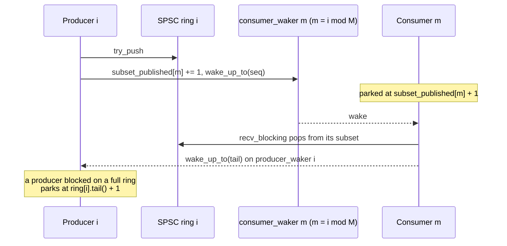

# BlockingMpmcRing


Composed-SPSC multi-producer / multi-consumer grid with
cross-process futex-shaped `send_blocking` / `recv_blocking`.
Wraps the [`SharedRingMpmc`]()
layout (N independent Lamport SPSC rings statically partitioned
across M consumers round-robin) with one [`CrossProcessWaker`]() per ring
on the producer side plus one waker per consumer subset.

> **The "M subsets, two wake families per subset" primitive.**
> Consumer m owns the subset of rings `{m, m+M, m+2M, ...}`.
> Producer i belongs to subset `i % M`. A producer's push wakes
> its subset's consumer waker only; a consumer's pop wakes the
> specific producer waker for the ring it drained. Per-subset
> shared `total_published[m]` counters carry the wake seq so
> consumer m's parks have unambiguous targets.

## Constraints

- **N producers, M consumers**, with `N >= M` so every consumer
  has at least one ring to drain. Each handle is `!Sync +
  !Clone + Send`: one producer per thread, one consumer per
  thread.
- **Per-producer-per-consumer FIFO**: items from producer i
  arrive at consumer `i % M` in push order. Items from
  different producers can interleave at the consumer they share.
- **Payload up to `SPSC_PAYLOAD_BYTES = 64` bytes per slot**
  (the underlying SPSC slots are payload-only; shorter pushes
  zero-fill, pops require a >= 64 B buffer).
- **Capacity must be a power of 2** (per ring).
- **In-process anonymous** (`create_anon_grid`) or
  **cross-process file-backed** (`create_grid` / `open_grid`).

## Wake routing



Producer i parks on `producer_wakers[i]` with target =
`ring[i].tail() + 1`.
Consumer m parks on `consumer_wakers[m]` with target =
`subset_total_published[m].load() + 1`.

## Operations

```rust
use std::path::Path;
use std::time::Duration;
use subetha_cxc::{
    BlockingError, BlockingMpmcConsumer, BlockingMpmcProducer, BlockingMpmcRing,
};

impl BlockingMpmcRing {
    pub fn create_anon_grid(
        n_producers: usize, n_consumers: usize, capacity: usize,
    ) -> Result<(Vec<BlockingMpmcProducer>, Vec<BlockingMpmcConsumer>), BlockingError>;

    pub fn create_grid(
        path_prefix: impl AsRef<Path>,
        n_producers: usize, n_consumers: usize, capacity: usize,
    ) -> Result<(Vec<BlockingMpmcProducer>, Vec<BlockingMpmcConsumer>), BlockingError>;

    pub fn open_grid(
        path_prefix: impl AsRef<Path>,
        n_producers: usize, n_consumers: usize, expected_capacity: usize,
    ) -> Result<(Vec<BlockingMpmcProducer>, Vec<BlockingMpmcConsumer>), BlockingError>;
}

impl BlockingMpmcProducer {
    pub fn try_push(&self, payload: &[u8]) -> Result<(), RingError>;
    pub fn send_blocking(&self, payload: &[u8], timeout: Option<Duration>) -> Result<(), BlockingError>;
}

impl BlockingMpmcConsumer {
    pub fn try_pop(&self, out: &mut [u8]) -> Result<usize, RingError>;
    pub fn recv_blocking(&self, out: &mut [u8], timeout: Option<Duration>) -> Result<usize, BlockingError>;
}
```

File-backed mode lays out files under one prefix:
- `<prefix>.ring.{i}.bin` for ring i (one per producer)
- `<prefix>.pw.{i}.bin` for producer-side waker i
- `<prefix>.cw.{m}.bin` for consumer-side waker m

## Accessors

`BlockingMpmcProducer` exposes `capacity()` (its own ring's slot count) and
`head()` (its publish position). `BlockingMpmcConsumer` exposes `n_rings()`
(rings in *this consumer's subset*, not the grid total) and
`approx_subset_len()` (pending items across that subset). The subset-scoped
names are deliberate: a consumer never sees rings outside `{m, m+M, m+2M,
...}`. `BlockingError` is the same set as
[`BlockingSpscRing`](blocking-spsc-ring/) (`Ring` / `WakerFull` / `Timeout` /
`WakerLayout` / `Io`); there is no phase-locked predictive-wait path here
(that is SPSC-only).

## Worked example (4P / 2C)

```rust
use std::thread;
use std::time::Duration;
use subetha_cxc::BlockingMpmcRing;

let (producers, consumers) =
    BlockingMpmcRing::create_anon_grid(4, 2, 64)?;

let prod_handles: Vec<_> = producers.into_iter().enumerate().map(|(pid, p)| {
    thread::spawn(move || {
        for i in 0..1000u64 {
            let val = (pid as u64) * 1_000_000 + i;
            let mut payload = [0u8; 56];
            payload[..8].copy_from_slice(&val.to_le_bytes());
            p.send_blocking(&payload, Some(Duration::from_secs(5))).unwrap();
        }
    })
}).collect();

let cons_handles: Vec<_> = consumers.into_iter().map(|c| {
    thread::spawn(move || {
        let mut buf = [0u8; 64];
        let mut got: Vec<u64> = Vec::new();
        while got.len() < 2000 {
            c.recv_blocking(&mut buf, Some(Duration::from_secs(5))).unwrap();
            got.push(u64::from_le_bytes(buf[..8].try_into().unwrap()));
        }
        got
    })
}).collect();

for h in prod_handles { h.join().unwrap(); }
let all: Vec<u64> = cons_handles.into_iter()
    .flat_map(|h| h.join().unwrap()).collect();
assert_eq!(all.len(), 4000);
```

## E2E proof

- **Intra-process demo** (`examples/blocking_ring_demo.rs`) ships
  4P/2C at 4 x 12500 items end-to-end and records 1567 total
  parks across both consumers (3.1% of recvs) in the captured
  run, asserting exactly-once delivery.
- **Library tests** (`cargo test -p subetha-cxc blocking_mpmc`)
  cover 4P/2C round-trip + timeout semantics.

## See also

- [`CrossProcessWaker`]():
  the underlying wake / park primitive.
- [`SharedRingMpmc`](): the
  non-blocking composed-SPSC MPMC grid this wraps.
- [`BlockingSpscRing`]() and
  [`BlockingMpscRing`](): the
  single-pair and N-producer/1-consumer siblings.
