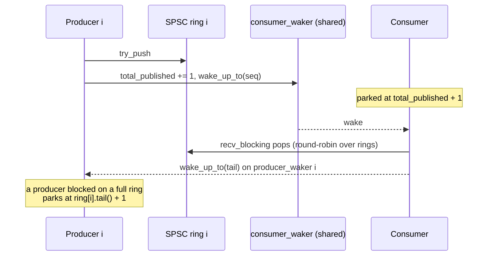

# BlockingMpscRing


Composed-SPSC multi-producer / single-consumer fan-in with
cross-process futex-shaped `send_blocking` / `recv_blocking`.
Wraps the [`SharedRingMpsc`]()
layout (N independent Lamport SPSC rings, one per producer) with
one [`CrossProcessWaker`]() per ring on
the producer side plus one shared consumer waker.

> **The "N SPSC rings, two wake families" primitive.** Each
> producer is the sole writer to its own SPSC ring and parks on
> its OWN producer waker when its ring is full; the consumer
> drains all N rings round-robin and parks on ONE shared
> consumer waker when every ring is empty. Wakes route by
> identity: a producer's push wakes the shared consumer waker;
> a consumer's pop wakes the specific producer waker for the
> ring it drained.

## Constraints

- **N producers, 1 consumer**, enforced at compile time
  (`BlockingMpscProducer` and `BlockingMpscConsumer` are both
  `!Sync + !Clone + Send`; the factory hands out a `Vec` of
  producers + one consumer).
- **Per-producer FIFO**: items from one producer arrive at the
  consumer in push order, but items from different producers
  can interleave arbitrarily. Use the global-FIFO
  [`SharedRingMpscFifo`]() variant
  if total ordering across all producers is required.
- **Payload up to `SPSC_PAYLOAD_BYTES = 64` bytes per slot**
  (the underlying SPSC slots are payload-only; shorter pushes
  zero-fill, pops require a >= 64 B buffer).
- **Capacity must be a power of 2** (per ring).
- **In-process anonymous** (`create_anon_pool`) or
  **cross-process file-backed** (`create_pool` / `open_pool`).

## Wake routing



Producer i parks on `producer_wakers[i]` with target = `ring[i].tail() + 1`.
Consumer parks on the single `consumer_waker` with target =
`total_published.load() + 1`.

A shared `AtomicU64 total_published` counter is incremented on
every successful push so the consumer's park target advances
monotonically; the wake call from any producer matches the
consumer's seq.

## Operations

```rust
use std::path::Path;
use std::time::Duration;
use subetha_cxc::{
    BlockingError, BlockingMpscConsumer, BlockingMpscProducer, BlockingMpscRing,
};

impl BlockingMpscRing {
    pub fn create_anon_pool(
        n_producers: usize, capacity: usize,
    ) -> Result<(Vec<BlockingMpscProducer>, BlockingMpscConsumer), BlockingError>;

    pub fn create_pool(
        path_prefix: impl AsRef<Path>, n_producers: usize, capacity: usize,
    ) -> Result<(Vec<BlockingMpscProducer>, BlockingMpscConsumer), BlockingError>;

    pub fn open_pool(
        path_prefix: impl AsRef<Path>, n_producers: usize, expected_capacity: usize,
    ) -> Result<(Vec<BlockingMpscProducer>, BlockingMpscConsumer), BlockingError>;
}

impl BlockingMpscProducer {
    pub fn try_push(&self, payload: &[u8]) -> Result<(), RingError>;
    pub fn send_blocking(&self, payload: &[u8], timeout: Option<Duration>) -> Result<(), BlockingError>;
}

impl BlockingMpscConsumer {
    pub fn try_pop(&self, out: &mut [u8]) -> Result<usize, RingError>;
    pub fn recv_blocking(&self, out: &mut [u8], timeout: Option<Duration>) -> Result<usize, BlockingError>;
}
```

File-backed mode lays out files under one prefix:
- `<prefix>.ring.{i}.bin` for ring i (one per producer)
- `<prefix>.pw.{i}.bin` for producer-side waker i
- `<prefix>.cw.bin` for the shared consumer waker

## Accessors

`BlockingMpscProducer` exposes `capacity()` (its own ring's slot count) and
`head()` (its publish position). `BlockingMpscConsumer` exposes
`n_producers()` (the number of rings it drains) and `approx_total_len()` (sum
of pending items across every ring). `BlockingError` is the same set as
[`BlockingSpscRing`](blocking-spsc-ring/) (`Ring` / `WakerFull` / `Timeout` /
`WakerLayout` / `Io`); this MPSC pool has no phase-locked predictive-wait path
(that is SPSC-only).

## Worked example

```rust
use std::thread;
use std::time::Duration;
use subetha_cxc::BlockingMpscRing;

let (producers, consumer) =
    BlockingMpscRing::create_anon_pool(4, 64)?;

let prod_handles: Vec<_> = producers.into_iter().enumerate().map(|(pid, p)| {
    thread::spawn(move || {
        for i in 0..1000u64 {
            let val = (pid as u64) * 1_000_000 + i;
            let mut payload = [0u8; 56];
            payload[..8].copy_from_slice(&val.to_le_bytes());
            p.send_blocking(&payload, Some(Duration::from_secs(5))).unwrap();
        }
    })
}).collect();

let mut buf = [0u8; 64];
let mut seen = Vec::with_capacity(4000);
for _ in 0..4000 {
    consumer.recv_blocking(&mut buf, Some(Duration::from_secs(5))).unwrap();
    seen.push(u64::from_le_bytes(buf[..8].try_into().unwrap()));
}
for h in prod_handles { h.join().unwrap(); }
```

## E2E proof

- **Intra-process demo** (`examples/blocking_ring_demo.rs`) ships
  4 x 12500 items end-to-end with the consumer recording 781
  parks (1.6% of recvs) in the captured run and asserts
  exactly-once delivery across all four producers.
- **Library tests** (`cargo test -p subetha-cxc blocking_mpsc`)
  cover 4P/1C round-trip + timeout semantics.

## See also

- [`CrossProcessWaker`]():
  the underlying wake / park primitive.
- [`SharedRingMpsc`](): the
  non-blocking composed-SPSC MPSC fan-in this wraps.
- [`BlockingSpscRing`]() and
  [`BlockingMpmcRing`](): the
  single-pair and many-pair siblings.
