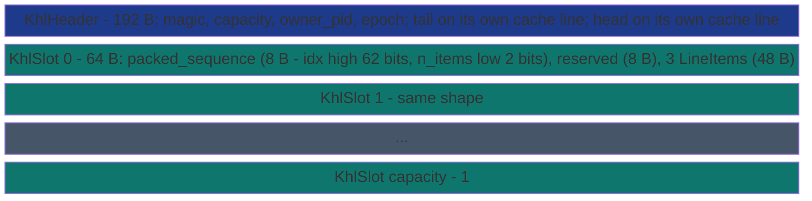

# SharedDequeKhl


K-axis Hierarchical LCRQ deque backed by a memory-mapped file.
**Novel SubEtha-native hybrid** that pulls three amortization levers
the four base primitives pull individually:

1. **KHPD's 3-items-per-Release-store** - each slot carries up to
   `KHL_ITEMS_PER_SLOT = 3` `LineItem` payloads, published by ONE
   Release-store on the slot's Vyukov sequence number.
2. **LOH's K-slots-per-counter-update** - `publish_batch` reserves
   `ceil(K / 3)` slots with ONE update of the producer tail counter.
3. **Chase-Lev's owner-private tail counter** - the producer's
   tail-counter update is a single Release-store (not a `LOCK XADD`),
   because the contract is "single owner process pushes."

> **The "all three levers at once" primitive.** Sibling to
> [`SharedDeque`](shared-deque/) (Chase-Lev, per-item, owner-private
> bottom only), [`SharedDequeKhpd`](shared-deque-khpd/) (per-slot
> amortization only), [`SharedDequeLoh`](shared-deque-loh/) (per-batch
> amortization only), and [`SharedDequeUrd`](shared-deque-urd/)
> (per-thief mailbox). KHL combines KHPD's per-slot packing AS the
> per-slot payload of LOH's Vyukov-sequence-number ring with
> Chase-Lev's owner-private counter.

**Constraints (read first):**

- **Payload**: each `LineItem` (shared with the rest of the deque
  family) holds a 16-byte byte-oriented payload.
- **3 items per slot**: each ring slot is a 64-byte cache line
  carrying an 8-byte `packed_sequence` (Vyukov index in the high
  62 bits, `n_items` bit-packed into the low 2 bits), 8 reserved
  bytes aligning the items to offset 16, and 3 * 16 = 48 bytes of
  items. Packing `n_items` into the sequence word means the
  producer's ONE Release-store publishes the protocol state AND
  the payload count.
- **Single owner, N thieves**: the owner is the only writer to the
  tail counter (Chase-Lev contract); any number of thieves race on
  the head CAS.
- **Cross-process backed by MMF.** Thieves open the same file via
  `SharedDequeKhl::open` and call `steal_slot()` in a tight loop.
- **`capacity` rounds up to the next power of two** (min 2). Capacity
  is in SLOTS; total item capacity is `capacity * 3`.

---

## Why this hybrid exists in SubEtha but not the upstream

The upstream LCRQ-on-LIFO ring has 56 bytes of dispatch-coupled
payload per slot (closure id + args + latch offset). They cannot
pack 3 of those per cache line. SubEtha's byte-oriented `LineItem`
is 16 bytes; three of them plus the sequence-number header fit
exactly in 64 bytes.

**The architectural enabler is SubEtha's decoupling between dispatch
(`pass_registry`) and transport (`SharedDeque*`).** The upstream's
dispatch-backend wrapper coupled the slot shape to the call shape
and locked them out of this corner of the design space; SubEtha's
clean separation lets the transport ride any slot layout the
hardware lever calls for.

## Cost model (per K=64 producer-fast batch)

| Primitive | Producer atomics | Thief CAS attempts |
|---|---:|---:|
| `SharedDeque` Chase-Lev per-item | 64 Release-stores + 64 fences | 64 |
| `SharedDequeKhpd::publish_batch` | 22 slot Release-stores + 1 `fetch_add` (`LOCK XADD`) | 22 |
| `SharedDequeLoh::publish_batch` | 64 slot Release-stores + 1 `fetch_add` (`LOCK XADD`) | 64 |
| **`SharedDequeKhl::publish_batch`** | **22 slot Release-stores + 1 Release-store on owner-private tail** | **22** |

KHL matches KHPD's per-slot count, matches LOH's per-batch counter
amortization, and adds Chase-Lev's owner-private counter to save the
`LOCK XADD` (~15 cycles) on top of that.

## Publish radius (the K_radius axis)

The per-slot publish mechanism is itself a tunable axis - `PublishRadius` -
because the optimal store differs by ~50-100x across coherence domains:

- **`PublishRadius::Local`** (producer + consumer share L1d/L2, same core or
  CCX): one cached `Release`-store on the slot's `packed_sequence`. The line
  stays in the publisher's L1d; the consumer's first read pays one
  L1d->L1d transfer.
- **`PublishRadius::Distant`** (cross-CCX / cross-CCD / cross-socket /
  CXL.mem): the whole 64-byte slot (sequence + n_items + items) is published
  with one `MOVDIR64B` + `SFENCE`, a Write-Combining store that bypasses the
  publisher's L1d and lands in LLC, so the consumer's read skips the
  cross-CCX coherence-upgrade penalty a cached store would force. The
  MOVDIR64B publishes the whole slot atomically, so the consumer sees either
  the old or the new slot, never a partial.

`PublishRadius::pick_auto()` (the construction default) chooses `Distant`
when [`subetha_core::has_movdir64b`](../../subetha-core/) is true, else
`Local`. `with_publish_radius(r)` overrides it; a `Distant` request
`resolve`s to `Local` on hosts without `MOVDIR64B`, so callers can request it
unconditionally. `publish_radius()` reports the effective value.

## API surface

```rust
use subetha_cxc::{SharedDequeKhl, LineItem, KhlSteal};

// Owner: create with 1024 slots (= 3072 item capacity).
let owner = SharedDequeKhl::create("/tmp/jobs.bin", 1024)?;

// Canonical hot-path API. K=64 items become 22 slots; the publisher
// pays one Release-store on tail + 22 per-slot Release-stores.
let batch: Vec<LineItem> = (0..64u32)
    .map(|id| LineItem::new(&id.to_le_bytes()).unwrap())
    .collect();
let n = owner.publish_batch(&batch)?;
assert_eq!(n, 64);

// Thief: open + drain via steal_slot().
let thief = SharedDequeKhl::open("/tmp/jobs.bin")?;
loop {
    match thief.steal_slot() {
        KhlSteal::Success(r) => {
            for i in 0..r.n_items {
                let id = u32::from_le_bytes(
                    r.items[i].payload[..4].try_into().unwrap(),
                );
                // ... process id
            }
        }
        KhlSteal::Empty => break,
        KhlSteal::Retry => std::hint::spin_loop(),
    }
}
```

Lifecycle + observability: `owner_pid()` reports the creating pid (0 after
`close_owner()`, which also advances the header epoch); `snapshot_size()`
returns `(head, tail, tail - head)` (independent loads, not a linearizable
snapshot); `flush_to_disk()` forces the mapped region to disk for the
disk-persistent deployment.

## Layout



The Vyukov sequence per slot has the standard three-state
protocol, run on the INDEX VALUE in the high 62 bits of
`packed_sequence` (`idx_value = packed >> 2`,
`n_items = packed & 3`):

- On creation: `idx_value == idx` (slot empty, ready to publish).
- After producer Release-store: `idx_value == idx + 1` (published;
  the same store carries `n_items`, so the consumer may read
  `items[..n_items]` with no second load).
- After consumer Release-store: `idx_value == idx + capacity`
  (consumed, ready for next round at `idx + capacity`).

The tail counter is **owner-private** (Chase-Lev style): the owner
process is the only writer; a thief Acquire-load on `tail` learns
the high watermark of reserved slots, and the owner's Release-store
on `tail` provides the synchronisation ordering thieves need.

## See also

- [`SharedDeque`](shared-deque/) - the per-item Chase-Lev base.
- [`SharedDequeKhpd`](shared-deque-khpd/) - the per-slot packing base.
- [`SharedDequeLoh`](shared-deque-loh/) - the per-batch amortization
  base (LCRQ-on-LIFO Hybrid).
- [`SharedDequeUrd`](shared-deque-urd/) - the per-thief mailbox base.
- [Citations and references](../../../explanation/citations/) - the
  Chase-Lev / LCRQ / Vyukov primary sources behind the three levers.
