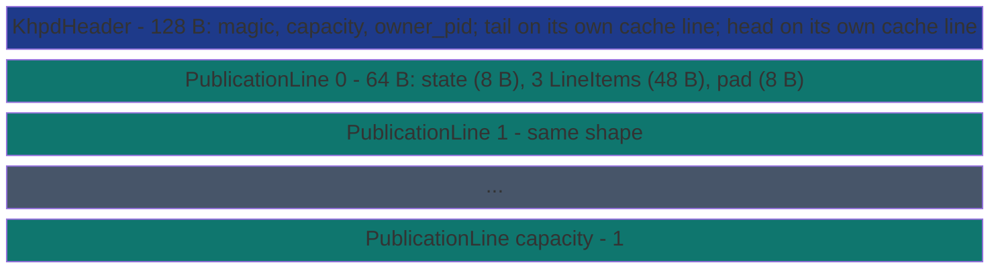

# SharedDequeKhpd


K-axis Hierarchical Publication Deque (single-tier variant) backed
by a memory-mapped file. Owner stages items into a local pending
buffer, then publishes 1-3 items per cache-line in a single
Release-store on the publication line's state word. Thieves CAS the
head index to claim a whole line at once, reading all three items
in one cache-line transfer.

> **The "publication-line + cache-line amortization" primitive.**
> Sibling to [`SharedDeque`](shared-deque/) (Chase-Lev): same
> single-owner / many-thieves shape, but the per-line publication
> batches up to three items per Release-store and one CAS-claim
> takes all three at once. See the
> [Citations and references](../../../explanation/citations/) page
> for the architectural lever.

**Constraints (read first):**

- **Payload**: each [`LineItem`] holds a 16-byte byte-oriented
  payload. Callers marshal their own value (via SubEtha's
  [`Marshal`](../../subetha-core/) trait or by hand).
- **`LINE_ITEMS = 3`** items per publication line; lines are
  cache-line aligned (64 bytes = 8 B state + 3 * 16 B items + 8 B
  padding).
- **Capacity must be a power of two** (the publication-line ring
  uses `head & (capacity - 1)` for slot indexing).
- **Single owner**: only the owner process / thread calls `stage`
  and `publish`; the underlying `pending` buffer is `Mutex`-protected
  but is uncontended on the hot path. Multiple threads staging
  concurrently from the owner side is sound but adds Mutex
  acquisition cost per stage.
- **Cross-process backed by MMF.** A second process opens the same
  file via `SharedDequeKhpd::open` and steals from a remote owner
  using the identical state-atomic protocol.

---

## When to use this vs `SharedDeque`

| Workload | Pick | Why |
|---|---|---|
| Per-item dispatch (one push at a time, no batching) | `SharedDeque` (Chase-Lev) | One Relaxed store per push; no per-line batching overhead. |
| Producer can batch N items per call (`publish_batch(&items)`) | `SharedDequeKhpd` | One Release-store on the line state publishes up to three items; one `tail.fetch_add(n_lines)` per batch. |
| Cross-process steal where cache-line coherence dominates the round-trip | `SharedDequeKhpd` | Three items per cache-line bounce instead of one. |

## Cost summary

Measured on AMD Ryzen 7 2700 (Zen+) under Criterion publication-grade
defaults (warm-up 3 s + measurement 5 s, 100 samples). Workload:
K=64 items per iter, drain runs in the background, wait-for-drain
catch-up happens OUTSIDE the timed window via `iter_custom` so the
bench measures pure producer-side throughput.

| Backend | K=64 wall-clock | Per-item | Throughput |
|---|---:|---:|---:|
| **`SharedDequeKhpd::publish_batch`** | **354 ns** | **5.5 ns/item** | **180 Melem/s** |
| `Mutex<VecDeque>` (single lock, 64 push_backs) | 548 ns | 8.6 ns/item | 117 Melem/s |
| `SharedDeque::push` (Chase-Lev, 64 calls) | 1010 ns | 15.8 ns/item | 63 Melem/s |

KHPD wins **2.85x vs Chase-Lev** on the producer-fast batch shape.
The amortization lever is exactly the architectural premise: 64
items reach 22 publication lines via 22 Release-stores (one per
line) plus one `tail.fetch_add(22)`, instead of Chase-Lev's 64
individual Release-stores on the `bottom` index. The per-line cost
amortizes over `LINE_ITEMS = 3` items.

KHPD also beats `Mutex<VecDeque>` 1.55x even though the mutex
variant holds the lock once for all 64 push_backs - the mutex path
pays a Vec resize + per-byte memcpy that the MMF publication-line
layout sidesteps.

Bench file:
[`crates/subetha-cxc/benches/shared_deque_khpd.rs`](https://github.com/Variably-Constant/subetha/blob/main/crates/subetha-cxc/benches/shared_deque_khpd.rs).

## API surface

```rust
use subetha_cxc::{SharedDequeKhpd, LineItem};

// Owner: create + publish a batch in one call (the hot-path API,
// one Mutex acquire per batch instead of one per staged item).
let owner = SharedDequeKhpd::create("/tmp/jobs.bin", 1024).unwrap();
let batch: Vec<LineItem> = (0..64u32)
    .map(|i| LineItem::new(&i.to_le_bytes()).unwrap())
    .collect();
let n_lines = owner.publish_batch(&batch)?;   // 22 lines from 64 items

// Owner: alternative stage + publish API for callers that build
// the batch incrementally over time.
owner.stage(LineItem::new(&42u32.to_le_bytes())?)?;
owner.stage(LineItem::new(&43u32.to_le_bytes())?)?;
owner.stage(LineItem::new(&44u32.to_le_bytes())?)?;
let n_lines = owner.publish()?;   // 1 line carrying 3 items

// Thief: open the same file + steal whole lines.
let thief = SharedDequeKhpd::open("/tmp/jobs.bin")?;
match thief.steal_line() {
    subetha_cxc::KhpdSteal::Success(r) => {
        for i in 0..r.n_items {
            let id = u32::from_le_bytes(r.items[i].payload[..4].try_into().unwrap());
            // ... process id
        }
    }
    subetha_cxc::KhpdSteal::Empty => {/* nothing to do */}
    subetha_cxc::KhpdSteal::Retry => {/* publisher still writing, or thief lost CAS */}
}
```

Lifecycle + observability: `owner_pid()` reports the creating pid (0 after
`close_owner()`, which also advances the header epoch); `snapshot_size()`
returns `(head, tail, tail - head, pending_items)`; `flush_to_disk()` forces
the mapped region to disk for the disk-persistent deployment.

The module also exports `FatLineItem` - a 64-byte slot (`n_items` + a caller
`reserved` tag + 3 `LineItem`s + pad) with a `Marshal` impl, built via
`FatLineItem::from_items(&[LineItem])` and read via `live_items()`. It is the
slot type `SharedDequeFcl` (the flat-combining Chase-Lev variant in
`shared_deque_fcl`) uses for counter-only Chase-Lev with three items per
cache-line write; KHPD itself stores bare `PublicationLine`s.

## Layout



`state` is a packed `(epoch: u32) << 32 | (n_items: u16) << 16 |
claim: u16`. The publisher fills the line's items in place and
issues one Release-store on `state` with `claim = 1` and `n_items`
set. A thief Acquire-loads `state`, validates the epoch matches its
`head`, CAS-takes `head`, reads the items, and stores
`state = STATE_EMPTY` (0) to release the slot for the next round.

## See also

- [`SharedDeque`](shared-deque/) - the Chase-Lev sibling that is
  preferable for per-item dispatch.
- [`SharedRing`](shared-ring/) - the symmetric MPMC ring for
  unbatched cross-process queue work.
- [Citations and references](../../../explanation/citations/) - the
  publication-line cache-line amortization design pattern.
