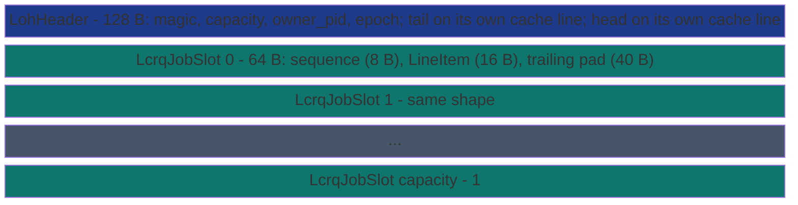

# SharedDequeLoh


LCRQ-on-LIFO Hybrid (LOH) deque backed by a memory-mapped file.
Owner-side push goes into a `LohStager`, a process-private LIFO its
holder mutates with *no atomic*; the migration step drains a batch
into a Vyukov-sequence-number ring with one compare-and-swap on
`tail` plus N Release-stores. Thieves race on `head` via CAS with a
per-slot sequence-number check that pre-validates the slot before
the CAS.

> **The "batched producer-counter amortization" primitive.** Sibling
> to [`SharedDeque`](shared-deque/) (Chase-Lev, per-item),
> [`SharedDequeKhpd`](shared-deque-khpd/) (publication-line, 3
> items per Release-store), and [`SharedDequeUrd`](shared-deque-urd/)
> (per-thief mailbox + WAITPKG). LOH's lever is amortizing the
> producer-counter atomic across an arbitrary batch size. Win zone:
> bursty producer-fast workloads where the per-burst migration
> amortizes over many items per cache-line bounce.

**Constraints (read first):**

- **Payload**: each `LineItem` (shared with `SharedDequeKhpd` and
  `SharedDequeUrd`) holds a 16-byte byte-oriented payload.
- **One item per slot**: each ring slot is a 64-byte cache line
  carrying an 8-byte Vyukov sequence number + 16-byte `LineItem`
  payload + 40-byte trailing padding. Cache-line aligned so
  adjacent slots never share coherence-traffic lines.
- **Single owner, N thieves**: the owner is the only writer; any
  number of thieves race on the consumer CAS. Every migration
  reserves its slots with one compare-and-swap on `tail`, so two
  owner-side publishes racing for the last free slots get `Full`
  rather than overfilling.
- **Cross-process backed by MMF.** Thieves open the same file via
  `SharedDequeLoh::open` and call `steal()` in a tight loop.
- **`capacity` rounds up to the next power of two** (min 2).
- **`flush_threshold`** controls auto-flush on per-item
  [`push`](#api-surface); set to `usize::MAX` to disable auto-flush
  and drive the ring purely through
  [`publish_batch`](#api-surface).

---

## When to use this vs `SharedDeque` / `SharedDequeKhpd` / `SharedDequeUrd`

| Workload | Pick | Why |
|---|---|---|
| Per-item dispatch, single thief, no batching | `SharedDeque` (Chase-Lev) | Lowest constant per push. |
| Producer batches K items per call, K small multiple of 3 | `SharedDequeKhpd::publish_batch` | One Release-store per 3 items via the publication line. |
| Producer batches K items per call, K arbitrary | `SharedDequeLoh::publish_batch` | One reservation of K slots on `tail` + K Release-stores amortizes the producer-counter atomic over an arbitrary batch size. |
| Multiple thieves and the workload is contention-bound at the steal site | `SharedDequeUrd` | Per-thief mailboxes give zero CAS contention. |

## Measured throughput (Ryzen 9 7900X, Windows 11, K=64 producer-fast)

SubEtha's LOH carries two SubEtha-native optimizations on top of the
classical LCRQ-on-LIFO design:

- **No lock anywhere.** The batch publish bypasses the LIFO
  entirely and competes only for the reservation on `tail`, and the
  LIFO is the stager's own buffer.
- **`PREFETCHW` via `core::arch::asm!`** in the per-slot publish
  loop brings the next slot's cache line to M-state directly,
  avoiding the RFO coherence upgrade that a stable
  `_mm_prefetch::<T0>` would force on the publisher's payload write.

Criterion's defaults (3 s warm-up, 5 s measurement, 100 samples per
cell), built for the x86-64 baseline on Windows 11 Pro 10.0.26200 on an
AMD Ryzen 9 7900X, while other work kept 4.6 to 8.0 of the machine's
24 hardware threads busy.

| Primitive | Median per K=64 batch | ns/item | LOH vs this |
|---|---:|---:|---:|
| `SharedDequeKhl::publish_batch` | 81.5 ns | 1.27 | LOH loses 2.61x |
| `SharedDequeKhpd::publish_batch` | 95.1 ns | 1.49 | LOH loses 2.24x |
| `Mutex<VecDeque<u64>>` | 144.6 ns | 2.26 | LOH loses 1.47x |
| `SharedDequeFcl::publish_batch` | 144.9 ns | 2.26 | LOH loses 1.47x |
| **`SharedDequeLoh::publish_batch`** | **213.0 ns** | **3.33** | (self) |
| `SharedDeque<u64>` per-item push | 506.3 ns | 7.91 | **LOH wins 2.38x** |
| `SharedDequeUrd::publish_to(0, ..)` | 1001.5 ns | 15.65 | LOH wins 4.70x |

Bench source:
[`crates/subetha-cxc/benches/shared_deque_loh.rs`](https://github.com/Variably-Constant/SubEtha/blob/main/crates/subetha-cxc/benches/shared_deque_loh.rs).

The 2.38x LOH-vs-Chase-Lev margin is the architectural lever's
payoff: amortizing one reservation of 64 slots across the batch beats
Chase-Lev's 64 independent Release-stores on `bottom`. KHL and KHPD
both beat LOH: each publishes 3 items per Release-store, 22 stores for
the batch, where LOH pays one reservation plus a sequence store per
item.

## Architectural lever

Chase-Lev pays one Release-store on `bottom` per item; KHPD packs 3
items per Release-store on `state`; LOH amortizes the
producer-counter atomic over an arbitrary batch with one reservation
on `tail`. The win zone is bursty producer-fast workloads
(parallel-for fan-out, fork-join leaves) where the per-burst
migration amortizes over many items per cache-line bounce.

The trade-off vs Chase-Lev MMF:

- **Owner push** drops from one Release-store on `bottom` per item
  to a plain `Vec::push` (~3 ns) on the stager.
- **Migration** is one compare-and-swap on `tail` plus `batch`
  Release-stores on per-slot sequence numbers.
- **Thief steal** is one CAS on `head` plus a sequence-number check
  on the slot. The wasted-ticket race that pure-XADD LCRQ exhibits
  is avoided by gating the CAS on `head < tail`.

Where LOH does not win: single-item request-reply, because there is
no batching to amortize against. The per-item
[`push`](#api-surface) path stages into the LIFO behind an
auto-flush trigger; only [`publish_batch`](#api-surface) exercises
the architectural lever directly.

## API surface

```rust
use subetha_cxc::{SharedDequeLoh, LineItem, LohSteal};

// Owner: create with capacity 1024 + auto-flush disabled
// (publish_batch is the canonical hot path).
let owner = SharedDequeLoh::create("/tmp/jobs.bin", 1024, usize::MAX)?;

// Canonical hot-path API: one reservation on tail + K Release-stores
// for the whole batch.
let batch: Vec<LineItem> = (0..64u32)
    .map(|id| LineItem::new(&id.to_le_bytes()).unwrap())
    .collect();
let n = owner.publish_batch(&batch)?;
assert_eq!(n, 64);

// Alternative incremental staging path. A flush_threshold of 8 means
// every 8th push triggers an auto-flush.
let staging = SharedDequeLoh::create("/tmp/staging.bin", 1024, 8)?;
let mut lifo = staging.stager();
for id in 0..16u32 {
    lifo.push(LineItem::new(&id.to_le_bytes()).unwrap())?;
}
lifo.flush()?;  // drain anything still in the LIFO

// Thief: open the same file + drain via steal().
let thief = SharedDequeLoh::open("/tmp/jobs.bin", usize::MAX)?;
loop {
    match thief.steal() {
        LohSteal::Success(r) => {
            let id = u32::from_le_bytes(r.item.payload[..4].try_into().unwrap());
            // ... process id
        }
        LohSteal::Empty => break,
        LohSteal::Retry => std::hint::spin_loop(),
    }
}
```

## Staging LIFO, lifecycle, and observability

The incremental `push` path stages into the `LohStager` that `stager()`
returns, an owner-private LIFO capped at `DEFAULT_LIFO_CAP = 256`; pushing
past the cap before a flush returns `PushError::LifoFull` (distinct from the
ring's `PushError::Full`), so the caller flushes or backs off. `pop_local()`
retrieves an unmigrated item straight off that LIFO without a ring
round-trip, and `flush()` migrates the whole LIFO in one batch (FIFO order);
a flush refused as `Full` leaves the items staged. `len()` counts them, and
the deque's `flush_threshold()` reports the auto-flush trigger.

Lifecycle + observability: `owner_pid()` is the creating pid (0 after
`close_owner()`, which also advances the header epoch); `snapshot_size()`
returns `(head, tail, tail - head)`; `flush_to_disk()` forces the mapped
region to disk for the disk-persistent deployment.

## Layout


```mermaid
block-beta
  columns 1
  hdr["LohHeader - 128 B: magic, capacity, owner_pid, epoch; tail on its own cache line; head on its own cache line"]
  s0["LcrqJobSlot 0 - 64 B: sequence (8 B), LineItem (16 B), trailing pad (40 B)"]
  s1["LcrqJobSlot 1 - same shape"]
  dots["..."]
  sn["LcrqJobSlot capacity - 1"]
  classDef hdrC fill:#1e3a8a,color:#ffffff
  classDef slotC fill:#0f766e,color:#ffffff
  classDef padC fill:#475569,color:#ffffff
  class hdr hdrC
  class s0,s1,sn slotC
  class dots padC
```

The slot's `sequence` is a `Vyukov` counter gating payload access:

- On creation: `seq == idx` (slot empty, ready to publish).
- After producer Release-store: `seq == idx + 1` (published,
  consumer may read).
- After consumer Release-store: `seq == idx + capacity` (consumed,
  ready for next round at `idx + capacity`).

Each round of `(producer publish, consumer take)` advances the
sequence by `capacity`, so the same slot indices wrap cleanly
without any per-slot CAS on the producer side.

## See also

- [`SharedDeque`](shared-deque/) - the per-item Chase-Lev sibling
  that loses to LOH under burst-batch producer-fast workloads but
  wins when the dispatch shape is single-item with no batching
  available.
- [`SharedDequeKhpd`](shared-deque-khpd/) - the publication-line
  sibling; the right pick when the batch size is a small multiple
  of 3 and the per-line cache-bounce cost dominates.
- [`SharedDequeUrd`](shared-deque-urd/) - the per-thief mailbox
  sibling; the right pick when contention at the steal site
  dominates (multi-thief workloads on WAITPKG-capable silicon).
- [Citations and references](../../../explanation/citations/) - the
  LCRQ + producer-LIFO architectural pattern.
