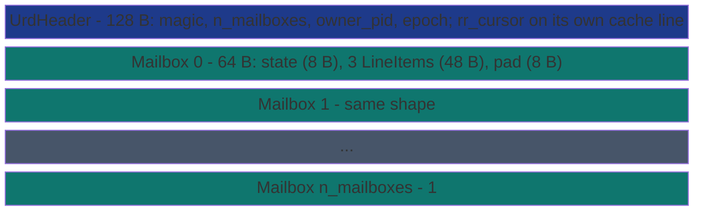

# SharedDequeUrd


UMWAIT Rendezvous Deque (URD) backed by a memory-mapped file.
Per-thief mailbox cache lines instead of a shared deque. Each
mailbox is one 64-byte line carrying state (8 B) + `MAILBOX_ITEMS
= 3` line items (48 B) + 8 B trailing padding. The owner picks a
mailbox by round-robin (or by an explicit target) and writes the
items in; the addressed thief reads its mailbox and never CASes a
contended atomic.

> **The "per-thief mailbox + UMWAIT" primitive.** Sibling to
> [`SharedDeque`](shared-deque/) (Chase-Lev, pull-based) and
> [`SharedDequeKhpd`](shared-deque-khpd/) (publication-line,
> pull-based). URD is *push-based*: the owner picks the target.
> Architectural win zone: multi-thief workloads where Chase-Lev's
> shared `head` CAS becomes a contention bottleneck.

**Constraints (read first):**

- **Payload**: each `LineItem` (shared with `SharedDequeKhpd`) holds
  a 16-byte byte-oriented payload.
- **`MAILBOX_ITEMS = 3`** items per mailbox publish; mailboxes are
  cache-line aligned (64 bytes = 8 B state + 3 * 16 B items + 8 B
  padding).
- **`n_mailboxes` is the thief count**: configured at create time;
  the owner picks targets in `0..n_mailboxes`.
- **Single owner, N thieves**: the owner is the only writer to each
  mailbox; the assigned thief is the only reader.
- **Cross-process backed by MMF.** A second process opens the same
  file via `SharedDequeUrd::open` and joins as a thief by reading
  its assigned mailbox index.
- **Wait strategy auto-picked**: `WaitStrategy::Waitpkg`
  (`UMONITOR` + `UMWAIT`) on Intel Tremont/Tiger Lake+ or AMD Zen 5+;
  `WaitStrategy::PauseSpin` (`PAUSE`-spin) elsewhere. Detection is
  via [`subetha_core::has_waitpkg`](../../subetha-core/).
- **Publish strategy auto-picked**: `PublishStrategy::Movdir64b`
  (atomic 64-byte non-temporal store via the `MOVDIR64B` instruction
  emitted with `core::arch::asm!`) on Intel Tremont/Tiger Lake+ or
  AMD Zen 5+; `PublishStrategy::Scalar` (cached store loop +
  Release-store on `state`) elsewhere. Detection is via
  [`subetha_core::has_movdir64b`](../../subetha-core/).

---

## When to use this vs `SharedDeque` / `SharedDequeKhpd`

| Workload | Pick | Why |
|---|---|---|
| Per-item dispatch, single thief, no batching | `SharedDeque` (Chase-Lev) | Lowest constant per push. |
| Producer batches K items per call (no contention required) | `SharedDequeKhpd` | One Release-store per 3 items via `publish_batch`. |
| Multiple thieves AND the workload is contention-bound at the steal site | `SharedDequeUrd` | Per-thief mailboxes mean **zero CAS contention**; owner picks target. |
| Low-power idle waits with `UMWAIT` available | `SharedDequeUrd` | Hardware-mediated wake instead of busy-spin (Zen 5+ / Intel Tiger Lake+). |

## Cost summary

Measured on AMD Ryzen 7 2700 (Zen+, no WAITPKG so URD uses
`PauseSpin` fallback) under Criterion publication-grade defaults
(warm-up 3 s + measurement 5 s, 100 samples). Workload: K=64 items
per iter dispatched plus drain catch-up, timed window covers
dispatch + delivery.

| Shape | URD | Chase-Lev | URD vs Chase-Lev |
|---|---:|---:|---:|
| Single-thief K=64 | 3.00 µs | 3.65 µs | **URD wins 1.22x** |
| Multi-thief N=4 K=64 | **1.71 µs** | 5.76 µs | **URD wins 3.37x** |

The multi-thief result is the headline. With four drain threads
racing for Chase-Lev's shared `head` CAS, each push pays for the
failed-CAS retries; URD's per-thief mailboxes have zero contention
because the owner round-robins one mailbox per call and each thief
sees only its own state byte. Even the single-thief result is a
small URD win because `MAILBOX_ITEMS = 3` amortizes one
Release-store across three items.

Bench file:
[`crates/subetha-cxc/benches/shared_deque_urd.rs`](https://github.com/Variably-Constant/SubEtha/blob/main/crates/subetha-cxc/benches/shared_deque_urd.rs).

## Publish strategy: MOVDIR64B vs scalar stores

URD's owner side has two publish modes, dispatched at construction
time by the [`PublishStrategy::pick`](./#publishstrategy) helper that
reads [`subetha_core::has_movdir64b`](../../subetha-core/):

- **`Movdir64b`** (`MOVDIR64B` + `SFENCE`): the owner builds a
  64-byte source line on the stack carrying the new state word plus
  the items, then emits one `MOVDIR64B` instruction that atomically
  writes the whole mailbox cache line as a Write-Combining store.
  The store bypasses the owner's L1d entirely and lands in LLC.
  Critical for cross-CCX delivery where the byte-by-byte path would
  pay an RFO coherence upgrade per item transfer.
- **`Scalar`** (cached store loop + Release-store on `state`):
  cached stores fill the mailbox slots, then a Release-store on
  `state` transitions the mailbox to READY. The fallback path used
  on hosts without `MOVDIR64B` (anything older than Intel Tiger Lake
  or AMD Zen 5).

Both paths converge on the same per-thief drain semantics: the
mailbox state word's `CLAIM_READY` bit gates payload visibility.

## Wait strategy: UMWAIT vs PAUSE-spin

URD's thief side has two wait modes, dispatched at construction
time by the [`WaitStrategy::pick`](./#waitstrategy) helper that
reads [`subetha_core::has_waitpkg`](../../subetha-core/):

- **`Waitpkg`** (`UMONITOR` + `UMWAIT`): the thief calls `UMONITOR`
  to arm the hardware monitor on its mailbox state byte, then
  `UMWAIT` to suspend until the line transitions or a TSC deadline
  fires. Power-efficient; the thief does NOT burn pipeline slots
  polling. Available on Intel Tremont (2019), Tiger Lake+ (2020),
  and AMD Zen 5 (2024).
- **`PauseSpin`** (`std::hint::spin_loop`): tight Acquire-load loop
  on the state byte with `PAUSE` between iterations. Universal
  fallback. The cost-comparable case to Chase-Lev's `steal()` loop.

Both branches converge on the same drain semantics once the state
byte carries the READY bit.

## API surface

```rust
use subetha_cxc::{SharedDequeUrd, LineItem};

// Owner: create + publish to a chosen mailbox or round-robin.
let owner = SharedDequeUrd::create("/tmp/jobs.bin", 4).unwrap();
let items = [
    LineItem::new(&1u32.to_le_bytes()).unwrap(),
    LineItem::new(&2u32.to_le_bytes()).unwrap(),
    LineItem::new(&3u32.to_le_bytes()).unwrap(),
];
let n = owner.publish_to(0, &items)?;       // explicit target
let (target, n) = owner.publish_round_robin(&items)?;  // auto target

// Thief: open the same file + drain assigned mailbox.
let thief = SharedDequeUrd::open("/tmp/jobs.bin")?;
match thief.drain_mailbox(0) {
    subetha_cxc::UrdDrain::Success(r) => {
        for i in 0..r.n_items {
            let id = u32::from_le_bytes(r.items[i].payload[..4].try_into().unwrap());
            // ... process id
        }
    }
    subetha_cxc::UrdDrain::Empty => {/* nothing published yet */}
}

// Or: block until something arrives (uses UMWAIT on capable
// silicon, PAUSE-spin elsewhere).
let _ = thief.wait_and_drain(0, u64::MAX);
```

## Lifecycle, accessors, and errors

`owner_pid()` reports the creating pid (0 after `close_owner()`, which also
advances the header epoch). `n_mailboxes()`, `wait_strategy()`, and
`publish_strategy()` report the configured count and the CPUID-picked
strategies for this handle; `flush_to_disk()` forces the mapped region to
disk for the disk-persistent deployment. `publish_to` returns
`PublishError::BadTarget(idx)` for an out-of-range mailbox,
`PublishError::TooManyItems` past `MAILBOX_ITEMS`, and
`PublishError::PayloadTooLarge` past `KHPD_ITEM_BYTES`.

## Layout



`state` is a packed `(epoch: u32) << 32 | (n_items: u16) << 16 |
claim: u16`. The publisher spins until `state == STATE_EMPTY`,
writes the line items in place, then Release-stores `state` with
`claim = 1` and `n_items` set. The thief Acquire-loads `state`,
reads the items, and Release-stores `state = STATE_EMPTY` to free
the slot for the next publish.

## See also

- [`SharedDeque`](shared-deque/) - the pull-based Chase-Lev
  alternative; loses to URD under multi-thief contention but wins
  when the dispatch shape is per-item without batching.
- [`SharedDequeKhpd`](shared-deque-khpd/) - the publication-line
  pull-based sibling; the right pick for batched-producer +
  uncontended-thief workloads.
- [Citations and references](../../../explanation/citations/) - the
  per-mailbox + WAITPKG architectural pattern.
