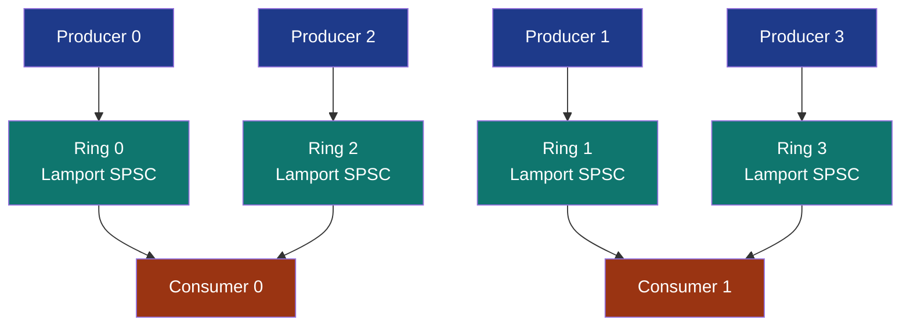

# SharedRingMpmc


Multi-producer / multi-consumer ring composed from N x M
independent Lamport SPSC rings. N producers each own one ring;
M consumers each statically own a round-robin partition of the N
rings. Each consumer is the sole drainer of its partition, so
the consumer-side CAS Vyukov MPMC needs is not present here.

Per-producer FIFO is preserved (each producer's items arrive at
one consumer in push order). Global FIFO across producers is not
preserved. When global FIFO matters, use
[`SharedRing`](../shared-ring/) (Vyukov MPMC).

> **The "composed N x M Lamport grid" primitive.** Push cost is
> pure Lamport SPSC. Pop cost is the same on the consumer's first
> non-empty ring, plus one Acquire load per empty ring scanned
> before it.

## Constraints

- **`n_producers >= n_consumers >= 1`**: every consumer owns at
  least one ring.
- **N producer handles + M consumer handles**, all
  `Send + !Sync + !Clone`.
- **Payload up to `SPSC_PAYLOAD_BYTES = 64`** per slot.
- **Each ring's capacity must be a power of 2**.
- **In-process anonymous** (`create_anon_grid`) or
  **cross-process file-backed** (`create_grid` / `open_grid`,
  one file per producer ring named `<path_prefix>.{i}.bin`).
- **Huge / large pages** (`create_grid_in_region`): all N SPSC
  lanes are carved back-to-back from ONE caller-owned
  `RegionOwner` (the region must hold
  `spsc_ring_file_size(capacity) * n_producers` bytes), so the
  whole grid sits on a handful of 2 MB / 1 GB pages instead of N
  small mappings - the case where large pages actually shed TLB
  pressure. (`SharedRing::create_in_region` is the global-FIFO
  Vyukov counterpart.)

## Round-robin partitioning



Consumers take rings round-robin: consumer `m` drains every ring
`i` with `i % M == m`.

Consumer i owns producer rings i, i + M, i + 2*M, etc. For
N=4 / M=2: consumer 0 drains rings {0, 2}, consumer 1 drains
rings {1, 3}. For N=M every consumer owns exactly one ring and
per-pop cost is pure Lamport SPSC.

Static partitioning means each consumer is sole-drainer of its
rings. No consumer-side CAS, no work-stealing. The trade is
load-balance brittleness: if one consumer's producers are
backlogged and another's are quiet, the second consumer goes
idle. For workloads with skewed producer rates, a
[work-stealing deque](../shared-deque/) is the better primitive.

## Worked example: symmetric MPMC, in-process

```rust
use subetha_cxc::SharedRingMpmc;
use subetha_cxc::spsc_ring::SPSC_PAYLOAD_BYTES;

let (producers, consumers) =
    SharedRingMpmc::create_anon_grid(4, 4, 1024)?;

let prods: Vec<_> = producers.into_iter().enumerate().map(|(pid, p)| {
    std::thread::spawn(move || {
        for i in 0..10_000u32 {
            let mut buf = [0u8; SPSC_PAYLOAD_BYTES];
            buf[..4].copy_from_slice(&(pid as u32).to_le_bytes());
            buf[4..8].copy_from_slice(&i.to_le_bytes());
            while p.try_push(&buf).is_err() {
                std::hint::spin_loop();
            }
        }
    })
}).collect();

let cons: Vec<_> = consumers.into_iter().map(|c| {
    std::thread::spawn(move || -> u32 {
        let mut got = 0u32;
        let mut out = [0u8; SPSC_PAYLOAD_BYTES];
        while got < 20_000 {
            if c.try_pop(&mut out).is_ok() {
                got += 1;
            } else {
                std::hint::spin_loop();
            }
        }
        got
    })
}).collect();

for p in prods { p.join().unwrap(); }
let totals: Vec<u32> = cons.into_iter().map(|c| c.join().unwrap()).collect();
assert_eq!(totals.iter().sum::<u32>(), 40_000);
```

Cross-process file-backed grid:

```rust
// Process A:
let (producers, _consumers) =
    SharedRingMpmc::create_grid("/tmp/mpmc", 4, 2, 1024)?;
// drives the producer threads

// Process B:
let (_producers, consumers) =
    SharedRingMpmc::open_grid("/tmp/mpmc", 4, 2, 1024)?;
// drains the partitioned subset
```

The round-robin partition is deterministic from N + M alone, so
both sides agree on which consumer owns which rings without any
out-of-band coordination.

## Bench evidence

`crates/subetha-cxc/examples/mpmc_shootout.rs`, 4 producers x
250,000 items each = 1,000,000 total, busy-spin on Full / Empty,
best-of-5 trials with one warmup pass. Zen+ R7 2700 / Windows 11.

| Variant | Throughput | vs Vyukov | vs crossbeam |
|---|---:|---:|---:|
| **`SharedRingMpmc` (composed 4 x 4 Lamport grid)** | **19.84 M items/s** | **3.18x** | **2.98x** |
| `crossbeam_channel::bounded(4096)` MPMC | 6.66 M items/s | 1.07x | baseline |
| `SharedRing` (Vyukov MPMC) | 6.24 M items/s | baseline | 0.94x |

Absolute numbers drift run to run on a desktop host; the ~3x lead
of the composed grid over both Vyukov MPMC and crossbeam's bounded
MPMC channel is the stable signal, because every push is pure
Lamport SPSC (zero CAS contention) and every pop is the same on
its owning ring.

## When to reach for `SharedRing` (Vyukov) instead

Pick the Vyukov MPMC ring when **any of these is a hard
requirement**:

- **Global FIFO across all producers**: events must arrive at
  consumers in monotonic `producer_seq` order. Composed grids
  give per-producer FIFO only.
- **Total ordering for a transaction stream**: each consumer
  needs to see the same ordering of every producer's pushes.
- **Single MMF file**: the composed grid uses N files (one per
  producer ring). A single `SharedRing` is one file regardless
  of producer count.

For everything else (work distribution, fan-in pipelines, task
queues, telemetry aggregation, request dispatch), the composed
grid is the right default.

## Known limitations

- **`n_producers >= n_consumers`**: the factory panics at runtime
  if violated.
- **Per-producer FIFO only**: use `SharedRing` for global FIFO.
- **Static partitioning**: consumer i owns rings (i mod M)
  forever. For dynamic load balancing use a
  [work-stealing deque](../shared-deque/).
- **N files in file-backed mode**: cross-process attach via
  `open_grid` opens all N files in parallel.
- **Memory scales with N**: each producer ring carries its own
  header (192 B) + capacity * 64 B payload.

## References

- Source: `crates/subetha-cxc/src/mpmc_ring.rs` (446 lines, 3
  unit tests). `MpmcProducer` exposes `try_push` / `capacity()` /
  `head()`; `MpmcConsumer` exposes `try_pop` / `n_rings()` /
  `approx_subset_len()`. Re-exported at the crate root.
- Bench: `crates/subetha-cxc/examples/mpmc_shootout.rs`.
- Ring family siblings:
  [shared-ring-spsc](../shared-ring-spsc/) (the SPSC primitive
  the grid composes per producer),
  [shared-ring-mpsc](../shared-ring-mpsc/) (N-producer single-
  consumer case),
  [shared-ring](../shared-ring/) (Vyukov MPMC, global-FIFO
  override),
  [shared-broadcast-ring](../shared-broadcast-ring/) (fan-out
  variant where every consumer sees every item),
  [shared-deque](../shared-deque/) (work-stealing variants for
  skewed-producer loads).
