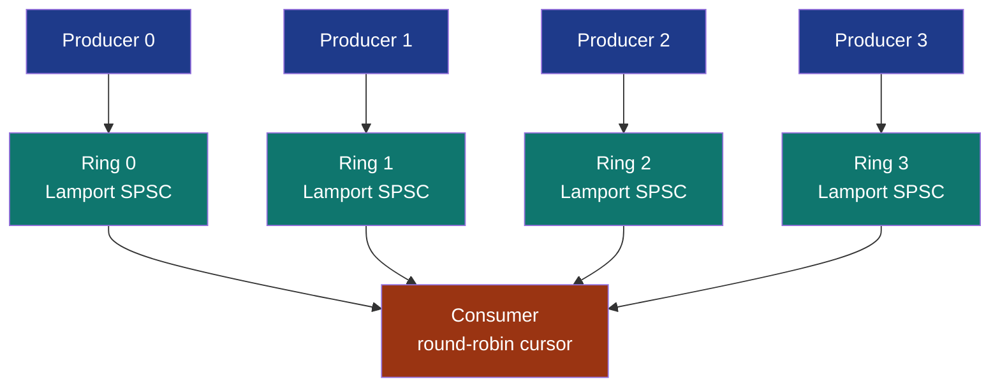

# SharedRingMpsc + SharedRingMpscFifo


Multi-producer / single-consumer ring family. Two complementary
primitives, with different protocol shapes and different ordering
guarantees:

- **`SharedRingMpsc`** - the default. Composed from N independent
  [Lamport SPSC](../shared-ring-spsc/) rings, one per producer;
  consumer drains them round-robin. **Per-producer FIFO**, no
  global ordering across producers. Wins throughput at every
  measured N because each producer pushes to its own ring with
  zero CAS contention.

- **`SharedRingMpscFifo`** - the override. Single shared
  [Vyukov MPMC ring](../shared-ring/) where producers contend on
  one `producer_seq` CAS but the consumer uses the
  `try_pop_spsc` fast path to skip the consumer-side CAS.
  **Preserves global FIFO across all producers**. Reach for this
  when total ordering is a correctness requirement, not a
  performance choice.

Both expose `Vec<Producer>` + `Consumer`. Producers are
`Send + !Sync + !Clone`; the consumer is the same. The compiler
enforces one thread per handle.

## `SharedRingMpsc` (composed N Lamport rings)



### Per-op cost

- **Push**: pure Lamport SPSC (1 Acquire load + 1 Release store +
  1 owner-private Relaxed load). Zero CAS, zero cross-producer
  contention.
- **Pop**: 1 Acquire load + 1 Release store on the successful
  ring, plus 1 Acquire load per empty ring scanned before
  finding a non-empty one. Worst case: N Acquire loads then
  `Err(Empty)`.

### Constructor API

```rust
pub fn create_anon_pool(
    n_producers: usize,
    capacity: usize,
) -> Result<(Vec<MpscProducer>, MpscConsumer), RingError>;

pub fn create_pool(
    path_prefix: impl AsRef<Path>,
    n_producers: usize,
    capacity: usize,
) -> Result<(Vec<MpscProducer>, MpscConsumer), RingError>;

pub fn open_pool(
    path_prefix: impl AsRef<Path>,
    n_producers: usize,
    expected_capacity: usize,
) -> Result<(Vec<MpscProducer>, MpscConsumer), RingError>;
```

File-backed mode creates one MMF per producer ring at
`<path_prefix>.{i}.bin`.

## `SharedRingMpscFifo` (single Vyukov ring)

Construction returns N producer handles all sharing one
underlying [`SharedRing`](../shared-ring/). Producers use the
standard Vyukov `try_push` (CAS on `producer_seq`). The consumer
uses `try_pop_spsc` (no consumer CAS, sound because the handle
type is `!Sync + !Clone`).

### Per-op cost

- **Push**: Vyukov MPMC producer-side. CAS on `producer_seq` to
  claim the slot (retries on contention from other producers),
  memcpy payload, Release-store on `slot[pos % cap].sequence`.
  Four cross-thread atomics in the success path.
- **Pop**: 1 Relaxed load on `consumer_seq` + 1 Acquire load on
  the slot's sequence + 1 Relaxed store on `consumer_seq` + 1
  Release store on `slot.sequence`. No consumer-side CAS.

File-backed mode uses one MMF (not N), so the on-disk layout
matches a plain `SharedRing` and the file can be opened from
other processes via `SharedRing::open` if the deployment
guarantees the single-consumer property.

## Bench evidence + crossover analysis

`crates/subetha-cxc/examples/mpmc_shootout.rs`, 250,000 items per
producer, 16-byte payloads, busy-spin on Full / Empty, best-of-5
trials with one warmup pass. Zen+ R7 2700 / Windows 11.

| N producers -> 1 consumer | `SharedRingMpsc` (composed) | `SharedRingMpscFifo` (single) | `crossbeam_channel::bounded` | `SharedRing` (Vyukov as MPSC) |
|---|---:|---:|---:|---:|
| **N=2** | **23.31 M items/s** | 14.83 M items/s | 10.54 M items/s | 8.97 M items/s |
| **N=4** | **9.61 M items/s** | 6.64 M items/s | 7.51 M items/s | 3.74 M items/s |
| **N=8** | **14.76 M items/s** | 3.21 M items/s | 7.28 M items/s | 2.71 M items/s |

Absolute numbers drift run to run on a desktop host; the
structural signals hold across runs. The composed primitive wins
at every N. Fifo degrades sharply (14.8 -> 6.6 -> 3.2, even
dipping below crossbeam by N=4) because producer-side CAS
contention scales with producer count. The composed primitive
holds its class at every N because each producer pushes to its
own ring with zero CAS.

### Picking between them

| Question | Answer |
|---|---|
| Do you need global FIFO across all producers? | `SharedRingMpscFifo` |
| Do you need a single file on disk for cross-process attach? | `SharedRingMpscFifo` |
| Throughput at any N? | `SharedRingMpsc` (composed) |
| Producer count 4 or above? | `SharedRingMpsc` (Fifo collapses) |
| Don't know which? | `SharedRingMpsc` (default) |

## Worked example: 4 workers send results to one collector

```rust
use subetha_cxc::SharedRingMpsc;
use subetha_cxc::spsc_ring::SPSC_PAYLOAD_BYTES;

let (producers, consumer) = SharedRingMpsc::create_anon_pool(4, 1024)?;

let workers: Vec<_> = producers.into_iter().enumerate().map(|(id, p)| {
    std::thread::spawn(move || {
        for i in 0..10_000u32 {
            let mut buf = [0u8; SPSC_PAYLOAD_BYTES];
            buf[..4].copy_from_slice(&(id as u32).to_le_bytes());
            buf[4..8].copy_from_slice(&i.to_le_bytes());
            while p.try_push(&buf).is_err() {
                std::hint::spin_loop();
            }
        }
    })
}).collect();

let collector = std::thread::spawn(move || {
    let mut out = [0u8; SPSC_PAYLOAD_BYTES];
    let mut received = 0;
    while received < 40_000 {
        if consumer.try_pop(&mut out).is_ok() {
            received += 1;
        } else {
            std::hint::spin_loop();
        }
    }
});

for w in workers { w.join().unwrap(); }
collector.join().unwrap();
```

## Known limitations

### `SharedRingMpsc` (composed)

- **No global FIFO**: items from different producers interleave
  at the consumer based on round-robin drain order. Use
  `SharedRingMpscFifo` for global FIFO.
- **N files in file-backed mode**: cross-process attach has to
  open all N files in parallel via `open_pool`.
- **Memory scales with N**: each producer ring carries its own
  header (192 B) + capacity * 64 B payload.

### `SharedRingMpscFifo` (single ring)

- **Producer-side CAS contention scales superlinearly with N**:
  past N=4 the composed primitive is strictly better.
- **No stuck-slot recovery on the typed handle**: the underlying
  `SharedRing` exposes `heal_stuck_slot` but the
  `MpscFifoConsumer` wrapper does not surface it.
- **Single MMF on disk**: another process opening the same file
  via `SharedRing::open` can act as a competing consumer and
  break the SPSC contract on the consumer side.

## References

- Source: `crates/subetha-cxc/src/mpsc_ring.rs` (446 lines, 3
  unit tests). `MpscProducer` also exposes `capacity()` / `head()`
  and `MpscConsumer` exposes `n_producers()` / `approx_total_len()`;
  both `SharedRingMpsc` and `SharedRingMpscFifo` are re-exported at
  the crate root.
- Bench: `crates/subetha-cxc/examples/mpmc_shootout.rs`.
- Ring family siblings:
  [shared-ring-spsc](../shared-ring-spsc/) (the SPSC primitive
  `SharedRingMpsc` composes),
  [shared-ring](../shared-ring/) (Vyukov MPMC, the storage
  backing `SharedRingMpscFifo`),
  [shared-ring-mpmc](../shared-ring-mpmc/) (N x M extension of
  the composition pattern).
