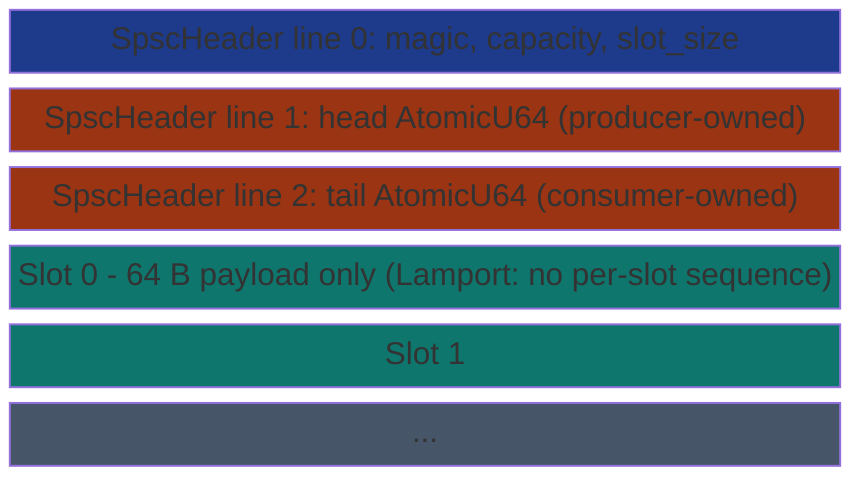

# SharedRingSpsc


Dedicated single-producer / single-consumer ring with the SPSC
contract enforced by the type system. Construction returns an
owned (`Producer`, `Consumer`) pair; neither half is `Clone`
or `Sync`, so the compiler refuses to let two threads hold the
producer side (or the consumer side) at the same time. The
underlying storage is a Lamport 1983 SPSC layout: head and tail
counters on separate cache lines, payload-only slots (no per-slot
atomic), one Acquire load + one Release store per push or pop.

> **The "Lamport SPSC + typed pair" primitive.** Producer owns
> `head`, consumer owns `tail`. Each side reads the peer's
> counter with Acquire and publishes its own with Release. Slot
> state is determined entirely by `head` vs `tail`; slots
> themselves are bytes, no per-slot sequence number to maintain.

## Constraints

- **Single producer, single consumer**: enforced at compile time
  by `Producer` and `Consumer` being `!Sync + !Clone + Send`.
- **Payload up to `SPSC_PAYLOAD_BYTES = 64`** bytes per slot.
- **Capacity must be a power of 2**.
- **In-process anonymous** (`create_anon_pair`) or
  **cross-process file-backed** (`create_pair` / `open_pair`) -
  same byte layout, same protocol.

## Lamport 1983 protocol



**Push** (in `Producer::try_push`):

1. `head = self.head.load(Relaxed)` - owner-private; no cross-thread contention.
2. `tail = self.tail.load(Acquire)` - read the peer's position to check full.
3. If `head - tail >= capacity`, return `Err(Full)`.
4. Memcpy payload into slot at `head & (capacity - 1)`.
5. `self.head.store(head + 1, Release)` - publish to the consumer.

**Pop** (in `Consumer::try_pop`): mirrors with `tail` Relaxed / `head` Acquire / Release on `tail`.

Two cross-thread atomics per op (Acquire load + Release store)
plus one owner-private Relaxed load. The Vyukov MPMC ring needs
four cross-thread atomics for the same op.

`head` and `tail` live on separate cache lines so the producer's
publish does not invalidate the consumer's `tail` cache line on
every push (and vice versa).

## Worked example

```rust
use std::thread;
use subetha_cxc::SharedRingSpsc;
use subetha_cxc::spsc_ring::SPSC_PAYLOAD_BYTES;

let (producer, consumer) = SharedRingSpsc::create_anon_pair(64)?;

let prod_thread = thread::spawn(move || {
    for i in 0..1_000_000u64 {
        let mut buf = [0u8; SPSC_PAYLOAD_BYTES];
        buf[..8].copy_from_slice(&i.to_le_bytes());
        while producer.try_push(&buf).is_err() {
            std::hint::spin_loop();
        }
    }
});

let cons_thread = thread::spawn(move || {
    let mut out = [0u8; SPSC_PAYLOAD_BYTES];
    let mut sum: u64 = 0;
    let mut got = 0u64;
    while got < 1_000_000 {
        if consumer.try_pop(&mut out).is_ok() {
            sum += u64::from_le_bytes(out[..8].try_into().unwrap());
            got += 1;
        } else {
            std::hint::spin_loop();
        }
    }
    sum
});

prod_thread.join().unwrap();
let sum = cons_thread.join().unwrap();
assert_eq!(sum, (0..1_000_000u64).sum::<u64>());
```

Cross-process file-backed uses `create_pair("/tmp/spsc.bin", 64)`
on the producer side and `open_pair("/tmp/spsc.bin", 64)` on the
consumer side; both return the (Producer, Consumer) pair and each
side drops the half it doesn't use.

## Bench evidence

`crates/subetha-cxc/examples/spsc_shootout.rs`, 1,000,000 items
per trial, 16-byte payloads, 1 producer + 1 consumer on separate
threads, busy-spin on Full / Empty, best-of-5 trials with one
warmup pass. Zen+ R7 2700 / Windows 11.

| Variant | Throughput | vs crossbeam |
|---|---:|---:|
| **`SharedRingSpsc::create_anon_pair` (Lamport)** | **37.79 M items/s** | **3.25x** |
| `SharedRing` SPSC fast path (file, `try_push_spsc`) | 36.44 M items/s | 3.14x |
| `SharedRing` SPSC fast path (anon, `try_push_spsc`) | 23.99 M items/s | 2.06x |
| `SharedRing` MPMC (file) | 21.26 M items/s | 1.83x |
| `SharedRing` MPMC (anon, `try_push` / `try_pop`) | 20.71 M items/s | 1.78x |
| `crossbeam_channel::bounded(4096)` | 11.62 M items/s | baseline |

Absolute numbers drift run to run on a desktop host (scheduler
placement and boost behavior move individual trials by 1.5x or
more - in this captured run the file-backed SPSC path even
out-drew the anon one, which inverts on the next run); the stable
signals across runs are crossbeam trailing every SubEtha variant,
the Lamport pair and SPSC fast paths leading the MPMC paths, and
the 2-3x class of the lead. The Lamport pair leads the Vyukov-based SPSC fast path
because the Vyukov path still pays the per-slot sequence atomic;
dedicated Lamport storage drops it and halves the per-op atomic
budget.

## Known limitations

- **Exactly one producer + one consumer**: enforced at compile
  time for single-process. Cross-process attach via file backing
  is the caller's responsibility to keep single-producer + single-
  consumer.
- **No global FIFO across multiple producers**: only one producer.
  For multi-producer fan-in see [shared-ring-mpsc](../shared-ring-mpsc/).
- **Crash recovery is "restart the sole producer"**: Lamport has
  no claimed-but-never-published pathology - a producer either
  published (head moved) or did not. The Vyukov
  [shared-ring](../shared-ring/) CAN strand a slot when a producer
  dies between its election CAS and its publish, which is what its
  `heal_stuck_slot(pos)` recovery API exists for; no equivalent is
  needed here.

## References

- Source: `crates/subetha-cxc/src/spsc_ring.rs` (Lamport
  `SpscRingCore`, 796 lines, 10 unit tests) + the typed
  `SharedRingSpsc` / `Producer` / `Consumer` pair in
  `crates/subetha-cxc/src/shared_ring.rs`. Beyond `try_push` /
  `try_pop`, `Producer` exposes `capacity()` / `head()` and
  `Consumer` exposes `capacity()` / `tail()`. The raw
  `SpscRingCore` additionally offers `create_from_shm` /
  `create_in_region` / `peek_slot` (zero-copy) / `head_signal`,
  used by the blocking + async wrappers rather than the typed pair.
- Bench: `crates/subetha-cxc/examples/spsc_shootout.rs`.
- Ring family siblings:
  [shared-ring](../shared-ring/) (Vyukov MPMC, global-FIFO override),
  [shared-ring-mpsc](../shared-ring-mpsc/) (N Lamport rings for fan-in),
  [shared-ring-mpmc](../shared-ring-mpmc/) (N x M Lamport grid).
- Theory: Leslie Lamport, *Specifying Concurrent Program Modules*,
  ACM TOPLAS 5(2), 1983.
