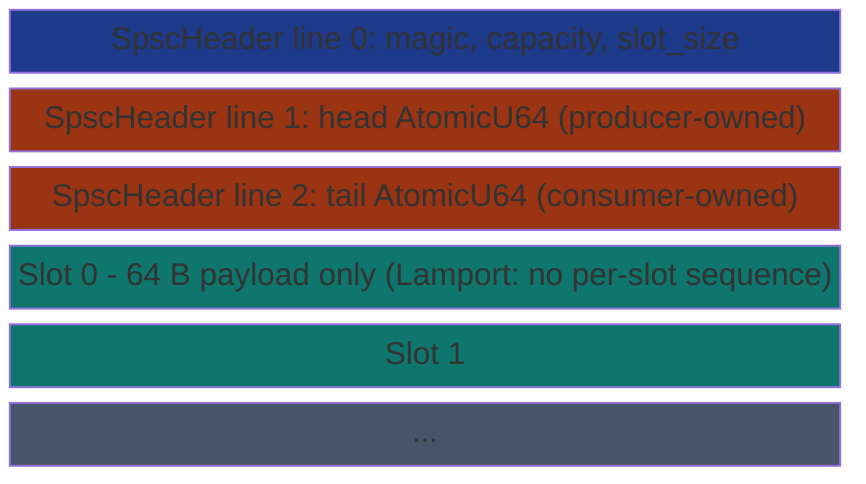

# SharedRingSpsc


Dedicated single-producer / single-consumer ring with the SPSC
contract enforced by the type system. Construction returns an
owned (`Producer`, `Consumer`) pair; neither half is `Clone`
or `Sync`, so the compiler refuses to let two threads hold the
producer side (or the consumer side) at the same time. The
underlying storage is a Lamport 1983 SPSC layout: head and tail
counters on separate cache lines, payload-only slots (no per-slot
atomic), one Acquire load + one Release store per push or pop.

> **The "Lamport SPSC + typed pair" primitive.** Producer owns
> `head`, consumer owns `tail`. Each side reads the peer's
> counter with Acquire and publishes its own with Release. Slot
> state is determined entirely by `head` vs `tail`; slots
> themselves are bytes, no per-slot sequence number to maintain.

## Constraints

- **Single producer, single consumer**: enforced at compile time
  by `Producer` and `Consumer` being `!Sync + !Clone + Send`.
- **Payload up to `SPSC_PAYLOAD_BYTES = 64`** bytes per slot.
- **Capacity must be a power of 2**.
- **In-process anonymous** (`create_anon_pair`) or
  **cross-process file-backed** (`create_pair` / `open_pair`) -
  same byte layout, same protocol.
- **File-backed create obtains the ring** (`create_pair`, and
  `SpscRingCore::create` under it): it initializes the file only
  when the path does not yet exist, and otherwise attaches with
  queued items and both cursors intact; a different capacity is
  a `LayoutMismatch`. Attaching is for a restarted process
  resuming its own side - SPSC still means one producer and one
  consumer total. `SpscRingCore::reset` truncates and
  reinitializes, and on Windows succeeds only once every mapping
  handle is gone.

## What it is

`SharedRingSpsc` is a factory; the handles you use are `Producer` and
`Consumer`, each owning one half of the contract. Cloning `producer`
is a compile error, and so is sharing `&producer` across threads: the
SPSC contract that the no-CAS hot path rests on is enforced by the
type system rather than by caller discipline.

The two halves share one `subetha_cxc::spsc_ring::SpscRingCore`
through an `Arc`. The pair is the ergonomic interface; the core is
exposed so the composed `SharedRingMpsc` and `SharedRingMpmc` build
their MPSC and MPMC shapes out of several SPSC rings without
duplicating the storage layout. The ring stays alive as long as
either half does.

## Lamport 1983 protocol


```mermaid
block-beta
  columns 1
  meta["SpscHeader line 0: magic, capacity, slot_size"]
  head["SpscHeader line 1: head AtomicU64 (producer-owned)"]
  tail["SpscHeader line 2: tail AtomicU64 (consumer-owned)"]
  s0["Slot 0 - 64 B payload only (Lamport: no per-slot sequence)"]
  s1["Slot 1"]
  dots["..."]
  classDef hdrC fill:#1e3a8a,color:#ffffff
  classDef hotC fill:#9a3412,color:#ffffff
  classDef slotC fill:#0f766e,color:#ffffff
  classDef padC fill:#475569,color:#ffffff
  class meta hdrC
  class head,tail hotC
  class s0,s1 slotC
  class dots padC
```

**Push** (in `Producer::try_push`):

1. `head = self.head.load(Relaxed)` - owner-private; no cross-thread contention.
2. `tail = self.tail.load(Acquire)` - read the peer's position to check full.
3. If `head - tail >= capacity`, return `Err(Full)`.
4. Memcpy payload into slot at `head & (capacity - 1)`.
5. `self.head.store(head + 1, Release)` - publish to the consumer.

**Pop** (in `Consumer::try_pop`):

1. `tail = self.tail.load(Relaxed)` - owner-private.
2. `head = self.head.load(Acquire)` - read the peer's position to check empty.
3. If `tail == head`, return `Err(Empty)`.
4. Memcpy payload out of slot at `tail & (capacity - 1)`.
5. `self.tail.store(tail + 1, Release)` - free the slot.

Two cross-thread atomics per op (Acquire load + Release store)
plus one owner-private Relaxed load. The Vyukov MPMC ring needs
four cross-thread atomics for the same op.

`head` and `tail` live on separate cache lines so the producer's
publish does not invalidate the consumer's `tail` cache line on
every push (and vice versa). The header is three cache lines, 192
bytes, where one would hold its fields.

## Worked example

```rust
use std::thread;
use subetha_cxc::SharedRingSpsc;
use subetha_cxc::spsc_ring::SPSC_PAYLOAD_BYTES;

let (producer, consumer) = SharedRingSpsc::create_anon_pair(64)?;

let prod_thread = thread::spawn(move || {
    for i in 0..1_000_000u64 {
        let mut buf = [0u8; SPSC_PAYLOAD_BYTES];
        buf[..8].copy_from_slice(&i.to_le_bytes());
        while producer.try_push(&buf).is_err() {
            std::hint::spin_loop();
        }
    }
});

let cons_thread = thread::spawn(move || {
    let mut out = [0u8; SPSC_PAYLOAD_BYTES];
    let mut sum: u64 = 0;
    let mut got = 0u64;
    while got < 1_000_000 {
        if consumer.try_pop(&mut out).is_ok() {
            sum += u64::from_le_bytes(out[..8].try_into().unwrap());
            got += 1;
        } else {
            std::hint::spin_loop();
        }
    }
    sum
});

prod_thread.join().unwrap();
let sum = cons_thread.join().unwrap();
assert_eq!(sum, (0..1_000_000u64).sum::<u64>());
```

Cross-process file-backed uses `create_pair("/tmp/spsc.bin", 64)`
on the producer side and `open_pair("/tmp/spsc.bin", 64)` on the
consumer side; both return the (Producer, Consumer) pair and each
side drops the half it doesn't use.

Process A (producer side):

```rust
use subetha_cxc::SharedRingSpsc;
let (producer, _consumer) = SharedRingSpsc::create_pair("/tmp/spsc.bin", 64)?;
// _consumer drops; another process attaches via open_pair.
for i in 0..1_000_000u64 {
    while producer.try_push(&i.to_le_bytes()).is_err() {
        std::hint::spin_loop();
    }
}
```

Process B (consumer side):

```rust
use subetha_cxc::SharedRingSpsc;
let (_producer, consumer) = SharedRingSpsc::open_pair("/tmp/spsc.bin", 64)?;
let mut out = [0u8; 64];
loop {
    if consumer.try_pop(&mut out).is_ok() {
        // handle item
    } else {
        std::thread::sleep(std::time::Duration::from_millis(1));
    }
}
```

Cross-process visibility relies on the OS page cache aliasing the
file between the two processes' address spaces. The SPSC contract
holds across processes the way it does across threads: one process
produces, one process consumes. A second producer or a second
consumer on the same file breaks the contract and corrupts the ring.

## Bench evidence

`crates/subetha-cxc/examples/spsc_shootout.rs`, 1,000,000 items
per trial, 16-byte payloads, 1 producer + 1 consumer on separate
threads, busy-spin on Full / Empty, best-of-5 trials with one
warmup pass. Zen+ R7 2700 / Windows 11.

| Variant | Throughput | vs crossbeam |
|---|---:|---:|
| **`SharedRingSpsc::create_anon_pair` (Lamport)** | **37.79 M items/s** | **3.25x** |
| `SharedRing` SPSC fast path (file, `try_push_spsc`) | 36.44 M items/s | 3.14x |
| `SharedRing` SPSC fast path (anon, `try_push_spsc`) | 23.99 M items/s | 2.06x |
| `SharedRing` MPMC (file) | 21.26 M items/s | 1.83x |
| `SharedRing` MPMC (anon, `try_push` / `try_pop`) | 20.71 M items/s | 1.78x |
| `crossbeam_channel::bounded(4096)` | 11.62 M items/s | baseline |

Absolute numbers drift run to run on a desktop host (scheduler
placement and boost behavior move individual trials by 1.5x or
more - in this captured run the file-backed SPSC path even
out-drew the anon one, which inverts on the next run); the stable
signals across runs are crossbeam trailing every SubEtha variant,
the Lamport pair and SPSC fast paths leading the MPMC paths, and
the 2-3x class of the lead. The Lamport pair leads the Vyukov-based SPSC fast path
because the Vyukov path still pays the per-slot sequence atomic;
dedicated Lamport storage drops it and halves the per-op atomic
budget.

An earlier capture of the same shootout on the same host measured the
Lamport pair at 62.96 M items/s (5.95x crossbeam), the `SharedRing`
MPMC anon path at 26.76 M items/s (2.53x), the anon SPSC fast path at
23.27 M items/s (2.20x), the file MPMC path at 19.05 M items/s
(1.80x), the file SPSC fast path at 18.78 M items/s (1.78x) and
`crossbeam_channel::bounded(4096)` at 10.71 M items/s, the Lamport
pair 2.71x ahead of the anon SPSC fast path.

The comparison is held to:

- **Fair contenders**: `crossbeam_channel::bounded` is the standard
  in-process bounded channel. Every variant moves the same 16-byte
  payload at the same capacity (4096) through the same busy-spin loop
  on Full / Empty.
- **Single-trial variance is high** on Windows from scheduler noise;
  best-of-5 with a warmup pass is what steadies the comparison.
- **Cross-thread, in-process**: both sides run in one process.
  Cross-process one-way latencies are in
  `docs/cross_process_ipc_results.json`, which records 80.2 ns for the
  pinned SPSC ring over an MMF on a Windows x86_64 host.

## Known limitations

- **Exactly one producer + one consumer**: enforced at compile
  time for single-process. Cross-process attach via file backing
  is the caller's responsibility to keep single-producer + single-
  consumer.
- **No global FIFO across multiple producers**: only one producer.
  For multi-producer fan-in see [shared-ring-mpsc](../shared-ring-mpsc/).
- **Crash recovery is "restart the sole producer"**: Lamport has
  no claimed-but-never-published pathology - a producer either
  published (head moved) or did not. The Vyukov
  [shared-ring](../shared-ring/) can strand a slot when a producer
  dies between its election CAS and its publish, which is what its
  `heal_stuck_slot(pos)` recovery API exists for; no equivalent is
  needed here.

## References

- Source: `crates/subetha-cxc/src/spsc_ring.rs` (Lamport
  `SpscRingCore`, 796 lines, 10 unit tests) + the typed
  `SharedRingSpsc` / `Producer` / `Consumer` pair in
  `crates/subetha-cxc/src/shared_ring.rs`. Beyond `try_push` /
  `try_pop`, `Producer` exposes `capacity()` / `head()` and
  `Consumer` exposes `capacity()` / `tail()`. The raw
  `SpscRingCore` additionally offers `create_from_shm` /
  `create_in_region` / `peek_slot` (zero-copy) / `head_signal`,
  used by the blocking + async wrappers rather than the typed pair.
- Bench: `crates/subetha-cxc/examples/spsc_shootout.rs`.
- Ring family siblings:
  [shared-ring](../shared-ring/) (Vyukov MPMC, global-FIFO override),
  [shared-ring-mpsc](../shared-ring-mpsc/) (N Lamport rings for fan-in),
  [shared-ring-mpmc](../shared-ring-mpmc/) (N x M Lamport grid).
- Theory: Leslie Lamport, *Specifying Concurrent Program Modules*,
  ACM TOPLAS 5(2), 1983.
