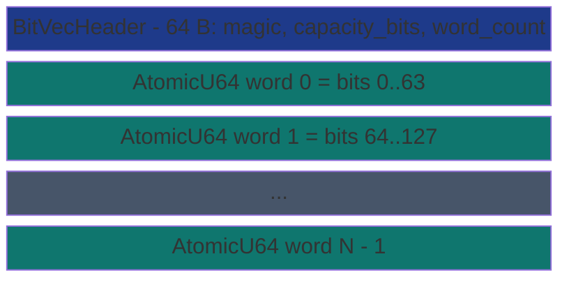

# SharedBitVec


Cross-process bit-packed boolean array. Storage is a contiguous
array of `AtomicU64` words inside an MMF; every per-bit operation
is one lock-free atomic RMW (`fetch_or` for set, `fetch_and` for
clear, `fetch_xor` for toggle, `load` for get). Multiple processes
or threads setting distinct bits in the same word compose
correctly with no lost updates.

> **The "cross-process bit array without a mutex" primitive.**
> Get hits at 1.84 ns vs `Mutex<Vec<u64>>` 17.54 ns (**9.5x
> faster**, lock-free vs lock-acquire); set at 8.20 ns vs
> `Mutex<Vec<u64>>` 17.22 ns (**2.1x faster**). 8x storage
> density vs `Vec<bool>` (1 bit/slot vs 1 byte/slot). The
> architectural lever stacks: lock-free per-op cost AND
> cross-process visibility AND 8x denser layout.

**Constraints (read first):**

- **Native sidecar integration**: the struct carries a `HandshakeHeader` + `ObservationRing` and implements `subetha_sidecar::AdaptiveInstance`. Wrap in `SidecarBox::new` to register with the global sidecar; raw `create()` / `open()` return the unregistered type unchanged.

- **Fixed capacity at create**: `capacity_bits` is locked in the
  header; cross-handle opens verify it matches.
- **One u64 word per 64 bits**: indexing is `(bit / 64, bit % 64)`.
- **RMW for single-bit ops**: `set`, `clear`, `toggle` use
  AcqRel `fetch_or` / `fetch_and` / `fetch_xor`.
- **Read is lock-free Acquire**: `get` is one atomic load.
- **Range ops mix RMW and store**: boundary words use RMW (preserves
  bits outside the range); fully-covered interior words use plain
  Release-store (overwrites every bit in the word).
- **Cross-process backed by MMF.**

---

## Table of contents

- [What it is](#what-it-is)
- [Operation table](#operation-table)
- [Range-op safety](#range-op-safety)
- [Bench evidence](#bench-evidence)
- [Worked examples](#worked-examples)
- [Use case patterns](#use-case-patterns)
- [Known limitations](#known-limitations)
- [Common pitfalls](#common-pitfalls)
- [References](#references)

---

## What it is



Total file size: `64 + ceil(capacity_bits / 64) * 8` bytes.
For 1024 bits, that's 64 + 128 = 192 bytes.

---

## Operation table

| Op | Atomic primitive | Ordering | Cost |
|---|---|---|---|
| `set(i)` | `word[w].fetch_or(1 << b)` | AcqRel | one cache-line RMW |
| `clear(i)` | `word[w].fetch_and(!(1 << b))` | AcqRel | one cache-line RMW |
| `toggle(i)` | `word[w].fetch_xor(1 << b)` | AcqRel | one cache-line RMW |
| `get(i)` | `word[w].load() & (1 << b)` | Acquire | one cache-line load |
| `set_range(lo, hi)` | RMW boundaries + store interior | AcqRel/Release | proportional to range |
| `count_ones()` | sum `count_ones()` per word | Acquire | proportional to capacity |

Every single-bit op is one atomic on one cache line. No global
lock, no SeqLock, no version field.

---

## Range-op safety

`set_range(lo, hi)` and `clear_range(lo, hi)` need to handle the
boundary words carefully:

- **First word** (partial cover at high end): RMW with a mask
  that touches only bits `[lo_bit..64)`.
- **Interior words** (fully covered): plain Release-store.
  Overwriting all 64 bits is safe because no concurrent writer
  is modifying bits THIS call expects to keep; we're
  setting / clearing every bit in the word.
- **Last word** (partial cover at low end): RMW with a mask
  that touches only bits `[0..hi_bit)`.

This avoids the cost of 64 separate atomic RMWs across an interior
word while preserving correctness for concurrent writers operating
on disjoint bits in the boundary words.

---

## Bench evidence

Bench harness: `crates/subetha-cxc/benches/shared_bit_vec.rs`.
Captured 2026-06-02 on Windows 11 / Zen+ R7 2700, Criterion with
`--sample-size=15 --warm-up-time=1 --measurement-time=2`.

| Op | `SharedBitVec` (mmf) | `Mutex<Vec<bool>>` | `Mutex<Vec<u64>>` (bit-packed) |
|---|---:|---:|---:|
| set | **8.20 ns** | 17.04 ns | 17.22 ns |
| get | **1.84 ns** | 17.04 ns | 17.54 ns |
| count_ones (1024 bits) | 28.61 ns | 185.96 ns | **20.89 ns** |
| storage (1024 bits) | **128 B** | 1024 B | 128 B |

**Relative performance (SharedBitVec vs best contender):**

- **set**: 2.1x faster than the bit-packed mutex baseline. The
  lock-free `fetch_or` saves a `Mutex::lock()` + `Mutex::unlock()`.
- **get**: 9.5x faster than both mutex variants. A single atomic
  Acquire load vs a full lock + array read + unlock.
- **count_ones**: 6.5x faster than `Vec<bool>`; slightly slower
  than `Mutex<Vec<u64>>` because the mutex baseline holds the
  lock once and scans sequentially with no per-word atomic
  acquire. SharedBitVec's per-word Acquire load is the cost of
  the cross-process safety contract.
- **storage**: 8x denser than `Vec<bool>` (1 bit/slot vs 1
  byte/slot). Identical to manual bit-packing - but with
  lock-free concurrent writes.

### Rule 3b bench audit

- **Fair contenders**: `Mutex<Vec<bool>>` is the naive 1-byte
  baseline; `Mutex<Vec<u64>>` is the manual bit-packed baseline
  doing exactly the same arithmetic SharedBitVec does internally.
- **Sized for workload**: 65,536-bit array for set workload (so
  the index modulo doesn't wrap inside a single cache line);
  1,024-bit array for count_ones.
- **No `thread::spawn` inside `b.iter`**: all benches are
  single-threaded; concurrent-set correctness is covered by the
  unit-test suite at the source level.
- **MMF lifecycle managed**: create + ops + drop + `remove_file`
  per bench; no leaks across runs.

### What the numbers do NOT show

- **Multi-thread / multi-process concurrent set**: the atomic RMW
  scales linearly until cache-line contention dominates. The
  mutex baselines serialize on the lock.
- **Cross-process visibility**: every process can map the same
  file and operate on the same bits.
- **Set-range throughput**: bulk operations skip per-bit RMW for
  interior words (one store per 64 bits).

---

## Worked examples

### Cross-process allocation bitmap

```rust
use subetha_cxc::SharedBitVec;

// Process A - daemon owns the master bitmap:
let slots = SharedBitVec::create("/tmp/slots.bin", 1024).unwrap();

// Worker process - claim a slot atomically:
let slots = SharedBitVec::open("/tmp/slots.bin", 1024).unwrap();
for i in 0..1024 {
    if !slots.set(i).unwrap() {
        // We won the race; slot `i` is now ours.
        return Some(i);
    }
}
None
```

### Bloom filter backing storage

```rust
use subetha_cxc::SharedBitVec;

// SharedBloomFilter wraps a SharedBitVec with k hash functions.
let bits = SharedBitVec::create("/tmp/bloom.bits", 95851).unwrap();
let h1 = fnv1a_seeded(b"hello", SEED_1);
let h2 = fnv1a_seeded(b"hello", SEED_2);
for i in 0..7 {
    let pos = h1.wrapping_add(i * h2) % 95851;
    bits.set(pos as usize).unwrap();
}
```

### Feature flag array

```rust
use subetha_cxc::SharedBitVec;

const FLAG_DARK_MODE: usize = 0;
const FLAG_BETA_API: usize = 1;
const FLAG_TELEMETRY: usize = 2;

let flags = SharedBitVec::create("/tmp/flags.bin", 64).unwrap();
flags.set(FLAG_DARK_MODE).unwrap();

// Any process reads the same flags lock-free:
if flags.get(FLAG_BETA_API).unwrap() {
    use_beta_endpoint();
}
```

---

## Use case patterns

### Pattern: cross-process work-stealing claim bits

A pool of N tasks; each task has a bit in the array. Workers
across processes race to `set(i)` - the first wins (returns
`false` from `set`), losers see `true` and move on.

### Pattern: presence map for a sparse keyspace

Key hashes into the bit index. `set` records presence, `get`
queries. With careful sizing this is the Bloom filter pattern
without the multi-hash distribution.

### Pattern: deduplicated event acks

Each event has a sequence number; the receiver `set`s the
corresponding bit. Duplicates are detected by `set` returning
`true`. `count_ones` reports total processed.

---

## Known limitations

- **Capacity fixed at create**: no auto-grow. Size for the
  worst-case workload.
- **Range stores on interior words are not RMW**: a concurrent
  writer setting a bit in an interior word during a
  `set_range` call sees its update overwritten. This is the
  documented contract - bulk range ops own the interior bits.
- **count_ones is O(words) with per-word Acquire load**: the
  cross-process atomicity contract costs more than a plain
  scan. Use sparingly in hot paths.
- **Cross-process backed by MMF.**

---

## Common pitfalls

- **Calling `set_range` concurrently with single-bit `set` on
  interior bits.** The range op overwrites every interior bit;
  the concurrent single-bit op's update is lost. Either coordinate
  externally or only use single-bit ops.

- **Treating `count_ones` as a hot-path counter.** It's O(words)
  with one Acquire load per word. For frequently-queried totals,
  maintain a separate `AtomicU64` counter alongside.

- **Sharing the file across processes with mismatched
  capacity_bits.** Open will fail with `LayoutMismatch`. Pin
  capacity in a shared spec.

- **Wrapping in a Mutex.** Pointless; the atomic RMW IS the
  synchronization mechanism.

---

## References

- Source: `crates/subetha-cxc/src/shared_bit_vec.rs` (655 lines, 17
  unit tests including concurrent-setter tests covering 4-thread
  disjoint bits, 64-thread same-word distinct bits, and 16-thread
  same-bit idempotent cases).
- Bench: `crates/subetha-cxc/benches/shared_bit_vec.rs` (set, get,
  count_ones, storage witness vs `Mutex<Vec<bool>>` and
  `Mutex<Vec<u64>>`).
- Consumer:
  [SHARED_BLOOM_FILTER.md](shared-bloom-filter/) - probabilistic
  set built on top of `SharedBitVec` with `k` hash functions.
- Sibling primitive:
  [SHARED_HASH_MAP.md](../maps/shared-hash-map/) - keyed map; bit-vec
  is the boolean-only specialization that drops keys entirely.
- Sibling primitive:
  [SHARED_ATOMIC.md](../atomics/shared-atomic/) - single-cell atomic; the
  bit-vec is an array of u64 atomics with bit addressing.
