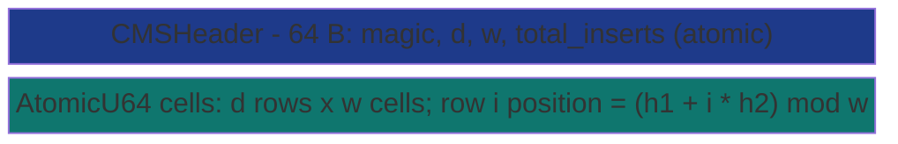

# SharedCountMinSketch


Cross-process probabilistic frequency estimator. `d` hash
functions, `w` cells per row. `insert(item)` does `d` atomic
`fetch_add(1)` ops on the row's chosen cells;
`estimate_count(item)` reads `d` cells and returns the minimum
- the tightest unbiased upper bound on true count. Hash
collisions overcount, never undercount.

> **The "frequency table without unbounded memory" primitive.**
> CMS is **slower per-op** than `Mutex<HashMap>` (insert 1.45x,
> estimate 2.94x) because d=4 means 4 hash computations + 4
> atomic ops vs HashMap's 1 lookup. The architectural lever
> is **bounded memory**: 32,832 bytes (fixed) vs HashMap
> ~480,000 bytes at 10k distinct items (**14.62x smaller**;
> at 1M items the gap is ~1500x). Plus cross-process visibility
> + tunable error bound HashMap cannot offer.

**Constraints (read first):**

- **Native sidecar integration**: the struct carries a `HandshakeHeader` + `ObservationRing` and implements `subetha_sidecar::AdaptiveInstance`. Wrap in `SidecarBox::new` to register with the global sidecar; raw `create()` / `open()` return the unregistered type unchanged.

- **`d * w` cells of `AtomicU64`**: fixed at create, bounded by
  caller's choice of (d, w).
- **Hash collisions overcount, never undercount**: estimate is
  a guaranteed upper bound on true count.
- **Error bound**: with probability `1 - delta`, estimate <=
  true + `epsilon * N` where N is total inserts. Sizing:
  `w >= e/epsilon`, `d >= ln(1/delta)`. Standard config
  (epsilon=0.001, delta=0.001): `suggest_config` returns
  d=7, w=2719 (`ceil(e/0.001)`), mem ~152 KB.
- **Double-hashing Kirsch-Mitzenmacher**: two FNV-1a + fmix64
  hashes; `pos[i] = (h1 + i * h2) % w`. Same technique as
  [`SharedBloomFilter`](shared-bloom-filter/).
- **Pure fetch_add writes**: no underflow, no spin loops, no
  CAS retries.
- **Cross-process backed by MMF.**

---

## Table of contents

- [What it is](#what-it-is)
- [Protocol](#protocol)
- [Bench evidence](#bench-evidence)
- [Worked examples](#worked-examples)
- [Use case patterns](#use-case-patterns)
- [Known limitations](#known-limitations)
- [Common pitfalls](#common-pitfalls)
- [References](#references)

---

## What it is



For d=4, w=1024: 64 + 4 * 1024 * 8 = 32,832 bytes total. Memory
scales with `(d, w)` only, not with the number of distinct
items.

---

## Protocol

### insert(item)

```text
h1 = fmix64(FNV1a(item, basis1))
h2 = fmix64(FNV1a(item, basis2))
for i in 0..d:
   raw  = h1 + i * h2                 # Kirsch-Mitzenmacher double-hash
   col  = raw & (w - 1)               # when w is pow2 ...
        | (raw * w) >> 64             # ... else Lemire fastrange (no DIV)
   row[i][col].fetch_add(1, AcqRel)
total_inserts.fetch_add(1, AcqRel)
```

`d` atomic increments. No coordination between rows; each is
independent. The column reduction is a bit-mask on power-of-two `w`
and Lemire multiply-shift (`(raw * w) >> 64`) otherwise - both land
in `[0, w)` without a hardware divide; the doc's `% w` shorthand
elsewhere is the conceptual form.

### estimate_count(item)

```text
h1 = FNV1a(item, basis1)
h2 = FNV1a(item, basis2)
min = u64::MAX
for i in 0..d:
   col = mask-or-fastrange(h1 + i * h2, w)   # same reduction as insert
   v = row[i][col].load(Acquire)
   if v < min: min = v
return min
```

`d` atomic loads + a min. The min IS the estimate (overcount
bias from collisions cannot decrease min below true count).

---

## Bench evidence

Bench harness: `crates/subetha-cxc/benches/shared_count_min_sketch.rs`.
Captured 2026-06-02 on Windows 11 / Zen+ R7 2700, Criterion with
`--sample-size=15 --warm-up-time=1 --measurement-time=2`.

Workload: d=4, w=1024 CMS. Baseline: `Mutex<HashMap<Vec<u8>, u64>>`.

| Op | `SharedCountMinSketch` (mmf) | `Mutex<HashMap>` | mmf relative |
|---|---:|---:|---|
| insert (same item repeatedly) | 168.70 ns | 115.98 ns | 1.45x slower |
| estimate_count | 134.86 ns | 45.80 ns | 2.94x slower |
| storage (32k items capacity, d=4 w=1024) | **32,832 bytes** | ~480,000 bytes @ 10k distinct | **14.62x smaller** |

### Reading the trade-offs

1. **Per-op CMS is slower.** `d=4` means 4 FNV hashes + 4 atomic
   ops per insert vs the HashMap's single hash + lookup. At
   higher d (e.g., d=7 for delta=0.001), the gap grows.
2. **Storage is the architectural lever.** CMS uses
   `d * w * 8` bytes regardless of distinct items.
   HashMap grows linearly with distinct keys. At 10k items
   the CMS is 14.62x smaller; at 1M items the gap is ~1500x.
3. **Tunable error bound.** Caller chooses (epsilon, delta);
   `suggest_config` computes (d, w). HashMap is exact but at
   unbounded memory cost.
4. **Cross-process visibility.** Multiple processes can each
   `insert` concurrently via lock-free fetch_add; observers
   read estimates without locks. HashMap has no cross-process
   story.

### Rule 3b bench audit

- **Fair contender**: `Mutex<HashMap<Vec<u8>, u64>>` is the
  textbook exact-count baseline. Same insert pattern; same
  lookup shape.
- **No `thread::spawn` inside `b.iter`**: single-threaded.
- **Sizing**: d=4 w=1024 is a representative small config;
  HashMap pre-allocated to 1024 capacity for fairness.
- **MMF lifecycle managed**: create + ops + drop + remove_file.
- **Storage witness reports per-distinct-item growth ratio**
  at a representative scale.

### What the numbers do NOT show

- **Storage scaling**: CMS is constant; HashMap is linear.
  At 1M distinct items the gap is ~1500x.
- **Cross-process inserts**: every process can increment cells
  via lock-free fetch_add; HashMap serializes on one mutex.
- **Heavy hitter detection**: CMS is the foundation for
  heavy-hitter algorithms (top-k by count); the bounded memory
  is what makes streaming heavy-hitter detection feasible.

---

## Worked examples

### Basic insert + estimate

```rust
use subetha_cxc::SharedCountMinSketch;

let cms = SharedCountMinSketch::create("/tmp/cms.bin", 4, 1024).unwrap();
for _ in 0..1000 { cms.insert(b"hot-key"); }
let est = cms.estimate_count(b"hot-key");
assert!(est >= 1000);   // upper bound guarantee
```

### Cross-process aggregation

```rust
// Process A (one of many):
let cms = SharedCountMinSketch::open("/tmp/cms.bin", 4, 1024).unwrap();
for ev in events_from_partition_a() {
    cms.insert(ev.key.as_bytes());
}

// Process B (also inserting):
let cms = SharedCountMinSketch::open("/tmp/cms.bin", 4, 1024).unwrap();
for ev in events_from_partition_b() {
    cms.insert(ev.key.as_bytes());
}

// Dashboard process (reading):
let cms = SharedCountMinSketch::open("/tmp/cms.bin", 4, 1024).unwrap();
let count = cms.estimate_count(b"hot-key");
println!("hot-key total: {count}");
```

---

## Use case patterns

### Pattern: streaming heavy-hitter detection

Ingest a stream of events; track frequencies in a fixed-memory
sketch; periodically scan for keys whose estimated count
exceeds a threshold.

### Pattern: rate-limiting at scale

A million distinct API keys; tracking per-key rates with an
exact HashMap is prohibitive. CMS gives bounded memory with
tunable accuracy.

### Pattern: cross-process metric aggregation

Each worker process increments its sketch on events; a
dashboard queries the same sketch for live counts. No lock
contention between workers (fetch_add is lock-free).

---

## Known limitations

- **Overcount only, never undercount**: estimate is an upper
  bound. For workloads needing exact counts, use a HashMap.
- **Tunable error trades memory for accuracy**: tighter
  epsilon/delta requires larger d*w.
- **No deletion**: items cannot be removed once inserted.
- **Fixed configuration at create**: (d, w) cannot change
  without rebuilding.
- **FNV-1a is not DoS-resistant**: adversarial input can
  elevate effective error rate.
- **Cross-process backed by MMF.**

---

## Common pitfalls

- **Treating the estimate as exact.** The min IS an upper
  bound but with overcount bias. For decision-making (e.g.,
  "is this key in the top 10?"), the bias is acceptable; for
  reporting, attach the (epsilon, delta) bounds.

- **Undersizing (d, w) for the workload.** Too few hashes or
  cells inflate the effective error rate. Use
  `suggest_config(epsilon, delta)` for a principled starting
  point.

- **Assuming distinct-item count affects memory.** It does
  not. The sketch IS the memory; insertion costs are fixed
  regardless of distinct count.

- **Wrapping in a Mutex.** Pointless; the fetch_add per cell
  is already concurrency-safe.

---

## References

- Source: `crates/subetha-cxc/src/shared_count_min_sketch.rs` (468
  lines, 12 unit tests covering insert+estimate, overcount safety,
  cross-handle visibility, suggest_config, and reset). Full API
  beyond insert/estimate_count: `insert_n(item, count)` (bulk
  increment), `reset()` (zero all cells + total_inserts),
  `suggest_config(epsilon, delta) -> (d, w)`, and the
  `d()` / `w()` / `total_inserts()` accessors. `CMSError` is
  `InvalidConfig` / `LayoutMismatch` / `IoError`;
  `cms_file_size(d, w)` sizes the backing file.
- Bench: `crates/subetha-cxc/benches/shared_count_min_sketch.rs`
  (insert, estimate, storage witness vs `Mutex<HashMap>`).
- Sibling primitive: [SHARED_BLOOM_FILTER.md](shared-bloom-filter/) -
  presence-only variant; CMS adds frequency.
- Sibling primitive:
  [SHARED_HYPER_LOG_LOG.md](shared-hyper-log-log/) -
  cardinality estimate (distinct count); CMS is per-key
  frequency.
- Original: Cormode + Muthukrishnan, "An Improved Data Stream
  Summary: The Count-Min Sketch and its Applications", 2005.
