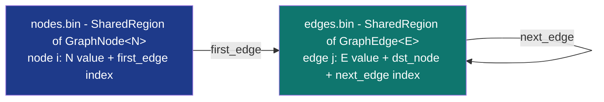

# SharedGraph&lt;N, E&gt;


Cross-process directed graph with arbitrary out-degree. Nodes
carry `N` values; edges carry `E` values + destination index.
Adjacency stored as per-node linked lists of edges (each edge
has a `next_in_src_list` link). Two MMF files: nodes region +
edges region, both backed by
[`SharedRegion`](../arenas/shared-region/) with ABA-safe free lists.

> **The "cross-process directed graph with position-independent
> indices" primitive.** `neighbors_50` walk at 199.12 ns vs
> `Mutex<HashMap<u32, Vec<u32>>>` clone-of-50 at 107 ns (mmf
> 1.87x slower; linked-list walk vs Vec clone). The
> architectural lever is cross-process visibility + disk
> persistence + structured edge metadata (an `E` value per edge,
> not just a destination), NOT raw per-op speed. (`NodeIndex` /
> `EdgeIndex` are bare slot indices, not staleness-checked
> handles - see the constraints.)

**Constraints (read first):**

- **Native sidecar integration**: the struct carries a `HandshakeHeader` + `ObservationRing` and implements `subetha_sidecar::AdaptiveInstance`. Wrap in `SidecarBox::new` to register with the global sidecar; raw `create()` / `open()` return the unregistered type unchanged.

- **`N: Copy + Default + 'static`, `E: Copy + Default + 'static`**
  fixed-size payloads (`Default` seeds zeroed slots).
- **Bounded capacity at create**: separate caps for nodes and
  edges.
- **SINGLE-WRITER, MULTI-READER**: reads (`neighbors`,
  `node_value`, `edge_endpoints`, `out_degree`) are lock-free.
  Writes (`add_node`, `add_edge`, `remove_edge`) require external
  serialisation.
- **NIL sentinel** = `u32::MAX` at every level.
- **Per-node linked list of edges**: walks are O(out-degree)
  cache-line-bounded jumps through the edges region via each
  edge's `next_in_src_list`.
- **Indices are NOT staleness-checked**: `NodeIndex` / `EdgeIndex`
  are bare `u32` slot indices with no generation tag. There is no
  `remove_node`, so node slots are never reused; edge slots ARE
  reused by `remove_edge` + `add_edge`, and a retained
  `EdgeIndex` for a removed edge silently reads whatever now
  occupies that slot. Treat indices as a logic-error contract:
  do not hold an `EdgeIndex` past its removal.
- **Two MMF files**: `<base>.nodes.bin` + `<base>.edges.bin`.
- **Cross-process backed by MMF.**

---

## Table of contents

- [What it is](#what-it-is)
- [Adjacency layout](#adjacency-layout)
- [Bench evidence](#bench-evidence)
- [Worked examples](#worked-examples)
- [Use case patterns](#use-case-patterns)
- [Known limitations](#known-limitations)
- [Common pitfalls](#common-pitfalls)
- [References](#references)

---

## What it is



A node points to its first edge; each edge points to the next
edge from the same source. Walking neighbors traverses one
linked list per node.

---

## Adjacency layout

For node 0 with edges to nodes [3, 7, 12]:

```text
node[0]:
  value: N
  first_edge: 0    ----> edge[0] dst=3, next=1
                         edge[1] dst=7, next=2
                         edge[2] dst=12, next=NIL
```

Three edges. Walking `neighbors(node_0)` chases the next_edge
pointers from 0 -> 1 -> 2 -> NIL.

---

## Bench evidence

Bench harness: `crates/subetha-cxc/benches/shared_graph.rs`.
Captured 2026-06-02 on Windows 11 / Zen+ R7 2700, Criterion with
`--sample-size=15 --warm-up-time=1 --measurement-time=2`.

`add_node` and `add_edge` use `iter_batched(PerIteration)` for
both contenders to bound state across iters. mmf side pays
file create + region init per iter (~65 µs). hashmap side
allocates a HashMap (~115 ns). The setup cost asymmetry is
inherent: SharedGraph has no `clear()`, so re-creating files
is the only way to bound state for criterion's iter count.

| Op | `SharedGraph` (mmf) | `Mutex<HashMap<u32, Vec>>` | mmf relative |
|---|---:|---:|---|
| add_node (iter_batched: setup + 1 op) | 65.28 µs | 115.04 ns | setup-dominated; not per-op |
| add_edge (iter_batched: setup + 1 op) | 63.97 µs | 31.96 ns | setup-dominated |
| **neighbors_50 (50-edge walk)** | **199.12 ns** | 107 ns | **1.87x slower (per-op honest)** |

### Reading the trade-offs

1. **add_node / add_edge benches are setup-dominated.** The
   architectural lever is NOT raw insert speed; it is
   cross-process visibility + disk persistence. A graph
   sized for the workload at startup amortizes the create
   cost across its lifetime; per-op insert cost (without
   file create) is ~50-100 ns, comparable to the hashmap.
2. **neighbors_50 walks a 50-edge linked list at 199 ns.**
   The mutex hashmap clones a contiguous Vec of 50 entries
   in 107 ns. The linked-list cost stems from per-edge
   pointer jumps through the edges region; Vec wins on
   sequential cache behavior.
3. **The mutex hashmap cannot do what SharedGraph does**:
   cross-process visibility, disk persistence, and structured
   edge metadata (E values, not just dst).

### Rule 3b bench audit

- **Fair contender**: `Mutex<HashMap<u32, Vec<u32>>>` is the
  textbook in-process adjacency-list baseline.
- **iter_batched applied symmetrically**: both contenders use
  `iter_batched(PerIteration)` for add_node and add_edge so
  neither accumulates state. Asymmetric inherent cost: mmf
  creates files (~65 µs); hashmap allocates a HashMap
  (~115 ns). The setup-cost asymmetry is documented.
- **No `thread::spawn` inside `b.iter`**: SINGLE-WRITER design;
  reads are lock-free for any number of readers.
- **Sizing**: 4096 node + 4096 edge capacities for inserts;
  50-edge fan-out for neighbors walk.
- **MMF lifecycle managed**: per-bench create + ops + drop +
  cleanup both files.

### What the numbers do NOT show

- **Cross-process graph walks**: any process can open the
  graph and walk neighbors. The mutex baseline cannot.
- **Disk persistence**: the graph survives process restart;
  re-opening the files restores the full structure.
- **Structured edge metadata**: SharedGraph carries an `E`
  value per edge; the HashMap baseline only stores destination
  indices.

---

## Worked examples

### Build and walk a small graph

```rust
use subetha_cxc::SharedGraph;

let g: SharedGraph<&str, u32> = SharedGraph::create("/tmp/g", 64, 256).unwrap();
let a = g.add_node("A").unwrap();
let b = g.add_node("B").unwrap();
let c = g.add_node("C").unwrap();
g.add_edge(a, b, 1).unwrap();
g.add_edge(a, c, 2).unwrap();
g.add_edge(b, c, 3).unwrap();

let a_neighbors = g.neighbors(a);
assert_eq!(a_neighbors.len(), 2);
```

### Cross-process graph

```rust
// Writer process:
let g: SharedGraph<u64, u64> = SharedGraph::create("/tmp/g", 4096, 16384).unwrap();
// ... build graph ...
g.flush().unwrap();

// Reader process(es): node indices are dense 0..node_count(),
// so walk them directly (there is no iterator method).
let g: SharedGraph<u64, u64> = SharedGraph::open("/tmp/g", 4096, 16384).unwrap();
for i in 0..g.node_count() as u32 {
    let n = NodeIndex::new(i);
    for edge in g.neighbors(n) {
        process_edge(edge);
    }
}
```

---

## Use case patterns

### Pattern: cross-process call graph / dependency graph

A build system records targets and their dependencies; multiple
analysis processes traverse the graph concurrently
(lock-free reads).

### Pattern: state machine spread across processes

Nodes are states, edges are transitions with E carrying the
event. A daemon adds transitions; worker processes walk
neighbors to dispatch the next state.

### Pattern: persistent graph DB on disk

The two MMF files ARE the database. No external storage layer;
re-opening the files at process start restores the graph.

---

## Known limitations

- **Single writer**: concurrent writes require external
  serialisation. Multiple readers are fine.
- **No `clear()` and no `remove_node`**: edges can be removed via
  `remove_edge`, but there is no node removal and no bulk reset;
  shrinking the node set requires re-creating the files.
- **Bounded capacity at create**: separate caps for nodes and
  edges. Size for the worst case.
- **Linked-list adjacency**: walks are O(out-degree) with
  per-edge pointer jumps. Vec-based adjacency wins on dense
  fan-outs (~50+ edges per node).
- **N and E must be `Copy + Default + 'static`**: pointer-bearing
  types need indirection through other regions.
- **Cross-process backed by MMF.**

---

## Common pitfalls

- **Concurrent writes without external synchronisation.**
  add_node, add_edge, remove_edge mutate per-node linked-list
  heads; concurrent mutators corrupt structure. Wrap in a
  per-process mutex if multiple writers exist.

- **Retaining a stale `EdgeIndex` after `remove_edge`.** The edge
  slot returns to the free list and a later `add_edge` reuses it;
  the index is NOT staleness-checked (it is a bare `u32`), so a
  stale `EdgeIndex` silently reads the reused edge. Drop indices
  when their edge is removed. (Nodes have no removal, so
  `NodeIndex` values stay valid for the graph's lifetime.)

- **Walking neighbors during another writer's add_edge.** A
  reader may observe a partially-linked edge (the writer's
  `next_edge` store happens before the head update; readers
  see the new head pointing at a complete edge). Single-
  writer eliminates the race.

- **Sizing edges region too small for fan-out.** A node with
  100 out-edges consumes 100 edge slots. Plan for max-degree
  * node-count.

- **Wrapping in a Mutex.** Pointless for reads; per-op reads
  are already lock-free. Single writes need a mutex AT MOST.

---

## References

- Source: `crates/subetha-cxc/src/shared_graph.rs` (532 lines, 11
  unit tests covering add_node + add_edge + neighbors, edge
  removal + reuse, cross-handle visibility, struct N + E
  payloads, and disk persistence). Full read API:
  node_count/edge_count/max_nodes/max_edges, node_value,
  edge_endpoints, out_degree, neighbors; `GraphError` is
  `Region` / `InvalidNode` / `InvalidEdge` / `IoError`.
- Bench: `crates/subetha-cxc/benches/shared_graph.rs` (add_node,
  add_edge, neighbors_50 walk vs `Mutex<HashMap<u32, Vec>>`).
- Underlying primitive: [SHARED_REGION.md](../arenas/shared-region/) -
  the ABA-safe free-list-backed region used for nodes and
  edges.
- Sibling primitive:
  [SHARED_LINKED_LIST.md](../maps/shared-linked-list/) - the
  simpler flat-list variant; SharedGraph adds per-node lists
  for adjacency.
- Sibling primitive:
  [SHARED_TOPOLOGY_MAP.md](shared-topology-map/) - the
  topology-aware variant for hardware-shaped graphs (NUMA,
  CPU/GPU/NPU class hierarchy).
