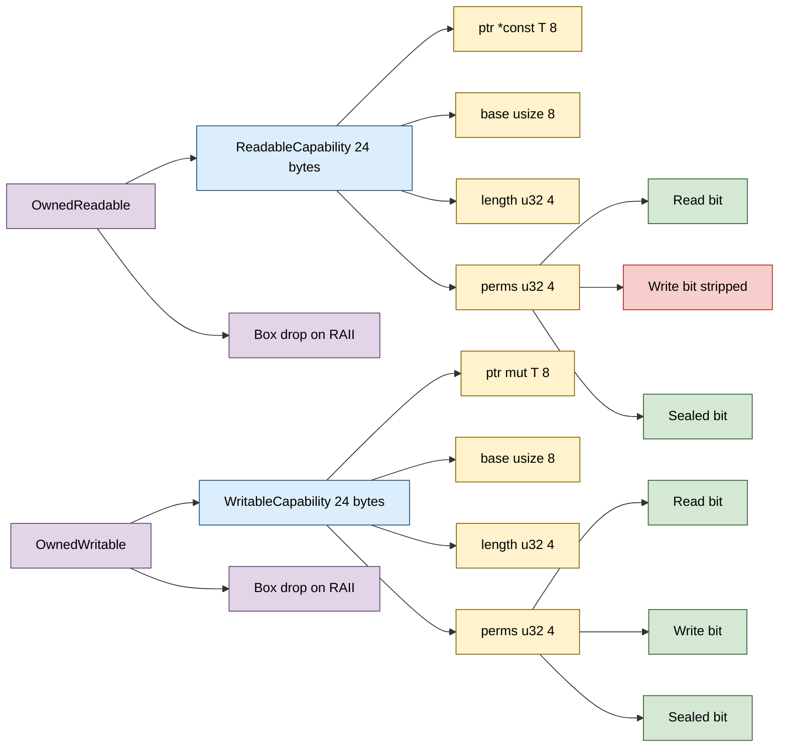

# ReadableCapability + WritableCapability + Owned* variants


CHERI-shaped capability pointers in software, lifted to type-level
read / write separation. A capability carries `(ptr, base, length,
perms)` and every dereference checks bounds + permissions + sealed
state. The capability semantics are encoded into the type system:
`ReadableCapability<T>` has no `write()` method at all,
`WritableCapability<T>` is `!Copy + !Clone` so the borrow checker
enforces the unique-writer guarantee. `OwnedReadableCapability<T>`
and `OwnedWritableCapability<T>` are RAII wrappers that own a
`Box<T>` and reclaim it on drop.

> **The "CHERI-in-software with no x86 silicon" primitive.** Real
> CHERI capability hardware exists on ARM Morello. There is no
> x86 / x86_64 equivalent. This module gives you the same
> capability surface (bounds + permissions + sealing) implemented
> in plain Rust with checked-arithmetic bounds tests. The companion
> [`RaspBatch<T>`](../rasp-pointer/) (`adaptive_rasp_batch` module)
> covers the x86 SIMD-batched bounds-check story.

**Constraints (read first):**

- **Software-only enforcement.** Bounds and permissions are checked
  in Rust code, not by hardware. This is a memory-safety layer
  ABOVE the existing virtual-memory protection, not a replacement
  for it. A capability cannot prevent the OS or another process
  from accessing the same memory.
- **`ReadableCapability::new` and `WritableCapability::new` are
  `unsafe`.** The caller asserts the `[base, base+length)` region
  is valid memory for the capability's lifetime AND that the
  initial `ptr` lies inside that region.
- **Safe constructors (`from_slice`, `from_slice_mut`) carry a
  lifetime.** The returned tuple includes a re-anchored borrow of
  the original slice. The borrow keeps the slice alive while the
  capability is in use; the capability does NOT extend the
  slice's lifetime on its own.
- **`ReadableCapability<T>` strips the Write bit at construction.**
  Both `new` and `from_slice` apply `perms & !WRITE_BIT`. If you
  pass `Read | Write` to a Readable constructor, the Write bit is
  silently masked off. There is no way to construct a Readable
  that grants Write access.
- **`WritableCapability<T>` is `!Copy + !Clone`.** Its struct
  derives only `Debug`. You cannot duplicate a writable cap. The
  `&mut self` receiver on `write()` plus the constructor's
  `&mut [T]` / consuming-Box contract give the unique-writer
  guarantee.
- **Sealed capabilities cannot read or write.** `read()` and
  `write()` check `is_sealed()` first and return
  `CapabilityError::Sealed`. The `unsealed()` method restores
  access (sealing is bit 31 of `perms`).
- **Bounds arithmetic uses `checked_add`.** Every `base + length`
  / `addr + size_of::<T>()` goes through `checked_add`, so a
  near-`usize::MAX` region correctly returns `AddressOverflow`
  instead of wrapping. Tests `readable_unsafe_new_overflow_guards`
  and `writable_unsafe_new_overflow_guards` exercise this.
- **`length` is `u32` (4 GiB maximum region).** The `length`
  field is a `u32`. Larger regions need multiple capabilities or
  a different primitive.
- **Capabilities are `!Send` and `!Sync`.** Both
  `ReadableCapability` and `WritableCapability` hold a raw pointer
  (`*const T` / `*mut T`) plus a matching `PhantomData`, and the
  module declares no `unsafe impl Send/Sync`, so the auto traits
  make them neither `Send` nor `Sync`. They cannot cross a thread
  boundary without the caller wrapping them in their own
  `Send`-asserting type; cross-thread shared access needs explicit
  synchronization on top.
- **24 bytes per capability.** `ptr: *const T` (8) + `base: usize`
  (8) + `length: u32` (4) + `perms: u32` (4) = 24 bytes. Three
  times the size of a bare pointer; sized for cache-line
  alignment.
- **In-process only.** The pointer + base fields are real virtual
  addresses. Cross-process sharing needs composition with a
  region-table primitive (e.g. `KTower2`).
- **Owned* variants take ownership of a Box.** They are NOT RAII
  wrappers around an arbitrary `*mut T`; the Drop impl assumes
  Box ownership and calls `Box::from_raw`. Using `into_box()`
  consumes the wrapper (via `std::mem::forget`) and returns the
  Box without firing Drop.

---

## Table of contents

- [What it is](#what-it-is)
- [Read vs Write at the type level](#read-vs-write-at-the-type-level)
- [Permission bits and sealing](#permission-bits-and-sealing)
- [Layout](#layout)
- [Constructor matrix](#constructor-matrix)
- [API at a glance](#api-at-a-glance)
- [Worked examples](#worked-examples)
- [Benchmark results](#benchmark-results)
- [Use case patterns](#use-case-patterns)
- [Known limitations (verified)](#known-limitations-verified)
- [Common pitfalls](#common-pitfalls)

---

## What it is

A capability is a triple-checked pointer: every dereference verifies
that the access lies inside the encoded `[base, base+length)`
region, that the encoded `perms` include the requested operation,
and that the capability is not `sealed`. The compiler enforces
read-vs-write separation by giving Readable and Writable distinct
types - Readable has no `write()` method, Writable's `write()`
requires `&mut self`.

```rust
// 24-byte layout, identical for both Readable and Writable:
ptr:    *const T   // 8 bytes - base or interior address
base:   usize      // 8 bytes - lower bound (often equals ptr)
length: u32        // 4 bytes - bytes from base
perms:  u32        // 4 bytes - permission bitmask + sealed bit
```

The owned variants (`OwnedReadableCapability`,
`OwnedWritableCapability`) wrap the corresponding capability and
own the underlying `Box<T>`, reclaiming it on `Drop`. This is the
no-manual-cleanup shape for capability semantics over allocated
values.

---

## Read vs Write at the type level

The shipped CHERI emulator chose to split read and write at the
type level rather than the runtime permission-bit level. Two
consequences:

1. **No accidental write through a Readable.** The compiler refuses
   `read_cap.write(value)` because no such method exists. A bit-flip
   that flipped the Write perm at runtime would have no effect on
   read-only callers.
2. **`!Copy + !Clone` for Writable is structural.** You cannot
   duplicate a writable capability to alias the writer. The
   compiler enforces this at the type-system level; no runtime
   reference counting needed.

`✶ Insight ────────────────────────────────`

This is "make illegal states unrepresentable" applied to memory
capabilities. The CHERI hardware model has a single
`capability_t` type with a permission word; a Read perm and a
Write perm are runtime checks. Lifting them to the type system
turns runtime checks into compile-time guarantees AND gives the
borrow checker something to enforce (the !Clone on Writable).

`──────────────────────────────────────────`

---

## Permission bits and sealing

`CapabilityPermission` (a `#[repr(u32)]` enum) defines:

| Variant | u32 | Semantic |
|---|---|---|
| `None` | 0 | No access. |
| `Read` | 1 | Allows `read()`. |
| `Write` | 2 | Allows `write()` (Writable only). |
| `Execute` | 4 | Reserved for execute-allow semantics (not exercised today). |

The `perms` field is a bitmask, so a cap can carry combinations
(`Read | Write`).

**Sealing** is an orthogonal bit:

- Bit 31 of `perms` is the sealed flag (`SEALED_BIT = 1 << 31`).
- A sealed cap returns `CapabilityError::Sealed` on every access.
- `cap.sealed()` consumes the cap and returns a sealed version.
- `cap.unsealed()` consumes the cap and returns an unsealed version.
- Sealing is INDEPENDENT of the permission bits: a sealed cap with
  Read+Write perms is still unreadable.

The architectural use case for sealing: temporarily disable a
capability without revoking it. The unsealed form can be reissued
later by code holding the sealed version.

---

## Layout



`#[repr(C)]` on both Readable and Writable. The field order is
fixed: `ptr -> base -> length -> perms`. The 24-byte total is
verified by `readable_layout_is_24_bytes` and
`writable_layout_is_24_bytes` tests.

---

## Constructor matrix

| Type | Safe constructor | Unsafe constructor | What it owns |
|---|---|---|---|
| `ReadableCapability<T>` | `from_slice(&[T], perms) -> (cap, &[T])` | `unsafe new(ptr, base, length, perms)` | Nothing (`Copy`). |
| `WritableCapability<T>` | `from_slice_mut(&mut [T]) -> (cap, &mut [T])` | `unsafe new(ptr, base, length, perms)` | Nothing (`!Copy`). |
| `OwnedReadableCapability<T>` | `new(value)`, `from_box(Box<T>)` | - | The `Box<T>`. |
| `OwnedWritableCapability<T>` | `new(value)`, `from_box(Box<T>)` | - | The `Box<T>`. |

The safe constructors for borrowed caps return a tuple. The
returned borrow re-anchors the slice's lifetime so the borrow
checker keeps the slice live for as long as the cap exists.

---

## API at a glance

```rust
use subetha_pointers::adaptive_cheri_pointer::{
    ReadableCapability, WritableCapability,
    OwnedReadableCapability, OwnedWritableCapability,
    CapabilityPermission as Perm,
};

// Read-only capability over a borrowed slice.
let storage = vec![1u64, 2, 3];
let (read_cap, _anchor) = ReadableCapability::from_slice(
    storage.as_slice(), Perm::Read as u32,
);
let value = read_cap.read().unwrap();  // = 1

// Writable capability over a mutable slice.
let mut buf = vec![0u64; 4];
let (mut write_cap, _anchor) = WritableCapability::from_slice_mut(buf.as_mut_slice());
write_cap.write(42u64).unwrap();
let v = write_cap.read().unwrap();  // = 42

// Owned RAII capability over a heap value.
let mut owned = OwnedWritableCapability::new(0u64);
owned.cap_mut().write(555).unwrap();
let val = owned.read().unwrap();  // = 555
// Box is reclaimed when `owned` is dropped.

// Narrow a writable to a read-only view (Write bit stripped).
let read_view = write_cap.as_readable();
assert!(read_view.has_permission(Perm::Read));
assert!(!read_view.has_permission(Perm::Write));
```

Every access method (`read`, `write`, `narrow`, `narrow_readable`)
returns `Result<_, CapabilityError>`. The four error variants are
`OutOfBounds`, `PermissionDenied`, `Sealed`, `AddressOverflow`.

---

## Worked examples

### Sealing as temporary revocation

A cap given to a child component can be sealed when the parent
wants to suspend access temporarily, without revoking the cap:

```rust
let (cap, _anchor) = ReadableCapability::from_slice(
    storage.as_slice(), Perm::Read as u32,
);
// Pass `cap` to a child component.

// Later, parent wants to suspend access:
let sealed = cap.sealed();
// Child's reads now fail with CapabilityError::Sealed.

// Parent unseals when access is allowed again:
let active = sealed.unsealed();
// Child can use `active` to read again.
```

### Narrowing a region

A parent capability covers a full slice; narrow grants a
sub-region to a child:

```rust
let mut buf = vec![0u64; 16];
let (root, _anchor) = WritableCapability::from_slice_mut(buf.as_mut_slice());
// Grant child access to bytes 16..32 only (elements 2..4).
let base = root.ptr as usize;
let child_cap = root.narrow(
    base + 16, 16,
    Perm::Read as u32 | Perm::Write as u32,
).unwrap();
// child_cap can only read/write within its 16-byte sub-region.
```

### Owned wrapper round-tripping a Box

The owned variants support `into_box()` to take back the Box
without firing Drop on the wrapper:

```rust
let owned = OwnedWritableCapability::new(12345u64);
let b: Box<u64> = owned.into_box();
assert_eq!(*b, 12345);
// `b` is now a normal Box, dropped on the next scope end.
```

This is the pattern for moving a value out of capability discipline
back into Rust's normal ownership model.

---

## Benchmark results

Bench: `crates/subetha-pointers/benches/unified.rs`, groups
`capability_validation_10k` and `owned_capability_construct_drop_1k`.
Measured on Windows 11 / Zen+ R7 2700, criterion at
`--measurement-time 2 --warm-up-time 1 --sample-size 30` (middle
estimate of each [low, mid, high] triple).

### Read / Write hot path (10 000 elements)

| Contender | Time | vs native | Notes |
|---|---|---|---|
| `baseline_native_slice_check` | **6.25 us** | 1.00x (floor) | Native `if !s.is_empty() { sum += s[0] }`. |
| `readable_capability_read` | **19.2 us** | 3.08x slower | Bounds + perm + sealed + overflow-safe arithmetic. |
| `baseline_native_slice_write_then_read` | **10.8 us** | floor (write+read) | Native `s[0] = 42; sum += s[0]`. |
| `writable_capability_write_then_read` | **11.6 us** | 1.07x over native write+read | Capability construct + write + read. |

**The benchmark pairs `writable_capability_write_then_read` against a
`baseline_native_slice_write_then_read` floor.** A read-only
`baseline_native_slice_check` baseline would be asymmetric - the
capability path includes a write, that native baseline does not.
Against the native write+read floor, the capability overhead
isolates to ~7%, not ~70%.

**Reading the results:**

- **Readable cap is ~3x slower than the native read baseline.**
  Each `read()` runs five checks: bounds-low, overflow-on-end,
  bounds-high, permission, sealed. Plus the load itself. The
  architectural claim is "memory safety for code that can't take
  a `&mut` borrow"; the 3x slowdown is the cost of paying for
  every check on every access.
- **Writable cap is ~1.07x slower than native write+read.** The
  per-iteration construct-cap + write + read is dominated by the
  underlying memory accesses, so the capability's added checks
  are a modest fraction relative to that workload.
- **Per-element cost:** native read ~0.63 ns, readable cap ~1.92 ns,
  writable cap ~1.16 ns (including construction). At a 3 GHz
  clock, the readable cap is roughly 5-6 cycles per check group
  (consistent with bounds + perm + sealed + checked-arith).

### Owned RAII (1 000 construct+drop cycles)

This group is **dominated by allocator free-list reuse**: each
sub-bench allocates and frees 1 000 boxes of the same size in a
tight loop, so the system allocator's thread cache serves every
request from a hot free list. The per-cycle times are therefore
sub-nanosecond and noisy (the `baseline_box_new_drop` 95% interval
spans ~680-840 ns for the whole 1 000-cycle loop). Read these as
"the RAII wrapper is in the same band as a plain Box", not as
stable point estimates.

| Contender | Time (1 000 cycles) | Notes |
|---|---|---|
| `baseline_box_new_drop` | **755 ns** (noisy, ~680-840) | `let b = Box::new(i); black_box(*b);` |
| `owned_readable_construct_then_drop` | **684 ns** | Box + capability + read + Drop. |
| `owned_writable_construct_write_drop` | **350 ns** | Box + capability + write + read + Drop. |

**Reading the results:**

- **The owned wrappers land in the same band as plain `Box`.** On
  this host both `owned_readable` (684 ns) and `owned_writable`
  (350 ns) measured at or below the noisy `baseline_box_new_drop`
  (755 ns). The RAII wrapper is construction (4 field writes +
  `Box::into_raw`) plus a `Box::from_raw` on drop; against
  allocator-free-list-served boxes that overhead is in the noise.
- **Don't over-read the ordering.** Because the allocator cache
  dominates, the relative order of the three sub-benches shifts
  run to run; the honest conclusion is "the capability RAII
  composition adds no allocation beyond the Box it wraps", not a
  fixed multiplier. For cold-allocation cost, benchmark with a
  non-caching allocator or randomized sizes.

---

## Use case patterns

| Pattern | Use which cap | Why |
|---|---|---|
| **Read-only sub-view of an allocation** | `ReadableCapability::from_slice` | No write method means no accidental writes; the borrow extends through the cap. |
| **Single-writer mutable region** | `WritableCapability::from_slice_mut` | `!Copy + !Clone` enforces unique-writer at compile time. |
| **Heap value with RAII** | `OwnedReadable/WritableCapability::new` | Drop reclaims the Box; zero-overhead wrapper. |
| **Suspend-resume access** | `cap.sealed()` / `cap.unsealed()` | Temporary revocation without losing the cap. |
| **Hand a sub-region to a callee** | `cap.narrow(...)` | Returns a capability over a smaller range; downgrades perms. |
| **Promote a writable to read-only** | `cap.as_readable()` or `cap.narrow_readable(...)` | Type-level guarantee that the callee cannot write. |
| **Round-trip a Box out of capability discipline** | `owned.into_box()` | Reclaims the Box without firing Drop; lets the value re-enter standard ownership. |

---

## Known limitations (verified)

All confirmed against the source or the bench:

- **Software-only.** The module docs are explicit that there is no
  hardware enforcement; the OS still owns virtual-memory
  protection. A capability does NOT protect against other
  processes or against syscalls that bypass the Rust borrow
  checker.
- **`length: u32` caps a region at 4 GiB.** The `length` field is
  a `u32`. For larger regions, compose multiple capabilities or
  use a different primitive.
- **No Execute path.** `CapabilityPermission::Execute = 4` is
  declared but no `execute()` method exists. The bit is reserved.
- **24-byte size is fixed.** Verified by
  `readable_layout_is_24_bytes` and `writable_layout_is_24_bytes`.
  Three times a bare pointer; significant in slot tables with
  millions of caps.
- **Bounds arithmetic uses `checked_add`.** Every region/access
  end computation goes through `checked_add`, so a `usize::MAX`
  base + nonzero length correctly returns `AddressOverflow`.
  Verified by `readable_unsafe_new_overflow_guards` and the
  writable equivalent.
- **The Drop impls assume Box ownership.**
  `OwnedReadableCapability` and `OwnedWritableCapability` call
  `Box::from_raw` on Drop. Using these to wrap a non-Box pointer
  would be UB. The safe constructors guarantee Box ownership; the
  unsafe `new` constructors on the underlying Readable / Writable
  do NOT promote to an Owned wrapper.
- **`OwnedReadableCapability::into_box`** uses `std::mem::forget`
  to suppress Drop and reclaim the raw pointer as a Box. The
  same pattern is in `OwnedWritableCapability::into_box`. Both
  are verified by the round-trip tests
  (`owned_writable_into_box_suppresses_drop` /
  `owned_writable_into_box_round_trip_value`).
- **Readable cap is 3x slower than direct slice access** in the
  bench. The architectural claim of "memory safety for code that
  can't take a borrow" justifies this in workloads where the
  borrow checker can't see the access pattern (e.g. capability
  tables, cross-component handoffs).

---

## Common pitfalls

- **Don't construct a Readable with Write perms expecting Write
  access.** The Write bit is silently stripped at construction
  (`perms & !WRITE_BIT`). The cap will reject writes regardless
  of what `perms` you passed.
- **Don't try to `Clone` a `WritableCapability`.** It's
  `!Copy + !Clone` by design (the struct derives only `Debug`).
  To share access, use the borrow-from-slice constructor inside a
  Rust function that re-issues caps to callees.
- **Don't ignore the lifetime anchor returned by `from_slice`.**
  The returned `&[T]` re-anchors the slice's lifetime; dropping
  it before the cap is invalid use of the cap. The pattern is
  `let (cap, _anchor) = ReadableCapability::from_slice(...)`,
  keeping `_anchor` alive for the cap's lifetime.
- **Don't `Box::from_raw(owned.as_raw())`.** Use `owned.into_box()`
  instead. The former does NOT suppress the wrapper's Drop, which
  will then double-free.
- **Don't compose a sealed cap with `narrow`.** The narrow methods
  mask the new perms with `& !SEALED_BIT`. A sealed parent yields
  an unsealed child; the seal does NOT propagate.
- **Don't wrap a non-Box pointer with OwnedReadable / OwnedWritable.**
  Their Drop impls call `Box::from_raw`. If the pointer wasn't
  obtained from `Box::into_raw`, the Drop is UB.
- **Don't expect cross-process portability.** The ptr + base
  fields are real virtual addresses. Cross-process sharing needs
  composition with a region-table primitive.
- **Don't conflate ReadableCapability with `&T`.** A Rust `&T`
  borrow has lifetime tracking and no runtime check. A
  ReadableCapability has runtime bounds + perm checks and a
  potentially-shorter lifetime (the slice it borrowed from must
  outlive it). Pick the right tool: `&T` for compile-time safety
  where the borrow checker can see the access, ReadableCapability
  for cross-component handoffs or stored capability tables.

---
