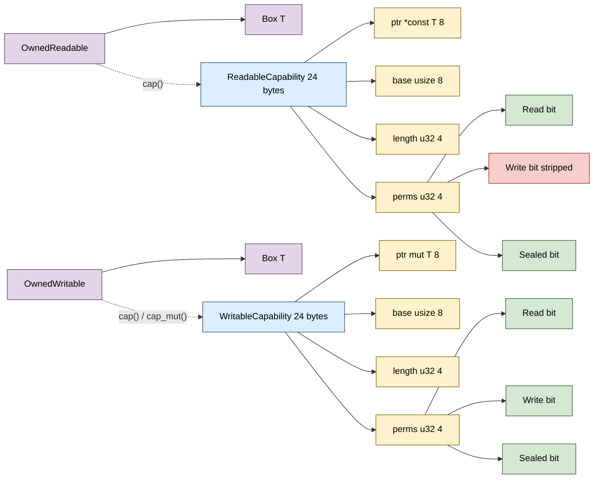

# ReadableCapability + WritableCapability + Owned* variants


CHERI-shaped capability pointers in software, lifted to type-level
read / write separation. A capability carries `(ptr, base, length,
perms)` and every dereference checks bounds + permissions + sealed
state. The capability semantics are encoded into the type system:
`ReadableCapability<'a, T>` has no `write()` method at all, and
`WritableCapability<'a, T>` holds a unique borrow of its memory, so
the borrow checker enforces the unique-writer guarantee. Both carry
the lifetime of the memory they were made from and cannot outlive it.
`OwnedReadableCapability<T>` and `OwnedWritableCapability<T>` own a
`Box<T>` and lend capabilities over it.

> **The "CHERI-in-software with no x86 silicon" primitive.** Real
> CHERI capability hardware exists on Arm's Morello board. There is
> no x86 / x86_64 equivalent. This module gives you the same
> capability surface (bounds + permissions + sealing) implemented
> in plain Rust with checked-arithmetic bounds tests. The companion
> [`RaspBatch<T>`](../rasp-pointer/) (`adaptive_rasp_batch` module)
> covers the x86 SIMD-batched bounds-check story.

**Constraints (read first):**

- **Software-only enforcement.** Bounds and permissions are checked
  in Rust code, not by hardware. This is a memory-safety layer
  above the existing virtual-memory protection, not a replacement
  for it. A capability cannot prevent the OS or another process
  from accessing the same memory.
- **A capability borrows its memory.** `from_slice` takes `&'a [T]`
  and `from_slice_mut` takes `&'a mut [T]`, and the capability holds
  that borrow for `'a`: the compiler refuses a capability that
  outlives its slice, and refuses to use the slice while a writable
  capability over it is alive.
- **`ReadableCapability::new` and `WritableCapability::new` are
  `unsafe`.** The caller asserts the `[base, base+length)` region
  is valid memory for `'a` (and, for a writable one, that nothing
  else reads or writes it) and that `ptr` carries that memory's
  provenance. `new` itself checks that `ptr` lies in the region and
  is aligned for `T`.
- **`ReadableCapability` strips the Write bit at construction.**
  Both `new` and `from_slice` apply `perms & !WRITE_BIT`. If you
  pass `Read | Write` to a Readable constructor, the Write bit is
  silently masked off. There is no way to construct a Readable
  that grants Write access.
- **`WritableCapability` is `!Copy + !Clone`, and reborrows.** Its
  struct derives only `Debug`. You cannot duplicate a writable cap.
  `narrow`, `narrow_readable` and `as_readable` borrow it, so it
  cannot write while a capability made from it is alive.
- **Every capability is aligned for `T`.** A `new` or `narrow` at an
  address misaligned for `T` returns `CapabilityError::Misaligned`.
- **Sealed capabilities cannot read or write.** `read()` and
  `write()` check `is_sealed()` first and return
  `CapabilityError::Sealed`. The `unsealed()` method restores
  access (sealing is bit 31 of `perms`).
- **Bounds arithmetic uses `checked_add`.** Every `base + length`
  / `addr + size_of::<T>()` goes through `checked_add`, so a
  near-`usize::MAX` region correctly returns `AddressOverflow`
  instead of wrapping. Tests `readable_unsafe_new_overflow_guards`
  and `writable_unsafe_new_overflow_guards` exercise this.
- **`length` is `u32` (4 GiB maximum region).** The `length`
  field is a `u32`; a slice over `u32::MAX` bytes gives a capability
  over its first `u32::MAX` bytes. Larger regions need multiple
  capabilities or a different primitive.
- **Capabilities are `!Send` and `!Sync`.** Both
  `ReadableCapability` and `WritableCapability` hold a raw pointer
  (`*const T` / `*mut T`), and the module declares no
  `unsafe impl Send/Sync`, so the auto traits make them neither
  `Send` nor `Sync`.
- **24 bytes per capability.** `ptr: *const T` (8) + `base: usize`
  (8) + `length: u32` (4) + `perms: u32` (4) = 24 bytes, three times
  the size of a bare pointer.
- **In-process only.** The pointer + base fields are real virtual
  addresses. Cross-process sharing needs composition with a
  region-table primitive (e.g. `KTower2`).

---

## Table of contents

- [What it is](#what-it-is)
- [Read vs Write at the type level](#read-vs-write-at-the-type-level)
- [Permission bits and sealing](#permission-bits-and-sealing)
- [Layout](#layout)
- [Constructor matrix](#constructor-matrix)
- [API at a glance](#api-at-a-glance)
- [Worked examples](#worked-examples)
- [Benchmark results](#benchmark-results)
- [Use case patterns](#use-case-patterns)
- [Known limitations (verified)](#known-limitations-verified)
- [Common pitfalls](#common-pitfalls)

---

## What it is

A capability is a triple-checked pointer: every dereference verifies
that the access lies inside the encoded `[base, base+length)`
region, that the encoded `perms` include the requested operation,
and that the capability is not `sealed`. The compiler enforces
read-vs-write separation by giving Readable and Writable distinct
types - Readable has no `write()` method, Writable's `write()`
requires `&mut self` - and keeps each capability inside the lifetime
of the memory it came from.

```rust
// 24-byte layout, identical for both Readable and Writable:
ptr:    *const T   // 8 bytes - base or interior address, aligned for T
base:   usize      // 8 bytes - lower bound (often equals ptr)
length: u32        // 4 bytes - bytes from base
perms:  u32        // 4 bytes - permission bitmask + sealed bit
```

The owned variants (`OwnedReadableCapability`,
`OwnedWritableCapability`) own a `Box<T>` and lend capabilities over
it through `cap()` (read-only) and, for the writable one, `cap_mut()`.
A lent capability borrows the owner, so it cannot outlive it.

---

## Read vs Write at the type level

The CHERI emulator splits read and write at the type level rather
than the runtime permission-bit level. Two consequences:

1. **No accidental write through a Readable.** The compiler refuses
   a `write` call on a `ReadableCapability` because no such method
   exists. A bit-flip that set the Write perm at runtime would have
   no effect on read-only callers.
2. **One writer at a time is structural.** You cannot duplicate a
   writable capability, and every capability made from one borrows
   it. The compiler enforces this at the type-system level; no
   runtime reference counting needed.

Lifting the permissions into the type system turns runtime checks
into compile-time guarantees and gives the borrow checker something
to enforce.

---

## Permission bits and sealing

`CapabilityPermission` (a `#[repr(u32)]` enum) defines:

| Variant | u32 | Semantic |
|---|---|---|
| `None` | 0 | No access. |
| `Read` | 1 | Allows `read()`. |
| `Write` | 2 | Allows `write()` (Writable only). |
| `Execute` | 4 | Declared; no method checks it. |

The `perms` field is a bitmask, so a cap can carry combinations
(`Read | Write`).

**Sealing** is an orthogonal bit:

- Bit 31 of `perms` is the sealed flag (`SEALED_BIT = 1 << 31`).
- A sealed cap returns `CapabilityError::Sealed` on every access.
- `cap.sealed()` consumes the cap and returns a sealed version.
- `cap.unsealed()` consumes the cap and returns an unsealed version.
- Sealing is independent of the permission bits: a sealed cap with
  Read+Write perms is still unreadable.

The architectural use case for sealing: temporarily disable a
capability without revoking it. The unsealed form can be reissued
later by code holding the sealed version.

---

## Layout


```mermaid
flowchart LR
    A[ReadableCapability 24 bytes] --> A1[ptr *const T 8]
    A --> A2[base usize 8]
    A --> A3[length u32 4]
    A --> A4[perms u32 4]
    A4 --> A4a[Read bit]
    A4 --> A4b["Write bit stripped"]
    A4 --> A4c[Sealed bit]
    B[WritableCapability 24 bytes] --> B1[ptr mut T 8]
    B --> B2[base usize 8]
    B --> B3[length u32 4]
    B --> B4[perms u32 4]
    B4 --> B4a[Read bit]
    B4 --> B4b[Write bit]
    B4 --> B4c[Sealed bit]
    C[OwnedReadable] --> Cb[Box T]
    D[OwnedWritable] --> Db[Box T]
    C -. "cap()" .-> A
    D -. "cap() / cap_mut()" .-> B
    classDef cap fill:#dceefb,stroke:#1f4e79,color:#000
    classDef field fill:#fff2cc,stroke:#7f6000,color:#000
    classDef perm fill:#d5e8d4,stroke:#2d5d2d,color:#000
    classDef strip fill:#f8cecc,stroke:#a52626,color:#000
    classDef owned fill:#e1d5e7,stroke:#5d4271,color:#000
    class A,B cap
    class A1,A2,A3,A4,B1,B2,B3,B4 field
    class A4a,A4c,B4a,B4b,B4c perm
    class A4b strip
    class C,D,Cb,Db owned
```

`#[repr(C)]` on both Readable and Writable. The field order is
fixed: `ptr -> base -> length -> perms`. The 24-byte total is
verified by `readable_layout_is_24_bytes` and
`writable_layout_is_24_bytes` tests.

---

## Constructor matrix

| Type | Safe constructor | Unsafe constructor | What it holds |
|---|---|---|---|
| `ReadableCapability<'a, T>` | `from_slice(&'a [T], perms) -> (cap, &'a [T])` | `unsafe new(ptr, base, length, perms)` | A shared borrow for `'a` (`Copy` when `T` is). |
| `WritableCapability<'a, T>` | `from_slice_mut(&'a mut [T]) -> cap` | `unsafe new(ptr, base, length, perms)` | A unique borrow for `'a` (`!Copy`). |
| `OwnedReadableCapability<T>` | `new(value)`, `from_box(Box<T>)` | - | The `Box<T>`. |
| `OwnedWritableCapability<T>` | `new(value)`, `from_box(Box<T>)` | - | The `Box<T>`. |

`from_slice` also returns the slice beside the capability; the
capability holds its own borrow either way.

---

## API at a glance

```rust
use subetha_pointers::adaptive_cheri_pointer::{
    ReadableCapability, WritableCapability,
    OwnedReadableCapability, OwnedWritableCapability,
    CapabilityPermission as Perm,
};

// Read-only capability over a borrowed slice.
let storage = vec![1u64, 2, 3];
let (read_cap, _slice) = ReadableCapability::from_slice(
    storage.as_slice(), Perm::Read as u32,
);
let value = read_cap.read().unwrap();  // = 1

// Writable capability over a mutable slice.
let mut buf = vec![0u64; 4];
let mut write_cap = WritableCapability::from_slice_mut(buf.as_mut_slice());
write_cap.write(42u64).unwrap();
let v = write_cap.read().unwrap();  // = 42

// A read-only view of the writable one (Write bit stripped).
let read_view = write_cap.as_readable();
assert!(read_view.has_permission(Perm::Read));
assert!(!read_view.has_permission(Perm::Write));

// Owned capability over a heap value.
let mut owned = OwnedWritableCapability::new(0u64);
owned.cap_mut().write(555).unwrap();
let val = owned.cap().read().unwrap();  // = 555
// The Box is freed when `owned` is dropped.
```

Every access method (`read`, `write`, `narrow`, `narrow_readable`)
returns `Result<_, CapabilityError>`. The five error variants are
`OutOfBounds`, `PermissionDenied`, `Sealed`, `AddressOverflow` and
`Misaligned`.

---

## Worked examples

### Sealing as temporary revocation

A cap given to a child component can be sealed when the parent
wants to suspend access temporarily, without revoking the cap:

```rust
let (cap, _slice) = ReadableCapability::from_slice(
    storage.as_slice(), Perm::Read as u32,
);
// Pass `cap` to a child component.

// Later, parent wants to suspend access:
let sealed = cap.sealed();
// Child's reads now fail with CapabilityError::Sealed.

// Parent unseals when access is allowed again:
let active = sealed.unsealed();
// Child can use `active` to read again.
```

### Narrowing a region

A parent capability covers a full slice; narrow grants a
sub-region to a child:

```rust
let mut buf = vec![0u64; 16];
let base = buf.as_ptr() as usize;
let mut root = WritableCapability::from_slice_mut(buf.as_mut_slice());
// Grant child access to bytes 16..32 only (elements 2..4).
let mut child_cap = root.narrow(
    base + 16, 16,
    Perm::Read as u32 | Perm::Write as u32,
).unwrap();
child_cap.write(7).unwrap();
// child_cap reads and writes only its 16-byte sub-region, and `root`
// is unusable until child_cap is dropped.
```

### Taking the Box back

The owned variants support `into_box()` to hand the value back to
normal ownership:

```rust
let owned = OwnedWritableCapability::new(12345u64);
let b: Box<u64> = owned.into_box();
assert_eq!(*b, 12345);
// `b` is now a normal Box, dropped on the next scope end.
```

---

## Benchmark results

Bench: `crates/subetha-pointers/benches/unified.rs`, groups
`capability_validation_10k` and `owned_capability_construct_drop_1k`.
Measured on Windows 11 Pro 10.0.26200 on an AMD Ryzen 9 7900X, built
for the x86-64 baseline, with Criterion's defaults (3 s warm-up, 100
samples over 5 s; middle estimate of each [low, mid, high] triple),
while other work kept 3.5 to 3.6 of the machine's 24 hardware threads
busy.

### Read / Write hot path (10 000 elements)

| Contender | Time | vs native | Notes |
|---|---|---|---|
| `baseline_native_slice_check` | **4.26 us** | 1.00x (floor) | Native `if !s.is_empty() { sum += s[0] }`. |
| `readable_capability_read` | **7.45 us** | 1.75x slower | Bounds + perm + sealed + alignment + overflow-safe arithmetic. |
| `baseline_native_slice_write_then_read` | **7.26 us** | floor (write+read) | Native `s[0] = 42; sum += s[0]`. |
| `writable_capability_write_then_read` | **10.19 us** | 1.40x over native write+read | Capability construct + write + read. |

**The benchmark pairs `writable_capability_write_then_read` against a
`baseline_native_slice_write_then_read` floor.** A read-only
`baseline_native_slice_check` baseline would be asymmetric - the
capability path includes a write, that native baseline does not.
Against the native write+read floor, the capability overhead
isolates to ~40%, not the ~140% the read-only floor would show.

**Reading the results:**

- **Readable cap is ~1.75x slower than the native read baseline.**
  Each `read()` checks bounds-low, overflow-on-end, bounds-high,
  permission, sealed state and alignment before the load itself.
- **Writable cap is ~1.40x slower than native write+read.** Each
  iteration constructs the capability and runs its checks on the
  write and on the read.
- **Per-element cost:** native read ~0.43 ns, readable cap ~0.74 ns,
  native write+read ~0.73 ns, writable cap ~1.02 ns (including
  construction).

### Owned construct + drop (1 000 cycles)

This group is **dominated by allocator free-list reuse**: each
sub-bench allocates and frees 1 000 boxes of the same size in a
tight loop, so the system allocator's thread cache serves every
request from a hot free list. The per-cycle times are therefore
sub-nanosecond and noisy (the `baseline_box_new_drop` 95% interval
spans ~265-289 ns for the whole 1 000-cycle loop). Read these as
"the owned wrapper is in the same band as a plain Box", not as
stable point estimates.

| Contender | Time (1 000 cycles) | Notes |
|---|---|---|
| `baseline_box_new_drop` | **277 ns** (noisy, ~265-289) | `let b = Box::new(i); black_box(*b);` |
| `owned_readable_construct_then_drop` | **255 ns** | Box + capability + read + drop. |
| `owned_writable_construct_write_drop` | **251 ns** | Box + capability + write + read + drop. |

**Reading the results:** both owned wrappers measured at or below
the noisy `baseline_box_new_drop`; because the allocator cache
dominates, the relative order of the three sub-benches shifts run to
run. The conclusion is "the owned wrapper adds no allocation beyond
the Box it holds", not a fixed multiplier. For cold-allocation cost,
benchmark with a non-caching allocator or randomized sizes.

---

## Use case patterns

| Pattern | Use which cap | Why |
|---|---|---|
| **Read-only sub-view of an allocation** | `ReadableCapability::from_slice` | No write method means no accidental writes; the cap holds the borrow. |
| **Single-writer mutable region** | `WritableCapability::from_slice_mut` | The cap holds the unique borrow; one writer at a time at compile time. |
| **Heap value with owned lifetime** | `OwnedReadable/WritableCapability::new` | The Box is freed with the owner; lent caps cannot outlive it. |
| **Suspend-resume access** | `cap.sealed()` / `cap.unsealed()` | Temporary revocation without losing the cap. |
| **Hand a sub-region to a callee** | `cap.narrow(...)` | Returns a capability over a smaller range; downgrades perms. |
| **Promote a writable to read-only** | `cap.as_readable()` or `cap.narrow_readable(...)` | Type-level guarantee that the callee cannot write. |
| **Take the value back out** | `owned.into_box()` | Returns the Box; the value re-enters standard ownership. |

---

## Known limitations (verified)

All confirmed against the source or the bench:

- **Software-only.** The module docs are explicit that there is no
  hardware enforcement; the OS still owns virtual-memory
  protection. A capability does not protect against other
  processes or against syscalls that bypass the Rust borrow
  checker.
- **`length: u32` caps a region at 4 GiB.** The `length` field is
  a `u32`. For larger regions, compose multiple capabilities or
  use a different primitive.
- **No Execute path.** `CapabilityPermission::Execute = 4` is
  declared but no `execute()` method exists.
- **24-byte size is fixed.** Verified by
  `readable_layout_is_24_bytes` and `writable_layout_is_24_bytes`.
  Three times a bare pointer; significant in slot tables with
  millions of caps.
- **Bounds arithmetic uses `checked_add`.** Every region/access
  end computation goes through `checked_add`, so a `usize::MAX`
  base + nonzero length correctly returns `AddressOverflow`.
  Verified by `readable_unsafe_new_overflow_guards` and the
  writable equivalent.
- **A capability cannot outlive its memory, and a writable one has
  one user at a time.** Compile-fail examples in the module docs
  are part of the doctests: a capability kept past its slice, one
  kept past its owner, and two writable capabilities alive over one
  region each fail to compile.
- **Readable cap is 3x slower than direct slice access** in the
  bench. The checks earn that in workloads where the borrow checker
  can't see the access pattern (e.g. capability tables,
  cross-component handoffs).

---

## Common pitfalls

- **Don't construct a Readable with Write perms expecting Write
  access.** The Write bit is silently stripped at construction
  (`perms & !WRITE_BIT`). The cap will reject writes regardless
  of what `perms` you passed.
- **Don't try to `Clone` a `WritableCapability`.** It's
  `!Copy + !Clone` by design (the struct derives only `Debug`).
  To hand out access, narrow it or lend a read-only view.
- **Don't expect to use a writable capability while something made
  from it is alive.** `narrow`, `narrow_readable` and `as_readable`
  borrow it; drop the narrowed capability or view first.
- **Don't compose a sealed cap with `narrow`.** The narrow methods
  mask the new perms with `& !SEALED_BIT`. A sealed parent yields
  an unsealed child; the seal does not propagate.
- **Don't narrow to an address that is not a multiple of `T`'s
  alignment.** It returns `CapabilityError::Misaligned`.
- **Don't expect cross-process portability.** The ptr + base
  fields are real virtual addresses. Cross-process sharing needs
  composition with a region-table primitive.
- **Don't conflate ReadableCapability with `&T`.** A Rust `&T`
  borrow has lifetime tracking and no runtime check. A
  ReadableCapability has the same lifetime tracking plus runtime
  bounds + perm checks. Pick the right tool: `&T` where the borrow
  checker can see the access, ReadableCapability for cross-component
  handoffs or stored capability tables.

---
