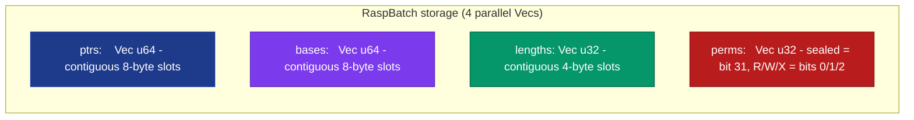
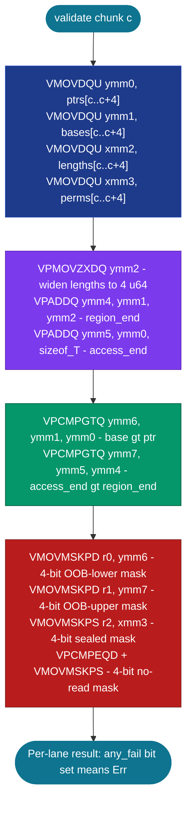

# RaspBatch&lt;T&gt; and RaspBatchIndex&lt;T&gt;


Bounds-checked pointers stored as structure-of-arrays (SoA) for
high-throughput SIMD batch validation. Each pointer's four fields
(ptr, base, length, perms) live in parallel `Vec`s; the i-th
pointer reads `(ptrs[i], bases[i], lengths[i], perms[i])`. The
layout is engineered so that a single `vmovdqu` instruction loads
4 consecutive ptr values into one YMM register with **zero**
GPR-to-SIMD domain crossings. The packed-quadword compare
(`vpcmpgtq`) then validates all 4 lanes in parallel.

> **The full bounds + permission + sealed + region-end check runs
> at ~0.65 ns per pointer** on AVX2 hardware (Zen+ R7 2700) -
> roughly the cost of a plain native bounds-checked slice read
> (~0.63 ns on the same host) and ~2.7x faster than the
> auto-vectorized scalar path (~1.78 ns). Full capability
> validation at about the price of an ordinary checked read.

**Constraints (read first):**

- **In-process only.** The stored `ptrs` / `bases` are raw machine
  addresses. For cross-process bounds-checked storage, layer this
  over a process-local mapping and use
  [`OffsetPtr`](../../subetha-cxc/pointers/offset-ptr/) for the
  cross-process leg.
- **`push_from_slice` requires a lifetime anchor.** The returned
  slice borrow is what proves the batch entry's target stays
  alive. Drop the anchor and any subsequent `read_at` is
  undefined behaviour.
- **Cooperative sealing, not hardware enforcement.** Setting the
  sealed bit (bit 31 of `perms`) causes `check_*` methods to
  return `Err(Sealed)`, but a caller who calls `raw_ptr(idx)` and
  dereferences via raw `unsafe { *p }` bypasses the seal. For
  adversarial isolation, pair with OS page protection or hardware
  capability silicon.
- **Length capped at `u32::MAX` bytes (4 GB).** Larger regions
  return `Err(LayoutTooWide)` from constructors.
- **Capacity capped at `u32::MAX - 1` entries.** The
  `RaspBatchIndex` is a 4-byte u32; the top value is reserved.
- **SIMD batch path is runtime-dispatched (AVX-512 -> AVX2 ->
  scalar).** The safe `count_valid()` / `check_read_all()` entries
  detect the widest available ISA at runtime: they prefer the
  AVX-512 path (`count_valid_avx512` / `check_read_all_avx512`)
  when `avx512f` is present, then AVX2, then the scalar fallback.
  The primary benchmark table below was taken on a Zen+ host (AVX2,
  no AVX-512); the AVX-512 path is measured separately on an EPYC
  Genoa VM (see the "On AVX-512 silicon" table), where it runs at
  ~0.22 ns/pointer.
- **`read_at` is `unsafe`.** The bounds + permission check
  enforces the perms recorded at push time; it does NOT prove the
  underlying allocation is still live. Caller is responsible for
  the target's continued validity per the original push-time
  borrow contract.

---

## Table of contents

- [What it is](#what-it-is)
- [Why SoA instead of AoS](#why-soa-instead-of-aos)
- [Memory layout](#memory-layout)
- [Validation protocol](#validation-protocol)
- [Permission model](#permission-model)
- [API at a glance](#api-at-a-glance)
- [Worked example](#worked-example)
- [Benchmark results](#benchmark-results)
- [Use case patterns](#use-case-patterns)
- [Known limitations (verified)](#known-limitations-verified)
- [Common pitfalls](#common-pitfalls)

---

## What it is

`RaspBatch<T>` is the structure-of-arrays storage for bounds-
checked pointers:

```rust
pub struct RaspBatch<T> {
    ptrs:    Vec<u64>,    // 8 bytes per slot, contiguous
    bases:   Vec<u64>,    // 8 bytes per slot, contiguous
    lengths: Vec<u32>,    // 4 bytes per slot, contiguous
    perms:   Vec<u32>,    // 4 bytes per slot, sealed bit at position 31
    _phantom: PhantomData<*const T>,
}
```

`RaspBatchIndex<T>` is the 4-byte position-independent reference:

```rust
#[repr(transparent)]
pub struct RaspBatchIndex<T> {
    idx: u32,
    _phantom: PhantomData<T>,
}
```

A `RaspBatch<T>` plus an index `i` uniquely identify a bounds-
checked pointer. The index is half the size of a typical 8-byte
`*const T` and a quarter the size of a 16-byte array-of-structures
bounds-checked pointer; in a `HashMap<u64, RaspBatchIndex<T>>` the
index is the smallest entry that still carries full RASP
semantics.

## Why SoA instead of AoS

The tempting alternative is an array-of-structures encoding: 16
or 32 bytes per pointer, so one pointer fits in one XMM (or YMM)
register and loads in a single instruction. The hidden cost is
batch validation: checking multiple AoS pointers requires packing
fields from each one into SIMD lanes via `_mm256_set_epi64x`,
which compiles to GPR-to-SIMD moves (vmovq + vpinsrq), and each
move pays a domain-crossing penalty.

This crate ships ONLY the SoA layout. An earlier design
exploration had AoS `RaspPointer` / `RaspWidePointer` types
alongside it; their AVX2 batch paths measured *slower* than their
own scalar loops (the GPR-to-SIMD packing dominated), so the AoS
types were removed and are not part of the current API. The SoA
layout loads 4 ptrs / bases / lengths / perms via single
`vmovdqu` instructions per chunk: zero GPR-to-SIMD crossings, and
the `vpcmpgtq` packed-quadword compares run at design speed. The
reproducible in-repo comparison is the SoA scalar-vs-AVX2 result
in [Benchmark results](#benchmark-results) (1.78 ns scalar vs
0.65 ns AVX2); the removed AoS variants have no bench in the
crate.

## Memory layout



For index `i`, the i-th bounds-checked pointer is the tuple
`(ptrs[i], bases[i], lengths[i], perms[i])`. All four `Vec`s
share the same length; pushing or reading always touches all
four in lockstep.

## Validation protocol

For a chunk of 4 consecutive entries starting at offset `c`:



Twelve SIMD instructions validate 4 pointers. Three instructions
per pointer. The same workload in scalar takes ~12 instructions
per pointer (one MOV per field, two CMP + branch for bounds, MOV
+ AND + TEST for perms).

## Permission model

The `perms: u32` field encodes:

| Bit | Meaning |
|---:|---|
| 0 | Read |
| 1 | Write |
| 2 | Execute |
| 3..30 | Reserved (must be 0) |
| 31 | Sealed (cooperative) |

`RaspPermission` enum constants for OR-composition:

```rust
RaspPermission::Read    // = 0b001
RaspPermission::Write   // = 0b010
RaspPermission::Execute // = 0b100
RaspPermission::None    // = 0
```

A sealed pointer (`perms & (1 << 31) != 0`) returns
`Err(RaspError::Sealed)` from all `check_*` paths regardless of
the lower bits.

## API at a glance

<details open>
<summary><b>Construction</b></summary>

| Method | Signature | Notes |
|---|---|---|
| `new()` | `fn() -> Self` | Empty batch |
| `with_capacity(n)` | `fn(usize) -> Self` | Pre-allocate the 4 parallel Vecs |
| `push_from_slice(slice, perms)` | `fn(&[T], u32) -> Result<(RaspBatchIndex<T>, &[T]), RaspError>` | Returns index + lifetime anchor |
| `push_raw(ptr, base, length, perms)` | `fn(u64, u64, u32, u32) -> Result<RaspBatchIndex<T>, RaspError>` | Caller manages target lifetime |

</details>

<details open>
<summary><b>Inspection</b></summary>

| Method | Returns | Notes |
|---|---|---|
| `len()` | `usize` | Number of entries |
| `is_empty()` | `bool` | `len() == 0` |
| `capacity()` | `usize` | Allocated slots |
| `raw_ptr(idx)` | `Option<*const T>` | Raw pointer, NOT validated |

</details>

<details open>
<summary><b>Validation</b></summary>

| Method | Returns | Notes |
|---|---|---|
| `check_read_scalar(idx)` | `Result<(), RaspError>` | Per-element scalar oracle |
| `check_read_all_scalar()` | `Vec<Result<(), RaspError>>` | Per-index results, scalar |
| `check_read_all_avx2()` (unsafe) | `Vec<Result<(), RaspError>>` | Per-index results, AVX2 |
| `check_read_all_avx512()` (unsafe) | `Vec<Result<(), RaspError>>` | Per-index results, AVX-512 |
| `check_read_all()` | `Vec<Result<(), RaspError>>` | Runtime-dispatched (AVX-512 -> AVX2 -> scalar) |
| `count_valid_scalar()` | `u32` | Count of Ok results, no allocation |
| `count_valid_avx2()` (unsafe) | `u32` | AVX2 count, no allocation |
| `count_valid_avx512()` (unsafe) | `u32` | AVX-512 count, no allocation |
| `count_valid()` | `u32` | Runtime-dispatched count (AVX-512 -> AVX2 -> scalar) |

</details>

<details>
<summary><b>Deref</b></summary>

| Method | Returns | Notes |
|---|---|---|
| `read_at(idx)` (unsafe) | `Result<T, RaspError>` | check + deref, requires `T: Copy` |

</details>

## Worked example

```rust
use subetha_pointers::adaptive_rasp_batch::{
    RaspBatch, RaspBatchIndex, RaspPermission,
};

// Build a batch over 1024 u64 storages.
let storages: Vec<Vec<u64>> = (0..1024).map(|i| vec![i as u64; 8]).collect();
let mut batch: RaspBatch<u64> = RaspBatch::with_capacity(1024);
let mut indices: Vec<RaspBatchIndex<u64>> = Vec::with_capacity(1024);
for s in &storages {
    let (idx, _anchor) = batch
        .push_from_slice(s, RaspPermission::Read as u32)
        .expect("push");
    indices.push(idx);
}

// Validate all 1024 in one call. AVX2 path processes 4 per
// iteration; scalar fallback on non-AVX2 hosts.
let valid_count = batch.count_valid();
assert_eq!(valid_count, 1024);

// Per-index read (checked + dereferenced). T: Copy required.
let idx = indices[42];
// SAFETY: the storages Vec is still alive.
let v = unsafe { batch.read_at(idx) }.expect("valid");
assert_eq!(v, 42);

// Sealed pointers: set bit 31 in perms.
const SEAL: u32 = 1 << 31;
let mut sealed_batch: RaspBatch<u64> = RaspBatch::with_capacity(1);
let (sealed_idx, _anchor) = sealed_batch
    .push_from_slice(&storages[0], RaspPermission::Read as u32 | SEAL)
    .unwrap();
let r = unsafe { sealed_batch.read_at(sealed_idx) };
assert!(matches!(r, Err(_)));
```

## Benchmark results

Bench: `crates/subetha-pointers/benches/unified.rs`, group
`capability_validation_10k` (`rasp_soa_count_valid_*` plus the
native baselines).

10 000 u64 storages, each 8 bytes. Measured on Windows 11 / Zen+
R7 2700 (AVX2, no AVX-512), criterion at `--measurement-time 2
--warm-up-time 1 --sample-size 30` (middle estimate of each
[low, mid, high] triple). The native floor is the
`baseline_native_slice_check` bench from the same `unified` run -
a per-element `if !s.is_empty() { sum += s[0] }` native bounds-
checked read.

| Workload | Time | Per-pointer | Notes |
|---|---:|---:|---|
| `baseline_native_slice_check` (native checked read) | 6.25 us | 0.63 ns | Plain `if !s.is_empty() { sum += s[0] }` floor |
| `RaspBatch::count_valid_scalar` | 17.8 us | 1.78 ns | Compiler-auto-vectorized scalar |
| **`RaspBatch::count_valid_avx2`** | **6.48 us** | **0.65 ns** | Hand-rolled AVX2 |

On this host the AVX2 capability validation (~0.65 ns/pointer) is
**at parity with a plain native bounds-checked read** (~0.63 ns)
and **~2.7x faster than the auto-vectorized scalar path**
(1.78 ns). The full bounds + permission + sealed + region-end
check therefore costs about the same as an ordinary checked slice
read on this CPU. The AVX-512 path adds the eight-lane regime that
Zen+ cannot run - see the Genoa table below.

### On AVX-512 silicon (EPYC Genoa)

Same `unified` bench, re-run on an AMD EPYC 9B14 (Genoa) Colab VM
(`avx512f` present), criterion `--measurement-time 2 --warm-up-time
1 --sample-size 30`. The `count_valid_avx512` row processes eight
u64 lanes per `vpcmpgtq`-class compare instead of AVX2's four.

| Workload | Time | Per-pointer | vs native check |
|---|---:|---:|---:|
| `baseline_native_slice_check` (native checked read) | 10.37 us | 1.04 ns | 1.00x (floor) |
| `RaspBatch::count_valid_scalar` | 13.46 us | 1.35 ns | 0.77x |
| `RaspBatch::count_valid_avx2` | 3.37 us | 0.34 ns | 3.08x faster |
| **`RaspBatch::count_valid_avx512`** | **2.22 us** | **0.22 ns** | **4.67x faster** |

On AVX-512 silicon the eight-lane validator runs at **0.22
ns/pointer**, **~1.5x faster than the AVX2 path** and **~4.7x
faster than the native bounds-checked read** on the same host. So
the architectural claim that the SoA RASP validator beats an
ordinary checked access *does* hold here - it just needs the
AVX-512 lanes that Zen+/Zen2/Zen3 lack. (The Genoa Colab VM's
`baseline_native_slice_check` is slower in absolute terms than the
Zen+ box's - that scalar baseline touches 10 000 separate Vec
allocations and is memory-subsystem-bound on the shared VM - but
the SoA SIMD paths, walking one contiguous buffer, are faster on
Genoa as expected.)

### Why each result lands where it does

<details>
<summary><b>count_valid_avx2 at ~0.65 ns: where the time goes</b></summary>

The SoA path validates 10 000 pointers via 2 500 SIMD chunks.
Each chunk loads 4 ptrs (32 B), 4 bases (32 B), 4 lengths
(16 B), 4 perms (16 B) - **96 contiguous bytes**, which is 1.5
cache lines. The prefetcher recognises the sequential pattern
and pre-fetches the next chunk while the current one validates,
so most loads hit L1 already-resident memory. About 2 500 chunks
of ~12 SIMD instructions each is around 30 000 instructions =
roughly 9 000 cycles on a 3-issue-wide modern x86 = ~3 us of
execution; the rest of the measured 6.48 us is cache traffic +
result-counting arithmetic.

The SoA layout's win over the scalar path comes from
**storage density + lane parallelism**: 24 bytes per RASP entry
(8 ptr + 8 base + 4 length + 4 perms) packed contiguously, four
lanes validated per `vpcmpgtq`. At 24 bytes per entry, 10 000
entries fit in ~240 KB (about an L2 cache). Against the plain
native checked read (~0.63 ns) the AVX2 path lands at parity
here, not ahead - the native read is already a single in-cache
load per element, so SIMD validation matches rather than beats
it on this CPU.

</details>

<details>
<summary><b>count_valid_scalar at 1.81 ns: compiler auto-vectorization is genuinely good</b></summary>

The scalar path is a tight `for i in 0..n` loop over the four
`Vec`s. LLVM unrolls 4-wide and auto-vectorizes the bounds
arithmetic into the same `vpcmpgtq` instructions the hand-rolled
AVX2 path uses, but with simpler mask handling and no
`#[target_feature]` ABI boundary. The gap from the 1.78 ns scalar
path to the 0.65 ns AVX2 path comes from:

- The auto-vectorizer must respect every IR-level abstraction
  (Vec indexing bounds checks, Option unwrap, Result construction)
  while the hand-rolled path elides them.
- The scalar loop computes per-element results as `Result<(),
  RaspError>` enum values; the SIMD path stays in mask-bit form
  and only materialises the count.

For workloads that already need per-index results,
`check_read_all_avx2` (which DOES materialise the Vec) costs
more than `count_valid_avx2`; the architectural lesson is that
the cheapest answer is "the smallest answer the caller needs".

</details>

<details>
<summary><b>Why an AoS RaspPointer is not part of the API</b></summary>

The obvious-looking design is a per-pointer struct: a 16-byte or
32-byte AoS record, one pointer per XMM/YMM register, loaded
whole in one instruction. The hidden cost is that batch
validation has to pack 4 pointers' fields into SIMD lanes via
`_mm256_set_epi64x`, which compiles to 12+ GPR-to-SIMD `vmovq`
instructions per chunk - each paying domain-crossing latency.
During the design exploration the AVX2 "fast path" of that layout
measured SLOWER than its own scalar loop (the packing dominated),
so the AoS `RaspPointer` / `RaspWidePointer` types were removed.
They are not in the crate and have no bench, so their figures are
not reproducible here; only the SoA `RaspBatch<T>` /
`RaspBatchIndex<T>` ship, which is why they are the only RASP
types documented. The reproducible evidence for the SoA layout is
the scalar-vs-AVX2 comparison in
[Benchmark results](#benchmark-results).

</details>

## Use case patterns

<details>
<summary><b>Pattern 1: capability-protected session store</b></summary>

```rust
// Build the batch over a heap-pinned session pool.
let mut batch: RaspBatch<Session> = RaspBatch::with_capacity(pool.len());
let mut handles: HashMap<u64, RaspBatchIndex<Session>> = HashMap::new();
for (key, slot) in keys.iter().zip(pool.iter()) {
    let slice = std::slice::from_ref(slot);
    let (idx, _anchor) = batch
        .push_from_slice(slice, RaspPermission::Read as u32)
        .unwrap();
    handles.insert(*key, idx);
}

// Access path: HashMap to 4-byte index to batch.read_at validates
// then dereferences. The HashMap stores 4-byte indices instead of
// 16-byte AoS pointers.
fn read_session(
    batch: &RaspBatch<Session>,
    handles: &HashMap<u64, RaspBatchIndex<Session>>,
    key: u64,
) -> Option<Session> {
    let idx = *handles.get(&key)?;
    // SAFETY: pool outlives batch + handles.
    unsafe { batch.read_at(idx) }.ok()
}
```

</details>

<details>
<summary><b>Pattern 2: dense scan over capability-bearing pointers</b></summary>

A garbage collector or compaction phase validates every entry
in a batch via `count_valid_avx2`. For 10 000 entries the AVX2
path runs at ~6.48 us total - ~650 ns per 1000-pointer subbatch,
making bounds-checked iteration about as cheap as a plain checked
read.

</details>

<details>
<summary><b>Pattern 3: untrusted IPC payload validation</b></summary>

A producer process writes data into a shared memory region and
hands the consumer indices into a `RaspBatch<u8>` of accessible
byte ranges. The consumer:

1. Receives the indices + a sealed batch (`perms` bit 31 set).
2. Validates the seal context out of band.
3. Re-pushes entries with sealed bit cleared.
4. Calls `count_valid` to confirm all entries pass bounds checks.
5. Uses `read_at` per index for actual access.

</details>

## Known limitations (verified)

1. **In-process only.** Raw machine addresses in `ptrs` / `bases`
   are not portable across processes.

2. **`push_from_slice`'s borrow anchor is the returned slice.**
   The batch's pointer is valid only as long as the slice borrow
   is held. Dropping the slice while retaining the batch yields
   undefined behaviour on subsequent `read_at` calls.

3. **`push_raw` skips borrow checking entirely.** Caller manages
   target lifetime.

4. **`read_at` is `unsafe`** and requires `T: Copy`. The
   check enforces bounds + perms encoded at push time; it
   cannot prove the underlying allocation has not been freed.

5. **Sealing is cooperative, not enforced.** A caller calling
   `raw_ptr(idx)` then `unsafe { *p }` bypasses the seal.

6. **Length cap is `u32::MAX`** (4 GB per entry). Larger regions
   return `Err(LayoutTooWide)`.

7. **Entry-count cap is `u32::MAX - 1`** (about 4.3 billion).
   `push_*` returns `Err(LayoutTooWide)` when full.

8. **SIMD path is runtime-dispatched (AVX-512 -> AVX2 -> scalar).**
   `count_valid()` / `check_read_all()` prefer the AVX-512 path
   (`count_valid_avx512` / `check_read_all_avx512`) when `avx512f`
   is present, then AVX2, then the scalar fallback. The primary
   table ran on a Zen+ host (AVX2 + scalar only); the AVX-512 row
   was measured on an EPYC Genoa VM and runs ~1.5x faster than AVX2
   (0.22 vs 0.34 ns/pointer) - see the "On AVX-512 silicon" table.

9. **The AVX2 path assumes ptr addresses are in the canonical
   x86-64 user-space half** (bit 63 = 0). `VPCMPGTQ` is a signed
   comparison; for user-space addresses bit 63 is always 0 and
   signed compare agrees with unsigned. Kernel-space addresses
   (bit 63 = 1) would compare incorrectly under the SIMD path;
   the scalar path handles full u64 via `usize` arithmetic.

10. **No remove / free operation.** Entries pushed remain in the
    batch until the batch is dropped. For workloads with high
    churn, pair with an external free-list of recycled indices.

## Common pitfalls

<details>
<summary><b>Pitfall 1: dropping the anchor</b></summary>

```rust
let mut batch: RaspBatch<u64> = RaspBatch::new();
let idx = {
    let storage = vec![42u64; 8];
    let (idx, _anchor) = batch
        .push_from_slice(&storage, RaspPermission::Read as u32)
        .unwrap();
    idx  // _anchor (which is &storage) drops at end of block
};       // storage is dropped here
// idx now refers to a freed allocation.
// SAFETY violation: the underlying target is gone.
let bad = unsafe { batch.read_at(idx) };
```

Hold the anchor (or extend the storage's lifetime by some other
means) for as long as the batch is used.

</details>

<details>
<summary><b>Pitfall 2: forgetting permissions</b></summary>

```rust
// push_from_slice with perms = 0 (no permissions).
batch.push_from_slice(&storage, 0).unwrap();
// All subsequent check_read returns Err(PermissionDenied).
```

Explicitly OR the permission bits you need:

```rust
let perms = (RaspPermission::Read as u32) | (RaspPermission::Write as u32);
batch.push_from_slice(&storage, perms).unwrap();
```

</details>

<details>
<summary><b>Pitfall 3: sealed-vs-no-perms confusion</b></summary>

Two distinct error variants:

- `Err(Sealed)` - sealed bit (31) set. The check returns Sealed
  even if Read/Write/Execute are also set.
- `Err(PermissionDenied)` - sealed bit clear, but the requested
  permission bit (e.g. Read) is not set.

`check_read_scalar` reports `Sealed` first; a caller looking only
for "is this valid?" should check `result.is_ok()`.

</details>

<details>
<summary><b>Pitfall 4: AVX2 batch path on cross-process addresses</b></summary>

If a workload encodes addresses with bit 63 set (kernel-space
mappings, or some user-space hardening schemes), the AVX2 path's
signed `VPCMPGTQ` will compare incorrectly. The scalar path
handles full u64 via `usize` and is correct in all cases.

Use `count_valid_scalar` (or `check_read_all_scalar`) for
workloads that include high-bit-set addresses.

</details>

---

[back to subetha-pointers docs](../_index.md)
