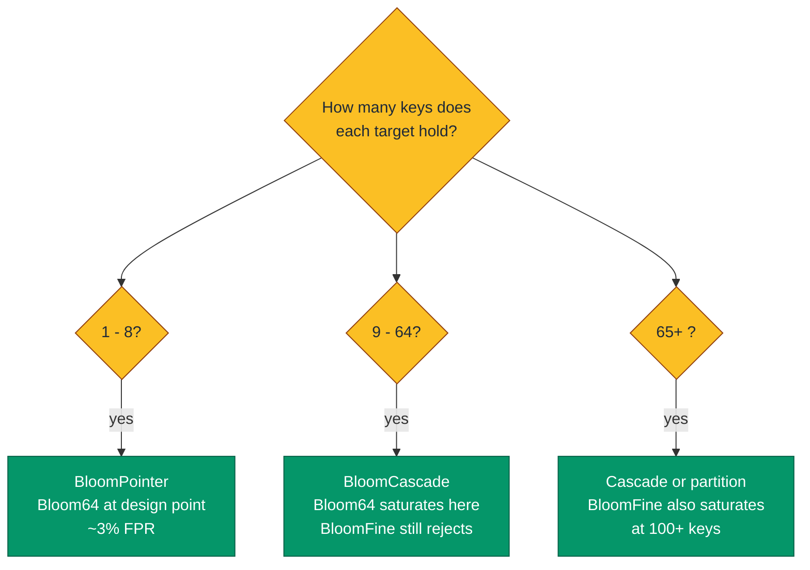
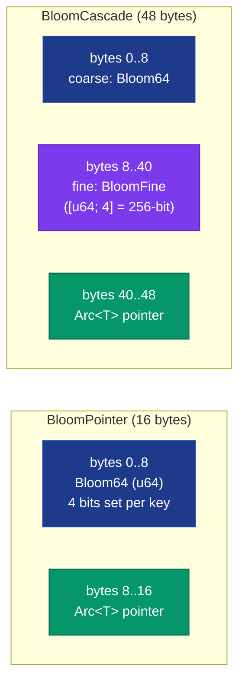

# Bloom64, BloomFine, BloomPointer&lt;T&gt;, BloomCascade&lt;T&gt;


Pointers that carry a Bloom-filter summary of their target's
membership keys, enabling `bloom.might_contain(query)` to reject
queries in one register-compare without touching the pointed-to
data. The architectural payoff: when a scan iterates many
candidate pointers and the query misses most of them, the
Bloom shortcircuit eliminates the deref + scan for ~99% of
queries; only the rare false-positive pays the full deref cost.

> **The "skip the deref when you can prove the answer is no"
> primitive.** Same architectural shape as LSM-tree Bloom layers,
> database B-tree subtree filters, content-addressed storage
> negative lookups. The 64-bit `Bloom64` fits in one register;
> the 256-bit `BloomFine` fits in one YMM; the two-level
> `BloomCascade` couples them for the saturation regime.

**Constraints (read first):**

- **In-process only.** `BloomPointer` and `BloomCascade` hold an
  `Arc<T>` to the target. Cross-process Bloom pointers require
  layering this design over an MMF substrate.
- **Right-size to the filter's capacity.** Bloom64 is designed for
  ~8 keys at ~3% FPR; pushing to 16 keys yields ~16% FPR; pushing
  to 32+ keys saturates the filter and `might_contain` returns
  true for every query. BloomFine handles ~64 keys at ~5% FPR.
  Choose the variant matching the workload's per-pointer key
  count; for the intermediate regime (16-64 keys) use
  `BloomCascade` (coarse + fine).
- **Caller maintains filter / target consistency.** The Bloom is
  built from caller-supplied keys at construction time. Mutating
  the target's membership keys after construction without
  rebuilding the filter produces silent false negatives.
- **Hash is `FxBloomHasher`** (FxHash-style rotate-xor-multiply).
  Fast (~2-3 ns/u64) but **NOT cryptographically strong** and
  **NOT stable across crate versions**. Workloads needing
  reproducible filter bits across processes / persistence must
  hash keys with a deterministic algorithm externally and
  construct the filter from the resulting u64 via the public
  tuple field (`Bloom64(bits)`; there is no `new` constructor).
- **Wins only when the deref is non-trivial.** For tiny in-cache
  `Vec<u64>::contains` over <8 elements, native scan is faster
  than even the optimised Bloom path. Bloom pays off when the
  shortcircuited operation costs more than ~5 ns of hash work:
  string equality on uniform-length strings, HashSet/HashMap
  lookups, remote/disk reads, large Vec/HashMap scans.

---

## Table of contents

- [What they are](#what-they-are)
- [The four types and when to pick each](#the-four-types-and-when-to-pick-each)
- [Memory layout](#memory-layout)
- [Hash design (FxBloomHasher)](#hash-design-fxbloomhasher)
- [False-positive rate vs load](#false-positive-rate-vs-load)
- [Cascade dispatch](#cascade-dispatch)
- [API at a glance](#api-at-a-glance)
- [Worked example](#worked-example)
- [Benchmark results](#benchmark-results)
- [Use case patterns](#use-case-patterns)
- [Known limitations (verified)](#known-limitations-verified)
- [Common pitfalls](#common-pitfalls)

---

## What they are

Four cooperating types:

```rust
pub struct Bloom64(pub u64);                      // 8 bytes, 4 hash indices

pub struct BloomFine { bits: [u64; 4] }           // 32 bytes, 8 hash indices

pub struct BloomPointer<T> {
    bloom:  Bloom64,                              // 8 B
    target: Arc<T>,                               // 8 B
}                                                 // 16 B total

pub struct BloomCascade<T> {
    coarse: Bloom64,                              // 8 B
    fine:   BloomFine,                            // 32 B
    target: Arc<T>,                               // 8 B
}                                                 // 48 B total
```

`Bloom64` and `BloomFine` are the filter types. `BloomPointer<T>`
pairs a Bloom64 with an Arc-backed target; `BloomCascade<T>`
pairs both filter levels with a target for the saturated regime.

## The four types and when to pick each



| Per-target key count | Filter | FPR estimate | Pointer type |
|---:|---|---:|---|
| 1-4 | Bloom64 | ~0.5% | `BloomPointer<T>` |
| 5-8 | Bloom64 | ~3% | `BloomPointer<T>` (the design point) |
| 9-16 | Bloom64 | ~16% (saturating) | `BloomCascade<T>` (cascade saves it) |
| 16-64 | BloomFine | ~5% at 64 | `BloomCascade<T>` |
| 65+ | BloomFine | >10% (saturating) | Partition target into multiple pointers, or accept the FPR |

## Memory layout



## Hash design (FxBloomHasher)

The original implementation used `std::collections::hash_map::DefaultHasher`
(SipHash-1-3, ~15-20 ns per call). For Bloom filters on small
in-memory targets, the hash cost dominated the deref+search cost
the filter was meant to shortcircuit: bench data showed
`bp.might_contain(&u64)` at ~35 ns vs `Vec<u64>::contains` over
5 elements at ~3 ns - a 10x net loss.

The current implementation uses an FxHash-style rotate-xor-multiply
hasher (`FxBloomHasher`):

```rust
fn write_u64(&mut self, n: u64) {
    self.0 = (self.0.rotate_left(5) ^ n).wrapping_mul(FX_MULT);
}
```

Per-call cost: ~2-3 ns for a u64 key. The full `Bloom64::indices`
then produces 4 bit positions from a single hash output by
slicing the 64-bit result at positions 0, 16, 32, 48. This cuts
the per-query cost from 2 SipHash calls to 1 FxHash call - a
~10x speedup.

`BloomFine::indices` makes two FxHash calls (with different seeds)
to derive 8 bit positions across the 256-bit filter, slicing each
hash output into 4 8-bit positions.

The hash is not cryptographic; the goal is bit-mixing for index
distribution, not collision resistance. Adversarial inputs could
craft hash collisions, so workloads under adversarial control
must use a stronger external hash and bypass the built-in.

## False-positive rate vs load

`Bloom64::estimated_fpr(n)` computes the standard formula
`(1 - exp(-k*n/m))^k` with `m = 64`, `k = 4`:

| Keys inserted | Bloom64 FPR | BloomFine FPR |
|---:|---:|---:|
| 1 | 0.0006% | < 0.0001% |
| 4 | 0.6% | < 0.001% |
| 8 (Bloom64 capacity) | ~2.4% | < 0.01% |
| 16 | ~16% | ~0.1% |
| 32 | ~63% | ~3% |
| 64 (BloomFine capacity) | ~95% (saturated) | ~5% |
| 100 | ~99% (saturated) | ~14% |

Read: Bloom64 is unusable above 16 keys; BloomFine remains
useful up to ~64 keys. The cascade structure exists precisely
for the 16-to-64-key gap where Bloom64 fails but BloomFine
still rejects.

## Cascade dispatch

`BloomCascade::cascade_check(key)` returns a three-state outcome:

```mermaid
flowchart TD
    Start([cascade_check key]) --> C{coarse.might_contain?<br/>~3 ns}
    C -->|no| RC[RejectedAtCoarse<br/>SKIP deref<br/>(saved: deref + fine)]
    C -->|yes| F{fine.might_contain?<br/>~6 ns}
    F -->|no| RF[RejectedAtFine<br/>SKIP deref<br/>(saved: deref)]
    F -->|yes| M[MightContain<br/>Caller must deref<br/>to confirm]

    classDef startend fill:#0e7490,stroke:#0e7490,color:#ffffff
    classDef decision fill:#fbbf24,stroke:#92400e,color:#1f2937
    classDef good fill:#059669,stroke:#065f46,color:#ffffff
    classDef maybe fill:#b91c1c,stroke:#7f1d1d,color:#ffffff
    class Start startend
    class C,F decision
    class RC,RF good
    class M maybe
```

The coarse-then-fine ordering puts the cheaper check first: at
32 keys per target, the coarse Bloom64 is saturated (~63% pass
rate) but the fine 256-bit filter still rejects ~95% of randoms.
The cascade pays the cheap check upfront and only routes to the
fine check when coarse fails to reject.

## API at a glance

<details open>
<summary><b>Bloom64</b></summary>

| Method | Signature | Notes |
|---|---|---|
| `ZERO` | `const Self` | Empty filter |
| `SUGGESTED_CAPACITY` | `const usize = 8` | ~3% FPR at this load |
| `insert(key)` | `fn(&mut self, &K)` | Set 4 bits for key |
| `might_contain(key)` | `fn(&self, &K) -> bool` | `false` = definitely-no, `true` = might-be-yes |
| `from_keys(iter)` | `fn(I) -> Self` | Build from key iterator |
| `popcount()` | `fn(&self) -> u32` | Bits set (saturation indicator) |
| `estimated_fpr(n)` | `fn(usize) -> f64` | Analytical FPR for n keys |

</details>

<details open>
<summary><b>BloomFine</b></summary>

| Method | Signature | Notes |
|---|---|---|
| `ZERO` | `const Self` | Empty filter |
| `SUGGESTED_CAPACITY` | `const usize = 64` | ~5% FPR at this load |
| `insert(key)` | `fn(&mut self, &K)` | Set 8 bits across `[u64; 4]` |
| `might_contain(key)` | `fn(&self, &K) -> bool` | Same contract as Bloom64 |
| `from_keys(iter)` | `fn(I) -> Self` | Build from iterator |
| `popcount()` | `fn(&self) -> u32` | Bits set across 256-bit filter |

</details>

<details open>
<summary><b>BloomPointer&lt;T&gt;</b></summary>

| Method | Signature | Notes |
|---|---|---|
| `new(target, bloom)` | `fn(Arc<T>, Bloom64) -> Self` | Caller-built filter |
| `from_keys(target, keys)` | `fn(Arc<T>, I) -> Self` | Filter built from key iterator |
| `bloom()` | `fn(&self) -> Bloom64` | Borrow the filter |
| `target()` | `fn(&self) -> &Arc<T>` | Borrow the target Arc |
| `might_contain(key)` | `fn(&self, &K) -> bool` | Skip-the-deref membership test |
| `set_bloom(b)` | `fn(&mut self, Bloom64)` | Replace filter after target mutation |

</details>

<details open>
<summary><b>BloomCascade&lt;T&gt;</b></summary>

| Method | Signature | Notes |
|---|---|---|
| `new(target, coarse, fine)` | constructor | Both filters supplied |
| `from_keys(target, keys)` | `fn(Arc<T>, I) -> Self` | Both filters built from iterator |
| `cascade_check(key)` | `fn(&self, &K) -> CascadeOutcome` | Three-state result |
| `coarse()` / `fine()` / `target()` | accessors | Borrow each component |

`CascadeOutcome::RejectedAtCoarse` / `RejectedAtFine` /
`MightContain`. `outcome.might_contain()` collapses to bool;
`outcome.rejected()` is the negation.

</details>

## Worked example

```rust
use std::sync::Arc;
use subetha_pointers::bloom_pointer::{
    Bloom64, BloomCascade, BloomFine, BloomPointer, CascadeOutcome,
};

// Pattern 1: BloomPointer for a small-key target (<=8 keys).
let target = Arc::new(vec![1u64, 2, 3, 4, 5, 6, 7, 8]);
let keys: Vec<u64> = target.iter().copied().collect();
let bp = BloomPointer::from_keys(target.clone(), keys);

for k in 1..=8u64 {
    assert!(bp.might_contain(&k));  // Inserted keys must pass.
}
// Most random misses reject:
let mut rejects = 0;
for k in 1000..1100u64 {
    if !bp.might_contain(&k) { rejects += 1; }
}
assert!(rejects > 95, "Bloom64 at capacity should reject ~97% of randoms");

// Pattern 2: BloomCascade for medium-key target (8-64 keys).
let big_target: Arc<Vec<u64>> = Arc::new((0..40u64).collect());
let big_keys: Vec<u64> = big_target.iter().copied().collect();
let bc = BloomCascade::from_keys(big_target.clone(), big_keys);

// Three-state classification per query.
for k in 0..40u64 {
    let outcome = bc.cascade_check(&k);
    assert!(outcome.might_contain(), "inserted key {k} must pass");
}

// Random misses: most are rejected at coarse or fine.
let mut coarse_rej = 0;
let mut fine_rej = 0;
let mut survive = 0;
for k in 1000..1100u64 {
    match bc.cascade_check(&k) {
        CascadeOutcome::RejectedAtCoarse => coarse_rej += 1,
        CascadeOutcome::RejectedAtFine   => fine_rej += 1,
        CascadeOutcome::MightContain     => survive += 1,
    }
}
// 40 keys saturates coarse (Bloom64 capacity = 8) so most queries
// reach the fine layer; fine still rejects most randoms.
assert!(coarse_rej + fine_rej >= 90);
```

## Benchmark results

Bench: `crates/subetha-pointers/benches/versioned_bloom.rs`
(`bloom_*` groups). Measured on Windows 11 / Zen+ R7 2700,
criterion at `--measurement-time 2 --warm-up-time 1
--sample-size 30` (middle estimate of each [low, mid, high]
triple). Each bench scans N candidate pointers and counts queries
that survive the shortcircuit to actually require a deref.

| Workload | Native | Bloom | Winner |
|---|---:|---:|---|
| `miss_query` (1024 ptrs x 8 u64 keys, Bloom64 at capacity) | 3.66 us | **1.55 us** | **Bloom 2.36x** |
| `miss_large_subset` (128 ptrs x 64 u64 keys, BloomCascade) | 2.34 us | **2.13 us** | Bloom 1.10x |
| `cascade.miss_query` (1024 ptrs x 32 u64 keys, saturated regime) | 10.83 us | 11.85 us (single) / **4.36 us (cascade)** | **Cascade 2.49x vs native, 2.72x vs saturated single** |
| `expensive_deref` (512 ptrs x 8 same-length strings) | 19.12 us | **5.41 us** | **Bloom 3.54x** |

### Why each result lands where it does

<details>
<summary><b>miss_query (Bloom64 at capacity): Bloom wins 2.36x</b></summary>

8 keys per pointer matches `Bloom64::SUGGESTED_CAPACITY`. The
filter holds ~32 bits set out of 64 (~50% fill); random queries
match all 4 indices with probability `(32/64)^4 = 1/16 = ~6%`.
The shortcircuit fires on ~94% of misses.

Per-query cost: 1 FxHash call (~3 ns) + 4 bit tests (~1 ns) =
~4 ns per Bloom check. Native `Vec<u64>::contains` over 8
elements is ~3.5 ns (auto-vectorized + length-known-small).
Net: Bloom's per-query overhead is comparable to native, but
Bloom skips the deref + Vec touch for 94% of queries.

</details>

<details>
<summary><b>miss_large_subset (BloomCascade at BloomFine capacity): modest 1.10x win</b></summary>

64 keys per pointer matches `BloomFine::SUGGESTED_CAPACITY`.
Cascade pays coarse check (saturated, ~95% pass through) then
fine check (~5% pass through). Total Bloom cost per query is
~10 ns (1 coarse hash + 1 fine hash + cache-friendly bit tests).

Native `Vec<u64>::contains` over 64 elements is auto-vectorized
heavily; the compiler emits a tight SIMD scan that runs ~18 ns
per query. At 128 subsets: ~2.34 us native vs ~2.13 us cascade
plus rare derefs.

The 1.10x margin is modest because `Vec<u64>::contains` is one
of the workloads LLVM optimises hardest. For non-vectorizable
deref operations (HashMap, BTreeMap, struct equality), the win
widens substantially - see expensive_deref below.

</details>

<details>
<summary><b>cascade.miss_query (saturated regime): Cascade 2.49x vs native, 2.72x vs single Bloom64</b></summary>

32 keys per pointer is **above Bloom64's capacity** and **below
BloomFine's**. The coarse Bloom64 is saturated to ~95% bits set;
`Bloom64::might_contain` returns true for ~80% of random queries
(near-useless rejection). The fine BloomFine still rejects ~95%
of randoms.

Three-way breakdown:
- Native Vec scan: 10.83 us
- Single Bloom64: **11.85 us** - LOSES to native because the
  saturated filter fails to shortcircuit, so it pays Bloom check
  cost AND deref cost on 80% of queries.
- BloomCascade: **4.36 us** - the cascade routes through fine,
  which actually rejects, and the deref is avoided 95% of the
  time.

This is the architectural lesson: a single-level Bloom is worse
than nothing when saturated; the cascade structure is what makes
mid-range key counts (16-64) tractable.

</details>

<details>
<summary><b>expensive_deref (Bloom wins 3.54x): the design point</b></summary>

512 pointers, 8 same-length 32-byte strings per pointer, miss
key also 32 bytes. `String::eq` cannot fast-reject on length
difference, so each comparison performs full byte-by-byte
memcmp. Native path: 512 * 8 * 32-byte compares = ~131k byte
compares for the all-miss workload = 19.12 us.

Bloom path: 1 FxHash call per String (~8 ns, includes the per-
byte hash mixing) + 4 bit tests = ~12 ns per query. 512 queries
= ~5.4 us total. The 94% shortcircuit rate skips the expensive
String::eq chain for almost every query.

This is the workload Bloom was designed for: the deref-and-
search is dramatically more expensive than the hash; the
shortcircuit pays back many times over.

</details>

## Use case patterns

<details>
<summary><b>Pattern 1: HashMap bucket-chain negative lookup acceleration</b></summary>

A custom HashMap stores `Vec<BloomPointer<Entry>>` per bucket.
On lookup, walk the chain checking `bp.might_contain(&key)`
before dereferencing each Entry. For dense maps where the key
is rarely in the bucket, the Bloom shortcircuit eliminates
most of the chain traversal.

</details>

<details>
<summary><b>Pattern 2: LSM-tree level skipping</b></summary>

An LSM-tree maintains per-SSTable Bloom filters as
`BloomCascade<SSTable>` (coarse for the most-recent levels,
cascade for the older levels where each SSTable holds many
keys). A point lookup walks levels newest-to-oldest; each
SSTable's cascade rejects in 6-9 ns before the disk read
happens.

</details>

<details>
<summary><b>Pattern 3: content-addressed cache negative lookups</b></summary>

A blob cache stores `Vec<BloomPointer<Vec<u8>>>` keyed by
content hash prefix. Cache misses (the common case for a
warming cache) reject through Bloom without dereferencing
the stored Vec<u8> at all.

</details>

<details>
<summary><b>Pattern 4: graph adjacency edge-existence checks</b></summary>

A graph stores per-node `BloomPointer<Vec<NodeId>>` where the
Bloom summarises outgoing edge labels. `has_edge_label(label)`
runs at hash-cost without walking the adjacency list. The
cascade variant kicks in for nodes with high out-degree.

</details>

## Known limitations (verified)

1. **In-process only.** Arc-backed targets are not portable across
   processes.

2. **Hash is non-cryptographic.** `FxBloomHasher` is designed for
   speed, not collision resistance. Adversarial inputs may craft
   queries that bypass the filter (force a false-positive); this
   is the standard non-crypto-Bloom risk.

3. **Hash is not stable across crate versions.** A future patch
   may tune the multiplier or rotation constant. Workloads
   persisting filter bits across versions must hash externally.

4. **Filter / target consistency is caller-managed.** Mutating
   `target`'s membership after building the filter produces
   silent false negatives. Use `set_bloom` to replace the
   filter after target mutation; the crate does not enforce
   this.

5. **Capacity caps are advisory, not enforced.**
   `Bloom64::SUGGESTED_CAPACITY = 8` and
   `BloomFine::SUGGESTED_CAPACITY = 64` are inflection points
   where FPR climbs sharply. Inserting beyond these values is
   permitted but FPR approaches 100% (saturated filter).

6. **Wins require the deref to cost more than the hash (~5 ns).**
   For tiny in-cache `Vec<u64>::contains` over 1-4 elements,
   native scan is comparable or faster than even the optimised
   Bloom path. The bench file ships explicit cases (`miss_query`,
   `expensive_deref`) showing where Bloom wins and loses.

7. **`BloomPointer` is 16 bytes; `BloomCascade` is 48 bytes.**
   Storage cost scales with the filter sophistication. For
   high-density pointer arrays, the 32-byte Bloom + Arc combo
   has the best size-vs-rejection tradeoff.

8. **`bloom_skip_vs_deref_large` uses `BloomCascade` sized at
   `BloomFine::SUGGESTED_CAPACITY`.** Sizing `BloomPointer` for
   200-key targets (25x Bloom64's capacity) would measure a
   saturated filter rather than the primitive's design point.

## Common pitfalls

<details>
<summary><b>Pitfall 1: over-filling Bloom64</b></summary>

```rust
let mut b = Bloom64::ZERO;
for k in 0..100u64 { b.insert(&k); }  // 100 keys >> SUGGESTED_CAPACITY (8)
// b.popcount() will be at or near 64 - the filter is saturated.
// Every query returns true; the filter is effectively useless.
```

Check `popcount()` or `estimated_fpr(n)` before relying on
shortcircuit behaviour. For n keys near or above
`SUGGESTED_CAPACITY`, switch to `BloomCascade`.

</details>

<details>
<summary><b>Pitfall 2: target mutation without bloom rebuild</b></summary>

```rust
let target = Arc::new(Mutex::new(vec![1u64, 2, 3]));
let keys: Vec<u64> = target.lock().iter().copied().collect();
let bp = BloomPointer::from_keys(target.clone(), keys);

// Later: target gets new keys.
target.lock().push(999);

// bp.might_contain(&999) returns FALSE - the filter was built
// before the insert and doesn't know about 999.
assert!(!bp.might_contain(&999));  // SILENT FALSE NEGATIVE
```

After mutating the target, rebuild and replace the filter:

```rust
let new_keys: Vec<u64> = target.lock().iter().copied().collect();
bp.set_bloom(Bloom64::from_keys(new_keys.iter()));
```

For mutable targets, prefer to wrap the filter in the same
synchronization primitive as the target (e.g. `Mutex<(Bloom64,
Vec<u64>)>`) so updates happen atomically.

</details>

<details>
<summary><b>Pitfall 3: assuming Bloom rejection means deref is impossible</b></summary>

```rust
if !bp.might_contain(&key) {
    // SAFE: definitely not in target. No deref needed.
} else {
    // MAYBE: false-positive at ~3% rate for Bloom64 at capacity.
    // Must deref and confirm with full equality test:
    if bp.target().contains(&key) {
        // Confirmed match.
    } else {
        // False positive.
    }
}
```

Skipping the confirmation step on the `might_contain == true`
branch means treating false positives as true positives -
correctness bug for any workload that needs definitive answers.

</details>

<details>
<summary><b>Pitfall 4: single-level Bloom on a saturated workload</b></summary>

```rust
// 50 keys per pointer, but using Bloom64 (capacity 8):
let bp = BloomPointer::from_keys(target.clone(), keys_50);
// might_contain returns true for ~99% of random queries.
// The deref is NOT shortcircuited; bloom path adds cost.
```

The bench `cascade.miss_query` (32 keys per pointer)
empirically shows single-level Bloom64 at 11.85 us vs native
10.83 us - **single Bloom LOSES** in the saturated regime.
The cascade variant at the same workload runs at 4.36 us
because the fine layer actually rejects.

Use `BloomCascade` whenever per-pointer key counts exceed
`Bloom64::SUGGESTED_CAPACITY`.

</details>

---

[back to subetha-pointers docs](../../)
