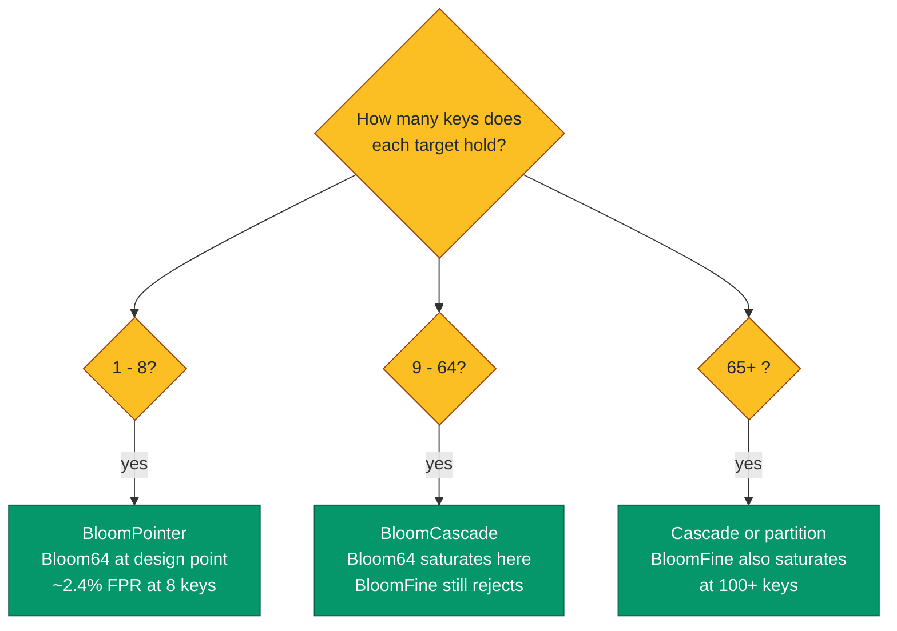
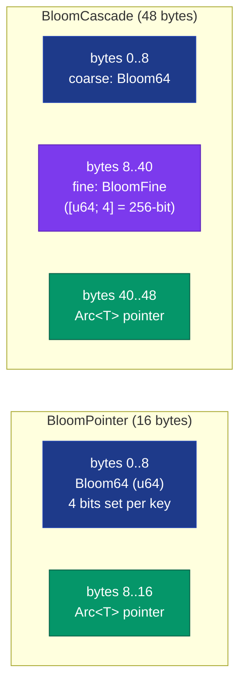
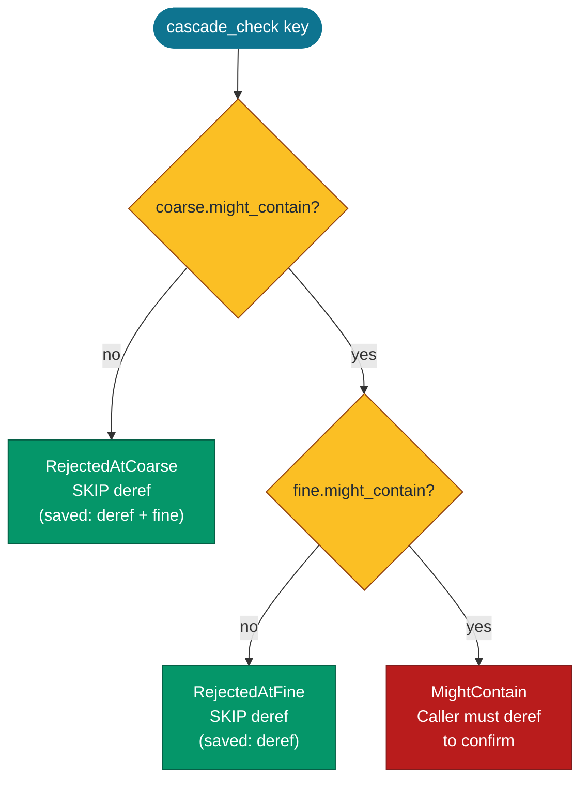

# Bloom64, BloomFine, BloomPointer&lt;T&gt;, BloomCascade&lt;T&gt;


Pointers that carry a Bloom-filter summary of their target's
membership keys, enabling `bloom.might_contain(query)` to reject
queries with one hash and a few bit tests, without touching the
pointed-to data. When a scan iterates many candidate pointers and
the query misses most of them, the Bloom shortcircuit skips the
deref and scan for about 98% of absent keys at `Bloom64`'s
suggested load of 8 keys; only a false positive pays the full
deref cost.

> **The "skip the deref when you can prove the answer is no"
> primitive.** Same architectural shape as LSM-tree Bloom layers,
> database B-tree subtree filters, content-addressed storage
> negative lookups. The 64-bit `Bloom64` fits in one register;
> the 256-bit `BloomFine` fits in one YMM; the two-level
> `BloomCascade` couples them for the saturation regime.

**Constraints (read first):**

- **In-process only.** `BloomPointer` and `BloomCascade` hold an
  `Arc<T>` to the target. Cross-process Bloom pointers require
  layering this design over an MMF substrate.
- **Right-size to the filter's capacity.** Bloom64 is designed for
  ~8 keys at ~2.4% FPR; at 16 keys the FPR is ~16%, at 32 ~56%,
  and at 64 ~93%. BloomFine suggests 32 keys (~2.5%) and stays
  under ~5% up to ~37 keys (~31% at 64). Choose the variant
  matching the workload's per-pointer key count; for the
  intermediate regime (16 to ~37 keys) use `BloomCascade`
  (coarse + fine).
- **Caller maintains filter / target consistency.** The Bloom is
  built from caller-supplied keys at construction time. Mutating
  the target's membership keys after construction without
  rebuilding the filter produces silent false negatives.
- **Hash is `FxBloomHasher`** (FxHash-style rotate-xor-multiply,
  finished with MurmurHash3's `fmix64`). Fast but **not
  cryptographically strong** and **not stable across crate
  versions**, so filter bits built by one version
  may not answer `might_contain` correctly under another. Persist
  the keys rather than the filter bits, and rebuild the filter
  where it is used.
- **Wins only when the skipped work costs more than the check.**
  The measured cases below range from 1.21x (a saturated
  single-level filter at 32 keys) to 4.50x (eight 32-byte strings
  per target); a target smaller than 8 keys was not measured.

---

## Table of contents

- [What they are](#what-they-are)
- [The four types and when to pick each](#the-four-types-and-when-to-pick-each)
- [Memory layout](#memory-layout)
- [Hash design (FxBloomHasher)](#hash-design-fxbloomhasher)
- [False-positive rate vs load](#false-positive-rate-vs-load)
- [Cascade dispatch](#cascade-dispatch)
- [API at a glance](#api-at-a-glance)
- [Worked example](#worked-example)
- [Benchmark results](#benchmark-results)
- [Use case patterns](#use-case-patterns)
- [Known limitations (verified)](#known-limitations-verified)
- [Common pitfalls](#common-pitfalls)

---

## What they are

Four cooperating types:

```rust
pub struct Bloom64(pub u64);                      // 8 bytes, 4 hash indices

pub struct BloomFine { bits: [u64; 4] }           // 32 bytes, 8 hash indices

pub struct BloomPointer<T> {
    bloom:  Bloom64,                              // 8 B
    target: Arc<T>,                               // 8 B
}                                                 // 16 B total

pub struct BloomCascade<T> {
    coarse: Bloom64,                              // 8 B
    fine:   BloomFine,                            // 32 B
    target: Arc<T>,                               // 8 B
}                                                 // 48 B total
```

`Bloom64` and `BloomFine` are the filter types. `BloomPointer<T>`
pairs a Bloom64 with an Arc-backed target; `BloomCascade<T>`
pairs both filter levels with a target for the saturated regime.

## The four types and when to pick each


```mermaid
flowchart TD
    Q{How many keys does<br/>each target hold?} --> A{1 - 8?}
    Q --> B{9 - 64?}
    Q --> C{65+ ?}
    A -->|yes| P1[BloomPointer<br/>Bloom64 at design point<br/>~2.4% FPR at 8 keys]
    B -->|yes| P2[BloomCascade<br/>Bloom64 saturates here<br/>BloomFine still rejects]
    C -->|yes| P3[Cascade or partition<br/>BloomFine also saturates<br/>at 100+ keys]

    classDef question fill:#fbbf24,stroke:#92400e,color:#1f2937
    classDef branch fill:#fbbf24,stroke:#92400e,color:#1f2937
    classDef pick fill:#059669,stroke:#065f46,color:#ffffff
    class Q,A,B,C question
    class P1,P2,P3 pick
```

| Per-target key count | Filter | FPR estimate | Pointer type |
|---:|---|---:|---|
| 1-4 | Bloom64 | 0.0013-0.24% | `BloomPointer<T>` |
| 5-8 | Bloom64 | 0.52-2.4% | `BloomPointer<T>` (the design point) |
| 9-16 | Bloom64 | 3.4-16% (saturating) | `BloomCascade<T>` (cascade saves it) |
| 16-64 | BloomFine | 0.057-31% (under 5% to ~37 keys) | `BloomCascade<T>` |
| 65+ | BloomFine | 32% and up (saturating) | Partition target into multiple pointers, or accept the FPR |

## Memory layout


```mermaid
flowchart LR
    subgraph BP["BloomPointer (16 bytes)"]
      direction LR
      B0["bytes 0..8<br/>Bloom64 (u64)<br/>4 bits set per key"]
      T0["bytes 8..16<br/>Arc&lt;T&gt; pointer"]
    end

    subgraph BC["BloomCascade (48 bytes)"]
      direction LR
      C0["bytes 0..8<br/>coarse: Bloom64"]
      F0["bytes 8..40<br/>fine: BloomFine<br/>([u64; 4] = 256-bit)"]
      TC["bytes 40..48<br/>Arc&lt;T&gt; pointer"]
    end

    classDef coarse fill:#1e3a8a,stroke:#1e40af,color:#ffffff
    classDef fine fill:#7c3aed,stroke:#5b21b6,color:#ffffff
    classDef ptr fill:#059669,stroke:#065f46,color:#ffffff
    class B0,C0 coarse
    class F0 fine
    class T0,TC ptr
```

## Hash design (FxBloomHasher)

The filters hash with `FxBloomHasher`, an FxHash-style
rotate-xor-multiply hasher, and pass its output through
MurmurHash3's 64-bit finalizer:

```rust
fn write_u64(&mut self, n: u64) {
    self.0 = (self.0.rotate_left(5) ^ n).wrapping_mul(FX_MULT);
}

fn fmix64(mut k: u64) -> u64 {
    k ^= k >> 33;
    k = k.wrapping_mul(0xFF51_AFD7_ED55_8CCD);
    k ^= k >> 33;
    k = k.wrapping_mul(0xC4CE_B9FE_1A85_EC53);
    k ^= k >> 33;
    k
}
```

A multiply leaves a product's low bits depending only on the key's
low bits, and the indices are sliced from fixed bit positions, so
the finalizer mixes every output bit from every input bit first.
Without it, sequential keys measured up to 1.65x the estimated
false-positive rate (Bloom64 at 16 keys: 26.4% against 16.0%).

`Bloom64::indices` produces 4 bit positions from a single hash
output, as 6-bit slices at bits 0, 16, 32 and 48.

`BloomFine::indices` makes two hash calls with different seeds
and takes 8-bit slices at the same offsets of each, 8 bit
positions across the 256-bit filter. The first of the two calls
uses `Bloom64`'s seed, so a key's fine indices extend its coarse
ones.

The hash is not cryptographic; the goal is bit-mixing for index
distribution, not collision resistance. Adversarial inputs could
craft hash collisions, so workloads under adversarial control
must use a stronger external hash and bypass the built-in.

## False-positive rate vs load

`Bloom64::estimated_fpr(n)` computes the standard formula
`(1 - exp(-k*n/m))^k` with `m = 64`, `k = 4`; the BloomFine
estimate is the same formula with `m = 256`, `k = 8`. The measured
columns insert the keys `0..n` and query 10,000 absent keys,
`1_000_000..1_010_000`; the hash is deterministic, so they are
exact for that key set:

| Keys inserted | Bloom64 estimate | Bloom64 measured | BloomFine estimate | BloomFine measured |
|---:|---:|---:|---:|---:|
| 1 | 0.0013% | 0.01% | < 0.0001% | 0.00% |
| 4 | 0.24% | 0.12% | < 0.001% | 0.00% |
| 8 (Bloom64 capacity) | ~2.4% | 1.81% | < 0.001% | 0.00% |
| 16 | ~16% | 16.94% | ~0.06% | 0.10% |
| 32 (BloomFine capacity) | ~56% | 55.09% | ~2.5% | 2.51% |
| 37 | ~66% | 63.14% | ~4.9% | 4.29% |
| 64 | ~93% (saturated) | 88.05% | ~31% | 26.34% |
| 100 | ~99% (saturated) | 93.90% | ~70% | 61.82% |

Read: Bloom64 is unusable above 16 keys; BloomFine stays under
~5% up to ~37 keys. The cascade structure exists for the gap
above 16 keys where Bloom64 fails but BloomFine still rejects.

## Cascade dispatch

`BloomCascade::cascade_check(key)` returns a three-state outcome:


```mermaid
flowchart TD
    Start([cascade_check key]) --> C{coarse.might_contain?}
    C -->|no| RC["RejectedAtCoarse<br/>SKIP deref<br/>(saved: deref + fine)"]
    C -->|yes| F{fine.might_contain?}
    F -->|no| RF["RejectedAtFine<br/>SKIP deref<br/>(saved: deref)"]
    F -->|yes| M[MightContain<br/>Caller must deref<br/>to confirm]

    classDef startend fill:#0e7490,stroke:#0e7490,color:#ffffff
    classDef decision fill:#fbbf24,stroke:#92400e,color:#1f2937
    classDef good fill:#059669,stroke:#065f46,color:#ffffff
    classDef maybe fill:#b91c1c,stroke:#7f1d1d,color:#ffffff
    class Start startend
    class C,F decision
    class RC,RF good
    class M maybe
```

The coarse-then-fine ordering puts the cheaper check first: at
32 keys per target, ~56% of absent keys pass the saturated coarse
Bloom64, while the fine 256-bit filter passes only ~2.5%. The
cascade pays the cheap check upfront and only routes to the fine
check when coarse fails to reject.

## API at a glance

<details open>
<summary><b>Bloom64</b></summary>

| Method | Signature | Notes |
|---|---|---|
| `ZERO` | `const Self` | Empty filter |
| `SUGGESTED_CAPACITY` | `const usize = 8` | ~2.4% estimated FPR at this load |
| `insert(key)` | `fn(&mut self, &K)` | Set 4 bits for key |
| `might_contain(key)` | `fn(&self, &K) -> bool` | `false` = definitely-no, `true` = might-be-yes |
| `from_keys(iter)` | `fn(I) -> Self` | Build from key iterator |
| `popcount()` | `fn(&self) -> u32` | Bits set (saturation indicator) |
| `estimated_fpr(n)` | `fn(usize) -> f64` | Analytical FPR for n keys |

</details>

<details open>
<summary><b>BloomFine</b></summary>

| Method | Signature | Notes |
|---|---|---|
| `ZERO` | `const Self` | Empty filter |
| `SUGGESTED_CAPACITY` | `const usize = 32` | ~2.5% estimated FPR at this load (2.51% measured); ~37 keys stay under 5% |
| `insert(key)` | `fn(&mut self, &K)` | Set 8 bits across `[u64; 4]` |
| `might_contain(key)` | `fn(&self, &K) -> bool` | Same contract as Bloom64 |
| `from_keys(iter)` | `fn(I) -> Self` | Build from iterator |
| `popcount()` | `fn(&self) -> u32` | Bits set across 256-bit filter |

</details>

<details open>
<summary><b>BloomPointer&lt;T&gt;</b></summary>

| Method | Signature | Notes |
|---|---|---|
| `new(target, bloom)` | `fn(Arc<T>, Bloom64) -> Self` | Caller-built filter |
| `from_keys(target, keys)` | `fn(Arc<T>, I) -> Self` | Filter built from key iterator |
| `bloom()` | `fn(&self) -> Bloom64` | A copy of the filter |
| `target()` | `fn(&self) -> &Arc<T>` | Borrow the target Arc |
| `might_contain(key)` | `fn(&self, &K) -> bool` | Skip-the-deref membership test |
| `set_bloom(b)` | `fn(&mut self, Bloom64)` | Replace filter after target mutation |

</details>

<details open>
<summary><b>BloomCascade&lt;T&gt;</b></summary>

| Method | Signature | Notes |
|---|---|---|
| `new(target, coarse, fine)` | constructor | Both filters supplied |
| `from_keys(target, keys)` | `fn(Arc<T>, I) -> Self` | Both filters built from iterator |
| `cascade_check(key)` | `fn(&self, &K) -> CascadeOutcome` | Three-state result |
| `coarse()` / `fine()` / `target()` | accessors | `Bloom64` by value, `&BloomFine`, `&Arc<T>` |

`CascadeOutcome::RejectedAtCoarse` / `RejectedAtFine` /
`MightContain`. `outcome.might_contain()` collapses to bool;
`outcome.rejected()` is the negation.

</details>

## Worked example

```rust
use std::sync::Arc;
use subetha_pointers::bloom_pointer::{BloomCascade, BloomPointer, CascadeOutcome};

// Pattern 1: BloomPointer for a small-key target (<=8 keys).
let target = Arc::new(vec![1u64, 2, 3, 4, 5, 6, 7, 8]);
let keys: Vec<u64> = target.iter().copied().collect();
let bp = BloomPointer::from_keys(target.clone(), keys);

for k in 1..=8u64 {
    assert!(bp.might_contain(&k));  // Inserted keys must pass.
}
// Most random misses reject:
let mut rejects = 0;
for k in 1000..1100u64 {
    if !bp.might_contain(&k) { rejects += 1; }
}
assert!(rejects > 95, "Bloom64 at capacity should reject ~97.6% of absent keys");

// Pattern 2: BloomCascade for medium-key target (8-64 keys).
let big_target: Arc<Vec<u64>> = Arc::new((0..40u64).collect());
let big_keys: Vec<u64> = big_target.iter().copied().collect();
let bc = BloomCascade::from_keys(big_target.clone(), big_keys);

// Three-state classification per query.
for k in 0..40u64 {
    let outcome = bc.cascade_check(&k);
    assert!(outcome.might_contain(), "inserted key {k} must pass");
}

// Random misses: most are rejected at coarse or fine.
let mut coarse_rej = 0;
let mut fine_rej = 0;
let mut survive = 0;
for k in 1000..1100u64 {
    match bc.cascade_check(&k) {
        CascadeOutcome::RejectedAtCoarse => coarse_rej += 1,
        CascadeOutcome::RejectedAtFine   => fine_rej += 1,
        CascadeOutcome::MightContain     => survive += 1,
    }
}
// 40 keys saturates coarse (Bloom64 capacity = 8) so most queries
// reach the fine layer; fine still rejects most randoms.
assert!(coarse_rej + fine_rej >= 90);
```

## Benchmark results

Bench: `crates/subetha-pointers/benches/versioned_bloom.rs`
(`bloom_*` groups). Measured on Windows 11 Pro 10.0.26200 on an
AMD Ryzen 9 7900X, built for the x86-64 baseline, with Criterion's
defaults (3 s warm-up, 100 samples over 5 s; middle estimate of each
[low, mid, high] triple), while other work kept 3.8 of the machine's
24 hardware threads busy. Each bench queries one absent key against
N candidate pointers and counts the pointers that survive the
shortcircuit to actually require a deref. The pass rates quoted
below are estimates from each filter's fill; the bench does not
count them.

| Workload | Native | Bloom | Winner |
|---|---:|---:|---|
| `miss_query` (1024 ptrs x 8 u64 keys, Bloom64 at capacity) | 2.36 us | **1.38 us** | **Bloom 1.71x** |
| `miss_large_subset` (128 ptrs x 64 u64 keys, BloomCascade) | 1.53 us | **969 ns** | **Bloom 1.58x** |
| `cascade.miss_query` (1024 ptrs x 32 u64 keys, saturated regime) | 7.56 us | 6.25 us (single) / **3.27 us (cascade)** | **Cascade 2.31x vs native, 1.91x vs saturated single** |
| `expensive_deref` (512 ptrs x 8 same-length strings) | 9.41 us | **2.09 us** | **Bloom 4.50x** |

### Why each result lands where it does

<details>
<summary><b>miss_query (Bloom64 at capacity): Bloom wins 1.71x</b></summary>

8 keys per pointer matches `Bloom64::SUGGESTED_CAPACITY`. Eight
keys set an expected 39% of the 64 bits (`1 - e^(-32/64)`), so an
absent key passes all 4 tests with probability ~2.4%, and the
shortcircuit fires on ~97.6% of misses.

Per pointer: 2.30 ns native (a `Vec<u64>::contains` over 8
elements behind an `Arc`) against 1.35 ns for the Bloom path,
which hashes the query, tests 4 bits, and skips the deref for
nearly every pointer.

</details>

<details>
<summary><b>miss_large_subset (BloomCascade at twice BloomFine's capacity): 1.58x win</b></summary>

64 keys per pointer is twice `BloomFine::SUGGESTED_CAPACITY`. By
the estimate ~93% of absent keys pass the saturated coarse check
and ~31% the fine one, so the cascade still dereferences about three
targets in ten. The cascade computes three hashes per check: the
coarse one, then the fine filter's two.

Per pointer: 12.0 ns native (a `Vec<u64>::contains` over 64
elements) against 7.6 ns for the cascade, 1.53 us against
969 ns over the 128 pointers.

</details>

<details>
<summary><b>cascade.miss_query (saturated regime): Cascade 2.31x vs native, 1.91x vs single Bloom64</b></summary>

32 keys per pointer is **above Bloom64's capacity** and **at
BloomFine's**. By the estimate, thirty-two keys set 86% of the
coarse filter's bits, so `Bloom64::might_contain` passes ~56% of
absent keys, and the fine BloomFine passes ~2.5%.

Three-way breakdown:
- Native Vec scan: 7.56 us
- Single Bloom64: 6.25 us - 1.21x faster than native; the
  saturated filter pays its check and still derefs for ~56% of
  pointers by the estimate.
- BloomCascade: **3.27 us** - the fine layer rejects, and by the
  estimate at most ~2.5% of pointers reach a deref.

At 32 keys the saturated single-level Bloom saves 1.21x over no
filter; the cascade's fine layer is what rejects.

</details>

<details>
<summary><b>expensive_deref (Bloom wins 4.50x): the design point</b></summary>

512 pointers, 8 same-length 32-byte strings per pointer, miss
key also 32 bytes. `String::eq` cannot reject on a length
difference, so every comparison calls into the byte compare; the
strings differ from the query in their first byte, so the cost is
reaching each string's own heap buffer, eight per pointer.
Native path: 9.41 us, 18.4 ns per pointer.

Bloom path: 2.09 us, 4.1 ns per pointer: hashing the 32-byte
query and testing 4 bits, with the eight string reads skipped for
~97.6% of pointers by the estimate.

The largest measured gain, 4.50x: the skipped work costs more
than the hash.

</details>

## Use case patterns

<details>
<summary><b>Pattern 1: HashMap bucket-chain negative lookup acceleration</b></summary>

A custom HashMap stores `Vec<BloomPointer<Entry>>` per bucket.
On lookup, walk the chain checking `bp.might_contain(&key)`
before dereferencing each Entry. For dense maps where the key
is rarely in the bucket, the Bloom shortcircuit eliminates
most of the chain traversal.

</details>

<details>
<summary><b>Pattern 2: LSM-tree level skipping</b></summary>

An LSM-tree maintains per-SSTable Bloom filters as
`BloomCascade<SSTable>` (coarse for the most-recent levels,
cascade for the older levels where each SSTable holds many
keys). A point lookup walks levels newest-to-oldest; each
SSTable's cascade can reject before the disk read happens.

</details>

<details>
<summary><b>Pattern 3: content-addressed cache negative lookups</b></summary>

A blob cache stores `Vec<BloomPointer<Vec<u8>>>` keyed by
content hash prefix. Cache misses (the common case for a
warming cache) reject through Bloom without dereferencing
the stored Vec<u8> at all.

</details>

<details>
<summary><b>Pattern 4: graph adjacency edge-existence checks</b></summary>

A graph stores per-node `BloomPointer<Vec<NodeId>>` where the
Bloom summarizes outgoing edge labels. `has_edge_label(label)`
runs at hash-cost without walking the adjacency list. The
cascade variant kicks in for nodes with high out-degree.

</details>

## Known limitations (verified)

1. **In-process only.** Arc-backed targets are not portable across
   processes.

2. **Hash is non-cryptographic.** `FxBloomHasher` is designed for
   speed, not collision resistance. Adversarial inputs may craft
   queries that bypass the filter (force a false-positive); this
   is the standard non-crypto-Bloom risk.

3. **Hash is not stable across crate versions.** A future patch
   may tune the multiplier or rotation constant. Workloads
   persisting filter bits across versions must hash externally.

4. **Filter / target consistency is caller-managed.** Mutating
   `target`'s membership after building the filter produces
   silent false negatives. Use `set_bloom` to replace the
   filter after target mutation; the crate does not enforce
   this.

5. **Capacity caps are advisory, not enforced.**
   `Bloom64::SUGGESTED_CAPACITY = 8` (~2.4% estimated FPR) and
   `BloomFine::SUGGESTED_CAPACITY = 32` (~2.5%) do not stop an
   insert; past them the FPR keeps climbing toward 100%
   (saturated filter).

6. **Wins require the skipped work to cost more than the check.**
   The benches measured gains from 1.21x, a saturated
   single-level filter at 32 keys (`cascade.miss_query`), to
   4.50x; targets smaller than 8 keys were not measured.

7. **`BloomPointer` is 16 bytes; `BloomCascade` is 48 bytes.**
   Storage cost scales with the filter sophistication.

## Common pitfalls

<details>
<summary><b>Pitfall 1: over-filling Bloom64</b></summary>

```rust
let mut b = Bloom64::ZERO;
for k in 0..100u64 { b.insert(&k); }  // 100 keys >> SUGGESTED_CAPACITY (8)
// b.popcount() will be at or near 64 - the filter is saturated.
// Almost every query returns true (~99% by the estimate).
```

Check `popcount()` or `estimated_fpr(n)` before relying on
shortcircuit behavior. For n keys near or above
`SUGGESTED_CAPACITY`, switch to `BloomCascade`.

</details>

<details>
<summary><b>Pitfall 2: target mutation without bloom rebuild</b></summary>

```rust
use std::sync::Arc;
use subetha_pointers::bloom_pointer::{Bloom64, BloomPointer};

let mut keys = vec![1u64, 2, 3];
let mut bp = BloomPointer::from_keys(Arc::new(keys.clone()), keys.clone());

// Later the key set gains 999 and the target is replaced, but the
// old filter is carried over.
keys.push(999);
bp = BloomPointer::new(Arc::new(keys.clone()), bp.bloom());

// The filter predates 999, so might_contain(&999) is almost surely
// false: a silent false negative.
assert!(!bp.might_contain(&999));
```

After changing the target, rebuild and replace the filter:

```rust
bp.set_bloom(Bloom64::from_keys(keys.iter()));
assert!(bp.might_contain(&999));
```

Replace the filter together with the target, so no reader sees
one updated without the other.

</details>

<details>
<summary><b>Pitfall 3: assuming Bloom rejection means deref is impossible</b></summary>

```rust
if !bp.might_contain(&key) {
    // Definitely not in the target. No deref needed.
} else {
    // Maybe: ~2.4% of absent keys pass Bloom64 at capacity.
    // Deref and confirm with a full equality test:
    if bp.target().contains(&key) {
        // Confirmed match.
    } else {
        // False positive.
    }
}
```

Skipping the confirmation step on the `might_contain == true`
branch means treating false positives as true positives -
correctness bug for any workload that needs definitive answers.

</details>

<details>
<summary><b>Pitfall 4: single-level Bloom on a saturated workload</b></summary>

```rust
// 50 keys per pointer, but using Bloom64 (capacity 8):
let bp = BloomPointer::from_keys(target.clone(), keys_50);
// might_contain passes ~84% of absent keys by the estimate, so
// the deref is rarely skipped and the check only adds cost.
```

The bench `cascade.miss_query` (32 keys per pointer)
empirically shows single-level Bloom64 at 11.85 us vs native
10.83 us - **single Bloom loses** in the saturated regime.
The cascade variant at the same workload runs at 4.36 us
because the fine layer actually rejects.

Use `BloomCascade` whenever per-pointer key counts exceed
`Bloom64::SUGGESTED_CAPACITY`.

</details>

---

[back to subetha-pointers docs](../../)
