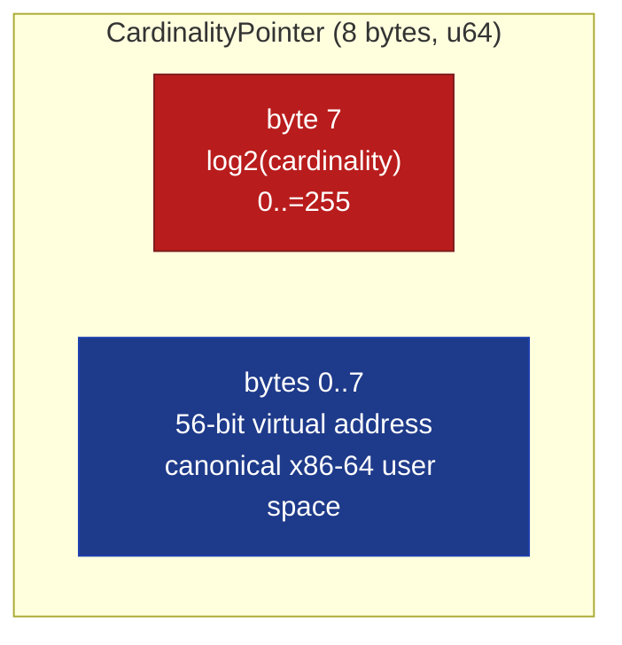

# CardinalityPointer&lt;T&gt;


-top_8_bits-success)


An 8-byte pointer that packs `log2(cardinality_of_target)` into
the high byte and the 56-bit machine address into the low bytes.
The cardinality byte is read directly by query planners /
algorithm dispatchers without touching the pointed-to data,
making it possible to branch on the **size** of a target before
deciding whether to scan / sort-merge / hash-join over it.

> **The "branch on size before dereferencing" primitive.** Same
> architectural shape as JVM compressed-oops storing a klass id
> in the low bits of a pointer, Hotspot's narrow-klass technique,
> or Apple Silicon's Top-Byte-Ignored hardware that uses the
> high byte for pointer tagging. Here the high byte carries
> `log2(cardinality)` so query planners can dispatch over a
> 64-byte cache line of pointers without indirection.

**Constraints (read first):**

- **In-process only.** The 56-bit address is a real machine
  pointer; meaningless across processes.
- **`from_raw` is `unsafe` and panics on out-of-envelope
  addresses.** Its `assert!(addr & !ADDR_MASK == 0)` is a runtime
  check that fires in BOTH debug and release builds when the high
  byte of the address is non-zero. For trusted hot paths where the
  caller has verified the envelope, use `from_raw_unchecked`
  (which silently masks the address - a real correctness hazard
  if the caller's assertion is wrong).
- **Address envelope is 56 bits.** x86-64 4-level paging
  (canonical user-space) uses 48 bits with bits 48..63 = 0, well
  within the envelope. **5-level paging environments** (Linux
  `CONFIG_X86_5LEVEL`, certain user-space hardening schemes) can
  produce addresses with bit 56+ set; calling `from_raw` panics
  in that case, calling `from_raw_unchecked` silently corrupts
  the cardinality byte.
- **Cardinality is stored as `log2`** (1 byte = 256 distinct
  values, encoding cardinalities up to 2^255). The encoding is
  `ceil(log2(cardinality_hint))` - conservative bucketing that
  rounds up to the next power of two.
- **Cardinality is caller-supplied at construction.** The crate
  does not track the target's actual size; mutations of the
  target after construction make the encoded cardinality stale.
  Use `set_cardinality` to refresh when the target's size
  changes.
- **`size_tier()` is a coarse 3-way bucket.** Tiny (cardinality
  ≤ 8), Medium (≤ 1024), Large (> 1024). For finer
  classifications, read `log2_cardinality` directly.
- **Apple Silicon TBI compatibility, not currently used.** On
  AArch64 with Top-Byte-Ignored enabled the high byte is masked
  by hardware on every dereference, making this pointer
  layout's masked-on-deref pattern free. On x86-64 the
  `as_raw` accessor explicitly masks.

---

## Table of contents

- [What it is](#what-it-is)
- [Why pack cardinality into the pointer](#why-pack-cardinality-into-the-pointer)
- [Bit layout](#bit-layout)
- [Cardinality encoding](#cardinality-encoding)
- [Three-tier classification](#three-tier-classification)
- [API at a glance](#api-at-a-glance)
- [Worked example](#worked-example)
- [Benchmark results](#benchmark-results)
- [Use case patterns](#use-case-patterns)
- [Known limitations (verified)](#known-limitations-verified)
- [Common pitfalls](#common-pitfalls)

---

## What it is

`CardinalityPointer<T>` is a `repr(transparent)` wrapper around
a `u64`:

```rust
#[repr(transparent)]
pub struct CardinalityPointer<T> {
    raw: u64,
    _phantom: PhantomData<*const T>,
}

pub const ADDR_MASK: u64 = 0x00FF_FFFF_FFFF_FFFF;  // low 56 bits
pub const CARD_SHIFT: u32 = 56;                    // log2 lives at top byte
```

The 8-byte slot encodes:
- High byte (`raw >> 56`): `log2(cardinality)` in 0..=255
- Low 7 bytes (`raw & ADDR_MASK`): 56-bit virtual address

A `CardinalityPointer<u64>` is exactly the same size as a raw
`*const u64`, with no padding. Pair this with the
`size_tier()` classifier and a query planner can branch on
target size without dereferencing.

## Why pack cardinality into the pointer

Query planners, ECS world walkers, graph databases, and stream
processors all want to know **how big is this collection** before
deciding which algorithm to dispatch:

| Cardinality | Optimal algorithm | Per-element cost |
|---:|---|---|
| 1 - 8 | Linear scan | O(N), small constant |
| 9 - 1024 | Sort-merge or quicksort | O(N log N), branch-friendly |
| > 1024 | Hash join / Bloom-filter / external partition | O(N), allocator-bound |

Without `CardinalityPointer<T>`, callers store cardinality in a
parallel metadata table (extra cache-line lookup) or dereference
the target just to read its size field (cold cache miss when the
target is not yet needed). Either way, the planner pays for the
indirection on every dispatch decision.

By packing `log2(cardinality)` into the top byte of the pointer
itself, the planner gets:

- **Storage density**: 8 bytes per entry instead of 16 bytes for
  a `(ptr, u8 tier)` tuple Rust pads.
- **Single-load dispatch**: one `mov` reads both the pointer
  and the tier; no second cache-line touch.
- **Branch-friendly inspection**: `size_tier()` is a top-byte
  shift + match, ~1 ns.

## Bit layout



Read access:

```text
log2_card = raw >> 56                          // top byte
addr      = raw & 0x00FF_FFFF_FFFF_FFFF        // low 56 bits
cardinality_estimate = 1 << log2_card          // 2^k
```

## Cardinality encoding

The constructor bucketizes a `cardinality_hint: u64` via
`ceil(log2(hint))`:

| Hint | `log2_cardinality` | Reconstructed `cardinality` | size_tier |
|---:|---:|---:|---|
| 0 | 0 | 1 | Tiny |
| 1 | 0 | 1 | Tiny |
| 2 | 1 | 2 | Tiny |
| 5 | 3 | 8 | Tiny |
| 100 | 7 | 128 | Medium |
| 1 000 | 10 | 1 024 | Medium |
| 1 000 000 | 20 | 1 048 576 | Large |
| u64::MAX | 64 | (saturated to u64::MAX) | Large |

The reconstructed cardinality is always a power of two and
always **≥** the original hint. This is intentional: the planner
should pick the algorithm for the worst-case bucket, not the
optimistic mid-bucket value.

## Three-tier classification

```mermaid
flowchart TD
    Start([read top byte]) --> K{k = log2_cardinality}
    K -->|0..=3 (k≤3, n≤8)| Tiny[SizeTier::Tiny<br/>linear scan]
    K -->|4..=10 (16..=1024)| Medium[SizeTier::Medium<br/>sort-merge]
    K -->|11..=255 (>1024)| Large[SizeTier::Large<br/>hash join]

    classDef startend fill:#0e7490,stroke:#0e7490,color:#ffffff
    classDef decision fill:#fbbf24,stroke:#92400e,color:#1f2937
    classDef tier fill:#1e40af,stroke:#1e3a8a,color:#ffffff
    class Start startend
    class K decision
    class Tiny,Medium,Large tier
```

The 3-tier bucketing matches the three algorithmic regimes
above. Callers with finer needs read `log2_cardinality()`
directly (returns `u8`, so a `match k { 0 => ..., 1 => ..., ...
}` distinguishes 256 buckets).

## API at a glance

<details open>
<summary><b>Construction</b></summary>

| Method | Signature | Notes |
|---|---|---|
| `from_raw(target, cardinality_hint)` (unsafe) | `unsafe fn(*const T, u64) -> Self` | **Panics** on out-of-envelope address (release + debug). |
| `from_raw_unchecked(target, cardinality_hint)` (unsafe) | `unsafe fn(*const T, u64) -> Self` | Skips envelope check; silently masks the address. Use only when the caller has verified the envelope out of band. |

</details>

<details open>
<summary><b>Inspection</b></summary>

| Method | Returns | Notes |
|---|---|---|
| `as_raw()` | `*const T` | Address with the cardinality byte masked off. **Use this** for any deref or pointer comparison. |
| `log2_cardinality()` | `u8` | Top byte, 0..=255 |
| `cardinality()` | `u64` | Reconstructed `1 << k`; saturates at `u64::MAX` for `k >= 63` |
| `raw()` | `u64` | Raw packed representation; cross-process-stable encoding |
| `size_tier()` | `SizeTier` | 3-way bucket: Tiny / Medium / Large |

</details>

<details>
<summary><b>Mutation</b></summary>

| Method | Signature | Notes |
|---|---|---|
| `set_cardinality(new_cardinality: u64)` | `&mut self` | Updates the encoded log2 in place; preserves the address bits |

</details>

<details>
<summary><b>Derived traits</b></summary>

`Copy + Clone + PartialEq + Eq + Hash + Debug`. Equality and hash
are on the packed `u64`, so two pointers with the same address
but different cardinality compare as distinct (consistent with
"this is a snapshot of the target's size").

</details>

## Worked example

```rust
use subetha_pointers::cardinality_pointer::{
    CardinalityPointer, SizeTier,
};

// Scenario: query planner over 3 candidate target sets of
// different sizes. Plan dispatches based on size_tier.
let plans: [CardinalityPointer<u64>; 3] = unsafe {
    [
        // Tiny set: 5 elements -> linear scan.
        CardinalityPointer::from_raw(0x0000_0000_0000_1000 as *const u64, 5),
        // Medium set: 500 elements -> sort-merge.
        CardinalityPointer::from_raw(0x0000_0000_0000_2000 as *const u64, 500),
        // Large set: 5 million elements -> hash join.
        CardinalityPointer::from_raw(0x0000_0000_0000_3000 as *const u64, 5_000_000),
    ]
};

for p in &plans {
    match p.size_tier() {
        SizeTier::Tiny => {
            // Linear scan over the target without dereferencing yet
            // (the actual scan would call into the target, but the
            // dispatch decision was made from the pointer alone).
        }
        SizeTier::Medium => { /* sort-merge */ }
        SizeTier::Large => { /* hash join */ }
    }
}

// log2_cardinality also exposes the underlying bucket for finer
// dispatch.
let p_million = unsafe {
    CardinalityPointer::<u64>::from_raw(0x1000 as *const u64, 1_000_000)
};
assert_eq!(p_million.log2_cardinality(), 20);
assert_eq!(p_million.cardinality(), 1 << 20);  // 1_048_576
assert_eq!(p_million.size_tier(), SizeTier::Large);

// In-place update if the target grows.
let mut p = p_million;
p.set_cardinality(10_000_000);
assert_eq!(p.log2_cardinality(), 24);
```

## Benchmark results

10 000-entry workload comparing CardinalityPointer to two
realistic native baselines. Measured on Windows 11 / Zen+ R7 2700,
criterion at `--measurement-time 2 --warm-up-time 1
--sample-size 30` (middle estimate of each [low, mid, high]
triple).

### Bench fairness

Two design choices keep the comparison honest:

1. Both native paths use **pre-computed tier bytes**, so the bench
   measures lookup cost, not pre-computation: computing `log2(card)`
   inside the native loop body would compare "cardinality-pointer's
   pre-computed byte read" against "compute-log2-every-query."

2. A `dispatch_*` variant reads BOTH the pointer and the tier per
   entry (the realistic query-planner workload); a tier-only walk
   exercises only the classify decision.

### Tier-only scan (just classify, don't deref)

| Workload | Layout | Time | Per-entry |
|---|---|---:|---:|
| `padded_tuple_baseline` | `Vec<(*const u64, u8)>` (16 B padded) | 9.34 us | 0.93 ns |
| `parallel_vecs_baseline` | `Vec<*const u64>` + `Vec<u8>` | 9.21 us | 0.92 ns |
| **`inline_size_tier`** | `Vec<CardinalityPointer<u64>>` (8 B) | **7.96 us** | **0.80 ns** |

### Realistic dispatch (read both pointer and tier per entry)

| Workload | Time | Per-entry |
|---|---:|---:|
| `dispatch_padded_tuple` | 9.71 us | 0.97 ns |
| **`dispatch_parallel_vecs`** | **6.28 us** | **0.63 ns** |
| `dispatch_inline` (CardinalityPointer) | 9.50 us | 0.95 ns |

### Reading the results

The architectural claim for CardinalityPointer is that packing the
tier into the pointer gives a single-stream, single-load dispatch
that should beat the two-array `parallel_vecs` layout. **On this
host (Zen+ R7 2700, N=10 000) that claim does NOT hold for the
dispatch case**: `parallel_vecs` is the fastest dispatch path at
6.28 us, ~1.5x faster than `inline` (9.50 us). The two separate
streams (a `Vec<*const u64>` and a `Vec<u8>`) are both small enough
to sit in cache and the hardware prefetcher tracks them
independently with no penalty, while the inline path pays for
shift+mask on every entry.

In the tier-only scan the inline path is fastest (7.96 us vs
~9.2 us), so the packed layout helps when only the tier byte is
read but not when both fields are consumed per entry at this size.

The single-stream advantage is expected to grow at larger N (where
`parallel_vecs`' two arrays stop co-residing in cache) and on
microarchitectures with fewer independent prefetch streams; it is
not realized at N=10 000 on this CPU. Treat the packed layout as a
storage-density win (8 B vs the padded tuple's 16 B) whose latency
benefit is hardware- and size-dependent, not a guaranteed dispatch
speedup. Re-run `cargo bench -p subetha-pointers --bench
bitsteal_pointers` on the target hardware before relying on it.

## Use case patterns

<details>
<summary><b>Pattern 1: query planner dispatch over candidate sets</b></summary>

A database query planner stores pointers to candidate result
sets along with their cardinality estimates from the statistics
table. Dispatch picks the algorithm without dereferencing:

```rust
fn plan_join(plans: &[CardinalityPointer<TableSubset>]) -> JoinPlan {
    let mut tiny_count = 0;
    let mut medium_count = 0;
    let mut large_count = 0;
    for p in plans {
        match p.size_tier() {
            SizeTier::Tiny => tiny_count += 1,
            SizeTier::Medium => medium_count += 1,
            SizeTier::Large => large_count += 1,
        }
    }
    // Decide on hash join, sort-merge, or nested loop based on
    // the tier distribution, WITHOUT touching the underlying
    // table data.
    pick_strategy(tiny_count, medium_count, large_count)
}
```

</details>

<details>
<summary><b>Pattern 2: graph adjacency size-based dispatch</b></summary>

A graph database stores per-node adjacency lists as
`CardinalityPointer<AdjList>` keyed by node ID. BFS / DFS
walkers branch on the degree (encoded as log2_cardinality) to
pick between dense-array iteration and sparse-set lookup:

```rust
let adj = node.adjacency_ptr();
match adj.size_tier() {
    SizeTier::Tiny => unsafe {
        // Few neighbors: scan inline array.
        scan_small(adj.as_raw());
    }
    SizeTier::Medium => unsafe {
        // Sort + binary search.
        scan_sorted(adj.as_raw());
    }
    SizeTier::Large => unsafe {
        // Hash set lookup.
        scan_hashed(adj.as_raw());
    }
}
```

</details>

<details>
<summary><b>Pattern 3: ECS component-array fast-path dispatch</b></summary>

An ECS world stores per-archetype component arrays. The
scheduler walks archetypes and dispatches systems; rare
archetypes (small entity counts) get inlined system code, common
archetypes get vectorized loops. Cardinality is the dispatch
selector.

</details>

<details>
<summary><b>Pattern 4: streaming query operator with dynamic sizing</b></summary>

A streaming join operator with dynamically-sized buckets carries
a `CardinalityPointer<Bucket>` per bucket. Operators downstream
of the bucket emitter read the cardinality byte to decide
whether to spill to disk (Large), buffer in memory
(Medium), or process inline (Tiny).

</details>

## Known limitations (verified)

1. **In-process only.** The 56-bit address is a real machine
   pointer.

2. **`from_raw` panics on out-of-envelope address.** Verified by
   the test `from_raw_panics_on_out_of_envelope_address`. The
   panic fires in both debug and release builds.

3. **`from_raw_unchecked` silently masks.** Verified by
   `from_raw_unchecked_skips_envelope_check`. Caller asserts
   via the `unsafe` contract that the address envelope is valid.

4. **Cardinality is caller-supplied.** No automatic tracking of
   target size mutations. Stale cardinality after target growth
   results in mis-classified dispatch (Tiny algorithm running
   over a Large target).

5. **Bucketing is `ceil(log2)`.** Two cardinalities in the same
   power-of-two bucket map to the same `log2_cardinality`. A
   100-element target and a 128-element target both encode as
   `k = 7` (representing 128).

6. **`cardinality()` saturates at `u64::MAX`.** Encodings of
   `k >= 63` map to `u64::MAX` rather than `1 << k` (which would
   shift out of u64 range).

7. **`size_tier()` is a coarse 3-way bucket.** Tiny ≤ 8, Medium
   9..=1024, Large > 1024. Workloads needing more granularity
   use `log2_cardinality()` directly.

8. **5-level paging incompatibility.** On Linux with
   `CONFIG_X86_5LEVEL`, addresses can have bit 56+ set
   legitimately. `from_raw` panics on such addresses;
   `from_raw_unchecked` corrupts the cardinality byte.

9. **AArch64 Top-Byte-Ignored not exercised.** On Apple Silicon
   and modern ARM Linux, TBI masks the top byte at hardware
   level on every deref. CardinalityPointer's `as_raw` does the
   masking in software anyway, so the layout works on TBI
   hardware but doesn't get the free hardware mask.

10. **The encoded value is `log2`, not the cardinality itself.**
    Callers comparing `log2_cardinality` values directly are
    comparing exponents, not magnitudes. To compare actual
    sizes use `cardinality()` (or the size_tier classification).

## Common pitfalls

<details>
<summary><b>Pitfall 1: dereferencing without masking</b></summary>

```rust
// WRONG: top byte (cardinality) is still in the bit pattern.
let p: CardinalityPointer<u64> = unsafe {
    CardinalityPointer::from_raw(0x1000 as *const u64, 100)
};
let raw_with_card = p.raw() as *const u64;  // includes top byte!
// unsafe { *raw_with_card }  // would dereference 0x0700_0000_0000_1000, NOT 0x1000
```

Use `as_raw()` which masks off the cardinality byte:

```rust
let real_addr = p.as_raw();  // 0x0000_0000_0000_1000
```

</details>

<details>
<summary><b>Pitfall 2: stale cardinality after target mutation</b></summary>

```rust
let mut target = vec![1u64, 2, 3];  // cardinality = 3
let p = unsafe {
    CardinalityPointer::from_raw(target.as_ptr(), target.len() as u64)
};
assert_eq!(p.size_tier(), SizeTier::Tiny);

target.extend(0..1_000_000);  // cardinality now 1_000_003
// p.size_tier() still reports Tiny -> dispatcher picks linear scan
// over a million-element target.
```

Either:
1. Don't mutate the target after constructing the pointer, or
2. Call `set_cardinality` on the pointer after every mutation.

</details>

<details>
<summary><b>Pitfall 3: assuming `cardinality()` equals the original hint</b></summary>

```rust
let p = unsafe {
    CardinalityPointer::<u64>::from_raw(0x1000 as *const u64, 100)
};
// log2(100) ceiling = 7, so cardinality = 128
assert_eq!(p.cardinality(), 128);  // NOT 100
```

The encoding is `ceil(log2(hint))`; the reconstructed value is
the upper bound of the bucket, not the original hint. For exact
size lookups, store the hint separately or use `log2_cardinality`
to bucket consistently across writes and reads.

</details>

<details>
<summary><b>Pitfall 4: out-of-envelope address on 5-level paging</b></summary>

```rust
// On Linux with CONFIG_X86_5LEVEL, user-space mappings can land
// at addresses with bit 56+ set.
let high_addr: *const u64 = 0x0100_0000_0000_0000_u64 as *const u64;
let p = unsafe {
    CardinalityPointer::<u64>::from_raw(high_addr, 100)  // PANICS
};
// from_raw_unchecked silently masks instead - the resulting
// pointer dereferences to the wrong address.
```

For 5-level paging environments, use a different pointer-tagging
scheme that reserves bits compatible with the wider address
envelope, OR enforce a custom allocator that returns addresses
in the 56-bit envelope.

</details>

---

[back to subetha-pointers docs](../../)
